This is the second of a two part post on paging and sorting.  In <a href="/paging-and-sorting-part-1/index.html" target="_blank">part 1</a> we looked at how to add paging, in this post we'll add the sorting component.

If you'd rather grab the source code directly rather than follow along, it's available on <a href="https://github.com/riebeekn/paging-and-sorting" target="_blank">GitHub</a>.

##What we'll build
To demonstrate paging and sorting we're going to build a simple list of customers.

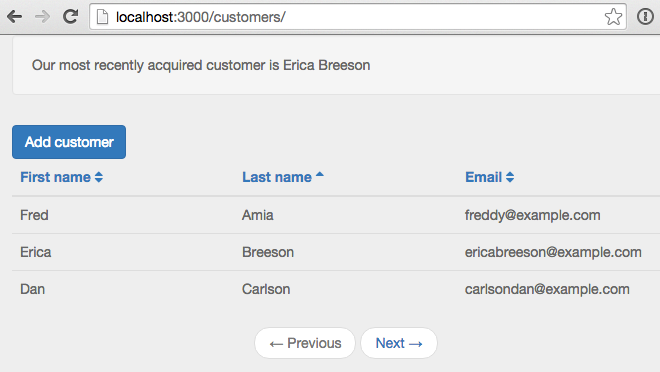

##Creating the app
If you followed along with <a href="/paging-and-sorting-part-1/index.html" target="_blank">part 1</a> you're all set.  If not and you want to jump right into part 2, you can clone part 1 from GitHub as a starting point.  This version of the application contains a paged list of customers and the ability to add more customers.

###Clone the Repo
Note, if you aren't familiar with Git and / or don't have it installed you can download a zip of the code <a href="https://github.com/riebeekn/paging-and-sorting/tree/part-1" target="_blank">here</a>.  Otherwise time to git down.

#####Terminal

git clone -b part-1 https://github.com/riebeekn/paging-and-sorting.git
cd paging-and-sorting


###Start up the app

#####Terminal

meteor --settings settings.json


You should now see the starting point for our application when you navigate your browser to <a href="http://localhost:3000" target="_blank">http://localhost:3000</a>.

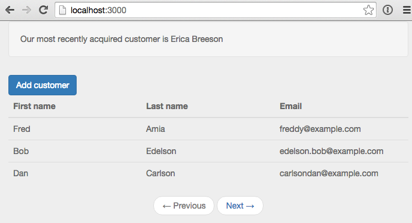

##Adding sorting

###Updating the table headers
The first thing we'll do is update the UI to have click-able headers, substituting links for the current headers.

#####/client/templates/customers/list-customers.html

<template name="listCustomers">
  

    

      <a class="btn btn-primary" id="btnAddCustomer">Add customer</a>
    

  

  {{#unless ready}}        
    {{> spinner}}      
  {{/unless}}
  <table class="table">
    <thead>
      <tr>
        <th>
          <a id="firstName" href="#">First name</a>
        </th>
        <th>
          <a id="lastName" href="#">Last name</a>
        </th>
        <th>
          <a id="email" href="#">Email</a>
        </th>
      </tr>
    </thead>
    <tbody>
      {{#each customers}}
      ...
      ...


OK, nothing complicated there, but before hooking up the links let's switch gears and figure out what we want to have happen on the server.  We'll want to specify not only a sort field but also a sort direction.  This will require a change to both the publication and the subscription.

###Updating the publication and subscription

Let's update the publication first.

#####/server/publications.js

Meteor.publish('customers', function(skipCount, sortField, sortDirection) {
  Counts.publish(this, 'customerCount', Customers.find(), { 
    noReady: true
  });

  var sortParams = {};
  sortParams[sortField] = sortDirection;
  return Customers.find({}, {
    limit: parseInt(Meteor.settings.public.recordsPerPage),
    skip: skipCount,
    sort: sortParams
  });
});


Nothing too crazy, we're passing two additional parameters to our publication, one for the sort field and the other for the sort direction.  The find call has been updated to take the new parameters into account.

Let's check out our app:

That's no good, but expected, we need to update our subscription to include the two new parameters.  To get things back to a working state we'll initially hard-code some values and then build out the full implementation.

First off though, to figure out what we're going to need to do, let's have a quick look at our database records with <a href="http://robomongo.org/" target="_blank">Robomongo</a>.

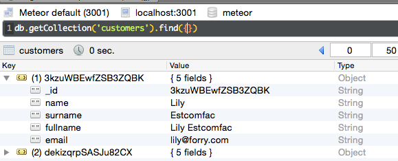

We can see we have 5 fields in our customer record, 3 of which we are displaying in the UI.  Also the column names are slightly different from the table headers, so when we specify the sort field we need to keep in mind the column names in the database.

Let's start off by sorting via the surname with an order value of 1 (i.e. an ascending sort direction).

#####/lib/router/customer-routes.js

CustomersListController = RouteController.extend({  
  template: 'listCustomers',  
  currentPage: function() {     
    return parseInt(this.params.page) || 1;  
  },
  subscriptions: function() {
    var skipCount = (this.currentPage() - 1) 
      * parseInt(Meteor.settings.public.recordsPerPage)
    this.customersSub = Meteor.subscribe('customers', skipCount, "surname", 1);  
  },


After hard-coding the surname as the sort field and ascending as the sort order, everything should be back working and we'll see our list of customers is now sorted by surname.

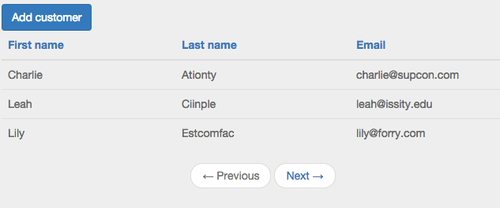

Since we're only using some of the columns from our database records, we should also update our publication to reflect this.

#####/server/publications.js

Meteor.publish('customers', function(skipCount, sortField, sortDirection) {
  Counts.publish(this, 'customerCount', Customers.find(), { 
    noReady: true
  });

  var sortParams = {};
  sortParams[sortField] = sortDirection;
  return Customers.find({}, {
    fields: {'name':1, 'surname':1, 'email':1},
    limit: parseInt(Meteor.settings.public.recordsPerPage),
    skip: skipCount,
    sort: sortParams
  });
});


We're now explicitly specifying which fields to return in the publication (note the `_id` will be returned automatically).  Although not a big deal in this particular instance, specifying the columns to return to the client is a good practice.  There is not point in bringing down data that you don't need and in some cases there might be columns in your database that you don't want to expose to the client.

###An issue
Hmm, I'm getting bored having only 6 customers in our database, how about we add a new customer via the `Add Customer` button.

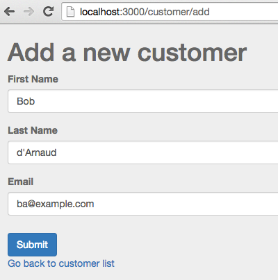

Awesome, we have a new customer... but hey what is up with the sort order?  Our newly added customer is way back on the last page.

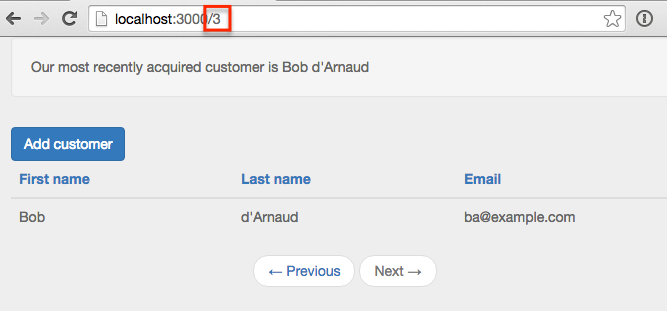

Well turns out Mongo does not support <a href="http://stackoverflow.com/questions/22931177/mongo-db-sorting-with-case-insensitive" target="_blank">case insensitive sorting</a>, and uppercase words will always come prior to lowercase words when sorted.  Holy smokes, what are we going to do?

###A solution
Turns out a common pattern when needing to sort on String columns in Mongo is to duplicate a lowercased version of the field for the purpose of sorting.  Coming from a traditional database background, this seems a little strange, but that's just the way it's done in Mongo, denormalization and duplication is fairly common.

So how can we accomplish this in our application?  There's a package for that (well sort of)!

We'll add the <a href="https://github.com/aldeed/meteor-collection2" target="_blank">collection2</a> package which will allow use to automatically create lower-cased versions of our String fields on insert.  Let's see how it all works.

#####Terminal

meteor add aldeed:collection2


Now we'll create a <a href="https://github.com/aldeed/meteor-collection2#attaching-a-schema-to-a-collection" target="_blank">schema</a> for our customer collection.

#####Terminal

mkdir lib/schemas
touch lib/schemas/customers.js


#####/lib/schemas/customers.js

Customers.attachSchema(new SimpleSchema({
  name: {
    type: String
  },

  name_sort: {
    type: String,
    optional: true,
    autoValue: function() {
      var name = this.field("name");
      if (name.isSet) {
        return name.value.toLowerCase();
      } else {
        this.unset(); // Prevent user from supplying her own value
      }
    }
  },
 
  surname: {
    type: String
  },

  surname_sort: {
    type: String,
    optional: true,
    autoValue: function() {
      var surname = this.field("surname");
      if (surname.isSet) {
        return surname.value.toLowerCase();
      } else {
        this.unset(); // Prevent user from supplying her own value
      }
    }
  },

  email: {
    type: String,
    autoValue: function() {
      return this.value.toLowerCase(); // store emails as lower-case
    }
  }
})); 


In the schema file we're specifying the types of our fields, i.e. `type: String` and then using the `autoValue` property to create and assign a value to our sort specific columns.  The code that assigns the value is pretty straight-forward, we're just lower-casing the value of the primary column.

We'll want to reset our app so that our fixture data gets the new auto value data.  So stop, reset and re-start the meteor server.

#####Terminal

meteor reset
meteor --settings settings.json


And now re-adding Bob d'Arnaud, puts him in the right place... after we make a small change to our subscription, using the `surname_sort` column instead of `surname` as the sort column.

#####/lib/router/customer-routes.js

CustomersListController = RouteController.extend({  
  template: 'listCustomers',  
  currentPage: function() {     
    return parseInt(this.params.page) || 1;  
  },
  subscriptions: function() {
    var skipCount = (this.currentPage() - 1) 
      * parseInt(Meteor.settings.public.recordsPerPage)
    this.customersSub = Meteor.subscribe('customers', skipCount, "surname_sort", 1);  
  },
  ...
  ...


There we go, Bob is now where he belongs.

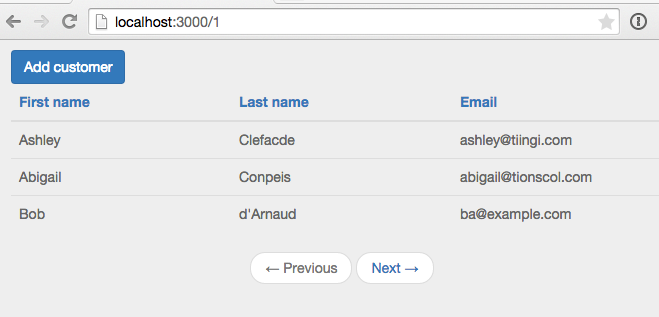

#STOPPED

###Hooking up the header links
OK, so we have our sorting working, now we just need to hook it into our header links.  Let's add some events for the links.

#####/client/templates/customers/list-customers.js

... existing code

Template.listCustomers.events({
  'click #btnAddCustomer': function(e) {
    e.preventDefault();

    Router.go('addCustomer', {page: Router.current().params.page});
  },
  'click #firstName,#lastName,#email': function(e) {
    e.preventDefault();

    if (e.target.id === 'firstName') {
      setSortFieldAndDirection('name_sort');
    } else if (e.target.id === 'lastName') {
      setSortFieldAndDirection('surname_sort');
    } else if (e.target.id === 'email') {
      setSortFieldAndDirection('email');
    }
  }
});

/*******************************************
 * Some template specific private functions
 *******************************************/
 var setSortFieldAndDirection = function(sortBy) {
  // if not currently sorting by the clicked field
  // set the sort field to the clicked field and the
  // sort direction to ascending... else just toggle
  // the sort direction
  var currentSortField = Session.get('sortField') || 'name_sort';
  if (currentSortField !== sortBy) {
    Session.set('sortField', sortBy);
    Session.set('sortDirection', 1);
  } else {
    toggleSortDirection();
  }
}

var toggleSortDirection = function() {
  var currentSortDirection = parseInt(Session.get('sortDirection')) || 1;
  if (currentSortDirection === 1) {
    Session.set('sortDirection', -1);
  } else {
    Session.set('sortDirection', 1);
  }
}


OK, that's a bit of a code dump but it's all pretty straight-forward.  

In the event handler we're checking which header was clicked, i.e. `e.target.id === 'firstName`, and based on that, pass in the appropriate sort column to the `setSortFieldAndDirection` function.

In `setSortFieldAndDirection` we set some Session variables to keep track of the current sort field and sort direction.  We've got some  simple logic that sets the sort field Session value to the value passed in to the function (defaulting to the `name_sort` column when the `sortDirection` is `null`... for instance on the initial page load).  

As far as sort direction, if we're sorting by a new column we default to ascending otherwise we toggle the sort direction via you guessed it `toggleSortDirection`.

In order for all this to work, we're going to need to update our subscription to take into account the new Session variables.

#####/lib/router/customer-routes.js

... existing code

  subscriptions: function() {
    var skipCount = (this.currentPage() - 1) 
      * parseInt(Meteor.settings.public.recordsPerPage);
    
    var currentSortField = Session.get('sortField') || 'name_sort';
    var currentSortDirection = parseInt(Session.get('sortDirection')) || 1;

    this.customersSub = Meteor.subscribe('customers', skipCount, 
      currentSortField, currentSortDirection);  
  },
...
...


And with that, we are able to sort our table.

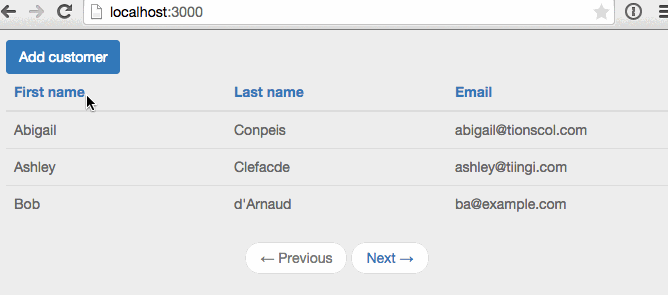

However, you may notice something a little strange going on with the screen capture above.  If you look closely there are temporarily more than 3 records showing on our page.  This is due to the page being rendered prior to the subscription being completely ready.  What's happening is we're re-rendering the page as we grab the next 3 records from the server but we still haven't completely cleared out the existing records.  One way to deal with this would be to surround the rendering code with a ready statement, i.e.

#####/client/templates/customer/list-customers.html

<template name="listCustomers">
  

    

      <a class="btn btn-primary" id="btnAddCustomer">Add customer</a>
    

  

  {{#unless ready}}        
    {{> spinner}}      
  {{/unless}}
  {{#if ready}}
  <table class="table">
    <thead>
    ...
    ...
  {{/if}}
  <nav>
    <ul class="pager">
  ...
  ...


The problem with this approach is that the page will tend to "jump", with the table temporarily disappearing and the navigation buttons moving to the top of the page.

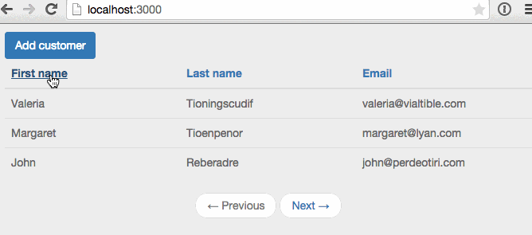

Instead we'll apply the same limit filtering to our `find` call in the client as we do on the server.  This will ensure that only the correct number of records ever appeara.

#####/client/templates/customers/list-customers.js

... existing code

Template.listCustomers.helpers({
  customers: function() {
    return Customers.find({}, {
      limit: parseInt(Meteor.settings.public.recordsPerPage)
    });
  },
  prevPage: function() {
...
...


And now we are all good.

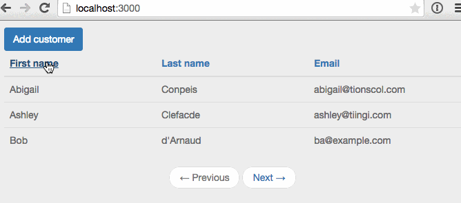

###Removing duplicate code
We've got a little bit of duplication going on in `list-customers.js` and `customer-routes.js` so let's refactor the common code out.

#####Terminal

touch lib/customer-sort-settings.js


#####/lib/customer-sort-settings.js

CustomerSortSettings = {};

var SORT_FIELD = 'customerSortField';
var SORT_DIRECTION = 'customerSortDirection';

CustomerSortSettings.sortField = function() {
  return Session.get(SORT_FIELD) || 'name_sort';
}

CustomerSortSettings.sortDirection = function() {
  return parseInt(Session.get(SORT_DIRECTION)) || 1;
}

CustomerSortSettings.setSortFieldAndDirection = function(sortBy) {
  // if not currently sorting by the clicked field
  // set the sort field to the clicked field and the
  // sort direction to ascending... else just toggle
  // the sort direction
  if (CustomerSortSettings.sortField() !== sortBy) {
    Session.set(SORT_FIELD, sortBy);
    Session.set(SORT_DIRECTION, 1);
  } else {
    toggleSortDirection();
  }
}

var toggleSortDirection = function() {
  if (CustomerSortSettings.sortDirection() === 1) {
    Session.set(SORT_DIRECTION, -1);
  } else {
    Session.set(SORT_DIRECTION, 1);
  }
}


First we're just setting up some constants for the sort field and sort direction Session variable keys.  We've also changed the keys to be a little more specific, i.e. `customerSortField` instead of `sortField`.  In general the more specific a Session key the better.  As your application grows if you use very generic Session keys there is a chance you'll unintentionally re-use a key for more than one thing, and in the process introduce all sorts of nasty, hard to track down bugs. 

After dealing with the Session keys, the next bit is just code we've moved out of the router that grabs the current sort field and direction.  Next we've  moved out from `list-customers.js` the logic that sets the Session variables.

As a result we can remove much of the code in `list-customers.js`, just keeping the event handler for the headers.

#####/client/templates/customers/list-customer.js

... existing code

Template.listCustomers.events({
  'click #btnAddCustomer': function(e) {
    e.preventDefault();

    Router.go('addCustomer', {page: Router.current().params.page});
  },
  'click #firstName,#lastName,#email': function(e) {
    e.preventDefault();

    if (e.target.id === 'firstName') {
      CustomerSortSettings.setSortFieldAndDirection('name_sort');
    } else if (e.target.id === 'lastName') {
      CustomerSortSettings.setSortFieldAndDirection('surname_sort');
    } else if (e.target.id === 'email') {
      CustomerSortSettings.setSortFieldAndDirection('email');
    }
  }
});


Much cleaner without the private functions in there!  Now let's change the router, just the subscription section needs to change.

#####/lib/router/customer-routes.js

... existing code

  subscriptions: function() {
    var skipCount = (this.currentPage() - 1) 
      * parseInt(Meteor.settings.public.recordsPerPage);
    
    this.customersSub = Meteor.subscribe('customers', skipCount, 
      CustomerSortSettings.sortField(), CustomerSortSettings.sortDirection());  
  },
...
...


And with that the refactoring is complete... now we're ready for one final step.

###Adding a sort indicator
It would be nice to have a sort indicator to provide some visual feedback to the user regarding how the table is currently sorted.  We'll use <a href="http://fortawesome.github.io/Font-Awesome/" target="_blank">font awesome</a> icons to indicate the sort direction.  A <a href="https://atmospherejs.com/natestrauser/font-awesome" target="_blank">package</a> is available, so lets get that added.

#####Terminal

meteor add natestrauser:font-awesome


Now we'll update our table headers to include an icon.

#####/client/templates/customers/list-customers.js

<template name="listCustomers">
  

    

      <a class="btn btn-primary" id="btnAddCustomer">Add customer</a>
    

  

  {{#unless ready}}        
    {{> spinner}}      
  {{/unless}}
  <table class="table">
    <thead>
      <tr>
        <th>
          <a id="firstName" href="#">First name
            
              <i class="{{firstNameIconClass}}"></i>
            
          </a>
        </th>
        <th>
          <a id="lastName" href="#">Last name
            
              <i class="{{lastNameIconClass}}"></i>
            
          </a>
        </th>
        <th>
          <a id="email" href="#">Email
            
              <i class="{{emailIconClass}}"></i>
            
          </a>
        </th>
      </tr>
    </thead>
    <tbody>
    ...
    ...


So we've added icon classes to each header.  Now we need to define those in `list-customers.js`.

#####/client/templates/customers/list-customers.js

... existing code

Template.listCustomers.helpers({
  customers: function() {
    return Customers.find();
  },
  ...
  ...
  ,
  firstNameIconClass: function() {
    return CustomerSortSettings.getSortIconClass("name_sort");
  },
  lastNameIconClass: function() {
    return CustomerSortSettings.getSortIconClass("surname_sort");
  },
  emailIconClass: function() {
    return CustomerSortSettings.getSortIconClass("email");
  }
});
...
...


All we're doing is calling into a new function we've created in `customer-sort-settings.js`.

#####/lib/customer-sort-settings.js

... existing code

CustomerSortSettings.getSortIconClass = function(element) {
  if (CustomerSortSettings.sortField() === element) {
    return CustomerSortSettings.sortDirection() === -1 ? 
      "fa fa-sort-asc" : "fa fa-sort-desc";
  } else {
    return "fa fa-sort";
  }
}

var toggleSortDirection = function() {
  ...
  ...


Pretty simple, if the passed in element is the current sort field, we return the `fa-sort-asc` or `fa-sort-desc` icon class based on the current sort direction.  Otherwise we return the double-arrow default sort icon, i.e. `fa-sort`.

##Summary
And with that... sorting, paging, icons... done!

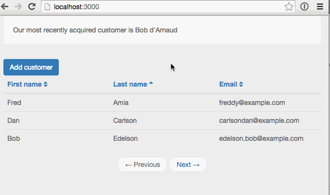

Thanks for reading and hope you enjoyed getting sorted!
