In this post we'll be looking at testing our application with <a href="https://velocity.readme.io/" target="_blank">Velocity</a> and <a href="https://velocity.readme.io/v1.0/docs/getting-started-with-jasmine" target="_blank">Jasmine</a>.  Velocity is the <a href="http://info.meteor.com/blog/meteor-testing-framework-velocity" target="_blank">official testing framework</a> for <a href="https://www.meteor.com/" target="_blank">Meteor</a> applications.

Automated testing is a great way to ensure the correct functionality of your application and to ensure when you make changes down the road you don't unintentionally break something.  Frameworks like Rails have long had a strong focus on testing with fantastic tools like <a href="http://rspec.info/" target="_blank">RSpec</a> and <a href="https://github.com/jnicklas/capybara" target="_blank">Capybara</a>.  Along with a dedicated <a href="http://guides.rubyonrails.org/testing.html#the-test-environment" target="_blank">testing environment</a> and test data manipulation tools like <a href="https://github.com/thoughtbot/factory_girl" target="_blank">FactoryGirl</a> testing on Rails is a pleasure.

Testing with Meteor has been a bit of a bumpy road in contrast, but Velocity is starting to come into it's own and has really seemed to have stabilized since I last had a whack at it 6-8 months or so ago.  So kudos to the Velocity team for all the work they continue to put in.

##What we'll build

This will look familiar to anyone who has gone thru the <a href="https://www.meteor.com/tutorials/blaze/creating-an-app" target="_blank">Meteor tutorial</a>.  Other than some slight variations, we'll use the tutorial code as the application code to write our tests against.  Note no explanation of the actual application code will be given as we'll be concentrating on the test code and the Meteor tutorial itself provides a clear explanation of what is going on.

So with that, let's get started!

##Creating the app

###Clone the Repo
Note, if you aren't familiar with Git and / or don't have it installed you can download a zip of the code <a href="https://github.com/riebeekn/meteor-client-testing-with-velocity-and-jasmine/archive/step-1.zip">here</a>.

#####Terminal

git clone -b step-1 https://github.com/riebeekn/meteor-client-testing-with-velocity-and-jasmine.git


Repository branches roughtly follow the steps of the official tutorial, reword!!!

###A quick over-view of where we're starting from
Open up the code in your text editor of choice and you'll see a pretty standard Meteor file structure. 

 

We've deviated from the official tutorial is this respect in that we've gotten rid of the default files and placed things in appropriate directories.

We've also removed the insecure and autopublish packages right off the bat where-as the official tutorial waits to do this.

###Start up the app
OK, let's see where we're starting from.

#####Terminal

cd jasmine-client-integration-testing
meteor


You should now see the starting point for our application when you navigate your browser to <a href="http://localhost:3000" target="_blank">http://localhost:3000</a>.

##Getting ready to do some testing
OK, getting our testing going is super easy, we just need to install a coupld of packages.

#####Terminal

meteor add sanjo:jasmine velocity:html-reporter


The first package adds everything we need to write Jasmine tests, the second package installs the Velocity HTML reporter which provides feedback directly within the browser regarding the status of our tests:

And with that we are ready to get to some testing!

MAKE NOTE OF TAILING THE LOG FOR ERRORS!

##Implementing Step 2 of the tutorial
We'll use somewhat of a test first approach through out this post where we'll first define the requirement for each step, then write the tests and then implement the code.  Although unnecessary this is a good approach to take, at the very least you should ensure your tests actually fail when expected... I've gotten bitten in the past where I didn't check that a test failed prior to implementation, blah, blah, blah

  

    <h3 class="panel-title">Step 2 requirements</h3>
  

  

    <ul>
      <li>The application should contain a static list of todos.</li>
      <li>The application should have a browser title of 'Todo List'.</li>
      <li>The application should have a header of 'Todo List'.</li>
    </ul>
  

###Writing our tests
First off we need to set-up a directory for our tests so let's do that, Velocity expects Jasmine client integration tests to be at /tests/jasmine/client/integration.  We'll create a specific directory for our Todos functionality.

#####Terminal

mkdir -p tests/jasmine/client/integration/todos


Next we'll create two files, page-contents-spec.js and task-list-spec.js.  page-contents will be used to specify items we expect to be present on the page.  task-list will be specific to the listing of tasks.

#####Terminal

touch tests/jasmine/client/integration/todos/page-contents-spec.js
touch tests/jasmine/client/integration/todos/task-list-spec.js


First let's deal with `page-contents-spec.js`.

#####/test/jasmine/client/integration/todos/page-contents-spec.js

describe ("the todo page : page contents", function() {
  
  it ("should include a page title of 'Todo List'", function() {
    expect($('title').text()).toEqual('Todo List');
  });

  it ("should include a page heading of 'Todo List'", function() {
    expect($('h1').text()).toEqual('Todo List');
  });

  it ("should include an unordered list for displaying the tasks", function() {
    expect($('ul').length).toEqual(1);
  });
  
});


In the `page-contents` spec we're describing the items we expect to be present on the page.  The `describe ("the todo...` line essentially just provides a header for the output of our tests.  You can use anything you like but obviously descriptive and consistent `describe` text is going to be helpful when reading the test output.

Next we have 3 tests.  Again the contents of the `it ("...` lines can be whatever descriptive text is appropriate.

The `expect` lines are where we actually testing the functionality of our application.  We're using jQuery to grab elements off the page and comparing the retrieved elements with an expected value.

So with the first test we're grabbing the page title and expecting it to equal 'Todo List'.  The second test we're expecting the page to have a `h1` tag containing the text 'Todo List', and finally in the third test we're expecting a `ul` item on the page as this is what will contain our list of tasks.

You'll notice Velocity is now telling us we have some failing tests.

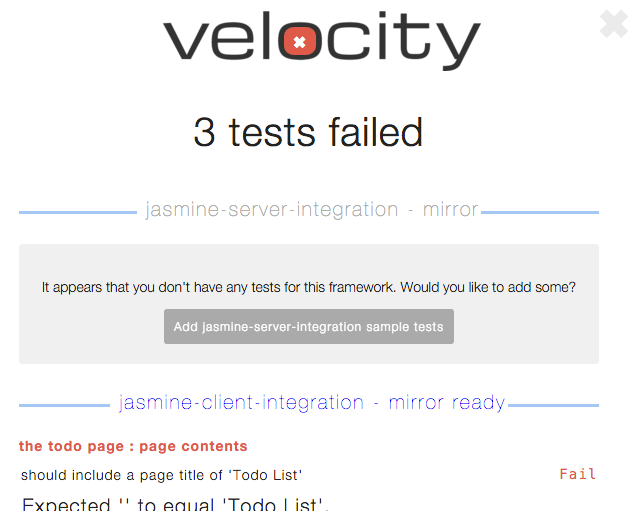

The output of the tests bring into focus the advantage of using well thought out `describe` and `it` descriptions.

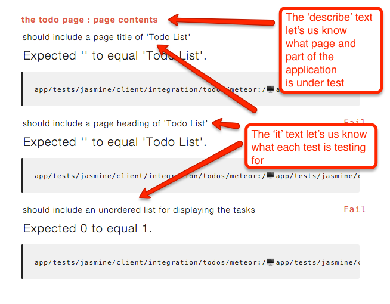

Before we work on getting on tests to pass, let's add one test to `task-list-spec`.

#####/tests/jasmine/client/integration/todos/task-list-spec.js

describe ("the todo page : task list", function() {

  it ("should contain the current list of tasks", function() {
    var tasks = $("li").map(function() { 
      return $(this).text();
    }).get();

    expect(tasks.length).toEqual(3);
    expect(tasks[0]).toEqual('This is task 1');
    expect(tasks[1]).toEqual('This is task 2');
    expect(tasks[2]).toEqual('This is task 3');
  });

});


Once again we are using a descriptive explanation for the `describe` and `it` text, the single test we have is checking that the page displays 3 tasks with specific text.

We now have 4 failing tests so let's get these suckers passing!

###Making the tests pass
First let's update our HTML to include the expected page contents.

#####/client/templates/simple-todos.html

<head>
  <title>Todo List</title>
</head>

<body>
  

    <header>
      <h1>Todo List</h1>
    </header>

    <ul>
      {{#each tasks}}
        {{> task}}
      {{/each}}
    </ul>
  

</body>

<template name="task">
  <li>{{text}}</li>
</template>


We won't go over any of the implementation code as explanation's are included in the <a href="https://www.meteor.com/tutorials/blaze/creating-an-app" target="_blank">Meteor tutorial</a>.

With the above HTML, we now have all 3 of our `page-content` tests passing.

Let's get the task list test to pass, just by using some hard-coded values.

#####/client/templates/simple-todos.js

Template.body.helpers({
  tasks: [
    { text: "This is task 1" },
    { text: "This is task 2" },
    { text: "This is task 3" }
  ]
});


And with that everything is passing!

Onto step 3!

##Implementing Step 3 of the tutorial

  

    <h3 class="panel-title">Step 3 requirements</h3>
  

  

    <ul>
      <li>The application should contain a dynamic list of todos retrieved from the database.</li>
    </ul>
  

OK, so not much is changing in step 3, we just want to grab our data out of the database instead of hard-coding it.  We don't need to change our tests at all off the bat as we don't have any functional changes, we just need to grab our data from a different place... so let's start off by doing that.

#####/lib/collections.js

Tasks = new Mongo.Collection("tasks");


#####/server/publications.js

Meteor.publish("tasks", function () {
  return Tasks.find();
});


#####/client/templates/simple-todos.js

Template.body.onCreated(function() {
  Meteor.subscribe("tasks");
});

Template.body.helpers({
  tasks: function() {
    return Tasks.find();
  }
});


OK, we've set up a collection to hold our tasks, published the collection and subscribed to the collection on the client.

Without the hard-coded tasks, we now have 1 failing test.

Although a small change, this is going to be a bit of work to get our test back to a passing state.  This is because we're going to need to come up with a method of handling test data.  Luckily the <a href="https://velocity.readme.io/docs/jasmine-database-fixtures-for-integration-tests" target="_blank">Velocity documentation</a> has some suggestions about how to go about doing this.  We're going to go with the package solution, where a package is specifically created for handling test data.

###Creating a package to handle test data.

First let's create our packages directory along with a couple of files.

#####Terminal

mkdir -p packages/testing
touch packages/testing/task-fixtures.js
touch packages/testing/package.js


First let's fill in `task-fixtures.js`, this is what we'll use for manipulating test data related to a task.

#####/packages/testing/task-fixtures.js

var createTask = function(taskAttributes) {
  var task = _.merge({}, _getDefaultTask(), taskAttributes);

  var taskId = Tasks.insert(task);

  return Tasks.findOne(taskId);
}

var destroyTasks = function() {
  Tasks.remove({});
}

var _getDefaultTask = function() {
  return {
    text: 'Task text',
    createdAt: new Date()
  }
};

Meteor.methods({
  'fixtures.createTask': createTask,
  'fixtures.destroyTasks': destroyTasks
});


So let's start from the bottom of this file, with `Meteor.methods({... `we're exposing two methods that allow us to create and destroy tasks.  During the course of our testing we're going to want to create test data and then tear down that test data after we are done with it.  When want to leave our test database in a consistent (i.e. empty) state so that it doesn't get filled up with various test data that could cause conflicts or inconsistencies across tests.

We define these methods at the top of the file, `createTask` inserts a task and also takes in an optional parameter which we use to set specific attributes on a task.  The `_.merge({}, _getDefaultTask(), taskAttributes);` line merges any passed in attributes with the defaultTask we create via `_getDefaultTask` which just sets up a task with some default values.  So with no attributes passed in the created task would have text of 'Task text' and a created at value of the current date.  We could for instance change the text via a call such as:


Meteor.call('fixtures.createTask', {
  text: 'The task'
});


The `destroyTasks` method simply clears out our `Tasks` table.

With our implementation out of the way, next we need to fill in `package.js`.

#####/packages/testing/package.js

Package.describe({
  name: 'testing',
  version: '0.0.0',
  summary: 'Tools that help us testing the app',
  documentation: 'README.md',
  // This tools are only available in development mode! (for security)
  debugOnly: true
});

Package.onUse(function (api) {
  api.versionsFrom('1.1.0.2');
  api.use([
    'underscore',
    'mongo',
    'stevezhu:lodash@3.10.1',
  ], 'server');
  api.addFiles('task-fixtures.js', 'server');
});


So this package definition is taken pretty much verbatim from the <a href="https://github.com/Sanjo/SpaceTalk/blob/feature/testing/packages/testing/package.js" target="_blank">Velocity example</a>.  The main point to emphasize is the use of the `debugOnly` flag... this is very important!  Without this we're going to expose our test methods outside of development mode... certainly not something that we want!

Other than that the package file is very standard, we're just specifying the required Meteor version, followed by the 3rd party libraries required by our package.  Finally, we expose the `task-fixtures.js` file via the `api.addFiles` line.  If you need a refresher on package files, I suggest this <a href="http://themeteorchef.com/recipes/writing-a-package/" target="_blank">Meteor Chef article</a>.

###Using our test data package

OK, now we can make use of our test data package, first thing we'll do is add the package to our app.

#####Terminal

meteor add testing


And now we'll make use of it in the `task-list` spec.

#####/tests/jasmine/client/integration/todos/task-list-spec.js

describe ("the todo page : task list", function() {

  beforeEach(function () {
    Meteor.call('fixtures.createTask', {text: 'This is task 1'});
    Meteor.call('fixtures.createTask', {text: 'This is task 2'});
    Meteor.call('fixtures.createTask', {text: 'This is task 3'});
  });
  afterEach(function() {
    Meteor.call('fixtures.destroyTasks');
  });

  it ("should contain the current list of tasks", function(done) {
    Meteor.setTimeout(function() {
      var tasks = $("li").map(function() { 
        return $(this).text();
      }).get();

      expect(tasks.length).toEqual(3);
      expect(tasks[0]).toEqual('This is task 1');
      expect(tasks[1]).toEqual('This is task 2');
      expect(tasks[2]).toEqual('This is task 3');
      done();
    }, 200);
  });

});


OK, so the first thing you'll notice with the above is we now are making use of `beforeEach` and `afterEach` functions.  As the name suggests these functions will run before and after each test.  This is very handy as `beforeEach` provides a good place for us to create our test data and then we can tear it down and keep our database consistent with `afterEach`.

The `beforeEach` function is just creating the 3 tasks that we're testing via the methods available from the test package.  The `afterEach` function just cleans them up with the test package `destroy` method.

The final change to our spec is the addition of a timeout on the test.  This is necessary to compensate for the slight delay of retrieving the tasks from the database, if we don't have a timeout the test will run so fast that it will complete prior to the tasks showing up and thus will fail.  NOTE: make comment about timeout times, have to experiement blah, blah, blah sometimes 200 sometime greater / lesser works

One thing to note is the use of the Jasmine 2.0 `done` function.  This is necessary to indicate to Jasmine that the test is asynchronous, without it we'll get a Jasmine error in the browser console... even worse our test will appear to still pass, so it's always a good idea to keep an eye on the browser console.

 

In any case with `done` in the mix we've got our tests back to passing without any browser console errors.

We're ready for step 4!

##Implementing Step 4 of the tutorial

  

    <h3 class="panel-title">Step 4 requirements</h3>
  

  

    <ul>
      <li>The application should contain an input field that allows users to add new tasks.</li>
      <li>New tasks should have a 'text' value of whatever the user entered and a created date of the current date / time.</li>
      <li>The 'new task' input should contain default placeholder text.</li>
      <li>When a new task is created, the 'new task' input should be cleared and replaced with the default placeholder text.</li>
      <li>The tasks should be displayed by creation date descending.</li>
    </ul>
  

Phew, that's a fair bit of stuff, we not explicitly test for every piece of functionality but let's see how we get on.

###Writing our tests and implementing step 4

So based on the requirements we'll need to update the `page-contents` spec to include the new input field.  Also the `task-list` spec needs to explicitly check for the sort order of the tasks.  In addition to these changes we'll add a new spec for the functionality around creating new tasks.

####task-list-spec.js

First let's make our changes to `task-list-spec.js`.

#####/tests/jasmine/client/integration/todos/task-list-spec.js

describe ("the todo page : task list", function() {

  beforeEach(function () {
    Meteor.call('fixtures.createTask', {text: 'This is task 1', createdAt: '2015-01-01'});
    Meteor.call('fixtures.createTask', {text: 'This is task 2', createdAt: '2015-02-01'});
    Meteor.call('fixtures.createTask', {text: 'This is task 3', createdAt: '2015-03-01'});  
  });
  afterEach(function() {
    Meteor.call('fixtures.destroyTasks');
  });

  it ("should contain the current list of tasks sorted by creation date descending", function(done) {
    Meteor.setTimeout(function() {
      var tasks = $("li").map(function() { 
        return $(this).text();
      }).get();

      expect(tasks.length).toEqual(3);
      expect(tasks[0]).toEqual('This is task 3');
      expect(tasks[1]).toEqual('This is task 2');
      expect(tasks[2]).toEqual('This is task 1');
      done();
    }, 200);
  });

});


The first change we've made is to explicitly specify a `createdAt` date for our tasks so that we can check that they display in the expected order.

Next we've updated the title of our test to indicate the tasks should display in a particular order.

And finally we've changed the order of the tasks in the `expect statements`.

With these changes we'll have a failing test.

It's pretty easy to get this back passing:

#####/client/templates/simple-todos.js

...

Template.body.helpers({
  tasks: function() {
    return Tasks.find({}, { sort: { createdAt: -1 }});
  }
});


Applying the appropriate sort gets the test back passing.

####page-contents-spec.js

OK, onto `page-contents`.

#####/tests/jasmine/client/integration/todos/page-contents-spec.js

...
it ("should include an unordered list for displaying the tasks", function() {
  expect($('ul').length).toEqual(1);
});

it ("should include a field for entering a new task " 
    + "with an appropriate placeholder", function() {
  expect($('.new-task input').attr('placeholder'))
    .toEqual('Type to add new tasks');    
});
...


We've added a new test to check for the input field and the input placeholder, so we've somewhat combined the testing of these 2 requirements.  As expected we're seeing a failing test.

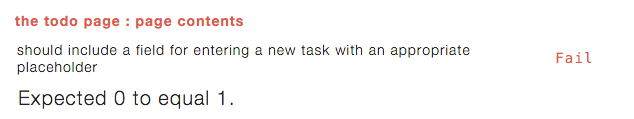

Let's update out HTML to get the test to pass.

#####/client/templates/simple-todos.html

...

  

    <header>
      <h1>Todo List</h1>

      <form class="new-task">
        <input type="text" name="text" placeholder="Type to add new tasks" />
      </form>
    </header>
    ...
    ...


We've added an `input` within the `header` and all tests are now passing.

####new-task-spec.js

We'll create a separate spec for testing the new functionality.

#####Terminal

touch tests/jasmine/client/integration/todos/new-task-spec.js


#####/tests/jasmine/client/integration/todos/new-task-spec.js

describe ("the todo page : new task field", function() {
    
  it ("should create a new task on form submit with expected values", function(done) {
    // submit a new task
    Meteor.setTimeout(function() {
      addTaskViaUI('My new task');
      
      // check the updated task list
      var tasks = $("li").map(function() { 
        return $(this).text();
      }).get();
      expect(tasks.length).toEqual(1);
      expect(tasks[0]).toEqual('My new task');

      // also check the DB
      var task = Tasks.findOne({text: 'My new task'});
      expect(task).not.toBe(undefined);
      expect(task.text).toEqual('My new task');
      done();
    }, 300);
  });

  it ("should clear out the new task field on form submit", function(done) {
    Meteor.setTimeout(function() {  
      addTaskViaUI('Another new task');
      expect($('.new-task input').val()).toEqual('');
      done();
    }, 200);
  });
  
});

var addTaskViaUI = function(taskName) {
  $('.new-task input').val(taskName);
  $("form").submit();
}


So we've got two tests in this spec.  

The first tests adds a new task and then we're checking that the new task shows up in both the UI and in the database.  The code is pretty straight forward, we've created a function `addTaskViaUI` that we're calling into to fill in our task input and then submit the form.

Then we use Jasmine `expect` calls to ensure the UI and database are in the expected state.

The second test just checks that the input field is cleared out and shows the placeholder text after a task is added.

Since we are creating tasks in both of the tests we have an `afterEach` call to clean up the database after each test run.

With the above tests in place you'll notice Velocity is having quite the issue:

The cause of this is the form submit... it's causing the page to reload which causes Velocity to try to run the tests which causes the page to reload... which... you get the idea! so Velocity doesn't get a chance to run it's tests as the page keeps reloading.

So let's stop the Velocity freak-out.

#####/client/templates/simple-todos.js

...
...
Template.body.events({
  "submit .new-task": function (event) {
    // Prevent default browser form submit
    event.preventDefault();
  }
});


And with that Velocity is back working and we see our new tests are failing.

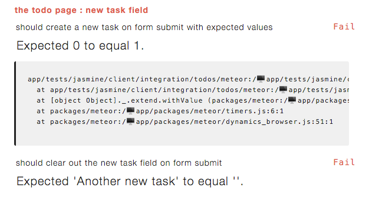

So let's fill in the event properly to get the test to pass.

#####/client/templates/simple-todos.js

...
...
Template.body.events({
  "submit .new-task": function (event) {
    // Prevent default browser form submit
    event.preventDefault();
    
    // Get value from form element
    var text = event.target.text.value;

    // Insert a task into the collection
    Meteor.call("addTask", text);

    // Clear form
    event.target.text.value = "";
  }
});


OK, so we're grabbing the text entered by the user and calling a method with it.

We'll need to create the `addTask` method, so let's do that next.

#####/lib/collections.js

Tasks = new Mongo.Collection("tasks");

Meteor.methods({
  addTask: function (text) {
    Tasks.insert({
      text: text,
      createdAt: new Date()
    });
  }
});


Nothing complex here, we're just adding a new Task record based on the text passed into the method.

And with that we've got all our tests passing!

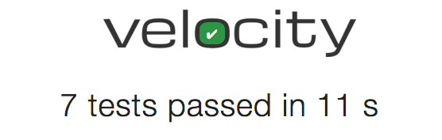

Before moving onto step 5 of the tutorial, we're seeing a bit of code duplication creep into our tests, specifically the code to grab the current tasks displaying in the UI, i.e.


var tasks = $("li").map(function() { 
  return $(this).text();
}).get();


So let's move that into a helper and clean up the duplication.

#####Terminal

mkdir tests/jasmine/client/integration/todos/helpers
touch tests/jasmine/client/integration/todos/helpers/todos-spec-helper.js


#####/tests/jasmine/client/integration/todos/helpers/todos-spec-helper.js

TodosSpecHelper = {};

TodosSpecHelper.retrieveTasksFromUI = function() {
  var tasks = $("li").map(function() { 
    return $(this).text();
  }).get();

  return tasks;
}


So here we've created a helper class that contains the code to grab the current tasks from the UI.

We now need to update `new-task-spec.js` and `task-list-spec.js`.

#####/test/jasmine/client/integration/todos/new-task-spec.js

...
...
  it ("should create a new task on form submit with expected values", function(done) {
    // submit a new task
    Meteor.setTimeout(function() {
      addTaskViaUI('My new task');
      
      // check the updated task list
      var tasks = TodosSpecHelper.retrieveTasksFromUI();
      ...
      ...


#####/test/jasmine/client/integration/todos/task-list-spec.js

...
...
  it ("should contain the current list of tasks sorted by creation date descending", function(done) {
    Meteor.setTimeout(function() {
      var tasks = TodosSpecHelper.retrieveTasksFromUI();

      expect(tasks.length).toEqual(3);
      ...
      ...


Great we've removed our duplication and not it's onto step 5!

##Implementing Step 5 of the tutorial

  

    <h3 class="panel-title">Step 5 requirements</h3>
  

  

    <ul>
      <li>As a user I want to be able to mark tasks as complete.</li>
      <li>Completed tasks should display in a manner that makes it obvious that they have been completed.</li>
      <li>As a user I want to be able to remove tasks.</li>
    </ul>
  

###Writing our tests and implementing step 5

We could update `page-contents` to check for the various new items associated with a task, but the functionality around a single task item is starting to get a bit involved, so instead we'll create a new spec `task-item-spec.js` to handle task specific tests.  With the new 'completed' field we'll also want to update `new-task` to check that newly inserted tasks are marked as not complete.

We'll also create a new spec for the removal functionality.

So let's get going, we'll start with the `task-item` spec.

####task-item-spec.js

#####Terminal

touch tests/jasmine/client/integration/todos/task-item-spec.js


So we'll use this spec file to test the contents of an individual task item.

######Tests

#####/tests/jasmine/client/integration/todos/task-item-spec.js

describe ("the todo page : an individual task item", function() {

  beforeEach(function() {
    Meteor.call('fixtures.createTask', {
      text: 'The task'
    });
  });
  afterEach(function() {
    Meteor.call('fixtures.destroyTasks');
  });

  it ("should include the task text", function(done) {
    Meteor.setTimeout(function() {
      var tasks = TodosSpecHelper.retrieveTasksFromUI();

      expect(tasks.length).toEqual(1);
      expect(tasks[0]).toEqual('The task');
      done();
    }, 200);
  });

  it ("should include a checkbox to mark the task as complete", function(done) {
    Meteor.setTimeout(function() {
      var checkbox = $('li').find("input:checkbox");
      expect(checkbox.length).toEqual(1);
      done();
    }, 100);
  });

  it ("should include a delete button", function(done) {
    Meteor.setTimeout(function() {
      var deleteButton = $('.delete');
      expect(deleteButton.length).toEqual(1);
      done();
    }, 200);
  });
  
});


OK, so first off in the `before` and `after` blocks we're just setting up and then tearing down our test data; in this case a single task.

Then we have 3 tests.  The first test we're just checking that the task text is correct.  The second test is ensuring we have a checkbox available for marking the task as complete, and finally the third test is checking for the presence of a delete button.

The first test is going to pass as we're already displaying the task text, the second two tests will fail however.

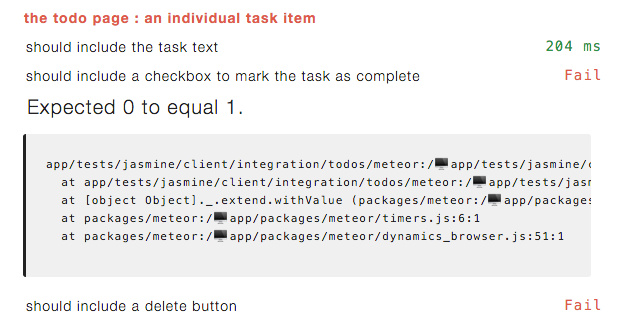

######Implementation

So let's get those tests passing!

#####/client/templates/simple-todos.html

...
<template name="task">
  <li>
    <button class="delete">&times;</button>
    <input type="checkbox" checked="{{checked}}" class="toggle-checked" />
    {{text}}
  </li>
</template>


Sweet, that was simple, we should be all good now!

Alas, we've gone backwards, we now have even more tests failing than before, what could be going on?  The failing tests all are a variation of the below:

It appears we're no longer grabbing the task text correctly, we've got the `x` symbol we're using as the delete button coming in with the task text.

So let's fix that.

#####/tests/jasmine/client/integration/todos/helpers/todos-spec-helper.js

TodosSpecHelper = {};

TodosSpecHelper.retrieveTasksFromUI = function() {
  var tasks = $("li .text").map(function() { 
    return $(this).text();
  }).get();

  return tasks;
}


We've changed our jQuery selector from `$("li")` to `$("li .text")` in order to zero in on just the text.  Already removing our duplicate test code has paid off, this one change, fixes all three tests.

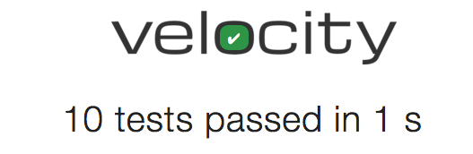

####remove-task-spec.js

Next we'll create a spec for testing the remove functionality.

#####Terminal

touch tests/jasmine/client/integration/todos/remove-task-spec.js


######Tests

#####/tests/jasmine/client/integration/todos/remove-task-spec.js

describe ("the todo page : remove task", function() {
  
  beforeEach(function() {
    Meteor.call('fixtures.createTask');
  });
  afterEach(function() {
    Meteor.call('fixtures.destroyTasks');
  })
  
  it ("should remove a task when the delete button is clicked", function(done) {
    Meteor.setTimeout(function() {
      // remove the task
      $('.delete').click();

      // ensure it is not in the database
      expect(Tasks.find().count()).toEqual(0);

      // ensure it is not in the UI
      expect($('li').size()).toEqual(0);
      done();
    }, 100);
  });

});


OK, first off we've got a `before` and `after` section to add and then clean up our test data (although if our test passes their won't be any data to clean up).

Then with the actual test, we delete the task via the delete button, and follow that up by ensuring it is gone from both the database and the UI.

As expected we've now got a failing test.

######Implementation

We'll need to add a client side event for the button along with a method to perform the delete.

#####/client/templates/simple-todos.js

Template.task.events({
  "click .delete": function () {
    Meteor.call("deleteTask", this._id);
  }
});


#####/lib/collections.js

Tasks = new Mongo.Collection("tasks");

Meteor.methods({
  addTask: function (text) {
    Tasks.insert({
      text: text,
      createdAt: new Date()
    });
  },
  deleteTask: function (taskId) {
    var task = Tasks.findOne(taskId);

    Tasks.remove(taskId);
  },
});


And there we go!

####update-task-spec.js

Another bit of functionality we need to test for is the completion of tasks.

#####Terminal

touch tests/jasmine/client/integration/todos/update-task-spec.js


######Tests

First let's handle the situation where a user marks a task as complete.

#####/tests/jasmine/client/integration/todos/update-task-spec.js

describe ("the todo page : update task", function() {
  
  describe ("completing a task", function() {
    beforeEach(function() {
      Meteor.call('fixtures.createTask');
    });
    afterEach(function() {
      Meteor.call('fixtures.destroyTasks');
    });
      
    it ("should set the 'completed' field to true", function(done) {
      Meteor.setTimeout(function() {
        // activate the checkbox
        $("li").find("input:checkbox").click();
        
        // find the associated record in the DB and verify it is checked
        var tasks = Tasks.find();
        expect(tasks.length).toEqual(1);
        expect(tasks.completed).toEqual(true);

        // ensure the checkbox is now checked
        expect($("li").find("input:checkbox").is(':checked')).toEqual(true);
        done();
      }, 200);
    });

    it ("should show a strike-through for the completed tasks", function(done) {
      Meteor.setTimeout(function() {
        $("li").find("input:checkbox").click();
      }, 200);

      Meteor.setTimeout(function() {
        expect($("li").hasClass('checked')).toBe(true);
        done();
      }, 800);
    });
  });

});


OK, first off we set up some fixture data, inserting a single task before our tests, removing it afterwards.

With the first test we're marking the task as complete and then checking the record has been updated in the database and the UI gets updated.

With the second test we test that the style for the item gets updated for completed tasks.

We've got ourselves 2 failing tests as expected.

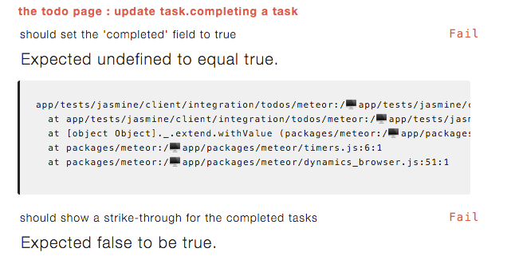

Let's address that first error, what's up with Expected <i>undefined</i> to equal true?  Shouldn't we be getting a false value returned since we have yet to implement the completed functionality?  We need to update our fixture code to take into account our new field.

#####/packages/testing/task-fixtures.js

...
var _getDefaultTask = function() {
  return {
    text: 'Task text',
    createdAt: new Date(),
    completed: false
  }
};
...


So we've added our new field into the default task that gets created by our fixture.  With that change we see the error we expected.

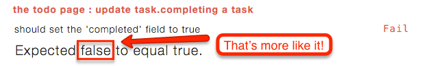

Before we get these test passing, let's add the scenarios for re-activating tasks.  The tests for re-activation are going to be nearly identical to the tests for completing a task... so we're going to apply some refactorings to the test code in order to reduce duplication.

#####/tests/jasmine/client/integration/todos/update-task-spec.js

describe ("the todo page : update task", function() {
  
  describe ("completing a task", function() {
    beforeEach(function() {
      Meteor.call('fixtures.createTask');
    });
    afterEach(function() {
      Meteor.call('fixtures.destroyTasks');
    });
      
    it ("should set the 'completed' field to true", function(done) {
      _toggleAndCheckTaskStatus(true, done);
    });

    it ("should show a strike-through for the completed tasks", function(done) {
      _toggleAndCheckTaskStatus(true, done);
    });
  });

  describe ("re-activating a task", function() {
    beforeEach(function () {
      Meteor.call('fixtures.createTask', {completed: true});
    });
    afterEach(function() {
      Meteor.call('fixtures.destroyTasks');
    });
      
    it ("should set the 'completed' field to false", function(done) {
      _toggleAndCheckTaskStatus(false, done);
    });

    it ("should remove the strike-through for the re-activated tasks", function(done) {
      _toggleAndCheckTaskStatus(false, done);
    });

  });

  var _toggleAndCheckTaskStatus = function(completeTask, done) {
    Meteor.setTimeout(function() {
      // activate the checkbox
      $("li").find("input:checkbox").click();
      
      // find the associated record in the DB and verify it is checked
      var tasks = Tasks.find().fetch();
      expect(tasks[0].completed).toEqual(completeTask);

      // ensure the checkbox is now checked
      expect($("li").find("input:checkbox").is(':checked')).toEqual(completeTask);
      done();
    }, 200);
  }

  var _toggleStatusAndCheckStrikeThru = function(completeTask, done) {
    Meteor.setTimeout(function() {
      $("li").find("input:checkbox").click();
    }, 200);

    Meteor.setTimeout(function() {
      expect($("li").hasClass('checked')).toBe(completeTask);
      done();
    }, 800);
  }

});


OK, a bit of a code dump... let's first look at what we've done with our 2 existing tests.  We've basically taken the tests and refactored them out into 2 helper functions `_toggleAndCheckTaskStatus` and `_toggleStatusAndCheckStrikeThru`.  
The point of this is so that our re-activation tests don't contain a bunch of copy and pasted duplicated code.  The only thing that is different for the re-activation tasks is the initial test data created in the `before` and `after` blocks along with whether the test should be checking for a completed or not completed task.  So our helper functions take in a parameter indicating whether a task is being completed or not and we can thus re-use the test code for both the complete and re-activate tests.

We now have 3 failing tests, the test that checks for the removal of the strike through when a task is re-activated is going to currently pass as we have no logic to initially set the strike through... reword!

######Implementation

OK, let's get things working.

#####/client/templates/simple-todos.html

...
<template name="task">
  <li class="{{#if completed}}checked{{/if}}">
    ...
    ...


We've added a class on the `li` attribute which is used to toggle the strike through class.

#####/client/templates/simple-todos.js

Template.task.events({
  "click .toggle-checked": function () {
    // Set the checked property to the opposite of its current value
    Meteor.call("setCompleted", this._id, ! this.completed);
  },
  "click .delete": function () {
  ...


We've added a new event handler for the check-box.

#####/lib/collections.js

  ...
  },
  setCompleted: function (taskId, setCompleted) {
    var task = Tasks.findOne(taskId);
    
    Tasks.update(taskId, { $set: { completed: setCompleted} });
  }, 
});


Finally we need to add a method to set a task to completed.

And with that we are back to passing.

####new-task-spec.js
Phew, step 5 is turning out to be a bit of a bear, but we're finally on the home stretch, just one more test to update.  We want to make sure new created tasks have a value of `false` for their completed status.

######Tests

#####/tests/jasmine/client/integration/todos/new-task-spec.js

...
  it ("should create a new task on form submit with expected values", function(done) {
    // submit a new task
    Meteor.setTimeout(function() {
      addTaskViaUI('My new task');
      
      // check the updated task list
      var tasks = TodosSpecHelper.retrieveTasksFromUI();
      expect(tasks.length).toEqual(1);
      expect(tasks[0]).toEqual('My new task');

      // also check the DB
      var task = Tasks.findOne({text: 'My new task'});
      expect(task).not.toBe(undefined);
      expect(task.text).toEqual('My new task');
      expect(task.completed).toBe(false);
      done();
    }, 300);
  });
  ...


We've just added an extra `expect` statement to our existing test.

We now have a failure.

######Implementation

Getting this test to pass, is fairly straight-forward.  We just need to set the completed field when tasks are added.

#####/lib/collections.js

...
Meteor.methods({
  addTask: function (text) {
    Tasks.insert({
      text: text,
      createdAt: new Date(),
      completed: false
    });
  },
  ...


And there we go!

Onto step 8!

##Implementing Step 8 of the tutorial

Wait a minute, what happened to step <a href="https://www.meteor.com/tutorials/blaze/deploying-your-app" target="_blank">6</a> and <a href="https://www.meteor.com/tutorials/blaze/running-on-mobile" target="_blank">7</a>?  Well, those steps of the tutorial deal with deployment and mobile, neither of which we're going to address, so we're skipping to step 8.

  

    <h3 class="panel-title">Step 8 requirements</h3>
  

  

    <ul>
      <li>As a user I want to be able to hide completed tasks.</li>
      <li>The application should display a count of uncompleted tasks.</li>
    </ul>
  

###Writing our tests and implementing step 8
So looks like we'll need to update `page-contents` as we'll include a new checkbox in our application that toggles whether we show all tasks or just uncompleted tasks.  We'll also be changing the format of our Todo header slightly to include the count of uncompleted tasks.

We're also going to need to update `task-list` as the tasks that are displayed will depend on whether they are complete or not and whether the show incomplete tasks checkbox has been activated or not.

So let's get started!

####page-contents-spec.js

######Tests

#####/test/jasmine/client/integration/todos/page-contents-spec.js

describe ("the todo page : page contents", function() {
  
  it ("should include a page title of 'Todo List'", function() {
    expect($('title').text()).toEqual('Todo List');
  });

  it ("should include a page heading of 'Todo List' appended " +
      "with the uncompleted task count", function(done) {
    Meteor.setTimeout(function() {
      expect($('h1').text()).toEqual('Todo List (0)');
      done();
    }, 200);
  });

  it ("should include an unordered list for displaying the tasks", function() {
    expect($('ul').length).toEqual(1);
  });

  it ("should include a field for entering a new task " 
      + "with an appropriate placeholder", function() {
    expect($('.new-task input').attr('placeholder'))
      .toEqual('Type to add new tasks');    
  });

  it ("should include a checkbox for hiding completed tasks", function() {
    expect($('label.hide-completed').find('input:checkbox').length).toEqual(1);
  });
  
});


So here we've updated our 2nd test (`should include a page heading...`) to include the task count.  Since this functionality now interacts with the database we need to add a `setTimeout` call to the test.

Then we've added a 5th test that checks for the checkbox that will be used to toggle whether uncomplete tasks get shown.

As expected both of these tests are failing.

######Implementation
OK, let's get these tests passing!

#####/client/templates/simple-todos.html

<body>
  

    <header>
      <h1>Todo List ({{incompleteCount}})</h1>

      <label class="hide-completed">
        <input type="checkbox" checked="{{hideCompleted}}" />
        Hide Completed Tasks
      </label>


We've changed our header to include a count and added the checkbox for hiding completed tasks.

With this change we're down to one failing test.

One more to go!

#####/client/templates/simple-todos.js

Template.body.helpers({
  tasks: function() {
    return Tasks.find({}, { sort: { createdAt: -1 }});
  },
  incompleteCount: function () {
    return Tasks.find({completed: {$ne: true}}).count();
  }
});


Adding the `incompleteCount` helper resolves our final failing test.

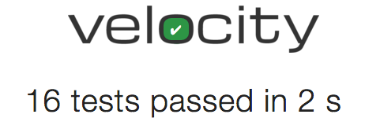

####task-item-spec.js
OK, so now we need to deal with the actual hiding of completed tasks.

######Tests

#####/test/jasmine/client/integration/todos/task-list-spec.js

describe ("the todo page : task list", function() {

  beforeEach(function() {
    Meteor.call('fixtures.createTask', {
      text: 'This is task 1', createdAt: '2015-01-01', completed: true});
    Meteor.call('fixtures.createTask', {text: 'This is task 2', createdAt: '2015-02-01'});
    Meteor.call('fixtures.createTask', {text: 'This is task 3', createdAt: '2015-03-01'});  
  });
  afterEach(function() {
    Meteor.call('fixtures.destroyTasks');
  });

  describe ("show all tasks", function() {

    it ("should contain the current list of tasks sorted by creation date " +
        "descending", function(done) {
      Meteor.setTimeout(function() {
        var tasks = TodosSpecHelper.retrieveTasksFromUI();

        expect(tasks.length).toEqual(3);
        expect(tasks[0]).toEqual('This is task 3');
        expect(tasks[1]).toEqual('This is task 2');
        expect(tasks[2]).toEqual('This is task 1');
        done();
      }, 200);
    });

  });

  describe ("show incomplete tasks only", function() {

    beforeEach(function() {
      // click the 'hide completed' checkbox to hide completed task
      $('label.hide-completed').find('input:checkbox').click();
    });
    afterEach(function() {
      // re-enable the showing of completed tasks so subsequent tests are not affected
      $('label.hide-completed').find('input:checkbox').click();
    });

    it ("should contain the current list of incompleted tasks sorted " +
        "by creation date descending", function(done) {
      Meteor.setTimeout(function() {
          var tasks = TodosSpecHelper.retrieveTasksFromUI();

          expect(tasks.length).toEqual(2);
          expect(tasks[0]).toEqual('This is task 3');
          expect(tasks[1]).toEqual('This is task 2');
          done();
        }, 200);
    });

  });

});


We've altered our test data slightly, marking the first task as complete.

We've then added describe sections for showing all vs only incomplete tasks.  In the case of the incomplete tasks we add additional `before` and `after` blocks to trigger the "hide complete" checkbox.

Our test for incomplete tasks is the same as that for complete tasks, just with less tasks due to the expectation that the complete tasks won't be showing.

As usual Velocity let's us know we have a failing test.

The error makes sense, we're still showing all 3 tasks instead of just the 2 incomplete tasks, let's fix that up!

######Implementation

#####client/templates/simple-todos.js

...
Template.body.helpers({
  tasks: function () {
    if (Session.get("hideCompleted")) {
      // If hide completed is checked, filter tasks
      return Tasks.find({completed: {$ne: true}}, {sort: {createdAt: -1}});
    } else {
      // Otherwise, return all of the tasks
      return Tasks.find({}, {sort: {createdAt: -1}});
    }
  },
  hideCompleted: function () {
    return Session.get("hideCompleted");
  },
  incompleteCount: function () {
    return Tasks.find({completed: {$ne: true}}).count();
  }
});

Template.body.events({
  ...
  ...
  "change .hide-completed input": function (event) {
    Session.set("hideCompleted", event.target.checked);
  }
});
...
...


We've updated the `tasks` helper to filter the tasks returned based on whether completed tasks should be shown or not.  A new `hideCompleted` helper has been added.  And finally we have a new event handler for the `hidCompleted` checkbox.

And with that the tests are all passing.

And with that onto our final step!

##Implementing Step 9 of the tutorial

OK, we are now onto the last step of the tutorial.  The official tutorial doesn't remove `autopublish` or `insecure` until step 10 and 11, but since we've removed those right off the bat we are ahead of the game and only have step 9 left.  It is pretty involved however, let's have look at the requirements.

  

    <h3 class="panel-title">Step 9 requirements</h3>
  

  

    <ul>
      <li>The application should allow users to create accounts.</li>
      <li>Only logged in user's can create new tasks.</li>
      <li>Tasks should indicate who created them.</li>
    </ul>
  

###Writing our tests and implementing step 9

OK, we're going to need to update `page-contents` to take into account the login / logout links.

As well, `new-task` will need to be updated to include the new rule about only logged in users  being able to create tasks.  Also we'll want to enhance the test to check that tasks are correctly associated with users.

Finally we need to update `task-item` as tasks now need to indicate who created them.

A bit of set-up is going to be required before we can get to the actual test as we need to figure out how to handle accounts in our tests.  First off let's add the necessary authentication packages.

#####Terminal

meteor add accounts-ui accounts-password


Now that we have the accounts packages installed, we're going to want to go about creating some user fixtures.

#####Terminal

touch packages/testing/user-fixtures.js


#####/packages/testing/user-fixtures.js

Meteor.startup(function() {
  var user = Meteor.users.findOne({username: 'Bob'});
  if (!user) {
    Accounts.createUser({
      username: 'Bob',
      password : 'foobar'
    });
  }
});


Nothing complicated, we're just creating a user 'Bob' if he doesn't already exist.

We're going to need to update our package file to include the new fixture.

#####/packages/testing/package.js

...
...
  api.addFiles([
    'task-fixtures.js',
    'user-fixtures.js'
  ], 'server');
});


We've added `user-fixtures.js` to our list of files and now as per <a href="http://robomongo.org/" target="_blank">Robomongo</a> we've got a user in our database.

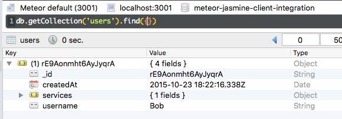

Next we're going to need a way to login and logout in our tests.  We could interact with the UI to do so, but we're going to circumvent that by just calling the appropriate Meteor methods.

To do so we'll create a new file in our testing package.

#####Terminal

touch packages/testing/test-user.js


#####/packages/testing/test-user.js

TestUser = {}

TestUser.login = function() {
  if (!Meteor.user())
  {
    Meteor.loginWithPassword('Bob', 'foobar', function(err) {
      if (err) {
        console.log('Login error: ' + err);
      }
    });
  }
}

TestUser.logout = function() {
  if (Meteor.user()) {
    Meteor.logout();
  }
}


So all we're doing here is setting up some methods to login and logout.

We'll need to update `package.js`.

#####/packages/testing/package.js

...
  api.addFiles([
    'task-fixtures.js',
    'user-fixtures.js'
  ], 'server');
  api.addFiles(['test-user.js'], ['client']);

  api.export([
    'TestUser'
  ]);
});


We've add the new file and exported our `TestUser` class.

The last thing I want to do is alter our task fixture to automatically assign a user to a task on creation when a user is logged in.

#####/packages/testing/task-fixtures.js

...
var _getDefaultTask = function() {
  var defaultUsername = '';
  var defaultOwnerId = '';

  if (Meteor.user()) {
    defaultUsername = Meteor.user().username;
    defaultOwnerId = Meteor.user()._id;
  }

  return {
    text: 'Task text',
    createdAt: new Date(),
    completed: false,
    username: defaultUsername,
    owner: defaultOwnerId
  }
};
...


So we just check if a user is logged in, if so that's who the task gets associated with.

Phew, now we can finally get onto the actual tests

####page-contents-spec.js

######Tests

#####/test/jasmine/client/integration/todos/page-contents-spec.js

describe ("the todo page : page contents", function() {

  describe ("for all users", function() {
    it ("should include a page title of 'Todo List'", function() {
      expect($('title').text()).toEqual('Todo List');
    });

    it ("should include a page heading of 'Todo List' appended " +
        "with the uncompleted task count", function(done) {
      Meteor.setTimeout(function() {
        expect($('h1').text()).toEqual('Todo List (0)');
        done();
      }, 200);
    });

    it ("should include an unordered list for displaying the tasks", function() {
      expect($('ul').length).toEqual(1);
    });

    it ("should include a checkbox for hiding completed tasks", function() {
      expect($('label.hide-completed').find('input:checkbox').length).toEqual(1);
    });

  });

  describe ("for logged in users", function() {

    beforeEach(function() {
      Package.testing.TestUser.login();
    });

    it ("should include a field for entering a new task " 
        + "with an appropriate placeholder", function(done) {
      Meteor.setTimeout(function() {
        expect($('.new-task input').attr('placeholder'))
          .toEqual('Type to add new tasks');
        done();
      }, 200);
    });

    it ("should include a logged in user link", function(done) {
      Meteor.setTimeout(function() {
        expect($('a#login-name-link').text()).toMatch("Bob");
        done();
      }, 300);
    });

  });

  describe ("for logged out users", function() {

    beforeEach(function() {
      Package.testing.TestUser.logout();
    });

    it ("should not include a field for entering a new task", function(done) {
      Meteor.setTimeout(function() {
        expect($('.new-task input').length).toEqual(0);
        done();
      }, 100);
    });

    it ("should include a login link", function(done) {
      Meteor.setTimeout(function() {
        expect($('a#login-sign-in-link').length).toEqual(1);
        done();
      }, 100);
    });
  });
  
});


OK, a decent amount of changes.  First off we've wrapped our existing tests in a new `for all users` describe block.  Notice that we've also removed the test that checks for the new task field as the field should only show up for logged in users.

Next we have our `for logged in users` tests.  We have a `before` block which logs in our test user, notice the different syntax that needs to be used when interacting with the API of a debug package, we need to prepend the call with 'Package.<package name>', instead of just calling `TestUser.login`.

Our actual "logged in" tests just check that a logged in link exists and that the new task input is available.

Conversely the `for logged out users` tests contain a call to `logout` in the `before` block and then check for a login link and that the new task field does not show up.

We have 3 tests failing.  

The test that checks for the new task field is going to pass as that field currently appears regardless of whether the user is logged in or not.

######Implementation

Let's get these tests passing.  First thing is that we're going to be logging in via username instead of email so let's set up our accounts config.

#####Terminal

touch client/config.js


#####/client/config.js

Accounts.ui.config({
  passwordSignupFields: 'USERNAME_ONLY'
});


Now we'll update the HTML.

#####/client/templates/todos.html

...
<header>
  <h1>Todo List ({{incompleteCount}})</h1>

  <label class="hide-completed">
    <input type="checkbox" checked="{{hideCompleted}}" />
    Hide Completed Tasks
  </label>

  {{> loginButtons}}

  {{#if currentUser}}
    <form class="new-task">
      <input type="text" name="text" placeholder="Type to add new tasks" />
    </form>
  {{/if}}
</header>
...


We've added the `loginButtons` template and also wrapped the new task field in a `currentUser` conditional.

And with that we have our `page-contents` tests passing, but we seem to have some issues with the new task tests now.

Makes sense, we now are going to need to login in order to have access to our new task field, so let's update `new-task`.  While we are at it, we'll update `new-task` to check that tasks are associated with the correct user on creation and that the task text is now prepended with the username.

#####/tests/jasmine/client/integration/todos/new-task-spec.js

describe ("the todo page : new task field", function() {
  
  beforeAll(function() {
    Package.testing.TestUser.login();
  });
  afterAll(function() {
    Package.testing.TestUser.logout();
  });

  afterEach(function() {
    Meteor.call('fixtures.destroyTasks');
  });
  
    it ("should create a new task on form submit with expected values", function(done) {
    // submit a new task
    Meteor.setTimeout(function() {
      addTaskViaUI('My new task');
      
      // check the updated task list
      var tasks = TodosSpecHelper.retrieveTasksFromUI();
      expect(tasks.length).toEqual(1);
      expect(tasks[0]).toEqual('Bob - My new task');

      // also check the DB
      var task = Tasks.findOne({text: 'My new task'});
      expect(task).not.toBe(undefined);
      expect(task.text).toEqual('My new task');
      expect(task.completed).toBe(false);
      expect(task.username).toEqual('Bob');
      expect(task.owner).toEqual(Meteor.userId());
      done();
    }, 300);
  });
  ...
  ...


So we've added `beforeAll` and `afterAll` blocks to hand the login and logout, and we've updated the expected task text that will be displayed in the UI.  Also in our DB checks we've added a check to ensure the username and owner values are correct.

To get this working we'll need to update our `addTask` method.

#####/lib/collections.js

...
Meteor.methods({
  addTask: function (text) {
    Tasks.insert({
      text: text,
      createdAt: new Date(),
      completed: false,
      owner: Meteor.userId(),
      username: Meteor.user().username
    });
  },
  ...
  ...


We're setting the owner and username on inserted tasks.

Now all our tests are passing.

####task-item-spec.js

So now the only other thing to do is update the way each task item should look.

######Tests

#####/tests/jasmine/client/integration/todos/task-item-spec.js

describe ("the todo page : an individual task item", function() {

  beforeAll(function() {
    Package.testing.TestUser.login();
  });
  afterAll(function() {
    Package.testing.TestUser.logout();
  });

  beforeEach(function() {
    Meteor.call('fixtures.createTask', {
      text: 'The task'
    });
  });
  afterEach(function() {
    Meteor.call('fixtures.destroyTasks');
  });

  it ("should include the name of the user who created "
      + "the task along with the task text", function(done) {
    Meteor.setTimeout(function() {
      var tasks = TodosSpecHelper.retrieveTasksFromUI();

      expect(tasks.length).toEqual(1);
      expect(tasks[0]).toEqual('Bob - The task');
      done();
    }, 200);
  });
  ...
  ...


We've updated the test that checks the task text to include the username and also added blocks to login the user.  We need to login otherwise no username will be associated with the task.

As expected we now have a failing test.

######Implementation

To get the test passing we need to update our HTML.

#####/client/templates/todos.html

...
...
<template name="task">
  <li class="{{#if completed}}checked{{/if}}">
    <button class="delete">&times;</button>
    <input type="checkbox" checked="{{completed}}" class="toggle-checked" />
    <strong>{{username}}</strong> - {{text}}
  </li>
</template>


OK, just a quick update to the `span` tag and we are all good.

Or not...

#CHECK THIS IMAGE MIGHT BE WRONG... might want to check all of them in step 9

We have some issues with our task list, once again we're going to need to login and then adjust the task text values in the UI that we are checking for.

#####/tests/jasmine/client/integration/todos/task-list-spec.js

describe ("the todo page : task list", function() {

  beforeAll(function(done) {
    Meteor.setTimeout(function() {
      Package.testing.TestUser.login();
      done();
    }, 300);
  });
  afterAll(function() {
    Package.testing.TestUser.logout();
  });

  beforeEach(function() {
    Meteor.call('fixtures.createTask', {
      text: 'This is task 1', createdAt: '2015-01-01', completed: true});
    Meteor.call('fixtures.createTask', {text: 'This is task 2', createdAt: '2015-02-01'});
    Meteor.call('fixtures.createTask', {text: 'This is task 3', createdAt: '2015-03-01'});  
  });
  afterEach(function() {
    Meteor.call('fixtures.destroyTasks');
  });

  describe ("show all tasks", function() {

    it ("should contain the current list of tasks sorted by creation date " +
        "descending", function(done) {
      Meteor.setTimeout(function() {
        var tasks = TodosSpecHelper.retrieveTasksFromUI();

        expect(tasks.length).toEqual(3);
        expect(tasks[0]).toEqual('Bob - This is task 3');
        expect(tasks[1]).toEqual('Bob - This is task 2');
        expect(tasks[2]).toEqual('Bob - This is task 1');
        done();
      }, 200);
    });

  });

  describe ("show incomplete tasks only", function() {

    beforeEach(function() {
      // click the 'hide completed' checkbox to hide completed task
      $('label.hide-completed').find('input:checkbox').click();
    });
    afterEach(function() {
      // re-enable the showing of completed tasks so subsequent tests are not affected
      $('label.hide-completed').find('input:checkbox').click();
    });

    it ("should contain the current list of incompleted tasks sorted " +
        "by creation date descending", function(done) {
      Meteor.setTimeout(function() {
          var tasks = TodosSpecHelper.retrieveTasksFromUI();

          expect(tasks.length).toEqual(2);
          expect(tasks[0]).toEqual('Bob - This is task 3');
          expect(tasks[1]).toEqual('Bob - This is task 2');
          done();
        }, 200);
    });

  });

});


The only changes here are that we have added `beforeAll` and `afterAll` blocks for logging in the user.  Note we needed to add a timeout to the `beforeAll` block as otherwise I found the `beforeEach` blocking was running before the user was logged in, meaning we weren't getting the username associated to a task.

The other change is to the task text that we are looking for in our expect statements, they've been pre-pended with 'Bob'.

And with that we have passing tests.

##Implementing Step 10 of the tutorial

Step 10 of the tutorial is where the insecure package is removed... but we've done that from right off the bat so we are ahead of the game, there is one minor requirement we can test for however.

  

    <h3 class="panel-title">Step 10 requirements</h3>
  

  

    <ul>
      <li>Attempting to add a task without logging in should throw a 'not-authorized' exception.</li>
    </ul>
  

###Writing our tests and implementing step 10

This test is going to be a little different than the others we've written so far as we're going to need to bypass the UI.  This is because the new task fields aren't available in the UI unless a user is logged in.

So we're going to call our server method directly from within our test.

####new-task-spec.js

######Tests

#####/tests/jasmine/client/integration/new-task-spec.js

describe ("the todo page : new task field", function() {
  
  describe ("for logged in users", function() {
    
    beforeAll(function() {
      Package.testing.TestUser.login();
    });
    afterAll(function() {
      Package.testing.TestUser.logout();
    });

    afterEach(function() {
      Meteor.call('fixtures.destroyTasks');
    });
  
    it ("should create a new task on form submit with expected values", function(done) {
      // submit a new task
      Meteor.setTimeout(function() {
        addTaskViaUI('My new task');
        
        // check the updated task list
        var tasks = TodosSpecHelper.retrieveTasksFromUI();
        expect(tasks.length).toEqual(1);
        expect(tasks[0]).toEqual('Bob - My new task');

        // also check the DB
        var task = Tasks.findOne({text: 'My new task'});
        expect(task).not.toBe(undefined);
        expect(task.text).toEqual('My new task');
        expect(task.completed).toBe(false);
        expect(task.username).toEqual('Bob');
        expect(task.owner).toEqual(Meteor.userId());
        done();
      }, 300);
    });

    it ("should clear out the new task field on form submit", function(done) {
      Meteor.setTimeout(function() {  
        addTaskViaUI('Another new task');
        expect($('.new-task input').val()).toEqual('');
        done();
      }, 200);
    });

  });

  describe ("for non-logged in users", function() {

    it ("should throw a 'not-authorized' exception", function(done) {
      Meteor.setTimeout(function() {
        Meteor.call('addTask', 'some task', function(err) {
          expect(err).not.toBe(undefined);
          expect(err.error).toEqual('not-authorized');
          done();
        });
        
      }, 300);
    });

  });
  
});

var addTaskViaUI = function(taskName) {
  $('.new-task input').val(taskName);
  $("form").submit();
}


OK, so we've added `logged in` and `logged out` describe blocks.  Our existing testing are going inside of the `logged in` block, the new test lives in the new block.

The new test is just explicitly calling our Meteor method and we check that we get an exception, and we're also checking the `error` property of the exception.

We now have a failing test.

######Implementation

To get our tests passing again we need to add a check for a logged in user within the `addTask` method.

#####/lib/collections.js

...
Meteor.methods({
  addTask: function (text) {
    // Make sure the user is logged in before inserting a task
    if (! Meteor.userId()) {
      throw new Meteor.Error("not-authorized");
    }

    Tasks.insert({
    ...


And with that we are all good.

One thing that is a little annoying is that the error gets thrown into the browser console and I haven't been able to figure out a way of preventing this.  This is a little annoying as it can be more difficult to see when things are actually going wrong that we aren't expecting to go wrong as now with this test we are always going to have some noise in the browser console.

##Implementing Step 11 of the tutorial

Step 11 primarily deals with removing autopublish so we're already there, but there are also some enhancements.

  

    <h3 class="panel-title">Step 11 requirements</h3>
  

  

    <ul>
      <li>The owner of a task should be able to mark a task as private via a private / public button.</li>
      <li>The private / public button will display the current state of the task, i.e. it will display 'public' for public tasks and 'private' for private tasks.</li>
      <li>Private tasks should display in a way that makes it obvious they are private.</li>
      <li>Attempts to mark a task the current user does not own as private will result in a 'not-authorized' exception.</li>
      <li>Private tasks will only appear to the owner of those tasks.</li>
      <li>Private tasks can only be deleted by their owner.</li>
      <li>Attempts to delete a private task that is not owned by the current user will result in a 'not-authorized' exception.</li>
      <li>Private tasks can only be marked as completed by their owner.</li>
      <li>Attempts to mark as complete as task not owned by the current user will result in a 'not-authorized' exception.</li>
    </ul>
  

###Writing our tests and implementing step 11

OK, so we've got a whole bunch of work in front of us to get this all implemented, let's get started!

####new-task-spec.js
Let's get some of our simpler changes out of the way first.  With `new-task` all we need to do is check that by default new tasks are public.

######Tests

#####/tests/jasmine/client/integration/todos/new-task-spec.js

    ...
    it ("should create a new task on form submit with expected values", function(done) {
      // submit a new task
      Meteor.setTimeout(function() {
        addTaskViaUI('My new task');
        
        // check the updated task list
        var tasks = TodosSpecHelper.retrieveTasksFromUI();
        expect(tasks.length).toEqual(1);
        expect(tasks[0]).toEqual('Bob - My new task');

        // also check the DB
        var task = Tasks.findOne({text: 'My new task'});
        expect(task).not.toBe(undefined);
        expect(task.text).toEqual('My new task');
        expect(task.completed).toBe(false);
        expect(task.username).toEqual('Bob');
        expect(task.owner).toEqual(Meteor.userId());
        expect(task.private).toBe(false);
        done();
      }, 300);
    });
    ...


We've just added a new `expect` statement, `expect(task.private).toBe(false);`.

And now we have a failing test.

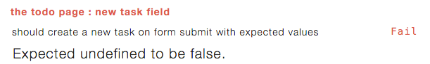

######Implementation

#####/lib/collection.js

Meteor.methods({
  addTask: function (text) {
    // Make sure the user is logged in before inserting a task
    if (! Meteor.userId()) {
      throw new Meteor.Error("not-authorized");
    }

    Tasks.insert({
      text: text,
      createdAt: new Date(),
      completed: false,
      owner: Meteor.userId(),
      username: Meteor.user().username,
      private: false
    });
  },


A fairly easy change, we've just added the default value to our insert method.

And we're back to passing.

While we are at it, let's update our default task in our task fixture.

#####/packages/testing/task-fixture.js

...
var _getDefaultTask = function() {
  var defaultUsername = '';
  var defaultOwnerId = '';

  if (Meteor.user()) {
    defaultUsername = Meteor.user().username;
    defaultOwnerId = Meteor.user()._id;
  } 

  return {
    text: 'Task text',
    createdAt: new Date(),
    completed: false,
    username: defaultUsername,
    owner: defaultOwnerId,
    private: false
  }
};
...


Again a very small change, just including the field in the default.

####task-list-spec.js
Next we're going to deal with the display aspects of private tasks, namely that they should not appear for user's who don't own the task or for user's who are not logged in.  We'll also ensure that tasks a user owns show up for them.

######Tests

First off we are going to need another user in order to test our scenarios, so let's set that up first.

#####/packages/testing/user-fixtures.js

Meteor.startup(function() {
  
  // Disable rate limiting for our test users
  //
  // As per docs.meteor.com/#/full/ddpratelimiter, "the default limits 
  // login attempts, new user creation, and password resets to 
  // 5 attempts every 10 seconds per connection"
  //
  // With rate limiting enabled, our tests will fail as we
  // are logging in / logging more than 5x per 10 seconds
  Accounts.removeDefaultRateLimit();

  var user = Meteor.users.findOne({username: 'Bob'});
  if (!user) {
    Accounts.createUser({
      username: 'Bob',
      password : 'foobar'
    });
  }

  user = Meteor.users.findOne({username: 'Sally'});
  if (!user) {
    Accounts.createUser({
      username: 'Sally',
      password: 'foobar'
    });
  }
});


We've added a new user `Sally` to our fixtures.

Next let's update our `login` and `logout` methods.

#####/packages/testing/test-user.js

TestUser = {}

TestUser.login = function() {
  _login('Bob');
}

TestUser.login.Sally = function() {
  _login('Sally');
}

TestUser.logout = function() {
  if (Meteor.user()) {
    Meteor.logout();
  }
}

var _login = function(user) {
  Meteor.loginWithPassword(user, 'foobar', function(err) {
    if (err) {
      console.log('Login error: ' + err);
    }
  });
}


Here, we've created a new method for logging in with Sally.  Our existing method logs in with Bob as usual, but we can now log in with Sally with our new method.

As far as the spec goes, there are a fair number of changes to this spec, so we'll list the full spec below and then go thru the changes section by section.

#####/tests/jasmine/client/integration/todos/task-list-spec.js

describe ("the todo page : task list", function() {

  describe ("private tasks", function() {

    beforeAll(function(done) {
      Meteor.setTimeout(function() {
        Package.testing.TestUser.login();
        
        // putting this here as more efficient, plus if in beforeEach afterEach
        // then the user might not be logged in during creation due to the logging in
        // and logging out in the tests themselves, figured this out by looking in 
        // Robomongo
        Meteor.call('fixtures.createTask', {
          text: 'This is a private task', createdAt: '2015-01-01', private: true });
        Meteor.call('fixtures.createTask', {
          text: 'This is a public task', createdAt: '2015-02-01'}); 
        
        done();
      }, 300);
    });
    afterAll(function() {
      Package.testing.TestUser.logout();
      Meteor.call('fixtures.destroyTasks');
    });

    it ("should not show up for non-signed in users", function(done) {
      Meteor.setTimeout(function() {
        Package.testing.TestUser.logout();
      }, 200);

      Meteor.setTimeout(function() {
        var tasks = TodosSpecHelper.retrieveTasksFromUI();

        expect(tasks.length).toEqual(1);
        expect(tasks[0]).toEqual('Bob - This is a public task');
        done();
      }, 400);
    });

    it ("should not show up for user's that do not own the task", function(done) {
      Meteor.setTimeout(function() {
        Package.testing.TestUser.login.Sally();
      }, 200);

      Meteor.setTimeout(function() {
        var tasks = TodosSpecHelper.retrieveTasksFromUI();

        expect(tasks.length).toEqual(1);
        expect(tasks[0]).toEqual('Bob - This is a public task');
        done();
      }, 400);
    });

    it ("should show up for the user that owns the task", function(done) {
      Meteor.setTimeout(function() {
        Package.testing.TestUser.login();
      }, 200);

      Meteor.setTimeout(function() {
        var tasks = TodosSpecHelper.retrieveTasksFromUI();

        expect(tasks.length).toEqual(2);
        expect(tasks[0]).toEqual('Bob - This is a public task');
        expect(tasks[1]).toEqual('Bob - This is a private task');
        done();
      }, 400);
    });

  });

  describe ("public tasks", function() {

    beforeAll(function(done) {
      Meteor.setTimeout(function() {
        Package.testing.TestUser.login();
        done();
      }, 300);
    });
    afterAll(function() {
      Package.testing.TestUser.logout();
    });

    beforeEach(function() {
      Meteor.call('fixtures.createTask', {
        text: 'This is task 1', createdAt: '2015-01-01', completed: true});
      Meteor.call('fixtures.createTask', {text: 'This is task 2', createdAt: '2015-02-01'});
      Meteor.call('fixtures.createTask', {text: 'This is task 3', createdAt: '2015-03-01'});  
    });
    afterEach(function() {
      Meteor.call('fixtures.destroyTasks');
    });

    describe ("show all tasks", function() {

      it ("should contain the current list of tasks sorted by creation date " +
          "descending", function(done) {
        Meteor.setTimeout(function() {
          var tasks = TodosSpecHelper.retrieveTasksFromUI();

          expect(tasks.length).toEqual(3);
          expect(tasks[0]).toEqual('Bob - This is task 3');
          expect(tasks[1]).toEqual('Bob - This is task 2');
          expect(tasks[2]).toEqual('Bob - This is task 1');
          done();
        }, 200);
      });

    });

    describe ("show incomplete tasks only", function() {

      beforeEach(function() {
        // click the 'hide completed' checkbox to hide completed task
        $('label.hide-completed').find('input:checkbox').click();
      });
      afterEach(function() {
        // re-enable the showing of completed tasks so subsequent tests are not affected
        $('label.hide-completed').find('input:checkbox').click();
      });

      it ("should contain the current list of incompleted tasks sorted " +
          "by creation date descending", function(done) {
        Meteor.setTimeout(function() {
            var tasks = TodosSpecHelper.retrieveTasksFromUI();

            expect(tasks.length).toEqual(2);
            expect(tasks[0]).toEqual('Bob - This is task 3');
            expect(tasks[1]).toEqual('Bob - This is task 2');
            done();
          }, 200);
      });

    });

  });

});


// break it up here and go thru each section

######Implementation

#####/server/publications.js

Meteor.publish("tasks", function () {
  return Tasks.find({
    $or: [
      { private: {$ne: true} },
      { owner: this.userId }
    ]
  });
});


We've updated our publication to take into account whether a task is private or not and whether the current user is the owner of the task.

####task-item-spec.js
Next let's tackle the `task-item` spec.  We're going to want to check that the private button shows for tasks the user owns, and doesn't show for tasks the user does not own.  We'll also check that private tasks are displayed differently from public tasks... so let's get started!

######Tests

#####/tests/jasmine/client/integration/todos/task-item-spec.js

describe ("the todo page : an individual task item", function() {

  describe ("any task", function() {

    beforeAll(function() {
      Meteor.call('fixtures.createTask', {
        text: 'The task'
      });
    });
    afterAll(function() {
      Meteor.call('fixtures.destroyTasks');
    });

    it ("should include the name of the user who created "
        + "the task along with the task text", function(done) {
      Meteor.setTimeout(function() {
        var tasks = TodosSpecHelper.retrieveTasksFromUI();

        expect(tasks.length).toEqual(1);
        expect(tasks[0]).toEqual('Bob - The task');
        done();
      }, 200);
    });

    it ("should include a checkbox to mark the task as complete", function(done) {
      Meteor.setTimeout(function() {
        var checkbox = $('li').find("input:checkbox");
        expect(checkbox.length).toEqual(1);
        done();
      }, 100);
    });

    it ("should include a delete button", function(done) {
      Meteor.setTimeout(function() {
        var deleteButton = $('.delete');
        expect(deleteButton.length).toEqual(1);
        done();
      }, 200);
    });

  });

  describe ("which the current user owns", function() {

    beforeEach(function() {
      Meteor.call('fixtures.createTask');
    });
    afterEach(function() {
      Meteor.call('fixtures.destroyTasks');
    });

    it ("should show the public / private button", function(done) {
      Meteor.setTimeout(function() {
        var tasks = TodosSpecHelper.retrieveTasksFromUI();

        var privateButton = $('.toggle-private');
        expect(privateButton.length).toEqual(1);
        done();
      }, 200);
    });

  });

  describe ("which the current user does not own", function() {

    beforeEach(function() {
      Meteor.call('fixtures.createTask', { owner: 'Joe' });
    });
    afterEach(function() {
      Meteor.call('fixtures.destroyTasks');
    });

    it ("should not show the public / private button", function(done) {
      Meteor.setTimeout(function() {
        var tasks = TodosSpecHelper.retrieveTasksFromUI();

        var privateButton = $('.toggle-private');
        expect(privateButton.length).toEqual(0);
        done();
      }, 200);
    });

  });

  describe ("private tasks", function() {

    beforeEach(function() {
      Meteor.call('fixtures.createTask', { private: true });
    });
    afterEach(function() {
      Meteor.call('fixtures.destroyTasks');
    });

    it ("should display with a grey background", function(done) {
      Meteor.setTimeout(function() {
        expect($("li").hasClass('private')).toBe(true);
        done();
      }, 200);
    });

  });
  
});


... explanation goes here

######Implementation

#####/client/templates/simple-todos.html

<template name="task">
  <li class="{{#if completed}}checked{{/if}} {{#if private}}private{{/if}}">
    <button class="delete">&times;</button>
    <input type="checkbox" checked="{{completed}}" class="toggle-checked" />

    {{#if isOwner}}
      <button class="toggle-private">
        {{#if private}}
          Private
        {{else}}
          Public
        {{/if}}
      </button>
    {{/if}}
    ...
    ...


#####/client/templates/simple-todos.js

...
Template.task.helpers({
  isOwner: function () {
    return this.owner === Meteor.userId();
  }
});

Template.task.events({
  ...


####update-task-spec.js

######Tests

#####/tests/jasmine/client/integration/todos/update-task-spec.js

describe ("the todo page : update task", function() {
  
  xdescribe ("completing a task", function() {
    beforeEach(function() {
      Meteor.call('fixtures.createTask');
    });
    afterEach(function() {
      Meteor.call('fixtures.destroyTasks');
    });
      
    it ("should set the 'completed' field to true", function(done) {
      _toggleAndCheckTaskStatus(true, done);
    });

    it ("should show a strike-through for the completed tasks", function(done) {
      _toggleAndCheckTaskStatus(true, done);
    });
  });

  xdescribe ("re-activating a task", function() {
    beforeEach(function () {
      Meteor.call('fixtures.createTask', {completed: true});
    });
    afterEach(function() {
      Meteor.call('fixtures.destroyTasks');
    });
      
    it ("should set the 'completed' field to false", function(done) {
      _toggleAndCheckTaskStatus(false, done);
    });

    it ("should remove the strike-through for the re-activated tasks", function(done) {
      _toggleAndCheckTaskStatus(false, done);
    });

  });

  describe ("private and public tasks", function() {
    
    beforeAll(function() {
      Package.testing.TestUser.login();
    });
    afterAll(function() {
      Package.testing.TestUser.logout();
    });
    
    xdescribe ("public tasks", function() {
      
      beforeEach(function() {
        Meteor.call('fixtures.createTask', 
          { text: "This is a public task"});
      });
      afterEach(function() {
        Meteor.call('fixtures.destroyTasks');
      });

      it ("should update the task to private when public button is clicked", function(done) {
        Meteor.setTimeout(function() {
          // set the task to private
          $('.toggle-private').click();

          var taskInDb = Tasks.findOne({text: "This is a public task"});
          expect(taskInDb.private).toEqual(true);
          done();
        }, 200);
      });

      it ("should update the text of the button to 'private' when the public button is clicked", function(done) {
        Meteor.setTimeout(function() {
          $('.toggle-private').click();
        }, 200);
        Meteor.setTimeout(function() {
          expect($('.toggle-private').text().trim()).toEqual('Private');
          done();
        }, 400);
      });
    
    });

    xdescribe ("private tasks : owned by the current user", function() {

      beforeEach(function() {
        Meteor.call('fixtures.createTask', 
          { text: "This is a private task", private: true});
      });
      afterEach(function() {
        Meteor.call('fixtures.destroyTasks');
      });

      it ("should update the task to public when private button is clicked", function(done) {
        Meteor.setTimeout(function() {
          // set the task to private
          $('.toggle-private').click();

          var taskInDb = Tasks.findOne({text: "This is a private task"});
          expect(taskInDb.private).toEqual(false);
          done();
        }, 200);
      });

      it ("should update the text of the button to 'public' when the private button is clicked", function(done) {
        Meteor.setTimeout(function() {
          $('.toggle-private').click();
        }, 200);
        Meteor.setTimeout(function() {
          expect($('.toggle-private').text().trim()).toEqual('Public');
          done();
        }, 400);
      });

    });

    describe ("private tasks : not owned by the current user", function() {
      var taskId = '';
      beforeEach(function() {
        Meteor.call('fixtures.createTask', { 
          text: "This is a private task", 
          private: true,
          owner: 'someOwner'
        }, function(error, result) {
          taskId = result._id;
        });
      });
      afterEach(function() {
        Meteor.call('fixtures.destroyTasks');
      });

      it ("should not be able to be completed", function(done) {
        Meteor.setTimeout(function() {
          Meteor.call('setCompleted', taskId, true, function(err) {
            expect(err).not.toBe(undefined);
            expect(err.error).toEqual('not-authorized');
            done();
          });
        }, 300);
      });

      it ("should not be able to be deleted", function(done) {
        Meteor.setTimeout(function() {
          Meteor.call('deleteTask', taskId, function(err) {
            expect(err).not.toBe(undefined);
            expect(err.error).toEqual('not-authorized');
            done();
          });
        }, 300);
      });

      it ("should not be able to be marked as public", function(done) {
        Meteor.setTimeout(function() {
          Meteor.call('setPrivate', taskId, false, function(err) {
            expect(err).not.toBe(undefined);
            expect(err.error).toEqual('not-authorized');
            done();
          });
        }, 300);
      });

    });
  
  });

  var _toggleAndCheckTaskStatus = function(completeTask, done) {
    Meteor.setTimeout(function() {
      // activate the checkbox
      $("li").find("input:checkbox").click();
      
      // find the associated record in the DB and verify it is checked
      var tasks = Tasks.find().fetch();
      expect(tasks[0].completed).toEqual(completeTask);

      // ensure the checkbox is now checked
      expect($("li").find("input:checkbox").is(':checked')).toEqual(completeTask);
      done();
    }, 200);
  }

  var _toggleStatusAndCheckStrikeThru = function(completeTask, done) {
    Meteor.setTimeout(function() {
      $("li").find("input:checkbox").click();
    }, 200);

    Meteor.setTimeout(function() {
      expect($("li").hasClass('checked')).toBe(completeTask);
      done();
    }, 800);
  }

});


######Implementation

#####/lib/collections.js

...
  deleteTask: function (taskId) {
    var task = Tasks.findOne(taskId);

    if (task.private && task.owner !== Meteor.userId()) {
      // If the task is private, make sure only the owner can delete it
      throw new Meteor.Error("not-authorized");
    }

    Tasks.remove(taskId);
  },
  setCompleted: function (taskId, setCompleted) {
    var task = Tasks.findOne(taskId);

    if (task.private && task.owner !== Meteor.userId()) {
      // If the task is private, make sure only the owner can check it off
      throw new Meteor.Error("not-authorized");
    }
    
    Tasks.update(taskId, { $set: { completed: setCompleted} });
  },
  ...


##Summary

###Next steps

###References
