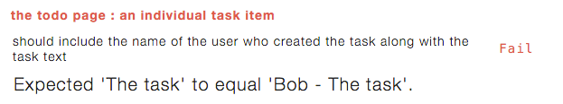

In this post we'll be continuing right from where we left off with <a href="/meteor-client-integration-testing-with-velocity-and-jasmine-part-1/index.html" target="_blank">part 1</a>.  We have a good chunk of the <a href="https://www.meteor.com/tutorials/blaze/creating-an-app" target="_blank">Meteor tutorial</a> implemented along with associated tests.  Part 2 will complete that work and deal with handling users and authentication within our tests.

So onto <a href="https://www.meteor.com/tutorials/blaze/adding-user-accounts" target="_blank">step 9...</a>

#STOPPED

##Implementing Step 9 of the tutorial

OK, we are now onto the last step of the tutorial.  The official tutorial doesn't remove `autopublish` or `insecure` until step 10 and 11, but since we've removed those right off the bat we are ahead of the game and only have step 9 left.  It is pretty involved however, let's have look at the requirements.

  

    <h3 class="panel-title">Step 9 requirements</h3>
  

  

    <ul>
      <li>The application should allow users to create accounts.</li>
      <li>Only logged in user's can create new tasks.</li>
      <li>Tasks should indicate who created them.</li>
    </ul>
  

###Writing our tests and implementing step 9

OK, we're going to need to update `page-contents` to take into account the login / logout links.

As well, `new-task` will need to be updated to include the new rule about only logged in users  being able to create tasks.  Also we'll want to enhance the test to check that tasks are correctly associated with users.

Finally we need to update `task-item` as tasks now need to indicate who created them.

A bit of set-up is going to be required before we can get to the actual test as we need to figure out how to handle accounts in our tests.  First off let's add the necessary authentication packages.

#####Terminal

meteor add accounts-ui accounts-password


Now that we have the accounts packages installed, we're going to want to go about creating some user fixtures.

#####Terminal

touch packages/testing/user-fixtures.js


#####/packages/testing/user-fixtures.js

Meteor.startup(function() {
  var user = Meteor.users.findOne({username: 'Bob'});
  if (!user) {
    Accounts.createUser({
      username: 'Bob',
      password : 'foobar'
    });
  }
});


Nothing complicated, we're just creating a user 'Bob' if he doesn't already exist.

We're going to need to update our package file to include the new fixture.

#####/packages/testing/package.js

...
...
  api.addFiles([
    'task-fixtures.js',
    'user-fixtures.js'
  ], 'server');
});


We've added `user-fixtures.js` to our list of files and now as per <a href="http://robomongo.org/" target="_blank">Robomongo</a> we've got a user in our database.

Next we're going to need a way to login and logout in our tests.  We could interact with the UI to do so, but we're going to circumvent that by just calling the appropriate Meteor methods.

To do so we'll create a new file in our testing package.

#####Terminal

touch packages/testing/test-user.js


#####/packages/testing/test-user.js

TestUser = {}

TestUser.login = function() {
  if (!Meteor.user())
  {
    Meteor.loginWithPassword('Bob', 'foobar', function(err) {
      if (err) {
        console.log('Login error: ' + err);
      }
    });
  }
}

TestUser.logout = function() {
  if (Meteor.user()) {
    Meteor.logout();
  }
}


So all we're doing here is setting up some methods to login and logout.

We'll need to update `package.js`.

#####/packages/testing/package.js

...
  api.addFiles([
    'task-fixtures.js',
    'user-fixtures.js'
  ], 'server');
  api.addFiles(['test-user.js'], ['client']);

  api.export([
    'TestUser'
  ]);
});


We've add the new file and exported our `TestUser` class.

The last thing I want to do is alter our task fixture to automatically assign a user to a task on creation when a user is logged in.

#####/packages/testing/task-fixtures.js

...
var _getDefaultTask = function() {
  var defaultUsername = '';
  var defaultOwnerId = '';

  if (Meteor.user()) {
    defaultUsername = Meteor.user().username;
    defaultOwnerId = Meteor.user()._id;
  }

  return {
    text: 'Task text',
    createdAt: new Date(),
    completed: false,
    username: defaultUsername,
    owner: defaultOwnerId
  }
};
...


So we just check if a user is logged in, if so that's who the task gets associated with.

Phew, now we can finally get onto the actual tests

####page-contents-spec.js

######Tests

#####/test/jasmine/client/integration/todos/page-contents-spec.js

describe ("the todo page : page contents", function() {

  describe ("for all users", function() {
    it ("should include a page title of 'Todo List'", function() {
      expect($('title').text()).toEqual('Todo List');
    });

    it ("should include a page heading of 'Todo List' appended " +
        "with the uncompleted task count", function(done) {
      Meteor.setTimeout(function() {
        expect($('h1').text()).toEqual('Todo List (0)');
        done();
      }, 200);
    });

    it ("should include an unordered list for displaying the tasks", function() {
      expect($('ul').length).toEqual(1);
    });

    it ("should include a checkbox for hiding completed tasks", function() {
      expect($('label.hide-completed').find('input:checkbox').length).toEqual(1);
    });

  });

  describe ("for logged in users", function() {

    beforeEach(function() {
      Package.testing.TestUser.login();
    });

    it ("should include a field for entering a new task " 
        + "with an appropriate placeholder", function(done) {
      Meteor.setTimeout(function() {
        expect($('.new-task input').attr('placeholder'))
          .toEqual('Type to add new tasks');
        done();
      }, 200);
    });

    it ("should include a logged in user link", function(done) {
      Meteor.setTimeout(function() {
        expect($('a#login-name-link').text()).toMatch("Bob");
        done();
      }, 300);
    });

  });

  describe ("for logged out users", function() {

    beforeEach(function() {
      Package.testing.TestUser.logout();
    });

    it ("should not include a field for entering a new task", function(done) {
      Meteor.setTimeout(function() {
        expect($('.new-task input').length).toEqual(0);
        done();
      }, 100);
    });

    it ("should include a login link", function(done) {
      Meteor.setTimeout(function() {
        expect($('a#login-sign-in-link').length).toEqual(1);
        done();
      }, 100);
    });
  });
  
});


OK, a decent amount of changes.  First off we've wrapped our existing tests in a new `for all users` describe block.  Notice that we've also removed the test that checks for the new task field as the field should only show up for logged in users.

Next we have our `for logged in users` tests.  We have a `before` block which logs in our test user, notice the different syntax that needs to be used when interacting with the API of a debug package, we need to prepend the call with 'Package.<package name>', instead of just calling `TestUser.login`.

Our actual "logged in" tests just check that a logged in link exists and that the new task input is available.

Conversely the `for logged out users` tests contain a call to `logout` in the `before` block and then check for a login link and that the new task field does not show up.

We have 3 tests failing.  

The test that checks for the new task field is going to pass as that field currently appears regardless of whether the user is logged in or not.

######Implementation

Let's get these tests passing.  First thing is that we're going to be logging in via username instead of email so let's set up our accounts config.

#####Terminal

touch client/config.js


#####/client/config.js

Accounts.ui.config({
  passwordSignupFields: 'USERNAME_ONLY'
});


Now we'll update the HTML.

#####/client/templates/todos.html

...
<header>
  <h1>Todo List ({{incompleteCount}})</h1>

  <label class="hide-completed">
    <input type="checkbox" checked="{{hideCompleted}}" />
    Hide Completed Tasks
  </label>

  {{> loginButtons}}

  {{#if currentUser}}
    <form class="new-task">
      <input type="text" name="text" placeholder="Type to add new tasks" />
    </form>
  {{/if}}
</header>
...


We've added the `loginButtons` template and also wrapped the new task field in a `currentUser` conditional.

And with that we have our `page-contents` tests passing, but we seem to have some issues with the new task tests now.

Makes sense, we now are going to need to login in order to have access to our new task field, so let's update `new-task`.  While we are at it, we'll update `new-task` to check that tasks are associated with the correct user on creation and that the task text is now prepended with the username.

#####/tests/jasmine/client/integration/todos/new-task-spec.js

describe ("the todo page : new task field", function() {
  
  beforeAll(function() {
    Package.testing.TestUser.login();
  });
  afterAll(function() {
    Package.testing.TestUser.logout();
  });

  afterEach(function() {
    Meteor.call('fixtures.destroyTasks');
  });
  
    it ("should create a new task on form submit with expected values", function(done) {
    // submit a new task
    Meteor.setTimeout(function() {
      addTaskViaUI('My new task');
      
      // check the updated task list
      var tasks = TodosSpecHelper.retrieveTasksFromUI();
      expect(tasks.length).toEqual(1);
      expect(tasks[0]).toEqual('Bob - My new task');

      // also check the DB
      var task = Tasks.findOne({text: 'My new task'});
      expect(task).not.toBe(undefined);
      expect(task.text).toEqual('My new task');
      expect(task.completed).toBe(false);
      expect(task.username).toEqual('Bob');
      expect(task.owner).toEqual(Meteor.userId());
      done();
    }, 300);
  });
  ...
  ...


So we've added `beforeAll` and `afterAll` blocks to hand the login and logout, and we've updated the expected task text that will be displayed in the UI.  Also in our DB checks we've added a check to ensure the username and owner values are correct.

To get this working we'll need to update our `addTask` method.

#####/lib/collections.js

...
Meteor.methods({
  addTask: function (text) {
    Tasks.insert({
      text: text,
      createdAt: new Date(),
      completed: false,
      owner: Meteor.userId(),
      username: Meteor.user().username
    });
  },
  ...
  ...


We're setting the owner and username on inserted tasks.

Now all our tests are passing.

####task-item-spec.js

So now the only other thing to do is update the way each task item should look.

######Tests

#####/tests/jasmine/client/integration/todos/task-item-spec.js

describe ("the todo page : an individual task item", function() {

  beforeAll(function() {
    Package.testing.TestUser.login();
  });
  afterAll(function() {
    Package.testing.TestUser.logout();
  });

  beforeEach(function() {
    Meteor.call('fixtures.createTask', {
      text: 'The task'
    });
  });
  afterEach(function() {
    Meteor.call('fixtures.destroyTasks');
  });

  it ("should include the name of the user who created "
      + "the task along with the task text", function(done) {
    Meteor.setTimeout(function() {
      var tasks = TodosSpecHelper.retrieveTasksFromUI();

      expect(tasks.length).toEqual(1);
      expect(tasks[0]).toEqual('Bob - The task');
      done();
    }, 200);
  });
  ...
  ...


We've updated the test that checks the task text to include the username and also added blocks to login the user.  We need to login otherwise no username will be associated with the task.

As expected we now have a failing test.

######Implementation

To get the test passing we need to update our HTML.

#####/client/templates/todos.html

...
...
<template name="task">
  <li class="{{#if completed}}checked{{/if}}">
    <button class="delete">&times;</button>
    <input type="checkbox" checked="{{completed}}" class="toggle-checked" />
    <strong>{{username}}</strong> - {{text}}
  </li>
</template>


OK, just a quick update to the `span` tag and we are all good.

Or not...

#CHECK THIS IMAGE MIGHT BE WRONG... might want to check all of them in step 9

We have some issues with our task list, once again we're going to need to login and then adjust the task text values in the UI that we are checking for.

#####/tests/jasmine/client/integration/todos/task-list-spec.js

describe ("the todo page : task list", function() {

  beforeAll(function(done) {
    Meteor.setTimeout(function() {
      Package.testing.TestUser.login();
      done();
    }, 300);
  });
  afterAll(function() {
    Package.testing.TestUser.logout();
  });

  beforeEach(function() {
    Meteor.call('fixtures.createTask', {
      text: 'This is task 1', createdAt: '2015-01-01', completed: true});
    Meteor.call('fixtures.createTask', {text: 'This is task 2', createdAt: '2015-02-01'});
    Meteor.call('fixtures.createTask', {text: 'This is task 3', createdAt: '2015-03-01'});  
  });
  afterEach(function() {
    Meteor.call('fixtures.destroyTasks');
  });

  describe ("show all tasks", function() {

    it ("should contain the current list of tasks sorted by creation date " +
        "descending", function(done) {
      Meteor.setTimeout(function() {
        var tasks = TodosSpecHelper.retrieveTasksFromUI();

        expect(tasks.length).toEqual(3);
        expect(tasks[0]).toEqual('Bob - This is task 3');
        expect(tasks[1]).toEqual('Bob - This is task 2');
        expect(tasks[2]).toEqual('Bob - This is task 1');
        done();
      }, 200);
    });

  });

  describe ("show incomplete tasks only", function() {

    beforeEach(function() {
      // click the 'hide completed' checkbox to hide completed task
      $('label.hide-completed').find('input:checkbox').click();
    });
    afterEach(function() {
      // re-enable the showing of completed tasks so subsequent tests are not affected
      $('label.hide-completed').find('input:checkbox').click();
    });

    it ("should contain the current list of incompleted tasks sorted " +
        "by creation date descending", function(done) {
      Meteor.setTimeout(function() {
          var tasks = TodosSpecHelper.retrieveTasksFromUI();

          expect(tasks.length).toEqual(2);
          expect(tasks[0]).toEqual('Bob - This is task 3');
          expect(tasks[1]).toEqual('Bob - This is task 2');
          done();
        }, 200);
    });

  });

});


The only changes here are that we have added `beforeAll` and `afterAll` blocks for logging in the user.  Note we needed to add a timeout to the `beforeAll` block as otherwise I found the `beforeEach` blocking was running before the user was logged in, meaning we weren't getting the username associated to a task.

The other change is to the task text that we are looking for in our expect statements, they've been pre-pended with 'Bob'.

And with that we have passing tests.

##Implementing Step 10 of the tutorial

Step 10 of the tutorial is where the insecure package is removed... but we've done that from right off the bat so we are ahead of the game, there is one minor requirement we can test for however.

  

    <h3 class="panel-title">Step 10 requirements</h3>
  

  

    <ul>
      <li>Attempting to add a task without logging in should throw a 'not-authorized' exception.</li>
    </ul>
  

###Writing our tests and implementing step 10

This test is going to be a little different than the others we've written so far as we're going to need to bypass the UI.  This is because the new task fields aren't available in the UI unless a user is logged in.

So we're going to call our server method directly from within our test.

####new-task-spec.js

######Tests

#####/tests/jasmine/client/integration/new-task-spec.js

describe ("the todo page : new task field", function() {
  
  describe ("for logged in users", function() {
    
    beforeAll(function() {
      Package.testing.TestUser.login();
    });
    afterAll(function() {
      Package.testing.TestUser.logout();
    });

    afterEach(function() {
      Meteor.call('fixtures.destroyTasks');
    });
  
    it ("should create a new task on form submit with expected values", function(done) {
      // submit a new task
      Meteor.setTimeout(function() {
        addTaskViaUI('My new task');
        
        // check the updated task list
        var tasks = TodosSpecHelper.retrieveTasksFromUI();
        expect(tasks.length).toEqual(1);
        expect(tasks[0]).toEqual('Bob - My new task');

        // also check the DB
        var task = Tasks.findOne({text: 'My new task'});
        expect(task).not.toBe(undefined);
        expect(task.text).toEqual('My new task');
        expect(task.completed).toBe(false);
        expect(task.username).toEqual('Bob');
        expect(task.owner).toEqual(Meteor.userId());
        done();
      }, 300);
    });

    it ("should clear out the new task field on form submit", function(done) {
      Meteor.setTimeout(function() {  
        addTaskViaUI('Another new task');
        expect($('.new-task input').val()).toEqual('');
        done();
      }, 200);
    });

  });

  describe ("for non-logged in users", function() {

    it ("should throw a 'not-authorized' exception", function(done) {
      Meteor.setTimeout(function() {
        Meteor.call('addTask', 'some task', function(err) {
          expect(err).not.toBe(undefined);
          expect(err.error).toEqual('not-authorized');
          done();
        });
        
      }, 300);
    });

  });
  
});

var addTaskViaUI = function(taskName) {
  $('.new-task input').val(taskName);
  $("form").submit();
}


OK, so we've added `logged in` and `logged out` describe blocks.  Our existing testing are going inside of the `logged in` block, the new test lives in the new block.

The new test is just explicitly calling our Meteor method and we check that we get an exception, and we're also checking the `error` property of the exception.

We now have a failing test.

######Implementation

To get our tests passing again we need to add a check for a logged in user within the `addTask` method.

#####/lib/collections.js

...
Meteor.methods({
  addTask: function (text) {
    // Make sure the user is logged in before inserting a task
    if (! Meteor.userId()) {
      throw new Meteor.Error("not-authorized");
    }

    Tasks.insert({
    ...


And with that we are all good.

One thing that is a little annoying is that the error gets thrown into the browser console and I haven't been able to figure out a way of preventing this.  This is a little annoying as it can be more difficult to see when things are actually going wrong that we aren't expecting to go wrong as now with this test we are always going to have some noise in the browser console.

##Implementing Step 11 of the tutorial

Step 11 primarily deals with removing autopublish so we're already there, but there are also some enhancements.

  

    <h3 class="panel-title">Step 11 requirements</h3>
  

  

    <ul>
      <li>The owner of a task should be able to mark a task as private via a private / public button.</li>
      <li>The private / public button will display the current state of the task, i.e. it will display 'public' for public tasks and 'private' for private tasks.</li>
      <li>Private tasks should display in a way that makes it obvious they are private.</li>
      <li>Attempts to mark a task the current user does not own as private will result in a 'not-authorized' exception.</li>
      <li>Private tasks will only appear to the owner of those tasks.</li>
      <li>Private tasks can only be deleted by their owner.</li>
      <li>Attempts to delete a private task that is not owned by the current user will result in a 'not-authorized' exception.</li>
      <li>Private tasks can only be marked as completed by their owner.</li>
      <li>Attempts to mark as complete as task not owned by the current user will result in a 'not-authorized' exception.</li>
    </ul>
  

###Writing our tests and implementing step 11

OK, so we've got a whole bunch of work in front of us to get this all implemented, let's get started!

####new-task-spec.js
Let's get some of our simpler changes out of the way first.  With `new-task` all we need to do is check that by default new tasks are public.

######Tests

#####/tests/jasmine/client/integration/todos/new-task-spec.js

    ...
    it ("should create a new task on form submit with expected values", function(done) {
      // submit a new task
      Meteor.setTimeout(function() {
        addTaskViaUI('My new task');
        
        // check the updated task list
        var tasks = TodosSpecHelper.retrieveTasksFromUI();
        expect(tasks.length).toEqual(1);
        expect(tasks[0]).toEqual('Bob - My new task');

        // also check the DB
        var task = Tasks.findOne({text: 'My new task'});
        expect(task).not.toBe(undefined);
        expect(task.text).toEqual('My new task');
        expect(task.completed).toBe(false);
        expect(task.username).toEqual('Bob');
        expect(task.owner).toEqual(Meteor.userId());
        expect(task.private).toBe(false);
        done();
      }, 300);
    });
    ...


We've just added a new `expect` statement, `expect(task.private).toBe(false);`.

And now we have a failing test.

######Implementation

#####/lib/collection.js

Meteor.methods({
  addTask: function (text) {
    // Make sure the user is logged in before inserting a task
    if (! Meteor.userId()) {
      throw new Meteor.Error("not-authorized");
    }

    Tasks.insert({
      text: text,
      createdAt: new Date(),
      completed: false,
      owner: Meteor.userId(),
      username: Meteor.user().username,
      private: false
    });
  },


A fairly easy change, we've just added the default value to our insert method.

And we're back to passing.

While we are at it, let's update our default task in our task fixture.

#####/packages/testing/task-fixture.js

...
var _getDefaultTask = function() {
  var defaultUsername = '';
  var defaultOwnerId = '';

  if (Meteor.user()) {
    defaultUsername = Meteor.user().username;
    defaultOwnerId = Meteor.user()._id;
  } 

  return {
    text: 'Task text',
    createdAt: new Date(),
    completed: false,
    username: defaultUsername,
    owner: defaultOwnerId,
    private: false
  }
};
...


Again a very small change, just including the field in the default.

####task-list-spec.js
Next we're going to deal with the display aspects of private tasks, namely that they should not appear for user's who don't own the task or for user's who are not logged in.  We'll also ensure that tasks a user owns show up for them.

######Tests

First off we are going to need another user in order to test our scenarios, so let's set that up first.

#####/packages/testing/user-fixtures.js

Meteor.startup(function() {
  
  // Disable rate limiting for our test users
  //
  // As per docs.meteor.com/#/full/ddpratelimiter, "the default limits 
  // login attempts, new user creation, and password resets to 
  // 5 attempts every 10 seconds per connection"
  //
  // With rate limiting enabled, our tests will fail as we
  // are logging in / logging more than 5x per 10 seconds
  Accounts.removeDefaultRateLimit();

  var user = Meteor.users.findOne({username: 'Bob'});
  if (!user) {
    Accounts.createUser({
      username: 'Bob',
      password : 'foobar'
    });
  }

  user = Meteor.users.findOne({username: 'Sally'});
  if (!user) {
    Accounts.createUser({
      username: 'Sally',
      password: 'foobar'
    });
  }
});


We've added a new user `Sally` to our fixtures.

Next let's update our `login` and `logout` methods.

#####/packages/testing/test-user.js

TestUser = {}

TestUser.login = function() {
  _login('Bob');
}

TestUser.login.Sally = function() {
  _login('Sally');
}

TestUser.logout = function() {
  if (Meteor.user()) {
    Meteor.logout();
  }
}

var _login = function(user) {
  Meteor.loginWithPassword(user, 'foobar', function(err) {
    if (err) {
      console.log('Login error: ' + err);
    }
  });
}


Here, we've created a new method for logging in with Sally.  Our existing method logs in with Bob as usual, but we can now log in with Sally with our new method.

As far as the spec goes, there are a fair number of changes to this spec, so we'll list the full spec below and then go thru the changes section by section.

#####/tests/jasmine/client/integration/todos/task-list-spec.js

describe ("the todo page : task list", function() {

  describe ("private tasks", function() {

    beforeAll(function(done) {
      Meteor.setTimeout(function() {
        Package.testing.TestUser.login();
        
        // putting this here as more efficient, plus if in beforeEach afterEach
        // then the user might not be logged in during creation due to the logging in
        // and logging out in the tests themselves, figured this out by looking in 
        // Robomongo
        Meteor.call('fixtures.createTask', {
          text: 'This is a private task', createdAt: '2015-01-01', private: true });
        Meteor.call('fixtures.createTask', {
          text: 'This is a public task', createdAt: '2015-02-01'}); 
        
        done();
      }, 300);
    });
    afterAll(function() {
      Package.testing.TestUser.logout();
      Meteor.call('fixtures.destroyTasks');
    });

    it ("should not show up for non-signed in users", function(done) {
      Meteor.setTimeout(function() {
        Package.testing.TestUser.logout();
      }, 200);

      Meteor.setTimeout(function() {
        var tasks = TodosSpecHelper.retrieveTasksFromUI();

        expect(tasks.length).toEqual(1);
        expect(tasks[0]).toEqual('Bob - This is a public task');
        done();
      }, 400);
    });

    it ("should not show up for user's that do not own the task", function(done) {
      Meteor.setTimeout(function() {
        Package.testing.TestUser.login.Sally();
      }, 200);

      Meteor.setTimeout(function() {
        var tasks = TodosSpecHelper.retrieveTasksFromUI();

        expect(tasks.length).toEqual(1);
        expect(tasks[0]).toEqual('Bob - This is a public task');
        done();
      }, 400);
    });

    it ("should show up for the user that owns the task", function(done) {
      Meteor.setTimeout(function() {
        Package.testing.TestUser.login();
      }, 200);

      Meteor.setTimeout(function() {
        var tasks = TodosSpecHelper.retrieveTasksFromUI();

        expect(tasks.length).toEqual(2);
        expect(tasks[0]).toEqual('Bob - This is a public task');
        expect(tasks[1]).toEqual('Bob - This is a private task');
        done();
      }, 400);
    });

  });

  describe ("public tasks", function() {

    beforeAll(function(done) {
      Meteor.setTimeout(function() {
        Package.testing.TestUser.login();
        done();
      }, 300);
    });
    afterAll(function() {
      Package.testing.TestUser.logout();
    });

    beforeEach(function() {
      Meteor.call('fixtures.createTask', {
        text: 'This is task 1', createdAt: '2015-01-01', completed: true});
      Meteor.call('fixtures.createTask', {text: 'This is task 2', createdAt: '2015-02-01'});
      Meteor.call('fixtures.createTask', {text: 'This is task 3', createdAt: '2015-03-01'});  
    });
    afterEach(function() {
      Meteor.call('fixtures.destroyTasks');
    });

    describe ("show all tasks", function() {

      it ("should contain the current list of tasks sorted by creation date " +
          "descending", function(done) {
        Meteor.setTimeout(function() {
          var tasks = TodosSpecHelper.retrieveTasksFromUI();

          expect(tasks.length).toEqual(3);
          expect(tasks[0]).toEqual('Bob - This is task 3');
          expect(tasks[1]).toEqual('Bob - This is task 2');
          expect(tasks[2]).toEqual('Bob - This is task 1');
          done();
        }, 200);
      });

    });

    describe ("show incomplete tasks only", function() {

      beforeEach(function() {
        // click the 'hide completed' checkbox to hide completed task
        $('label.hide-completed').find('input:checkbox').click();
      });
      afterEach(function() {
        // re-enable the showing of completed tasks so subsequent tests are not affected
        $('label.hide-completed').find('input:checkbox').click();
      });

      it ("should contain the current list of incompleted tasks sorted " +
          "by creation date descending", function(done) {
        Meteor.setTimeout(function() {
            var tasks = TodosSpecHelper.retrieveTasksFromUI();

            expect(tasks.length).toEqual(2);
            expect(tasks[0]).toEqual('Bob - This is task 3');
            expect(tasks[1]).toEqual('Bob - This is task 2');
            done();
          }, 200);
      });

    });

  });

});


// break it up here and go thru each section

######Implementation

#####/server/publications.js

Meteor.publish("tasks", function () {
  return Tasks.find({
    $or: [
      { private: {$ne: true} },
      { owner: this.userId }
    ]
  });
});


We've updated our publication to take into account whether a task is private or not and whether the current user is the owner of the task.

####task-item-spec.js
Next let's tackle the `task-item` spec.  We're going to want to check that the private button shows for tasks the user owns, and doesn't show for tasks the user does not own.  We'll also check that private tasks are displayed differently from public tasks... so let's get started!

######Tests

#####/tests/jasmine/client/integration/todos/task-item-spec.js

describe ("the todo page : an individual task item", function() {

  describe ("any task", function() {

    beforeAll(function() {
      Meteor.call('fixtures.createTask', {
        text: 'The task'
      });
    });
    afterAll(function() {
      Meteor.call('fixtures.destroyTasks');
    });

    it ("should include the name of the user who created "
        + "the task along with the task text", function(done) {
      Meteor.setTimeout(function() {
        var tasks = TodosSpecHelper.retrieveTasksFromUI();

        expect(tasks.length).toEqual(1);
        expect(tasks[0]).toEqual('Bob - The task');
        done();
      }, 200);
    });

    it ("should include a checkbox to mark the task as complete", function(done) {
      Meteor.setTimeout(function() {
        var checkbox = $('li').find("input:checkbox");
        expect(checkbox.length).toEqual(1);
        done();
      }, 100);
    });

    it ("should include a delete button", function(done) {
      Meteor.setTimeout(function() {
        var deleteButton = $('.delete');
        expect(deleteButton.length).toEqual(1);
        done();
      }, 200);
    });

  });

  describe ("which the current user owns", function() {

    beforeEach(function() {
      Meteor.call('fixtures.createTask');
    });
    afterEach(function() {
      Meteor.call('fixtures.destroyTasks');
    });

    it ("should show the public / private button", function(done) {
      Meteor.setTimeout(function() {
        var tasks = TodosSpecHelper.retrieveTasksFromUI();

        var privateButton = $('.toggle-private');
        expect(privateButton.length).toEqual(1);
        done();
      }, 200);
    });

  });

  describe ("which the current user does not own", function() {

    beforeEach(function() {
      Meteor.call('fixtures.createTask', { owner: 'Joe' });
    });
    afterEach(function() {
      Meteor.call('fixtures.destroyTasks');
    });

    it ("should not show the public / private button", function(done) {
      Meteor.setTimeout(function() {
        var tasks = TodosSpecHelper.retrieveTasksFromUI();

        var privateButton = $('.toggle-private');
        expect(privateButton.length).toEqual(0);
        done();
      }, 200);
    });

  });

  describe ("private tasks", function() {

    beforeEach(function() {
      Meteor.call('fixtures.createTask', { private: true });
    });
    afterEach(function() {
      Meteor.call('fixtures.destroyTasks');
    });

    it ("should display with a grey background", function(done) {
      Meteor.setTimeout(function() {
        expect($("li").hasClass('private')).toBe(true);
        done();
      }, 200);
    });

  });
  
});


... explanation goes here

######Implementation

#####/client/templates/simple-todos.html

<template name="task">
  <li class="{{#if completed}}checked{{/if}} {{#if private}}private{{/if}}">
    <button class="delete">&times;</button>
    <input type="checkbox" checked="{{completed}}" class="toggle-checked" />

    {{#if isOwner}}
      <button class="toggle-private">
        {{#if private}}
          Private
        {{else}}
          Public
        {{/if}}
      </button>
    {{/if}}
    ...
    ...


#####/client/templates/simple-todos.js

...
Template.task.helpers({
  isOwner: function () {
    return this.owner === Meteor.userId();
  }
});

Template.task.events({
  ...


####update-task-spec.js

######Tests

#####/tests/jasmine/client/integration/todos/update-task-spec.js

describe ("the todo page : update task", function() {
  
  xdescribe ("completing a task", function() {
    beforeEach(function() {
      Meteor.call('fixtures.createTask');
    });
    afterEach(function() {
      Meteor.call('fixtures.destroyTasks');
    });
      
    it ("should set the 'completed' field to true", function(done) {
      _toggleAndCheckTaskStatus(true, done);
    });

    it ("should show a strike-through for the completed tasks", function(done) {
      _toggleAndCheckTaskStatus(true, done);
    });
  });

  xdescribe ("re-activating a task", function() {
    beforeEach(function () {
      Meteor.call('fixtures.createTask', {completed: true});
    });
    afterEach(function() {
      Meteor.call('fixtures.destroyTasks');
    });
      
    it ("should set the 'completed' field to false", function(done) {
      _toggleAndCheckTaskStatus(false, done);
    });

    it ("should remove the strike-through for the re-activated tasks", function(done) {
      _toggleAndCheckTaskStatus(false, done);
    });

  });

  describe ("private and public tasks", function() {
    
    beforeAll(function() {
      Package.testing.TestUser.login();
    });
    afterAll(function() {
      Package.testing.TestUser.logout();
    });
    
    xdescribe ("public tasks", function() {
      
      beforeEach(function() {
        Meteor.call('fixtures.createTask', 
          { text: "This is a public task"});
      });
      afterEach(function() {
        Meteor.call('fixtures.destroyTasks');
      });

      it ("should update the task to private when public button is clicked", function(done) {
        Meteor.setTimeout(function() {
          // set the task to private
          $('.toggle-private').click();

          var taskInDb = Tasks.findOne({text: "This is a public task"});
          expect(taskInDb.private).toEqual(true);
          done();
        }, 200);
      });

      it ("should update the text of the button to 'private' when the public button is clicked", function(done) {
        Meteor.setTimeout(function() {
          $('.toggle-private').click();
        }, 200);
        Meteor.setTimeout(function() {
          expect($('.toggle-private').text().trim()).toEqual('Private');
          done();
        }, 400);
      });
    
    });

    xdescribe ("private tasks : owned by the current user", function() {

      beforeEach(function() {
        Meteor.call('fixtures.createTask', 
          { text: "This is a private task", private: true});
      });
      afterEach(function() {
        Meteor.call('fixtures.destroyTasks');
      });

      it ("should update the task to public when private button is clicked", function(done) {
        Meteor.setTimeout(function() {
          // set the task to private
          $('.toggle-private').click();

          var taskInDb = Tasks.findOne({text: "This is a private task"});
          expect(taskInDb.private).toEqual(false);
          done();
        }, 200);
      });

      it ("should update the text of the button to 'public' when the private button is clicked", function(done) {
        Meteor.setTimeout(function() {
          $('.toggle-private').click();
        }, 200);
        Meteor.setTimeout(function() {
          expect($('.toggle-private').text().trim()).toEqual('Public');
          done();
        }, 400);
      });

    });

    describe ("private tasks : not owned by the current user", function() {
      var taskId = '';
      beforeEach(function() {
        Meteor.call('fixtures.createTask', { 
          text: "This is a private task", 
          private: true,
          owner: 'someOwner'
        }, function(error, result) {
          taskId = result._id;
        });
      });
      afterEach(function() {
        Meteor.call('fixtures.destroyTasks');
      });

      it ("should not be able to be completed", function(done) {
        Meteor.setTimeout(function() {
          Meteor.call('setCompleted', taskId, true, function(err) {
            expect(err).not.toBe(undefined);
            expect(err.error).toEqual('not-authorized');
            done();
          });
        }, 300);
      });

      it ("should not be able to be deleted", function(done) {
        Meteor.setTimeout(function() {
          Meteor.call('deleteTask', taskId, function(err) {
            expect(err).not.toBe(undefined);
            expect(err.error).toEqual('not-authorized');
            done();
          });
        }, 300);
      });

      it ("should not be able to be marked as public", function(done) {
        Meteor.setTimeout(function() {
          Meteor.call('setPrivate', taskId, false, function(err) {
            expect(err).not.toBe(undefined);
            expect(err.error).toEqual('not-authorized');
            done();
          });
        }, 300);
      });

    });
  
  });

  var _toggleAndCheckTaskStatus = function(completeTask, done) {
    Meteor.setTimeout(function() {
      // activate the checkbox
      $("li").find("input:checkbox").click();
      
      // find the associated record in the DB and verify it is checked
      var tasks = Tasks.find().fetch();
      expect(tasks[0].completed).toEqual(completeTask);

      // ensure the checkbox is now checked
      expect($("li").find("input:checkbox").is(':checked')).toEqual(completeTask);
      done();
    }, 200);
  }

  var _toggleStatusAndCheckStrikeThru = function(completeTask, done) {
    Meteor.setTimeout(function() {
      $("li").find("input:checkbox").click();
    }, 200);

    Meteor.setTimeout(function() {
      expect($("li").hasClass('checked')).toBe(completeTask);
      done();
    }, 800);
  }

});


######Implementation

#####/lib/collections.js

...
  deleteTask: function (taskId) {
    var task = Tasks.findOne(taskId);

    if (task.private && task.owner !== Meteor.userId()) {
      // If the task is private, make sure only the owner can delete it
      throw new Meteor.Error("not-authorized");
    }

    Tasks.remove(taskId);
  },
  setCompleted: function (taskId, setCompleted) {
    var task = Tasks.findOne(taskId);

    if (task.private && task.owner !== Meteor.userId()) {
      // If the task is private, make sure only the owner can check it off
      throw new Meteor.Error("not-authorized");
    }
    
    Tasks.update(taskId, { $set: { completed: setCompleted} });
  },
  ...


##Summary

###Next steps

###References
