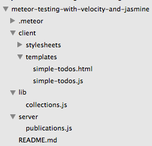

In this post we'll be looking at testing Meteor applications with <a href="https://velocity.readme.io/" target="_blank">Velocity</a> and <a href="https://velocity.readme.io/v1.0/docs/getting-started-with-jasmine" target="_blank">Jasmine</a>.  Velocity <s class='strike'>is</s> (make that was) the <a href="http://info.meteor.com/blog/meteor-testing-framework-velocity" target="_blank">official testing framework</a> for <a href="https://www.meteor.com/" target="_blank">Meteor</a> applications, so is an obvious choice when choosing a testing framework.

Automated testing is a great way to verify the functionality of your application and can be a life saver down the road in ensuring new functionality or changes leave your application in a working state.  Frameworks like <a href="http://rubyonrails.org/" target="_blank">Ruby on Rails</a> have long had a strong focus on testing with fantastic tools like <a href="http://rspec.info/" target="_blank">RSpec</a> and <a href="https://github.com/jnicklas/capybara" target="_blank">Capybara</a>.  Along with a dedicated <a href="http://guides.rubyonrails.org/testing.html#the-test-environment" target="_blank">testing environment</a> and test data manipulation tools like <a href="https://github.com/thoughtbot/factory_girl" target="_blank">FactoryGirl</a>, testing on Rails is a pleasure.

Testing with Meteor has been a bit of a bumpy road in contrast, but that's to be expected with a relatively young framework.  Velocity seems to be continuously improving so kudos to the Velocity team for all the work they <s class='strike'>continue to</s> put into Velocity.

###What is Velocity
So first off, what exactly is Velocity?  Velocity is a test runner for Meteor applications.  Velocity isn't a test framework itself; it facilitates writing tests in various frameworks such as Jasmine, Cucumber, Mocha etc.  In this post we'll be concentrating on Jasmine.  

One of the primary tasks of Velocity is to set-up a mirror of the application under test.  This means tests are run in isolation from the main development environment.  This is helpful when it comes to managing test data and other aspects of testing.

####What is the future of Velocity?
A very recent development is the transition of Velocity support and development from <a href="http://xolv.io/" target="_blank">Xolv.io</a> to the <a href="https://www.meteor.com/people" target="_blank">Meteor Development Group</a>.  So we'll have to see what this means for Velocity, will it change significantly, will something else replace it?  

Hard to know at this point in time, but regardless, Jasmine will likely be a valid option despite what happens in terms of test runners.  So Velocity might change or be replaced, but in theory this should have little impact on how Meteor tests are written in Jasmine.

##What we'll build

This will look familiar to anyone who has gone thru the <a href="https://www.meteor.com/tutorials/blaze/creating-an-app" target="_blank">Meteor tutorial</a>.  Other than some slight deviations, we'll use the tutorial code as the application to write our tests against.  We won't be giving much of an explanation regarding the actual application code; we'll instead be concentrating on the tests.  If you need guidance regarding the tutorial application, the <a href="https://www.meteor.com/tutorials/blaze/creating-an-app" target="_blank">Meteor tutorial</a> provides a clear explanation of what is going on.

So enough with the chit-chat, let's get started!

##Creating the app

###Clone the Repo
Note, if you aren't familiar with Git and / or don't have it installed you can download a zip of the code <a href="https://github.com/riebeekn/meteor-testing-with-velocity-and-jasmine/archive/step-1.zip">here</a>.

#####Terminal

git clone -b step-1 https://github.com/riebeekn/meteor-testing-with-velocity-and-jasmine.git


###A quick over-view of where we're starting from
Open up the code in your text editor of choice and you'll see a pretty standard Meteor file structure. 

 

We've deviated from the official tutorial in that we've gotten rid of the default files and placed things in appropriate directories.

We've also removed the `insecure` and `autopublish` packages right off the bat.  The official tutorial defers doing so until later in the tutorial.  Since we're going to be manipulating test data, we want to jettison any crutches from the get go to ensure our technique for inserting test data is valid without `insecure`.

###Start up the app
Let's see where we're starting from.

#####Terminal

cd meteor-testing-with-velocity-and-jasmine
meteor


You should now see the starting point for our application when you navigate your browser to <a href="http://localhost:3000" target="_blank">http://localhost:3000</a>.

So basically we're at the end of <a href="https://www.meteor.com/tutorials/blaze/creating-an-app" target="_blank">step 1</a> of the tutorial... the application has been created, we have a few default files and we've filled in our CSS styles.

##Getting ready to do some testing
Getting ready to test is a snap, we just need to install a couple of packages.

#####Terminal

meteor add sanjo:jasmine velocity:html-reporter


The first package adds everything we need to write Jasmine tests, the second package installs the Velocity HTML reporter which provides feedback directly within the browser regarding the status of the tests, you'll see the following after the packages install:

Velocity works by running a mirror of your application complete with it's own database.  This is very handy as you don't need to worry about your tests messing up your development database or vice-versa.

With that we are ready to get to some testing!

##Implementing Step 2 of the tutorial
We're going to take a bit of a test first approach to implementing each step of the <a href="https://www.meteor.com/tutorials/blaze/creating-an-app" target="_blank">tutorial</a>.

We'll extract the requirements of each step, write the tests, and then implement the functionality to get the tests to pass.

Let's get to our requirements for <a href="https://www.meteor.com/tutorials/blaze/templates" target="_blank">step 2</a>.

  

    <h3 class="panel-title">Step 2 requirements</h3>
  

  

    <ul>
      <li>The application should contain a static list of todos.</li>
      <li>The application should have a browser title of 'Todo List'.</li>
      <li>The application should have a header of 'Todo List'.</li>
    </ul>
  

###Writing our tests
OK, we have our marching orders, first thing we need to do is set-up a directory for our tests.  Velocity expects Jasmine client integration tests to live in `/tests/jasmine/client/integration`.  We'll create a sub-directory for our Todos functionality.

#####Terminal

mkdir -p tests/jasmine/client/integration/todos


Next we'll create two files, `page-contents-spec.js` and `task-list-spec.js`.  `page-contents` will be used to specify items we expect to be present on the page.  `task-list` will be specific to the task list functionality.

#####Terminal

touch tests/jasmine/client/integration/todos/page-contents-spec.js
touch tests/jasmine/client/integration/todos/task-list-spec.js


The minute we add a `js` file in our test directory you'll notice some new output in our server console.

It's a good idea to `tail` the Velocity log.  I've found the log is sometimes the only place an error with the tests will show up, for instance in cases where there is a compile error in your specs.  Another quick tip; sometimes Velocity will start failing on a few tests for no apparent reason (most of the time I've found this occurs when I add a new file, new test or am switching branches)... usually hard refreshing the browser seems to clear things up.  So if a test is failing when everything should be passing, try a browser refresh.

For our first tests, let's deal with `page-contents-spec.js`.

#####/test/jasmine/client/integration/todos/page-contents-spec.js

describe ("the todo page : page contents", function() {
  
  it ("should include a page title of 'Todo List'", function() {
    expect($('title').text()).toEqual('Todo List');
  });

  it ("should include a page heading of 'Todo List'", function() {
    expect($('h1').text()).toEqual('Todo List');
  });

  it ("should include an unordered list for displaying the tasks", function() {
    expect($('ul').length).toEqual(1);
  });
  
});


I won't go over the details of Jasmine's syntax too much, Velocity currently uses version 2.1 of Jasmine, the <a href="http://jasmine.github.io/2.1/introduction.html" target="_blank">Jasmine documentation</a> is a great place for additional information about Jasmine if you need it.

In the `page-contents` spec above, we're describing the general items we expect to be present on the page.  

The `describe ("the todo...` line essentially just provides a header for the output of the tests.  The text within the quotes can be anything, but descriptive and consistent `describe` text is going to be helpful when reading the test output.

Next we have 3 tests.  Again the contents of the quoted text in the `it ("...` lines can be whatever descriptive text is appropriate.

The `expect` lines are where we are actually testing the functionality of our application.  We're using jQuery to grab elements off the page and comparing the retrieved elements with what we expect to see.

So with the first test we're grabbing the page title and expecting it to equal `Todo List`.  

The second test we're expecting the page to have an `h1` tag containing the text `Todo List`.  

Finally in the third test we're expecting a `ul` item on the page; this is what will contain our list of tasks.

You'll notice Velocity is now telling us we have some failing tests.  Pretty cool!

The output of the tests bring into focus the advantage of using well thought out `describe` and `it` descriptions.

Before we work on getting the tests to pass, let's add a single test to `task-list`.

#####/tests/jasmine/client/integration/todos/task-list-spec.js

describe ("the todo page : task list", function() {

  it ("should contain the current list of tasks", function() {
    var tasks = $("li").map(function() { 
      return $(this).text();
    }).get();

    expect(tasks.length).toEqual(3);
    expect(tasks[0]).toEqual('This is task 1');
    expect(tasks[1]).toEqual('This is task 2');
    expect(tasks[2]).toEqual('This is task 3');
  });

});


Once again we are using a descriptive explanation for the `describe` and `it` text.  In the test itself we're grabbing all the `li` items from the page (our tasks will be contained in `li` tags) and storing them in the `tasks` variable.  We then check that we have 3 tasks on the page and that the 3 tasks contain the expected text of `This is task 1, This is task... etc`.

We now have 4 failing tests so let's get these suckers passing!

###Making the tests pass
First let's update our HTML to include the expected page contents.

#####/client/templates/simple-todos.html

<head>
  <title>Todo List</title>
</head>

<body>
  

    <header>
      <h1>Todo List</h1>
    </header>

    <ul>
      {{#each tasks}}
        {{> task}}
      {{/each}}
    </ul>
  

</body>

<template name="task">
  <li>{{text}}</li>
</template>


With the above HTML, we now have all 3 of our `page-content` tests passing.  If you activate the `Show passing tests` button Velocity will display the passing tests.

Let's get `task-list` to pass.  For now we're going to use some hard-coded values in the template helper.

#####/client/templates/simple-todos.js

Template.body.helpers({
  tasks: [
    { text: "This is task 1" },
    { text: "This is task 2" },
    { text: "This is task 3" }
  ]
});


And with that everything is passing!

Pretty exciting, onto <a href="https://www.meteor.com/tutorials/blaze/collections" target="_blank">step 3</a>!

##Implementing Step 3 of the tutorial

  

    <h3 class="panel-title">Step 3 requirements</h3>
  

  

    <ul>
      <li>The application should contain a dynamic list of todos retrieved from the database.</li>
    </ul>
  

Not much is changing, we just need to retrieve our data from a database instead of hard-coding it.  Our tests can stay as they are as we don't have any functional changes, we just need to grab our data from a different place... so let's start off by doing that.

#####/lib/collections.js

Tasks = new Mongo.Collection("tasks");


#####/server/publications.js

Meteor.publish("tasks", function () {
  return Tasks.find();
});


#####/client/templates/simple-todos.js

Template.body.onCreated(function() {
  Meteor.subscribe("tasks");
});

Template.body.helpers({
  tasks: function() {
    return Tasks.find();
  }
});


OK, we've set up a collection to hold our tasks, published the collection and subscribed to the collection on the client.

Without the hard-coded tasks, we now have 1 failing test.

Although a relatively small change on the implementation side of things, we've got our work cut out for us to get the test back to a passing state.  Now that we are dealing with real data from a database we're going to need to come up with a method of handling test data.  

Luckily the <a href="https://meteor-testing.readme.io/docs/jasmine-database-fixtures-for-integration-tests" target="_blank">Velocity documentation</a> suggests a few techniques for handling test data.  The one we'll go with is creating a test package.  The basic idea is to create a debug only package that you can use within your application for managing test data.  This is a pretty clever solution and I think it works really well, so let's get to it!

###Creating a package to handle the test data.

The first thing we will do is create a packages directory along with the necessary files for the package.

#####Terminal

mkdir -p packages/testing
touch packages/testing/task-fixtures.js
touch packages/testing/package.js


Next let's implement `task-fixtures.js`, this is where we'll be manipulating test data related to a task.

#####/packages/testing/task-fixtures.js

var createTask = function(taskAttributes) {
  var task = _.merge({}, getDefaultTask(), taskAttributes);

  var taskId = Tasks.insert(task);

  return Tasks.findOne(taskId);
}

var destroyTasks = function() {
  Tasks.remove({});
}

var getDefaultTask = function() {
  return {
    text: 'Task text',
    createdAt: new Date()
  }
};

Meteor.methods({
  'fixtures.createTask': createTask,
  'fixtures.destroyTasks': destroyTasks
});


Let's start from the bottom of the file, with `Meteor.methods({...` we're exposing two methods that allow us to create and destroy tasks.  

During the course of our testing we're going to want to create test data and then tear down that test data after we are done with it.  We want to leave our test database in a consistent (i.e. empty) state so that it doesn't get filled up with a bunch of test data cruft.  If we insert data willy nilly without removing it, we won't know what our database contains at any particular time when we run a test.  This will make it difficult to know what we should actually be expecting to get out of the database and what values we should be testing for.  So we need to ensure we return the database to a known state after every test.

The definition of the two methods we've exposed are at the top of the file.

`createTask` inserts a task to the database.  It takes an optional parameter which can be used to set the specific attributes on a task.  The `_.merge({}, getDefaultTask(), taskAttributes);` line merges any passed in attributes with the defaultTask we create via the `getDefaultTask` function.  With no attributes the created task would have `text` of 'Task text' and a `createdAt` value of the current date.  We could change the text for example, via a call such as:


Meteor.call('fixtures.createTask', {
  text: 'The task'
});


The `destroyTasks` method simply clears out the `Tasks` table.

With our implementation out of the way, the next step is to fill in the `package.js` file.

#####/packages/testing/package.js

Package.describe({
  name: 'testing',
  version: '0.0.0',
  summary: 'Tools that help us testing the app',
  documentation: 'README.md',
  // Only available in development mode! (for security)
  debugOnly: true
});

Package.onUse(function (api) {
  api.versionsFrom('1.1.0.2');
  api.use([
    'underscore',
    'mongo',
    'stevezhu:lodash@3.10.1',
  ], 'server');
  api.addFiles('task-fixtures.js', 'server');
});


This package definition is taken pretty much verbatim from the <a href="https://github.com/Sanjo/SpaceTalk/blob/feature/testing/packages/testing/package.js" target="_blank">Velocity example</a>.  

The main point to emphasize is the use of the `debugOnly` flag... this is very important!  Without this we're going to expose our test methods outside of development mode... certainly not something we want!

Otherwise the package file is very standard, we're specifying the required Meteor version, followed by the 3rd party libraries our package needs.  Finally, we expose the `task-fixtures.js` file via the `api.addFiles` line.  If you need a refresher on package files, I suggest this <a href="http://themeteorchef.com/recipes/writing-a-package/" target="_blank">Meteor Chef article</a>.

###Using our test data package

OK, let's make use of our package, first thing we'll do is add it.

#####Terminal

meteor add testing


Now we have access to it in our `task-list` spec.

#####/tests/jasmine/client/integration/todos/task-list-spec.js

describe ("the todo page : task list", function() {

  beforeEach(function () {
    Meteor.call('fixtures.createTask', {text: 'This is task 1'});
    Meteor.call('fixtures.createTask', {text: 'This is task 2'});
    Meteor.call('fixtures.createTask', {text: 'This is task 3'});
  });
  afterEach(function() {
    Meteor.call('fixtures.destroyTasks');
  });

  it ("should contain the current list of tasks", function(done) {
    Meteor.setTimeout(function() {
      var tasks = $("li").map(function() { 
        return $(this).text();
      }).get();

      expect(tasks.length).toEqual(3);
      expect(tasks[0]).toEqual('This is task 1');
      expect(tasks[1]).toEqual('This is task 2');
      expect(tasks[2]).toEqual('This is task 3');
      done();
    }, 400);
  });

});


Sweet!

The first change we've made is to use `beforeEach` and `afterEach` functions for setting up and tearing down the test data.  As the name suggests these functions will run before and after each test.  This is very handy as `beforeEach` provides a good place for us to create our test data and then we can tear it down and keep our database clean by running `afterEach`.

In the `beforeEach` function we are creating 3 tasks via our test package.  The `afterEach` function cleans the data.

The test code has changed slightly as well.  For one we've added a timeout to the test.  The timeout is used to compensate for the slight delay of retrieving the tasks from the database and displaying them on the UI.  If we don't have a timeout, the test will run too quickly and complete prior to the tasks showing up on the UI.  Setting timeouts on tests is a bit of a pain and choosing a timeout value is rather arbitrary.  Sometimes 400 milliseconds seems to work great, other times a shorter or longer timeout works.  In general a bit of experimentation is required in choosing a timeout value.  I've found it's better to err on the side of longer timeouts.

One other thing to note is the use of the Jasmine 2.0 `done` function.  This is necessary to indicate to Jasmine that the test is asynchronous, without it we'll get a Jasmine error in the browser console... even worse our test will appear to still pass within Velocity.  It's always a good idea to keep an eye on the browser console and the Velocity logs when creating your tests to make sure everything is running as expected.

 

Anyway, with `done` in the mix we've got our tests passing and we have no browser or console errors.

We're ready for <a href="https://www.meteor.com/tutorials/blaze/forms-and-events" target="_blank">step 4</a>!

##Implementing Step 4 of the tutorial

  

    <h3 class="panel-title">Step 4 requirements</h3>
  

  

    <ul>
      <li>The application should contain an input field that allows users to add new tasks.</li>
      <li>New tasks should have a 'text' value of whatever the user entered, and a created date of the current date / time.</li>
      <li>The 'new task' input field should contain some default placeholder text.</li>
      <li>When a new task is created, the 'new task' input field should be cleared and replaced with the default placeholder text.</li>
      <li>The tasks when displayed should be ordered by creation date descending.</li>
    </ul>
  

OK, looks like we have a decent chunk of work ahead of us, let's get to it!

###Writing our tests and implementing step 4

Looking at the requirements we'll need to update the `page-contents` spec for the new input field.  Also the `task-list` spec needs to explicitly check for the sort order of the tasks.  In addition to these changes we'll add a `new-task` spec to test the functionality around creating new tasks.

####task-list-spec.js

First let's make our changes to `task-list-spec.js`, we need to make sure our tasks are ordered by the creation date when they are displayed.

#####/tests/jasmine/client/integration/todos/task-list-spec.js

describe ("the todo page : task list", function() {

  beforeEach(function () {
    Meteor.call('fixtures.createTask', {
      text: 'This is task 1', createdAt: '2015-01-01'
    });
    Meteor.call('fixtures.createTask', {
      text: 'This is task 2', createdAt: '2015-02-01'
    });
    Meteor.call('fixtures.createTask', {
      text: 'This is task 3', createdAt: '2015-03-01'
    });  
  });
  afterEach(function() {
    Meteor.call('fixtures.destroyTasks');
  });

  it ("should contain the current list of tasks sorted by creation date descending", function(done) {
    Meteor.setTimeout(function() {
      var tasks = $("li").map(function() { 
        return $(this).text();
      }).get();

      expect(tasks.length).toEqual(3);
      expect(tasks[0]).toEqual('This is task 3');
      expect(tasks[1]).toEqual('This is task 2');
      expect(tasks[2]).toEqual('This is task 1');
      done();
    }, 400);
  });

});


The first change is to explicitly set a `createdAt` date for each task so we know what order we should be expecting them to appear.

Next we've updated the title of our test in the `it ("should...` statement to indicate the tasks should display in a particular order.

And finally we've changed the order of the tasks in the `expect statements`.

With these changes we have a failing test.

It's pretty easy to get this back passing:

#####/client/templates/simple-todos.js

...

Template.body.helpers({
  tasks: function() {
    return Tasks.find({}, { sort: { createdAt: -1 }});
  }
});


Applying the appropriate sort gets the test back passing.

####page-contents-spec.js

OK, next let's tackle `page-contents`.

#####/tests/jasmine/client/integration/todos/page-contents-spec.js

  ... 

  it ("should include a field for entering a new task " 
      * "with an appropriate placeholder", function() {
    var input = $('.new-task input');
    expect(input.length).toEqual(1);
    expect(input.attr('placeholder')).toEqual('Type to add new tasks');    
  });


We've added a new test to check that there is an input field present for entering new tasks and that the input field has an appropriate placeholder.  As expected we're seeing a failing test.

Let's update out HTML to get the test to pass.

#####/client/templates/simple-todos.html

...

  

    <header>
      <h1>Todo List</h1>

      <form class="new-task">
        <input type="text" name="text" placeholder="Type to add new tasks" />
      </form>
    </header>
    ...
    ...


Adding an `input` field within the `header` does the trick, and everything is now passing.

####new-task-spec.js

Next up, we'll create a separate spec for testing the task creation functionality.

#####Terminal

touch tests/jasmine/client/integration/todos/new-task-spec.js


#####/tests/jasmine/client/integration/todos/new-task-spec.js

describe ("the todo page : new task field", function() {
    
  afterEach(function() {
    Meteor.call('fixtures.destroyTasks');
  });

  it ("should create a new task on form submit with expected values", function(done) {
    // submit a new task
    Meteor.setTimeout(function() {
      addTaskViaUI('My new task');
      
      // check the updated task list
      var tasks = $("li").map(function() { 
        return $(this).text();
      }).get();
      expect(tasks.length).toEqual(1);
      expect(tasks[0]).toEqual('My new task');

      // also check the DB
      var task = Tasks.findOne({text: 'My new task'});
      expect(task).not.toBe(undefined);
      expect(task.text).toEqual('My new task');
      done();
    }, 400);
  });

  it ("should clear out the new task field on form submit", function(done) {
    Meteor.setTimeout(function() {  
      addTaskViaUI('Another new task');
      expect($('.new-task input').val()).toEqual('');
      done();
    }, 400);
  });
  
});

var addTaskViaUI = function(taskName) {
  $('.new-task input').val(taskName);
  $("form").submit();
}


We've added two tests in this spec.  

The first test adds a new task and then checks that the new task shows up in both the UI and the database.  

The code is pretty straight forward, we've created a helper function `addTaskViaUI` that we're calling to perform the task insert.  The helper fills in the input field and then submits the form.  Then back in our test, we use Jasmine `expect` calls to ensure the UI and database are in the expected state.

The second test just checks that the input field is cleared out after the form submits.

Since we are creating tasks in both of the tests we have an `afterEach` call to clean up the database after each test run.

With the above tests in place you'll notice Velocity is having quite the issue:

The cause of this is the `$("form").submit();` line in our `spec`... it's causing the page to submit and reload, which in turn causes Velocity to try to run the tests... which in turn causes the page to submit and reload, which... you get the idea!  So Velocity doesn't get a chance to run the tests as the tests keep causing the page to reload.

Let's stop the Velocity freak-out.

#####/client/templates/simple-todos.js

...
...
Template.body.events({
  "submit .new-task": function (event) {
    // Prevent default browser form submit
    event.preventDefault();
  }
});


And with that Velocity is back working and we see our new tests failing.

So let's fill in the event properly to get the test to pass.

#####/client/templates/simple-todos.js

...
...
Template.body.events({
  "submit .new-task": function (event) {
    // Prevent default browser form submit
    event.preventDefault();
    
    // Get value from form element
    var text = event.target.text.value;

    // Insert a task into the collection
    Meteor.call("addTask", text);

    // Clear form
    event.target.text.value = "";
  }
});


OK, so we're grabbing the text entered by the user and passing it into a method.

We'll need to create the `addTask` method, so let's do that next.

#####/lib/collections.js

Tasks = new Mongo.Collection("tasks");

Meteor.methods({
  addTask: function (text) {
    Tasks.insert({
      text: text,
      createdAt: new Date()
    });
  }
});


And with that we now have passing tests!

Before moving on let's do a quick refactor as we're seeing a bit of code duplication creep into the tests.  Specifically the code to grab the tasks displayed in the UI, i.e.


var tasks = $("li").map(function() { 
  return $(this).text();
}).get();


Let's move this code into a helper and clean up the duplication.

#####Terminal

mkdir tests/jasmine/client/integration/todos/helpers
touch tests/jasmine/client/integration/todos/helpers/todos-spec-helper.js


#####/tests/jasmine/client/integration/todos/helpers/todos-spec-helper.js

TodosSpecHelper = {};

TodosSpecHelper.retrieveTasksFromUI = function() {
  var tasks = $("li").map(function() { 
    return $(this).text();
  }).get();

  return tasks;
}


We now have a helper class that contains the code to grab the current tasks from the UI.

We now need to update `new-task-spec.js` and `task-list-spec.js`.

#####/tests/jasmine/client/integration/todos/new-task-spec.js

...
...
  it ("should create a new task on form submit with expected values", function(done) {
    // submit a new task
    Meteor.setTimeout(function() {
      addTaskViaUI('My new task');
      
      // check the updated task list
      var tasks = TodosSpecHelper.retrieveTasksFromUI(); // use the helper
      expect(tasks.length).toEqual(1);
      expect(tasks[0]).toEqual('My new task');
      ...
      ...


#####/tests/jasmine/client/integration/todos/task-list-spec.js

...
...
  it ("should contain the current list of tasks sorted by creation date descending", function(done) {
    Meteor.setTimeout(function() {
      var tasks = TodosSpecHelper.retrieveTasksFromUI(); // use the helper

      expect(tasks.length).toEqual(3);
      ...
      ...


Great we've removed our duplication and now it's onto <a href="https://www.meteor.com/tutorials/blaze/update-and-remove" target="_blank">step 5</a>!

##Implementing Step 5 of the tutorial

  

    <h3 class="panel-title">Step 5 requirements</h3>
  

  

    <ul>
      <li>As a user I want to be able to mark tasks as complete.</li>
      <li>Completed tasks should display in a manner that makes it obvious that they have been completed.</li>
      <li>As a user I want to be able to remove tasks.</li>
    </ul>
  

###Writing our tests and implementing step 5

With step 5 we're going to be adding some new elements to each task on our UI, namely a checkbox for completing tasks and a delete button.  We could update `page-contents` to check for these new items, but the functionality around a single task item is starting to get a bit involved.  So instead we'll break this out and create a new spec `task-item-spec.js` to handle task specific tests.  

We'll also create a new spec to test the removal functionality and another new spec to test that a task can be updated (for the completion functionality).

Finally we'll want to update `new-task` to ensure that newly inserted tasks are marked as not complete by default when they are created.

So let's get going, we'll start with the `task-item` spec.

####task-item-spec.js

#####Terminal

touch tests/jasmine/client/integration/todos/task-item-spec.js


As we explained earlier, we'll use this spec file to test the contents of an individual task item.

######Tests

#####/tests/jasmine/client/integration/todos/task-item-spec.js

describe ("the todo page : an individual task item", function() {

  beforeEach(function() {
    Meteor.call('fixtures.createTask', {
      text: 'The task'
    });
  });
  afterEach(function() {
    Meteor.call('fixtures.destroyTasks');
  });

  it ("should include the task text", function(done) {
    Meteor.setTimeout(function() {
      var tasks = TodosSpecHelper.retrieveTasksFromUI();

      expect(tasks.length).toEqual(1);
      expect(tasks[0]).toEqual('The task');
      done();
    }, 400);
  });

  it ("should include a checkbox to mark the task as complete", function(done) {
    Meteor.setTimeout(function() {
      var checkbox = $('li').find("input:checkbox");
      expect(checkbox.length).toEqual(1);
      done();
    }, 400);
  });

  it ("should include a delete button", function(done) {
    Meteor.setTimeout(function() {
      var deleteButton = $('.delete');
      expect(deleteButton.length).toEqual(1);
      done();
    }, 400);
  });
  
});


OK, so first off in the `before` and `after` blocks we're just setting up and then tearing down our test data; in this case a single task.

Then we have 3 tests.  In the first test we're checking that the task text is correct.  The second test is ensuring we have a checkbox available for marking the task as complete, and finally the third test is checking for the presence of a delete button.

The first test is going to pass as we're already displaying the task text, the second two tests will fail.

######Implementation

So let's get those tests passing!

#####/client/templates/simple-todos.html

...
<template name="task">
  <li>
    <button class="delete">&times;</button>
    <input type="checkbox" checked="{{completed}}" class="toggle-checked" />
    {{text}}
  </li>
</template>


Sweet, that was simple, we should be good to go!

Alas, we've gone backwards, we now have even more tests failing than before, what could be going on?  The failing tests all are a variation of the below:

It appears we're no longer grabbing the task text correctly, the `x` symbol we're using as the delete button is coming in along with the text.

So let's fix that.

#####/tests/jasmine/client/integration/todos/helpers/todos-spec-helper.js

TodosSpecHelper = {};

TodosSpecHelper.retrieveTasksFromUI = function() {
  var tasks = $("li .text").map(function() { 
    return $(this).text();
  }).get();

  return tasks;
}


We've changed our jQuery selector from `$("li")` to `$("li .text")` in order to zero in on just the text.  Already removing our duplicate test code has paid off, this one change fixes all three tests instead of us having to hunt for all the instances in our test code where we are grabbing our task items from the UI.

####remove-task-spec.js

Next we'll create a spec for testing the remove functionality.

#####Terminal

touch tests/jasmine/client/integration/todos/remove-task-spec.js


######Tests

#####/tests/jasmine/client/integration/todos/remove-task-spec.js

describe ("the todo page : remove task", function() {
  
  beforeEach(function() {
    Meteor.call('fixtures.createTask');
  });
  afterEach(function() {
    Meteor.call('fixtures.destroyTasks');
  })
  
  it ("should remove a task when the delete button is clicked", function(done) {
    Meteor.setTimeout(function() {
      // remove the task
      $('.delete').click();

      // ensure it is not in the database
      expect(Tasks.find().count()).toEqual(0);

      // ensure it is not in the UI
      expect($('li').size()).toEqual(0);
      done();
    }, 400);
  });

});


OK, first off we've got a `before` and `after` section to add and then clean up our test data (although if our test passes there won't be any data to clean up).

Then with the actual test, we delete the task via the delete button, and follow that up by ensuring it is gone from both the database and the UI.

As expected we have a failing test.

######Implementation

We'll need to add a client side event for the button along with a method to perform the delete.

#####/client/templates/simple-todos.js

Template.body.events({
  "submit .new-task": function (event) {
  ...
  ...
});

Template.task.events({
  "click .delete": function () {
    Meteor.call("deleteTask", this._id);
  }
});


#####/lib/collections.js

Tasks = new Mongo.Collection("tasks");

Meteor.methods({
  addTask: function (text) {
    Tasks.insert({
      text: text,
      createdAt: new Date()
    });
  },
  deleteTask: function (taskId) {
    var task = Tasks.findOne(taskId);

    Tasks.remove(taskId);
  },
});


And there we go!

####update-task-spec.js

Next let's deal with the testing around the completion of tasks.

#####Terminal

touch tests/jasmine/client/integration/todos/update-task-spec.js


######Tests

First let's handle the situation where a user marks a task as complete.

#####/tests/jasmine/client/integration/todos/update-task-spec.js

describe ("the todo page : update task", function() {
  
  describe ("completing a task", function() {
    beforeEach(function() {
      Meteor.call('fixtures.createTask');
    });
    afterEach(function() {
      Meteor.call('fixtures.destroyTasks');
    });
      
    it ("should set the 'completed' field to true", function(done) {
      Meteor.setTimeout(function() {
        // activate the checkbox
        $("li").find("input:checkbox").click();
        
        // find the associated record in the DB and verify it is checked
        var tasks = Tasks.find().fetch();
        expect(tasks.length).toEqual(1);
        expect(tasks[0].completed).toEqual(true);

        // ensure the checkbox is now checked
        expect($("li").find("input:checkbox").is(':checked')).toEqual(true);
        done();
      }, 400);
    });

    it ("should show a strike-through for the completed tasks", function(done) {
      Meteor.setTimeout(function() {
        $("li").find("input:checkbox").click();
      }, 400);

      Meteor.setTimeout(function() {
        expect($("li").hasClass('checked')).toBe(true);
        done();
      }, 800);
    });
  });

});


OK, first off we set up some fixture data, inserting a single task before our tests, removing it afterwards.

In the first test we're marking the task as complete by clicking the checkbox for the task.  We then check the record has been updated in the database and the UI.

With the second test we check that the style for the item gets updated for completed tasks.  Note the use of two timeout blocks in this test.  I've found that for CSS changes it often seems like one timeout is required around the actual action (i.e. clicking the checkbox) and a separate timeout is required around the checking of the updated class.  I believe the first timeout is required for the database / method latency, the second for the DOM updates.

We've got ourselves 2 failing tests as expected.

Let's address that first error, what's up with Expected <i>undefined</i> to equal true?  Shouldn't we be getting a false value returned since we have yet to implement the completed functionality?  The issue is we need to update our fixture code to take into account our new field otherwise it is going to come back as undefined.

#####/packages/testing/task-fixtures.js

...
var getDefaultTask = function() {
  return {
    text: 'Task text',
    createdAt: new Date(),
    completed: false
  }
};
...


So we've added the `completed` field in the default task.  With that change we see the error we would expect.

Before we get these test passing, let's add the scenarios for re-activating tasks.  The tests for re-activation are going to be nearly identical to the tests for completing a task... so we're going to apply some refactorings to the test code in order to reduce duplication.

#####/tests/jasmine/client/integration/todos/update-task-spec.js

describe ("the todo page : update task", function() {
  
  describe ("completing a task", function() {
    beforeEach(function() {
      Meteor.call('fixtures.createTask');
    });
    afterEach(function() {
      Meteor.call('fixtures.destroyTasks');
    });
      
    it ("should set the 'completed' field to true", function(done) {
      toggleAndCheckTaskStatus(true, done);
    });

    it ("should show a strike-through for the completed tasks", function(done) {
      toggleStatusAndCheckStrikeThru(true, done);
    });
  });

  describe ("re-activating a task", function() {
    beforeEach(function () {
      Meteor.call('fixtures.createTask', {completed: true});
    });
    afterEach(function() {
      Meteor.call('fixtures.destroyTasks');
    });
      
    it ("should set the 'completed' field to false", function(done) {
      toggleAndCheckTaskStatus(false, done);
    });

    it ("should remove the strike-through for the re-activated tasks", function(done) {
      toggleStatusAndCheckStrikeThru(false, done);
    });

  });

  var toggleAndCheckTaskStatus = function(completeTask, done) {
    Meteor.setTimeout(function() {
      // activate the checkbox
      $("li").find("input:checkbox").click();
      
      // find the associated record in the DB and verify
      var tasks = Tasks.find().fetch();
      expect(tasks[0].completed).toEqual(completeTask);

      // verify the status of the UI checkbox
      expect($("li").find("input:checkbox").is(':checked')).toEqual(completeTask);
      done();
    }, 400);
  }

  var toggleStatusAndCheckStrikeThru = function(completeTask, done) {
    Meteor.setTimeout(function() {
      $("li").find("input:checkbox").click();
    }, 400);

    Meteor.setTimeout(function() {
      expect($("li").hasClass('checked')).toBe(completeTask);
      done();
    }, 800);
  }

});


OK, a bit of a code dump... let's first look at what we've done with our 2 existing tests.  We've basically taken the tests and refactored them out into 2 helper functions `toggleAndCheckTaskStatus` and `toggleStatusAndCheckStrikeThru`.

The point of this is so that our re-activation tests don't contain a bunch of duplicate code.  The only thing that is different for the re-activation tests is the initial test data created in the `before` block (note we set `completed: true` for the reactivation test data) and whether the test should be checking for a completed or not completed task.  The helper functions take in a parameter indicating whether a task is being completed or not and thus re-use of the test code is possible for both the complete and re-activate tests.

We now have 3 failing tests, the test that checks for the removal of the strike through when a task is re-activated is going to pass as the implementation code currently does not toggle the class of a task based on it's completion status... so for now it will be passing by default.

######Implementation

OK, let's get things working.

#####/client/templates/simple-todos.html

...
<template name="task">
  <li class="{{#if completed}}checked{{/if}}">
    ...
    ...


We've added a class on the `li` attribute which is used to toggle the strike through style.

#####/client/templates/simple-todos.js

Template.task.events({
  "click .toggle-checked": function () {
    // Set the checked property to the opposite of its current value
    Meteor.call("setCompleted", this._id, ! this.completed);
  },
  "click .delete": function () {
  ...


We've added a new event handler for the check-box.

#####/lib/collections.js

  ...
  },
  setCompleted: function (taskId, setCompleted) {
    var task = Tasks.findOne(taskId);
    
    Tasks.update(taskId, { $set: { completed: setCompleted} });
  }
});


Finally we need to add a method to set a task to completed.

And with that we are back to passing.

####new-task-spec.js
Phew, step 5 is turning out to be a bit of a bear, but we're finally on the home stretch, just one more test to update.  We want to make sure new tasks have a default value of `false` for their completed status.

######Tests

#####/tests/jasmine/client/integration/todos/new-task-spec.js

...
  it ("should create a new task on form submit with expected values", function(done) {
    // submit a new task
    Meteor.setTimeout(function() {
      addTaskViaUI('My new task');
      
      // check the updated task list
      var tasks = TodosSpecHelper.retrieveTasksFromUI(); // use the helper
      expect(tasks.length).toEqual(1);
      expect(tasks[0]).toEqual('My new task');

      // also check the DB
      var task = Tasks.findOne({text: 'My new task'});
      expect(task).not.toBe(undefined);
      expect(task.text).toEqual('My new task');
      expect(task.completed).toBe(false);
      done();
    }, 400);
  });
  ...


We've just added an extra `expect` statement to our existing test, `expect(task.completed).toBe(false);`.

We now have a failure.

######Implementation

Getting this test to pass, is fairly straight-forward.  We just need to set the completed field when tasks are added.

#####/lib/collections.js

...
Meteor.methods({
  addTask: function (text) {
    Tasks.insert({
      text: text,
      createdAt: new Date(),
      completed: false
    });
  },
  ...


And there we go!

Onto <a href="https://www.meteor.com/tutorials/blaze/temporary-ui-state" target="_blank">step 8</a>!

##Implementing Step 8 of the tutorial

Wait a minute, what happened to step <a href="https://www.meteor.com/tutorials/blaze/deploying-your-app" target="_blank">6</a> and <a href="https://www.meteor.com/tutorials/blaze/running-on-mobile" target="_blank">7</a>?  Well, those steps of the tutorial deal with deployment and mobile, neither of which we're going to address, so we're heading straight thru to step 8.

  

    <h3 class="panel-title">Step 8 requirements</h3>
  

  

    <ul>
      <li>As a user I want to be able to hide completed tasks.</li>
      <li>The application should display a count of uncompleted tasks.</li>
    </ul>
  

###Writing our tests and implementing step 8
So looks like we'll need to update `page-contents` to include a checkbox that toggles whether we show all tasks or just uncompleted tasks.  We'll also be changing the format of our Todo header to include the count of uncompleted tasks.

We're also going to need to update `task-list` as the tasks that are displayed will depend on their completion status and whether the show incomplete tasks checkbox has been activated.

Let's start by changing `page-contents`.

####page-contents-spec.js

######Tests

#####/test/jasmine/client/integration/todos/page-contents-spec.js

describe ("the todo page : page contents", function() {
  
  ...
  ...

  it ("should include a page heading of 'Todo List' appended " +
      "with the uncompleted task count", function(done) {
    Meteor.setTimeout(function() {
      expect($('h1').text()).toEqual('Todo List (0)');
      done();
    }, 400);
  });

  ...
  ...

  it ("should include a checkbox for hiding completed tasks", function() {
    expect($('label.hide-completed').find('input:checkbox').length).toEqual(1);
  });
  
});


So here we've updated our 2nd test (`should include a page heading...`) to include the task count.  Since this functionality now interacts with the database we need to add a `setTimeout` call within the test.

Then we've added a 5th test that checks for the checkbox that will be used to toggle whether complete tasks get shown.

As expected both of these tests are failing.

######Implementation
OK, let's get these tests passing!

#####/client/templates/simple-todos.html

...
...
<body>
  

    <header>
      <h1>Todo List ({{incompleteCount}})</h1>

      <label class="hide-completed">
        <input type="checkbox" checked="{{hideCompleted}}" />
        Hide Completed Tasks
      </label>

      <form class="new-task">
      ...
      ...


We've changed our header to include a count of incomplete tasks and added a new checkbox for hiding completed tasks.

With this change we're down to one failing test.

#####/client/templates/simple-todos.js

...
...
Template.body.helpers({
  tasks: function() {
    return Tasks.find({}, { sort: { createdAt: -1 }});
  },
  incompleteCount: function () {
    return Tasks.find({completed: {$ne: true}}).count();
  }
});
...
...


Adding the `incompleteCount` helper resolves the final failing test.

####task-item-spec.js
OK, now we need to deal with the actual hiding of completed tasks.

######Tests

#####/test/jasmine/client/integration/todos/task-list-spec.js

describe ("the todo page : task list", function() {

  beforeEach(function() {
    Meteor.call('fixtures.createTask', {
      text: 'This is task 1', createdAt: '2015-01-01', completed: true});
    Meteor.call('fixtures.createTask', {text: 'This is task 2', createdAt: '2015-02-01'});
    Meteor.call('fixtures.createTask', {text: 'This is task 3', createdAt: '2015-03-01'});  
  });
  afterEach(function() {
    Meteor.call('fixtures.destroyTasks');
  });

  describe ("show all tasks", function() {

    it ("should contain the current list of tasks sorted by creation date " +
        "descending", function(done) {
      Meteor.setTimeout(function() {
        var tasks = TodosSpecHelper.retrieveTasksFromUI();

        expect(tasks.length).toEqual(3);
        expect(tasks[0]).toEqual('This is task 3');
        expect(tasks[1]).toEqual('This is task 2');
        expect(tasks[2]).toEqual('This is task 1');
        done();
      }, 400);
    });

  });

  describe ("show incomplete tasks only", function() {

    beforeEach(function() {
      // click the 'hide completed' checkbox to hide completed task
      $('label.hide-completed').find('input:checkbox').click();
    });
    afterEach(function() {
      // re-enable the showing of completed tasks so subsequent tests are not affected
      $('label.hide-completed').find('input:checkbox').click();
    });

    it ("should contain the current list of incompleted tasks sorted " +
        "by creation date descending", function(done) {
      Meteor.setTimeout(function() {
          var tasks = TodosSpecHelper.retrieveTasksFromUI();

          expect(tasks.length).toEqual(2);
          expect(tasks[0]).toEqual('This is task 3');
          expect(tasks[1]).toEqual('This is task 2');
          done();
        }, 400);
    });

  });

});


So what have we changed?  We've altered our test data slightly, marking the first task as complete.

We've then added describe sections for testing the `show all` functionality vs the `incomplete only` functionality.  In the case of the incomplete tasks we add additional `before` and `after` blocks to trigger the "hide complete" checkbox.

Our test for incomplete tasks is the same as that for complete tasks, just with less tasks in the `expect` section as the complete task should not show up.

As usual Velocity let's us know we have a failing test.

The error makes sense, we're still showing all 3 tasks instead of just the 2 incomplete tasks, let's fix that up!

######Implementation

#####client/templates/simple-todos.js

...
Template.body.helpers({
  tasks: function () {
    if (Session.get("hideCompleted")) {
      // If hide completed is checked, filter tasks
      return Tasks.find({completed: {$ne: true}}, {sort: {createdAt: -1}});
    } else {
      // Otherwise, return all of the tasks
      return Tasks.find({}, {sort: {createdAt: -1}});
    }
  },
  hideCompleted: function () {
    return Session.get("hideCompleted");
  },
  incompleteCount: function () {
    return Tasks.find({completed: {$ne: true}}).count();
  }
});

Template.body.events({
  ...
  ...
  },
  "change .hide-completed input": function (event) {
    Session.set("hideCompleted", event.target.checked);
  }
});
...
...


We've updated the `tasks` helper to filter tasks based on whether completed tasks should be shown or not.  A new `hideCompleted` helper has been added to retrieve the value of the `hideCompleted` session variable.  And finally we have a new event handler for the `hideCompleted` checkbox.

With that all tests are passing.

##Summary
So that takes us through some of the steps involved in writing tests with <a href="https://velocity.readme.io/" target="_blank">Velocity</a> and <a href="https://velocity.readme.io/v1.0/docs/getting-started-with-jasmine" target="_blank">Jasmine</a>.  

We've looked at basic steps such as getting Velocity up and running and have looked at one method for handling test data.

In part 2 we'll finish off the rest of the <a href="https://www.meteor.com/tutorials/blaze/creating-an-app" target="_blank">Meteor tutorial</a> and deal with users and authentication within our tests.  We'll also have a quick look at server tests and Jasmine spies.

Thanks for reading and hope you enjoyed part 1!
