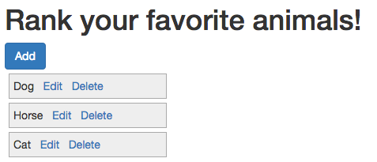
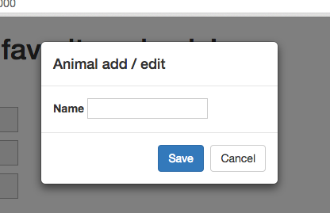
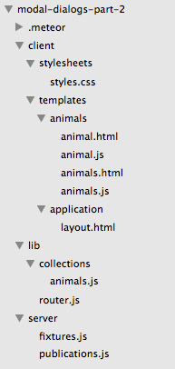
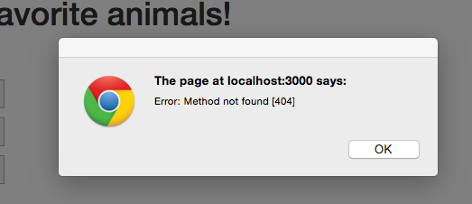
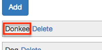
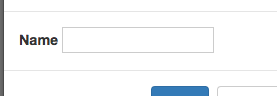
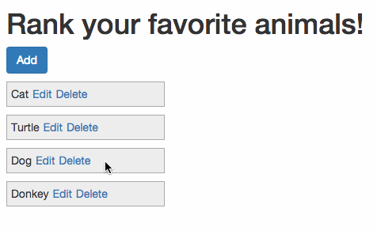

In this post we are going to take a look at how to use <a href="http://getbootstrap.com/javascript/#modals" target="_blank">Bootstrap Modals</a> in conjunction with Meteor. The main things we'll cover are:

* How to set-up a bootstrap modal to work with Meteor.
* How to use a 3rd party package to make working with bootstrap modals easier.
* And finally, although not related to modals, we'll figure out how to create lists which can be sorted by our user's.

As a starting point, we're going to use a very simple existing Meteor app, if you want to start from scratch, see the <a href="/modal-dialogs-part-1/index.html" target="_blank">part 1</a>.

If you'd rather skip directly to the code instead of following along, it's available on <a href="https://github.com/riebeekn/modal-dialogs-part-2" target="_blank">GitHub</a>.

##What we'll build
To demonstrate working with modals we'll build out a very simple application that let's user's rank their favorite animals.  The main interface will look like:

User's can add more animals via the "add" button, which will bring up a modal:

##Creating the app
As a starting point, we'll clone a partially implemented version of the application from GitHub.  This partial implementation has the list of animals implemented and working delete links.  We'll need to implement the add, edit and ranking functionality.

###Clone the Repo
Note, if you aren't famliar with Git and / or don't have it installed you can download a zip of the code <a href="https://github.com/riebeekn/modal-dialogs-part-1" target="_blank">here</a>.  Otherwise let's git started (you can steal that joke if you want, it works great on dates... OK, maybe not so much).

#####Terminal

git clone https://github.com/riebeekn/modal-dialogs-part-1.git modal-dialogs-part-2
cd modal-dialogs-part-2


###A quick over-view of where we're starting from
If you open the code in your text editor of choice, you'll see a pretty standard file structure.

The `animals.html` template is the core template for the application, with `animal.html` being responsible for the rendering of single animal records.

We'll primarily be changing / adding code in the `/client/templates/animals` folder, in addition, we'll make some changes to `/lib/collections/animals.js`.  

###Start up the app

#####Terminal

meteor


You should now see the application render when you pointing your browser to <a href="http://localhost:3000" target="_blank">http://localhost:3000</a>.

##Adding animals

###Hooking up the Add button

The first thing we'll work on is to implement the "Add" button functionality.  If you click the "Delete" links you'll notice it's possible to remove animals from the list of favorites, but there is currently no way to add new animals, that won't do!

First step is to create our modal template and include it as part of the existing `animals.html` template.  We embed the modal template within the animals template as the modal needs to be rendered as part of the animals template in order for it to open successfully.  Including the modal as part of the animals template is not ideal, we'd rather put it in it's own template file.  Later in this post we'll make use of a third party Meteor library that will allow us to do just that... but for now:

#####/client/templates/animals/animals.html

<template name="animals">
  <!-- existing code ... -->

  {{> animalsModalTemplate}}
</template>

<template name="animalsModalTemplate">
  

    

      

        

          <h4 class="modal-title">Animal add / edit</h4>
        

        

          <label for="name">Name</label>
          <input type="text" id="animalName" />
        

        

          <button type="button" class="btn btn-primary" id="save">Save</button>
            <button type="button" class="btn btn-default" data-dismiss="modal">Cancel</button>
        

      

    

  

</template>


OK, nothing special about the `animalsModalTemplate`, it's a standard <a href="http://getbootstrap.com/javascript/#modals" target="_blank">Bootstrap modal</a>.  The key thing to note is the `{{> animalsModalTemplate}}` tag we've added to the `animals` template.  As mentioned earlier, unless we render the modal as part of the main template it won't appear when we try to open it.

So with the HTML in place, let's add an event handler to `animals.js`.

#####/client/templates/animals/animals.js

// ...
// existing code
//...

Template.animals.events({
  'click #add': function(e) {
    e.preventDefault();
    
    $('#animalsModal').modal('show');
  }
});


After the above changes, the modal will appear when the "Add" button is clicked.

###Saving new animals
So we now have our Modal showing up, and although the "Cancel" button works out of the gate, the "Save" button is currently nothing but an empty promise.  Let's fix that!

First we'll capture the Save button event.

#####/client/templates/animals/animals.js

// ...
// existing code
//...

Template.animalsModalTemplate.events({
  'click #save': function(e) {
    e.preventDefault();
    
    var animal = {
      name: $('#animalName').val()
    }

    Meteor.call('addAnimal', animal, function(error, result) {
      if (error) {
        alert(error);
      }
    });

    $('#animalsModal').modal('hide');
  }
});


Pretty simple, we're grabbing the value entered in the name text box and then calling a Meteor method on the server.  Of course, we have yet to implement the server method, so we'll currently see an error if we try adding an animal.

OK, so let's get rid of that no method error by... you guessed it, implementing the method. 

#####/lib/collections/animals.js

Meteor.methods({
  addAnimal: function(animal) {
    check(animal.name, String);

    _.extend(animal, {"rank": 0});
    Animals.insert(animal);
  },
  deleteAnimal: function(animal) {
    ...


This is super simple, we just need to check that the name field is a valid string, then we add the animal to our database.  Just prior to inserting the record we add a default rank value for the animal.  Later on, we'll use the rank value to allow users to rank the animals.

##Time to refactor!
Including the Modal code in  `animals.html` and `animals.js` is rather messy... and things are only going to get worse as we add more functionality.  Let's see if we can structure our code a little better.

###Switching up our Modal to use a package
Luckily there is a Meteor package we can use to split out our Modal from our other templates.

#####Terminal

meteor add peppelg:bootstrap-3-modal


Now we'll move our modal template code out of `animals.html` into it's own file.

#####Terminal

touch client/templates/animals/animals-modal.html


#####/client/templates/animals/animals-modal.html

<template name="animalsModal">
  

    

      

        

          <h4 class="modal-title">Animal add / edit</h4>
        

        

          <label for="name">Name</label>
          <input type="text" id="animalName" />
        

        

          <button type="button" class="btn btn-primary" id="save">Save</button>
            <button type="button" class="btn btn-default" data-dismiss="modal">Cancel</button>
        

      

    

  

</template>


One thing to notice is that we've renamed the template to "animalModal" and we've removed the id attribute on the top-level div.  Another advantage of the package we're using is that it triggers the modal based on the template name so a separate id is not required.

Now, let's change `animals.html`.

#####/client/templates/animals/animals.html

<template name="animals">
  <h1>Rank your favorite animals!</h1>
  

    <a href="#" id="add" class="btn btn-primary">Add</a>
    

      {{#each animals}}
        {{> animal}}
      {{else}}
        <h4>
          You haven't added any favorite animals, click the Add button!
        </h4>
      {{/each}}
    

  

</template>


The file is now much cleaner, also notice we no longer need to render our modal template in the animals template, i.e. the `{{> animalModalTemplate}}` line has been removed.

OK with those changes, out of the way, if you click the Add button you'll notice nothing happens.  This is because we need to call our modal in a different manner, so let's get that sorted.  We'll also move the modal specific code out of `animals.js` into it's own file just like we did with the template code.

#####Terminal

touch client/templates/animals/animals-modal.js


#####/client/templates/animals/animals-modal.js

Template.animalsModal.events({
  'click #save': function(e) {
    e.preventDefault();
    
    var animal = {
      name: $('#animalName').val()
    }

    Meteor.call('addAnimal', animal, function(error, result) {
      if (error) {
        alert(error);
      }
    });

    Modal.hide('animalsModal');
  }
});


OK, we've moved the save animal event handler into it's own file, and we're using our package to hide the modal, i.e. `Modal.hide('animalsModal');`.

Now we'll clean up `animals.js`.

#####/client/templates/animals/animals.js

Template.animals.helpers({
  animals: function() {
    return Animals.find({}, { sort: {rank: 1}});
  }
});

Template.animals.events({
  'click #add': function(e) {
    e.preventDefault();

    Modal.show('animalsModal');
  }
});


We've removed the save animals event handling code and changed up our code that opens the Modal to use the package, `Modal.show('animalsModal');`.

And with that, we've finished our refactoring and the Add button is back to a working state.  Next step is to implement edit.

##Editing animals
As you can see below, I've got a typo with my newly added animal.

I could delete and re-add my Donkey... but that seems a little awkward, so let's get some editing up and running.  

###Altering the UI to support editing
First off let's add an edit link to `animal.html`.

#####/client/templates/animals/animal.html

<template name="animal">
  

    {{name}}<a href="#" id="edit">Edit</a><a href="#" id="delete">Delete</a>
  

</template>


Now we just need to hook up the event so that our modal is opened when the user clicks "Edit".

#####/client/templates/animals/animal.js

Template.animal.events({
  'click #edit': function(e) {
    e.preventDefault();

    Modal.show('animalsModal');
  },
  'click #delete': function(e) {
  ...
  ...


Easy as pie... not!  The above code opens up the modal but the existing animal name isn't showing up.

 

Essentially we need our modal to handle two modes, "Add"... when a user adds a new animal, and "Edit"... when a user is editing an existing animal.

When the modal dialog opens in edit mode we need to populate the modal with the details of the current animal under edit.  We'll accomplish this by setting a <a href="http://docs.meteor.com/#/basic/session" target="_blank">Session</a> variable that will contain our animal id.  If the id is empty we'll know the modal has been opened in create mode.  

**Note:** Session variables are handy but should be used with caution as they have the same drawbacks associated with traditional global variables.

In any case let's make our changes.

#####/client/templates/animals/animal.js

  'click #edit': function(e) {
    e.preventDefault();

    animal = $(e.target).closest('.animal')
    animalId = animal.attr('data-id')
    ModalHelper.openModalFor(animalId);
  },
  'click #delete': function(e) {
  ...
  ...


#####/client/templates/animals/animal.html

<template name="animal">
  

    {{name}}<a href="#" id="edit">Edit</a><a href="#" id="delete">Delete</a>
  

</template>


There's a decent amount going on here but it's fairly straight-forward.  In `animal.html` we're using a data-id attribute to keep track of the id of the current animal record.  We then use this in conjunction with the class attribute to grab the id in `animal.js`.  

What's up with that `ModalHelper.openModalFor(animalId)` line?  Well since there is now a little bit of logic involved in opening our modal, we're going to create a helper to centralize that functionality.

#####Terminal

mkdir client/helpers
touch client/helpers/open-modal.js


#####/client/helpers/open-modal.js

ModalHelper = {};

ModalHelper.openModalFor = function(animalId) {
  Session.set('selectedAnimalId', animalId);
  Modal.show('animalsModal');
}


The helper code just sets a session variable prior to opening the modal.

Next let's make use of the session variable in the modal.

#####/client/templates/animals/animals-modal.js

Template.animalsModal.helpers({
  animal: function() {
    var animalId = Session.get('selectedAnimalId');
    
    if (typeof animalId !== "undefined") {
      var animal = Animals.findOne(animalId);
      return animal;
    } else {
      return {name:'', rank:''}
    }
  }
});

Template.animalsModal.events({
  'click #save': function(e) {
    e.preventDefault();
    
    var animalId = Session.get('selectedAnimalId');
    var animal = {
      name: $('#animalName').val()
    }

    if (!animalId) {
      Meteor.call('addAnimal', animal, function(error, result) {
        if (error) {
          alert(error);
        }
      });
    } else {
      _.extend(animal, {id: animalId});
      Meteor.call('editAnimal', animal, function(error, result) {
        if (error) {
          alert(error);
        }
      });
    }

    Modal.hide('animalsModal');
  }
});


Firstly we've updated the animal helper to fetch the current animal record when in "Edit" mode, i.e. when the Session variable is populated.  Next we update the save method to call different methods on the server depending on whether an add or an update is occurring.

Finally we need to update `animals-modal.html` to set the value of the animal name text box.  This way it will be blank if it's a new instance, but populated when an edit is under way:

#####/client/templates/animals/animals-modal.html

<template name="animalsModal">
  

    ...
    ...
        

          <label for="name">Name</label>
          <input type="text" id="animalName" value={{animal.name}} />
        

    ...
    ...


Oops, I lied, one more small edit is required in `animals.js`.

#####/client/templates/animals/animals.js

Template.animals.events({
  'click #add': function(e) {
    e.preventDefault();

    ModalHelper.openModalFor(null);
  }
});


In the 'add' event handling code we need to call the ModalHelper method we created and pass `null` as the animal id.  If we fail to do this the Modal will contain the name of the last edited animal when it opens, as our `selectedAnimalId` Session variable will still be set.

So that is the client side code, but we're calling into a non-existent server method, 'editAnimal', so let's code that up.

###Altering the back-end to support editing

#####/lib/collections/animals.js

Meteor.methods({
  editAnimal: function(animal) {
    Animals.update(animal.id, {$set: {
      name: animal.name
    }});
  },
  addAnimal: function(animal) {
  ...
  ...


Pretty darn easy! 

We've now got our modal working the way we want both when adding new animals and when editing existing animals.

##Ranking animals
The final step is to allow user's to rank the animals via drag and drop.  For instance Dogs and Donkeys definitely need to come before Cats:

We'll accomplish the above with the help of the drag and drop functionality included in jQuery UI.

#####Terminal

meteor add mrt:jquery-ui


A little bit of Googling yields a great article that covers exactly what we want to do: <a href="http://blog.differential.com/sortable-lists-in-meteor-using-jquery-ui/" target="_blank">http://blog.differential.com/sortable-lists-in-meteor-using-jquery-ui/</a>.

Excellent!  We can copy the code from the above blog post pretty much verbatim to get our drag and drop hooked up.  We'll add the code from the Differential blog post to `animals.js`, hooking into the rendered event of the template.

#####/client/templates/animals/animals.js

// sorting code copied from: 
//  http://blog.differential.com/sortable-lists-in-meteor-using-jquery-ui/
Template.animals.rendered = function() {
  this.$('#animals').sortable({
    stop: function(e, ui) {
      // get the dragged html element and the one before
      //   and after it
      el = ui.item.get(0)
      before = ui.item.prev().get(0)
      after = ui.item.next().get(0)

      // Here is the part that blew my mind!
      //  Blaze.getData takes as a parameter an html element
      //    and will return the data context that was bound when
      //    that html element was rendered!
      if(!before) {
        //if it was dragged into the first position grab the
        // next element's data context and subtract one from the rank
        newRank = Blaze.getData(after).rank - 1
      } else if(!after) {
        //if it was dragged into the last position grab the
        //  previous element's data context and add one to the rank
        newRank = Blaze.getData(before).rank + 1
      }
      else
        //else take the average of the two ranks of the previous
        // and next elements
        newRank = (Blaze.getData(after).rank +
                   Blaze.getData(before).rank)/2

      //update the dragged Item's rank
      Meteor.call('updateAnimalRank', Blaze.getData(el)._id, newRank, function(error, result) {
        if (error) {
          alert(error);
        }
      });
    }
  })
}

// ...
// existing helper and event handling code
// ...


Now all we need to do is implement the `updateAnimalRank` method on the server.

#####/lib/collections/animals.js

Meteor.methods({
  updateAnimalRank: function(id, rank) {
    Animals.update(id, {$set: {rank: rank}});
  },
  editAnimal: function(animal) {
  ...
  ...


And that's it!  User's can now edit, add and rank animals.

##Summary
Although a contrived example (heck we don't even have seperate lists of animals for different user's), we see that using Modals within Meteor is pretty simple.  Likewise adding nice UI elements such as drag and drop can also be accomplished without too much effort.

Thanks for reading and hope you found this post useful! 