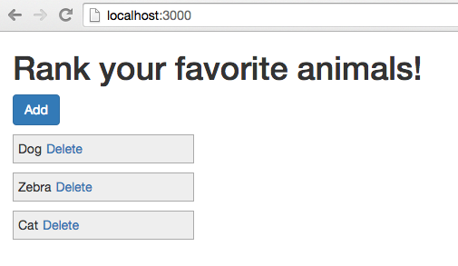
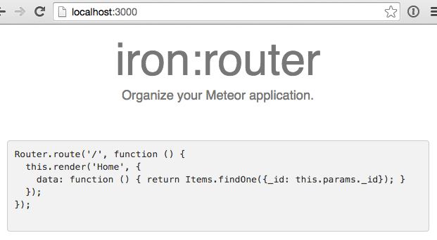
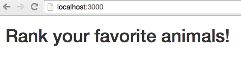
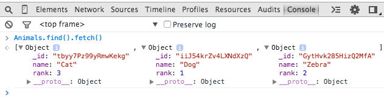
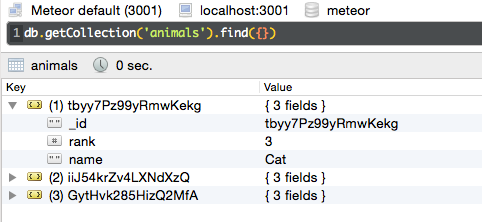
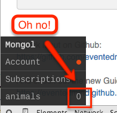
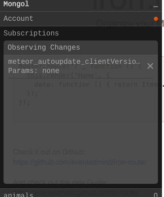
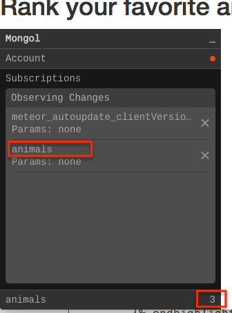
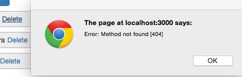
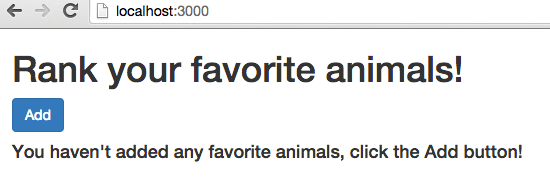

This post is a prequel to [Using Bootstrap Modal Dialogs with Meteor](/modal-dialogs/index.html).  We'll cover building the application from scratch and discuss a few details of the Meteor Framework.  If you already have experience with Meteor, you might want to go directly to [part 2.](/modal-dialogs/index.html)  On the other hand, if you have little or no experience with Meteor you may want to check out the official <a href="https://www.meteor.com/install" target="_blank">Meteor tutorial.</a>

If you'd rather grab the source code directly rather than follow along, it's available on GitHub at...... 

##What we'll build
We're going to create the next million dollar app!  A favorite animal ranking app (p.s. don't quit the day job just yet, I could be wrong about that million dollars part).

With this post we will concentrate on the first iteration of the application...  we'll simply be building a page that contains a list of animals:

##Creating the app
OK, let's get on the road to making that million dollars, first create a new Meteor application.

#####Terminal

meteor create fav-animals


After Meteor has done it's thing let's get rid of the default files it created for us, as we won't be needing them.

#####Terminal

cd fav-animals
rm fav-animals.*


Now we'll add a couple of packages to help us along our way:

* <a href="https://github.com/iron-meteor/iron-router" target="_blank">Iron Router</a> - to provide routing functionality.
* <a href="https://atmospherejs.com/twbs/bootstrap" target="_blank">Bootstrap</a> - to help with some styling and to provide our modal functionality.  Note that in a production application this is not the best way to integrate Boostrap into Meteor, see this <a href="http://www.manuel-schoebel.com/blog/meteorjs-and-twitter-bootstrap---the-right-way" target="_blank">article</a> for more information.  However for testing things out using the Bootstrap package is just fine and is very convenient.

#####Terminal

meteor add iron:router twbs:bootstrap


Sweet, our app is now ready to go, let's fire it up... 

#####Terminal

meteor


If we navigate to <a href="http://localhost:3000" target="_blank">localhost:3000</a>, we should see a default Iron Router message:

This let's us know that our app is all set up and running A-OK.  Now it's time to start actually building it on out.

##Building the UI

###Adding some templates

OK, let's start to add our UI and get rid of that Iron Router default page.  First we'll create a standard layout <a href="https://www.meteor.com/try/2" target="_blank">template</a> which will contain the head and body section of our HTML document.

#####Terminal

mkdir -p client/templates/application
touch client/templates/application/layout.html


#####/client/templates/application/layout.html

<head>
  <meta name="viewport" content="width=device-width, initial-scale=1.0">
  <title>Favorite Animals</title>
  <link rel="icon" sizes="16x16 32x32" href="/favicon.ico">
</head>

<template name="layout">
  <body>
    

       {{> yield}} 
    

  </body>
</template>


Templates are pretty much just standard HTML but with a little bit of magic called <a href="http://meteorcapture.com/spacebars/" target="_blank">spacebars</a> added to make them more than just static files. 

The layout template we've created is very simple and just sets up the basic structure of our app.  Note the "yield" statement in the `<body>`, this is where Iron Router will inject the contents for the different templates in our application.

Next we'll create the template to display our favorite animals.

#####Terminal

mkdir client/templates/animals
touch client/templates/animals/animals.html


#####/client/templates/animals/animals.html

<template name="animals">
  <h1>Rank your favorite animals!</h1>
</template>


You'll notice we're creating our templates in a "client" directory.  Meteor let's you put your files wherever you want but it does have a few special directories to be aware of.

* /client - any files located in this directory will only be run on the client.
* /server - any files located in this directory will only be run on the server.
* /lib - any files located in this directory will be loaded first when Meteor starts up.

Since our HTML is going to be running on the client (i.e. our user's browsers) it makes sense to place our template files in the client directory.

###Hooking up the router

Now that our templates are set, we'll hook up our router to display the animals template when someone navigates to the root of the application.

#####Terminal

mkdir lib
touch lib/router.js


#####/lib/router.js

Router.configure({
    layoutTemplate: 'layout'
});

Router.route('/', {
  name: 'animals'
});


Routing code is something we want available off the drop so we place our routing files in the /lib directory to ensure it is one of the first things to load on application start-up.

The code itself, is pretty self explanatory, in the configuration section we're specifying our layout template as the application's layout, and we're creating a single route which serves up our animals template.

With the above in place, we should now see the contents of our animals template instead of the Iron Router default page.

As exciting as the current page is, why don't we get some data in there to spice things up.

##Creating some data

###Adding a collection and some default data

For our next step, we'll create some default animal data.  First we need to set up a <a href="https://www.meteor.com/try/3" target="_blank">collection</a> to store the animals, then create a fixture file to insert some animals.

#####Terminal

mkdir -p lib/collections
mkdir server
touch lib/collections/animals.js
touch server/fixtures.js


#####/lib/collections/animals.js

Animals = new Mongo.Collection('animals');


#####/server/fixtures.js

// Fixture data
if (Animals.find().count() === 0) {
  Animals.insert({
      rank: 3,
      name: "Cat"
  });
  Animals.insert({
      rank: 1,
      name: "Dog"
  });
  Animals.insert({
      rank: 2,
      name: "Zebra"
  });
}


We want the collection available to both the client and server so the /lib folder is a good place for it.  The fixture file only needs to run on the server so it gets placed in the /server directory.

The code is pretty simple, the collection code just creates a collection to store our animals, as for the fixture file, it's also straight-forward, we're hard-coding some data to insert.  Note, we've added a "rank" column to the Animal records so they can be ordered when displayed.

Now that we've added data, we should be able to view the data directly in a web client console by querying the Animals collection:

Nice, we've got data!  But hmm, that doesn't seem so secure allowing any old web client to connect directly to our database, is Meteor inherently insecure?  <a href="https://www.discovermeteor.com/blog/meteor-and-security/" target="_blank">Nope!</a>  Let's batten down the hatches!

#####Terminal

meteor remove insecure autopublish


Now we've locked out our browser from accessing our database... phew!

To double-check that the data is still present, you can fire up <a href="http://robomongo.org/" target="_blank">Robomongo</a> and connect to port 3001 (the default port Mongo runs under with Meteor):

An even better option, is to add the <a href="https://github.com/msavin/Mongol" target="_blank">Mongol</a> package, a clever little package that let's you browse your database from the browser when Meteor is running in debug mode (which by default it does when you fire up Meteor locally).  What's great about this package is you don't need to worry about removing it when pushing your app to production.  Meteor will automatically remove it for you, see <a href="https://github.com/msavin/Mongol/blob/master/documentation/SECURITY.md" target="_blank">here</a> for details and some caveats.

OK, let's add Mongol and then hit control-M from within our browser to bring it up.

#####Terminal

meteor add msavin:mongol


Hmm, where did our Animals go?

Clicking on the "Subscriptions" tab of Mongol gives a hint of what the problem is.

No sight of our animals anywhere!  Now that we've removed the <a href="https://atmospherejs.com/meteor/autopublish" target="_blank">autopublish</a> package we're going to need to manually <a href="http://meteortips.com/tutorial/publish-subscribe-autopublish/" target="_blank">publish and subscribe</a> to our data.

###Publishing and subscribing to the data
OK, so let's start by setting up our publication.  This is what will expose the data residing on the server and make it available to the client.

#####Terminal

touch server/publications.js


#####/server/publications.js

Meteor.publish('animals', function() {
  return Animals.find();
});


We're returning all our animals in our publication, which happens to be exactly what was happening when we had autopublish enabled, now we're just explicitly exposing all our animals.  In general, publications would scope the data being returned to the client for both performance and data security reasons (i.e. to only display data accessible to the current user).  In our simple Animals application all users see and share the same data however, so we're just returning everything in the publication.

Next step is to subscribe to the data on the client, we'll accomplish this with Iron Router.

#####/lib/router.js

Router.configure({
  layoutTemplate: 'layout',
  // subscribe to our animals publication
  // with a waitOn function in Iron Router
  // ... now our application will wait to load 
  // until we've successfully subscribed to the
  // publication
  waitOn: function () {
    Meteor.subscribe('animals');
  }
});

Router.route('/', {
  name: 'animals'
});


With all that in place we see our animals are showing up, and Mongol also shows that we are subscribing to our animals publication... perfect!

Nothing much is happening in our actual application yet however, let's update the UI to display those animals!

##Some UI Tweaks

###Displaying the Animals
We've got animals, we've got a subscription to those animals, let's hook them into the UI.  First step is to create a template helper to make the subscribed data available in the template.

#####Terminal

touch client/templates/animals/animals.js


#####/client/templates/animals/animals.js

Template.animals.helpers({
  animals: function() {
    return Animals.find({}, { sort: {rank: 1}});
  }
});


Simple... similar to what we were doing in the web console before turning off autopublish and insecure, we're querying the Animals collection made available via the subscription and instructing it to return all the animals and order them by their rank attribute.

Next let's create a template to display each individual animal record.

#####Terminal

touch client/templates/animals/animal.html


#####/client/templates/animals/animal.html

<template name="animal">
  

    {{name}}
  

</template>


Here we've added a spacebars directive to display the name of the current animal record.

We'll hook into our `animal.html` template from our `animals.html` template.  This can be done by looping over the data in the animals template and rendering the animal template for each record, essentially setting up a parent child relationship between the templates.

#####/client/templates/animals/animals.html

<template name="animals">
  <h1>Rank your favorite animals!</h1>
  

    <a href="#" id="add" class="btn btn-primary">Add</a>
    

      {{#each animals}}
        {{> animal}}
      {{else}}
        <h4>
          You haven't added any favorite animals, click the Add button!
        </h4>
      {{/each}}
    

  

</template>


One bit of Meteor magic in the above code is the passing of the data context from the parent `animals.html` template down to the child `animal.html` template.  Meteor is smart enough to know that when you render the animal template from within the `{{#each animals}}` block that the current animal record should be passed as the data context to the animal template.  This is why in the `animal.html` template we can display the name of the animal simply with `{{name}}`.  Check out this excellent <a href="https://www.discovermeteor.com/blog/a-guide-to-meteor-templates-data-contexts/" target="_blank">post</a> for a further explanation of data contexts.

###Deleting Animals
The last thing we're going to do is add the ability for user's to delete animals.  In [part 2](/modal-dialogs/index.html) we'll tackle adding and editing animals.

Let's update our animal template to include a delete link.

#####/client/templates/animals/animal.html

<template name="animal">
  

    {{name}}<a href="#" id="delete">Delete</a>
  

</template>


Notice we've also added a CSS class to our template, let's add a stylesheet and some simple styles to make the UI a little more attractive.

#####Terminal

mkdir client/stylesheets
touch client/stylesheets/styles.css


#####/client/stylesheets/styles.css

.animal {  
  padding: 5px;
  margin-top: 10px;
  background-color: #eee;
  border: 1px solid #aaa;
  width: 200px;
}

.animal a {
  margin-left: 5px;
}


OK, that's it for the UI, now let's hook in the logic that will allow us to delete animals that have fallen out of favor!  First step is to handle the delete link click event.

#####Terminal

touch client/templates/animals/animal.js


#####/client/templates/animals/animal.js

Template.animal.events({
  'click #delete': function(e) {
    e.preventDefault();

    Meteor.call('deleteAnimal', this, function(error, result) {
      if (error) {
        alert(error);
      } 
    });
  }
});


Give it a try and you'll get a clue as to the next step:

Makes sense, we need to define the delete method on the server... so let's get on that!  We'll add our delete method to the existing animals collection.

#####/lib/collections/animals.js

Animals = new Mongo.Collection('animals');

Meteor.methods({
  deleteAnimal: function(animal) {
    Animals.remove(animal);
  }
});


Now with our delete method in place, we can delete animals to our heart's content.  Once all our animals have been deleted, the "no animals" message will appear.

##Summary
Phew, working with all these animals is exhausting!  In [part two](/modal-dialogs/index.html) we'll hook up our add button, figure out how user's can edit existing animals and let them re-order their animals to reflect which animal is the very best of them all.

Thanks for reading!
