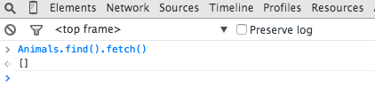

This post is a prequel to !!!put link here!!!.  We'll cover building the application from scratch, you can go directly to !!!part 2!!! if you want to skip this... reword, this, this is sucking!

##What we'll build
We're going to create the next million dollar app!  A favorite animal ranking app (p.s. don't quit the day job, just in case I'm wrong about the million dollars it'll pull in).

In this post we are going to build the first iteration of the application.  This application will be a favorite animals app.  For our first iteration we'll simply provide a list of animals, this should get us at least a quarter million to fund the second part of our app!

##Creating the app
OK, let's get on the road to making our million dollars, first create a new Meteor app.

#####Terminal

meteor create fav-animals


After Meteor has done it's thing let's get rid of the default files it created for us.

#####Terminal

cd fav-animals
rm fav-animals.*


Now we'll add a couple of packages to help us along: ... argh re-style, below looks gross

* <a href="https://github.com/iron-meteor/iron-router" target="_blank">Iron Router</a> - to provide routing functionality.
* <a href="https://atmospherejs.com/twbs/bootstrap" target="_blank">Bootstrap</a> - to help with some styling and to provide our modal functionality.  Note that in a production application this is not the best way to integrate Boostrap into Meteor, see this <a href="http://www.manuel-schoebel.com/blog/meteorjs-and-twitter-bootstrap---the-right-way" target="_blank">article</a> for more information.  However for testing things out using a package is just fine and very convenient.

#####Terminal

meteor add iron:router twbs:bootstrap


Sweet, our app is ready to go, let's run Meteor... 

#####Terminal

meteor


... and navigate to <a href="http://localhost:3000" target="_blank">localhost:3000</a>, we should see a default Iron Router message:

###Building the UI
OK, let's add our UI and get rid of that Iron Router default page.  First we'll create a standard layout <a href="https://www.meteor.com/try/2" target="_blank">template</a> which will contain the head and body section of our HTML document.  Note the "yield" statement in the body, this is where Iron Router will inject the contents for the different templates in our application.

#####Terminal

mkdir -p client/templates/application
touch client/templates/application/layout.html


#####/client/templates/application/layout.html

<head>
  <meta name="viewport" content="width=device-width, initial-scale=1.0">
  <title>Favorite Animals</title>
  <link rel="icon" sizes="16x16 32x32" href="/favicon.ico">
</head>

<template name="layout">
  <body>
    

       {{> yield}} 
    

  </body>
</template>


Next we'll create the template to display our favorite animals.

#####Terminal

mkdir client/templates/animals
touch client/templates/animals/animals.html


#####/client/templates/animals/animals.html

<template name="animals">
  <h1>Rank your favorite animals!</h1>
</template>


Finally, we'll hook up our router so that the animals template is displayed at the root of our application.

#####Terminal

mkdir lib
touch lib/router.js


#####/lib/router.js

Router.configure({
    layoutTemplate: 'layout'
});

Router.route('/', {
  name: 'animals'
});


In the configuration section we're specifying our layout template as our application's layout, afterwards we are routing requests that come to the root our application to serve up our animals template.

We should now see the contents of our animals template in place of the Iron Router default page.

As exciting as our current page is, why don't we get some data in there to spice things up.

###Creating some data
So let's get some default animals into our app so that we can display them to the user.  First we need to set up a <a href="https://www.meteor.com/try/3" target="_blank">collection</a> to store our animals, we'll then create a fixture file which we will use to insert some default data.

#####Terminal

mkdir -p lib/collections
mkdir server
touch lib/collections/animals.js
touch server/fixtures.js


#####/lib/collections/animals.js

Animals = new Mongo.Collection('animals');


#####/server/fixtures.js

// Fixture data
if (Animals.find().count() === 0) {
  Animals.insert({
      rank: 3,
      name: "Cat"
  });
  Animals.insert({
      rank: 1,
      name: "Dog"
  });
  Animals.insert({
      rank: 2,
      name: "Zebra"
  });
}


Note we are adding a "rank" column to our Animals so that we can order them when they are displayed.

Now that we've added some fixture data we should be able to view the data directly in our web client console by querying the Animals collection:

Nice, we've got data!  But hmm, that doesn't seem so secure allowing any old web client to connect to our database, is Meteor inherently insecure?  <a href="https://www.discovermeteor.com/blog/meteor-and-security/" target="_blank">Nope!</a>  Let's batten down the hatches!

#####Terminal

meteor remove insecure autopublish


Now we've locked out our browser from accessing our database... phew!

If you want to double-check that our data is still present, you can fire up <a href="http://robomongo.org/" target="_blank">Robomongo</a> and connect to port 3001 (the default port Mongo runs under with Meteor):

Or you can add the <a href="https://github.com/msavin/Mongol" target="_blank">Mongol</a> package, a clever little package that let's you browse your database from the browser when Meteor is running in debug mode (which by default it does when you fire up Meteor locally).  What's great about this package is you don't need to worry about removing it when pushing your app to production as Meteor will do it for you, see <a href="https://github.com/msavin/Mongol/blob/master/documentation/SECURITY.md" target="_blank">here</a> for details and some caveats.

OK, let's add Mongol and then hit control-M from within our browser.

#####Terminal

meteor add msavin:mongol


Hmm, where did our Animals go?

If we click on the "Subscriptions" tab of Mongol we'll see what the problem is.

No sight of our animals anywhere!  Now that we've removed the <a href="https://atmospherejs.com/meteor/autopublish" target="_blank">autopublish</a> package we're going to need to manually <a href="http://meteortips.com/tutorial/publish-subscribe-autopublish/" target="_blank">publish and subscribe</a> to our data.

###Setting up our publications and subscriptions
OK, so let's start by setting up our publication.  This is what will expose our data and make it available to the client.

#####Terminal

touch server/publications.js


#####/server/publications.js

Meteor.publish('animals', function() {
  return Animals.find();
});


We're returning all our animals in our publication, so similar to what was happening when we had autopublish enabled, now we're just explicitly indicating what should be returned by the server.

Now let's subscribe to our publication via Iron Router.

#####/lib/router.js

Router.configure({
  layoutTemplate: 'layout',
  // subscribe to our animals publication
  // with a waitOn function in Iron Router
  // ... now our application will wait to load 
  // until we've successfully subscribed to the
  // publication
  waitOn: function () {
    Meteor.subscribe('animals');
  }
});

Router.route('/', {
  name: 'animals'
});


Now when we open up Mongol we see our animals are showing up, and Mongol also shows that we are subscribing to our animals publication... perfect!

Nothing much is happening in our actual application yet however, let's update the UI to actually display some animals!

###Updating the UI
Now that we have some animals coming back from our subscription, let's hook them into the UI.  First we'll create a helper to pass our data from our subscription to our template.

#####Terminal

touch client/templates/animals/animals.js


#####/client/templates/animals/animals.js

Template.animals.helpers({
  animals: function() {
    return Animals.find({}, { sort: {rank: 1}});
  }
});


Now let's create an animal template that we'll use to display each record.

#####Terminal

touch client/templates/animals/animal.html


#####/client/templates/animals/animal.html

<template name="animal">
  

    {{name}}
  

</template>


Finally we'll loop over our data in our main animals template.

#####/client/templates/animals/animals.html

<template name="animals">
  <h1>Rank your favorite animals!</h1>
  

    <a href="#" id="add" class="btn btn-primary">Add</a>
    

      {{#each animals}}
        {{> animal}}
      {{else}}
        <h4>
          You haven't added any favorite animals, click the Add button!
        </h4>
      {{/each}}
    

  

</template>


###Deleting Animals
The last thing we're going to do is add the ability for user's to delete animals.  In !!!part 2!!! we'll tackle adding and editing animals.

Let's update our animal template to include a delete link.
#####/client/templates/animals/animal.html

<template name="animal">
  

    {{name}}<a href="#" id="delete">Delete</a>
  

</template>


Notice we've also added some classes to our template, let's add a stylesheet so that we can define some CSS.

#####Terminal

mkdir client/stylesheets
touch client/stylesheets/styles.css


#####/client/stylesheets/styles.css

.animal {  
  padding: 5px;
  margin-top: 10px;
  background-color: #eee;
  border: 1px solid #aaa;
  width: 200px;
}

.animal a {
  margin-left: 5px;
}


That's pretty much it for our first iteration UI, let's hook the logic that will allow us to delete animals we've decided we no longer like!  First step is to handle the delete link click event.

#####Terminal

touch client/templates/animals/animal.js


#####/client/templates/animals/animal.js

Template.animal.events({
  'click #delete': function(e) {
    e.preventDefault();

    Meteor.call('deleteAnimal', this, function(error, result) {
      if (error) {
        alert(error);
      } 
    });
  }
});


Give it a try and you'll get a clue as to the next step:

Makes sense, we need to define the delete method on the server... so let's get on that!  We'll add our delete method to our existing animals collection.

#####/lib/collections/animals.js

Animals = new Mongo.Collection('animals');

Meteor.methods({
  deleteAnimal: function(animal) {
    Animals.remove(animal);
  }
});


Now with our delete method in place, we can delete animals to our heart's content.  Once all our animals have been deleted, the "no animals" message will appear.

###Summary
Phew, working with all these animals is exhausting!  In part two we'll hook up our add button, figure out how user's can rank edit existing animals and let them re-order their animals to reflect which animal is the best of them all.
