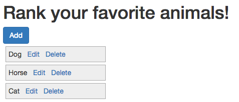

In this post we are going to take a look at how to use Bootstrap Modals in conjunction with Meteor. The main things we'll cover are:

* How to set-up a bootstrap modal to work with Meteor.
* How to use a 3rd party package to make working with bootstrap modals easier.
* And finally, although not related to modals, we'll figure out how to create lists which can be sorted by our user's.

Often when gathering input from the user the best solution is to create a separate page and navigate back and forth between it and a "list" page.  Sometimes however, a modal can be a good choice as it can help keep the flow of the application as the user doesn't need to leave the page they are currently viewing.  When the form in question consists of only a few fields a modal dialog is often worth considering.

So how do we do this with Meteor... find out below!  And for the tl;dr crowd, here's a link to a github repo of the code <insert the link here!!>

##What we'll build
We're going to create the next million dollar app!  A favorite animal ranking app (p.s. don't quit the day job, just in case I'm wrong about the million dollars it'll pull in).  The main interface will look like:

User's can add their favorite animal via the "add" button, which will bring up a modal dialog:
<ADD AN IMAGE HERE!!!>

##Creating the app
OK, let's get on the road to making our million dollars, first create a new Meteor app.

#####Terminal

meteor create fav-animals


After Meteor has done it's thing let's get rid of the default files it created for us.

#####Terminal

cd fav-animals
rm fav-animals.*


Now we'll add a couple of packages to help us along: ... argh re-style, below looks gross

* <a href="https://github.com/iron-meteor/iron-router" target="_blank">Iron Router</a> - to provide routing functionality.
* <a href="https://atmospherejs.com/twbs/bootstrap" target="_blank">Bootstrap</a> - to help with some styling and to provide our modal functionality.  Note that in a production application this is not the best way to integrate Boostrap into Meteor, see this <a href="http://www.manuel-schoebel.com/blog/meteorjs-and-twitter-bootstrap---the-right-way" target="_blank">article</a> for more information.  However for testing things out using a package is just fine and very convenient.

#####Terminal

meteor add iron:router
meteor add twbs:bootstrap


Sweet, our app is ready to go, let's run Meteor... 

#####Terminal

meteor


... and navigate to <a href="http://localhost:3000" target="_blank">localhost:3000</a>, we should see a default Iron Router message:

##Filling in some details
OK, this section is going to be a bit of a whirl-wind code dump as we get all the supporting pieces together in order to move on to working with our modals.

###Creating some data
So first order of business, let's get some default animals into our app so that we can display them to the user.  So let's set up our collection and then create a fixture file which will insert some default data, if no data currently exists.

#####Terminal

mkdir -p lib/collections
mkdir server
touch lib/collections/animals.js
touch server/fixtures.js


#####/lib/collections/animals.js

Animals = new Mongo.Collection('animals');


#####/server/fixtures.js

// Fixture data
if (Animals.find().count() === 0) {
    Animals.insert({
        rank: 3,
        name: "Cat"
    });
    Animals.insert({
        rank: 1,
        name: "Dog"
    });
    Animals.insert({
        rank: 2,
        name: "Zebra"
    });
}


Note we are adding a "rank" column to our Animals so that we can order them when they are displayed.

Now that we've added some fixture data we should be able to view the data directly in our web client console by querying the Animals collection:

Nice, we've got data!  But hmm, that doesn't seem so secure allowing any old web client to connect to our database, is Meteor inherently insecure?  <a href="https://www.discovermeteor.com/blog/meteor-and-security/" target="_blank">Nope!</a>  Let's batten down the hatches!

#####Terminal

meteor remove insecure
meteor remove autopublish


Now we've locked out our browser from accessing our database... phew!

If you want to double-check that our data is still present, you can fire up <a href="http://robomongo.org/" target="_blank">Robomongo</a> and connect to port 3001 (the default port Mongo runs under with Meteor):

Or you can add the <a href="https://github.com/msavin/Mongol" target="_blank">Mongol</a> package, a clever little package that let's you browse your database from the browser when Meteor is running in debug mode (which by default it does when you fire up Meteor locally).  What's great about this package is you don't need to worry about removing it when pushing your app to production as Meteor will do it for you, see <a href="https://github.com/msavin/Mongol/blob/master/documentation/SECURITY.md" target="_blank">here</a> for details and some caveats.

OK, let's add Mongol and then hit control-M from within our browser.

#####Terminal

meteor add msavin:mongol


Hmm, where did our Animals go?

If we click on the "Subscriptions" tab of Mongol we'll see what the problem is.

Now that we've removed the <a href="https://atmospherejs.com/meteor/autopublish" target="_blank">autopublish</a> package we're going to need to manually publish and subscribe to our data.

###Setting up our publications and subscriptions
OK, so let's start by setting up our publication.

#####Terminal

touch server/publications.js


#####/server/publications.js

Meteor.publish('animals', function() {
  return Animals.find();
});


Now let's subscribe to our publication via Iron Router.  We'll also need to set-up some templates for Iron Router to render.  So let's get some basic templates out of the way first.

#####Terminal

mkdir -p client/templates/application
mkdir client/templates/animals
touch client/templates/application/layout.html
touch client/templates/animals/animals.html


We'll create a standard layout that just yields to our main content.

#####/client/templates/application/layout.html

<head>
  <meta name="viewport" content="width=device-width, initial-scale=1.0">
  <title>Favorite Animals</title>
  <link rel="icon" sizes="16x16 32x32" href="/favicon.ico">
</head>

<template name="layout">
  <body>
    

       {{> yield}} 
    

  </body>
</template>


For now we'll just create a simple animals template just containing an h1 tag.

#####/client/templates/animals/animals.html

<template name="animals">
  <h1>Rank your favorite animals!</h1>
</template>


Right... so let's hook-up our router:

#####Terminal

touch lib/router.js


#####/lib/router.js

Router.configure({
  waitOn: function() {
    return Meteor.subscribe('animals');
  }
});

Router.route('/', {
  name: 'animals'
});


Now when we open up Mongol we see our animals are showing up, and Mongol also shows that we are subscribing to our animals publication... perfect!

Finally let's fill in the animals template so that we are displaying our animals... 

#####/client/templates/animals/animals.html

<template name="animals">
  <h1>Rank your favorite animals!</h1>
  

    <a href="#" id="add" class="btn btn-primary">Add</a>
    

       {{#each animals}} 
         {{> animal}} 
       {{else}} 
        <h4>
          You haven't added any favorite animals, click the Add button!
        </h4>
       {{/each}} 
    

  

</template>


Phew, now we can finally get onto that modal dialog we keep talking about... well... almost.