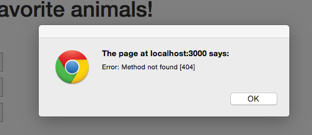

In this post we are going to take a look at how to use Bootstrap Modals in conjunction with Meteor. The main things we'll cover are:

* How to set-up a bootstrap modal to work with Meteor.
* How to use a 3rd party package to make working with bootstrap modals easier.
* And finally, although not related to modals, we'll figure out how to create lists which can be sorted by our user's.

We're going to use an existing Meteor app in this post, if you want to start from scratch, see the !!!prequel!!!.

Often when gathering input from the user the best solution is to create a separate page and navigate back and forth between it and a "list" page.  Sometimes however, a modal can be a good choice as it can help keep the flow of the application as the user doesn't need to leave the page they are currently viewing.  When the form in question consists of only a few fields a modal dialog is often worth considering.

So how do we do this with Meteor... find out below!  And for the tl;dr crowd, here's a link to a github repo of the code <insert the link here!!>

##What we'll build
We're going to create the next million dollar app!  A favorite animal ranking app (p.s. don't quit the day job, just in case I'm wrong about the million dollars it'll pull in).  The main interface will look like:

User's can add their favorite animal via the "add" button, which will bring up a modal dialog:
<ADD AN IMAGE HERE!!!>

##Creating the app
As a starting point, pull down the application from Github, and fire up the app.

#####Terminal

git clone ???
cd fav-animals
meteor


You should now see the application render when you point your browser at <a href="http://localhost:3000" target="_blank">http://localhost:3000</a>.

##Hooking up the Add button
The first thing we'll work on is to hook up the "Add" button.  If you click the "Delete" links you'll notice it's possible to remove animals from our list of favorites but there is currently no way to add new animals, that won't do!

We'll create our modal template and include it as part of the existing animals template.  This is necessary as the modal needs to be rendered in order for it successfully be opened.  Having to include the modal as part of the animals template is not ideal and we'll look at an alternative approach further along in this post.

#####/client/templates/animals/animals.html

<template name="animals">
  <!-- existing code ... -->

  {{> animalsModalTemplate}}
</template>

<template name="animalsModalTemplate">
  

    

      

        

          <h4 class="modal-title">Animal add / edit</h4>
        

        

          <label for="name">Name</label>
          <input type="text" id="animalName" />
        

        

          <button type="button" class="btn btn-primary" id="save">Save</button>
            <button type="button" class="btn btn-default" data-dismiss="modal">Cancel</button>
        

      

    

  

</template>


Now, we'll hook up our add button event.

#####/client/templates/animals/animals.js

Template.animals.events({
  'click #add': function(e) {
    e.preventDefault();
    
    $('#animalsModal').modal('show');
  }
});


After the above changes, the modal will appear when the "Add" button is clicked.

##Implementing the Modal Add button
So we now have our Modal showing up, and although the "Cancel" button works out of the gate, the "Save" button is currently nothing but an empty promise.  Let's fix that!

First we'll capture the Save button event.

#####/client/templates/animals/animals.js

Template.animalsModalTemplate.events({
  'click #save': function(e) {
    e.preventDefault();
    
    var animal = {
      name: $('#animalName').val()
    }

    Meteor.call('addAnimal', animal, function(error, result) {
      if (error) {
        alert(error);
      }
    });

    $('#animalsModal').modal('hide');
  }
});


Pretty simple, we're grabbing the value entered in the animal name text box and then calling a Meteor method on the server.  Of course, we have yet to implement the server method, so we'll currently see an error if we try adding an animal.

##Implementing Add on the server
OK, so let's get rid of that no method error by... you guessed it, implementing the method.  This is super simple, we just need to check that the name field is a valid string, then we add the animal to our database.  For now we are hard-coding all new animals to have a rank value of 0. 

#####/lib/collections/animals.js

Meteor.methods({
  addAnimal: function(animal) {
    check(animal.name, String);

    _.extend(animal, {"rank": 0});
    Animals.insert(animal);
  },
  deleteAnimal: function(animal) {
    ...


##Refactoring to use a package and implementing Edit
As you can see below, I've got a typo with my newly added animal.

Now I could delete and re-add my Donkey... but that seems a bit of pain, we're going to want to let user's edit the names of their animals.  But first let's see if we can structure our code around our Modal a little better, I don't like having to include the template within our existing animals template.

###Switching up our Modal to use a package
Luckily there is a Meteor package we can use to help us split out our Modal code in a more logical manner.

#####Terminal

meteor add peppelg:bootstrap-3-modal


Now we'll move our modal template out of our main animals template file and instead define the template in it's own file.

#####Terminal

touch client/templates/animals/animals-modal.html


#####client/templates/animals/animals-modal.html

<template name="animalsModal">
  

    

      

        

          <h4 class="modal-title">Animal add / edit</h4>
        

        

          <label for="name">Name</label>
          <input type="text" id="animalName" />
        

        

          <button type="button" class="btn btn-primary" id="save">Save</button>
            <button type="button" class="btn btn-default" data-dismiss="modal">Cancel</button>
        

      

    

  

</template>


One thing to notice is that we've renamed the template to simply be "animalModal" and we've removed the id attribute on the top-level div.  Another advantage of the package we're using is that it triggers on the template name and no separate id is required.

Now, lets' change our main animals template, the file is now much cleaner, also notice we no longer need to render our modal template in the animals template, i.e. the {{> animalModalTemplate}} line has been removed.

#####/client/templates/animals/animals.html

<template name="animals">
  <h1>Rank your favorite animals!</h1>
  

    <a href="#" id="add" class="btn btn-primary">Add</a>
    

      {{#each animals}}
        {{> animal}}
      {{else}}
        <h4>
          You haven't added any favorite animals, click the Add button!
        </h4>
      {{/each}}
    

  

</template>


OK with those changes, out of the way, if you click the Add button you'll notice, nothing happens.  This is because we need to call our modal in a different manner, so let's get that sorted.  At the same time we'll move the modal specific code into it's own file just like we did with the HTML templates.

#####Terminal

touch client/templates/animals/animals-modal.js


#####/client/templates/animals/animals-modal.js

Template.animalsModal.events({
  'click #save': function(e) {
    e.preventDefault();
    
    var animal = {
      name: $('#animalName').val()
    }

    Meteor.call('addAnimal', animal, function(error, result) {
      if (error) {
        alert(error);
      }
    });

    Modal.hide('animalsModal');
  }
});


#####/client/templates/animals/animals.js

Template.animals.helpers({
  animals: function() {
    return Animals.find({}, { sort: {rank: 1}});
  }
});

Template.animals.events({
  'click #add': function(e) {
    e.preventDefault();

    Modal.show('animalsModal');
  }
});


###Implementing Edit
OK, now that we have our package in place and our code is all cleaned up, it is time to implement our editing functionality.  The first thing we'll want to do is add an edit link to our animal template.

#####/client/templates/animals/animal.html

<template name="animal">
  

    {{name}}<a href="#" id="edit">Edit</a><a href="#" id="delete">Delete</a>
  

</template>


Now we just need to hook up the event so that our modal is opened when the user clicks "Edit".

#####/client/templates/animals/animal.js

Template.animal.events({
  'click #edit': function(e) {
    e.preventDefault();

    Modal.show('animalsModal');
  },
  'click #delete': function(e) {
  ...
  ...


Easy as pie... not!  The above code opens up the modal when the edit link is clicked but the existing values for our animal aren't displayed in the modal.  

Essentially we need our modal to handle two modes, add... when a user adds a new animal, and edit... when a user is editing an existing animal.

When the modal dialog opens in edit mode we need to populate the modal with the details for the animal under edit.  We'll accomplish this by setting a session variable that will contain our animal id.  If the id is empty we'll know the modal has been opened in create mode.

So let's update our code to handle this, we'll need to update both the template and the JS code.

#####/client/templates/animals/animal.js

  'click #edit': function(e) {
    e.preventDefault();

    animal = $(e.target).closest('.animal')
    animalId = animal.attr('data-id')
    ModalHelper.openModalFor(animalId);
  },
  'click #delete': function(e) {


#####/client/templates/animals/animal.html

<template name="animal">
  

    {{name}}<a href="#" id="edit">Edit</a><a href="#" id="delete">Delete</a>
  

</template>


There's a decent amount going on here but it's fairly straight-forward.  In our template we're using a data-id attribute to keep track of the id of the current animal record.  We then use this in conjunction with the class on the div to grab the id in our javascript code.  What is up with the ModalHelper line?  Well since there is now a little bit of logic involved in opening our modal, we're going to create a helper to centralize that functionality.

#####Terminal

mkdir client/helpers
touch client/helpers/open-modal.js


#####/client/helpers/open-modal.js

ModalHelper = {};

ModalHelper.openModalFor = function(animalId) {
  Session.set('selectedAnimalId', animalId);
  Modal.show('animalsModal');
}


From this helper code we can see how we're passing our id to our modal, we're using a Session variable.

We'll now make use of this Session variable in our modal code.

In the template we're setting the value of our animal name text box.

#####/client/templates/animals/animals-modal.html

<template name="animalsModal">
  

    ...
    ...
        

          <label for="name">Name</label>
          <input type="text" id="animalName" value={{animal.name}} />
        

    ...


And in our JavaScript we're fetching our animal record when appropriate.  Also we've updated our save method to create a new record when or edit an existing one.

#####/client/templates/animals/animals-modal.js

Template.animalsModal.helpers({
  animal: function() {
    var animalId = Session.get('selectedAnimalId');
    
    if (typeof animalId !== "undefined") {
      var animal = Animals.findOne(animalId);
      return animal;
    } else {
      return {name:'', rank:''}
    }
  }
});

Template.animalsModal.events({
  'click #save': function(e) {
    e.preventDefault();
    
    var animalId = Session.get('selectedAnimalId');
    var animal = {
      name: $('#animalName').val()
    }

    if (!animalId) {
      Meteor.call('addAnimal', animal, function(error, result) {
        if (error) {
          alert(error);
        }
      });
    } else {
      _.extend(animal, {id: animalId});
      Meteor.call('editAnimal', animal, function(error, result) {
        if (error) {
          alert(error);
        }
      });
    }

    Modal.hide('animalsModal');
  }
});


OK, we've got our client code doing what we want, but we're calling into a non-existent server method, 'editAnimal', so let's code that up.

#####/lib/collections/animals.js

Meteor.methods({
  editAnimal: function(animal) {
    Animals.update(animal.id, {$set: {
      name: animal.name
    }});
  },
  addAnimal: function(animal) {
  ...
  ...


Perfect, we've not got our modal working the way we want both when adding new animals and when editing existing animals.

##Ranking our favorites
The final step is to allow user's to rank the animals by dragging and dropping.

We'll accomplish this with the help of the drag and drop functionality included in jQuery UI.

#####Terminal

meteor add mrt:jquery-ui


Luckily a little bit of Googling results in a great article that covers exactly what we want to do: <a href="http://blog.differential.com/sortable-lists-in-meteor-using-jquery-ui/" target="_blank">http://blog.differential.com/sortable-lists-in-meteor-using-jquery-ui/</a>.

Excellent!  We can copy the code from the above blog post pretty much verbatim to get our drag and drop hooked up.  We'll add some code for the rendered event to our existing animals.js file.

#####/client/templates/animals/animals.js

// sorting code copied from: 
//  http://blog.differential.com/sortable-lists-in-meteor-using-jquery-ui/
Template.animals.rendered = function() {
  this.$('#animals').sortable({
    stop: function(e, ui) {
      // get the dragged html element and the one before
      //   and after it
      el = ui.item.get(0)
      before = ui.item.prev().get(0)
      after = ui.item.next().get(0)

      // Here is the part that blew my mind!
      //  Blaze.getData takes as a parameter an html element
      //    and will return the data context that was bound when
      //    that html element was rendered!
      if(!before) {
        //if it was dragged into the first position grab the
        // next element's data context and subtract one from the rank
        newRank = Blaze.getData(after).rank - 1
      } else if(!after) {
        //if it was dragged into the last position grab the
        //  previous element's data context and add one to the rank
        newRank = Blaze.getData(before).rank + 1
      }
      else
        //else take the average of the two ranks of the previous
        // and next elements
        newRank = (Blaze.getData(after).rank +
                   Blaze.getData(before).rank)/2

      //update the dragged Item's rank
      Meteor.call('updateAnimalRank', Blaze.getData(el)._id, newRank, function(error, result) {
        if (error) {
          alert(error);
        }
      });
    }
  })
}


Now all we need to do is implement the 'updateAnimalRank' method on the server.

#####/lib/collections/animals.js

Meteor.methods({
  updateAnimalRank: function(id, rank) {
    Animals.update(id, {$set: {rank: rank}});
  },
  editAnimal: function(animal) {
  ...
  ...


And that's it!  User's can now edit, add and rank animals.

##Summary
Although a contrived example (heck we don't even have seperate lists of animals for different user's), we see that using Modal within Meteor is pretty simple and furthermore adding nice UI elements such as drag and drop can also be accomplished without too much effort.

Thanks for reading and hope you found this post useful, feel free to hit me up with any comments or questions below, thanks again! 