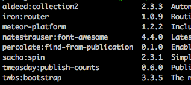
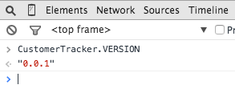
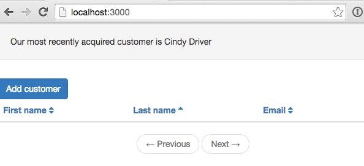
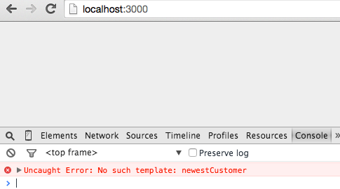
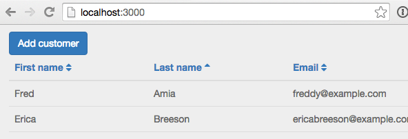
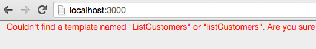

I recently viewed a great <a href="http://www.telescopeapp.org/blog/telescope-package-based-architecture/" target="_blank">screen cast</a> by <a href="http://sachagreif.com/" target="_blank">Sacha Grief</a> where he explains the package based architecture used by the open source <a href="http://www.telescopeapp.org/" target="_blank">Telescope</a> project.

We're going to take an existing application and apply the principles laid out in Sacha's screen cast to convert it to a package based architecture.  We'll be replicating a lot of the conventions used in Telescope very closely such as utilizing a lib and core package.

##Why packages?
So before we get going, why would one want to use a package based architecture in a Meteor project?  Well, there are a number of reasons that Sacha covers in his screen cast, which I'll summarize here:

* File load order.  The load order of files is explicit when using packages, this means you can avoid any load order issues you may have run into with a traditional structure.
* Code organization.  With packages, organization of your code is more modular and coupling between components is reduced.
  * Typically each feature has it's own package.
  * Each feature is independent, can take out a package and the application still works.
* Meteor update.  Updates on your application can be applied via Meteor update. (test this out!!!!)
* Customizations are easier.  If someone alters the source to add features, this can be done via a package, thus ensuring the core code of the application is not compromised.

##Why not packages?
The only real drawback that I see to using a package based architecture is that it adds some minor complexity and may be unfamiliar to other developers who might be looking at your code.

There are a couple of additional steps involved in adding a new file when using packages, you need to specify the files directly in the package file.

For small projects, a package approach *might* be overkill.  I really am impressed with some of the benefits of a package approach however, after running through this tutorial hopefully you'll have a better idea of whether you want to give it a go for your own projects.

##What we'll build

For those of you who have gone through the <a href="/paging-and-sorting-part-1/" target="_blank">paging and sorting</a> tutorial, this is going to look familiar.  Sorry about the recycled application, but taking an existing application and converting it I think is good way to demonstrate the differences between a standard and package based architecture.

Note we won't be doing much explanation of examination of the actual implementation code in this post.  Mostly we'll be moving code around and dealing with `package.js` files.  If you want an explanation of the code, checkout the <a href="/paging-and-sorting-part-1/" target="_blank">paging and sorting</a> tutorial.

##Creating the app
If you've gone through the paging and sorting tutorial you can use the existing code you built out from that.  If not or if you want to start from a fresh code base you can clone the starting point for this post from GitHub.

###Clone the Repo
Note, if you aren't familiar with Git and / or don't have it installed you can download a zip of the code <a href="https://github.com/riebeekn/package-based-architecture/archive/part-0.zip">here</a>.

#####Terminal

git clone -b part-0 https://github.com/riebeekn/package-based-architecture.git


###A quick over-view of where we're starting from
Open up the code in your text editor of choice and you'll see a pretty standard Meteor file structure.

By the time we're done, our project structure will look radically different: 

###Start up the app
OK, let's see where we're starting from.

#####Terminal

cd package-based-architecture
meteor --settings settings.json


You should now see the starting point for our application when you navigate your browser to <a href="http://localhost:3000" target="_blank">http://localhost:3000</a>.

##An over-view of the packages we'll be creating
Our goal is to break up the code into a package based structure.  Obviously our application is a contrived example and we're going to go a little package crazy with it, we'll be splitting up the "list", "add", and "newest customer" functionality into independent packages.  This is for illustration purposes, with a real application, likely all the customer functionality would be contained in a single package.

We'll be creating the following packages:

* customertracker-lib
* customertracker-core
* customertracker-customer
* customertracker-list
* customertracker-add
* customertracker-newest

As we tackle each package we'll explain it's purpose, we'll also be taking an iterative approach so our application will still be usable throughout the conversion process.

So let's get started!

##Creating the lib package
We'll be following the same convention as <a href="http://www.telescopeapp.org/" target="_blank">Telescope</a> and creating a lib package.  This package contains all our core Meteor and 3rd party references and also sets up a global namespace for our application.

###Implementation

#####Terminal

mkdir -p packages/customertracker-lib/lib
touch packages/customertracker-lib/package.js
touch packages/customertracker-lib/lib/core.js


The first thing we'll do is set up a global namespace for our project, we'll call our application 'Customer Tracker' so will go with that for the namespace.

#####/packages/customertracke-lib/lib/core.js

CustomerTracker = {};

CustomerTracker.VERSION = '0.0.1';


So all we are doing here is setting up a global namespace and setting a version attribute on the namespace.  The point of a global namespace is to ensure we don't end up with namespace collisions with 3rd party components or other javascript libraries.

Now let's move onto the `package.js` file.

As mentioned the main purpose of the lib package is to reference our 3rd party packages, so let's see what packages our application currently uses:

#####Terminal

meteor list


Awesome, with the above information we can now fill in `package.js`.

#####/packages/customertracker-lib/package.js

Package.describe({
  name: 'customertracker:lib', 
  summary: 'Customer tracker third party libraries and global namespace.',
  version: '0.0.1',
  git: 'https://github.com/riebeekn/package-based-architecture'
});

Package.onUse(function (api) {

  // specifies the version of Meteor required
  // here we're requring version 1.0  or greater of meteor
  api.versionsFrom(['METEOR@1.0']); 
  
  // 3rd party packages to use
  var packages = [
    'meteor-platform',
    'iron:router@1.0.9',
    'twbs:bootstrap@3.3.5',
    'sacha:spin@2.3.1',
    'tmeasday:publish-counts@0.6.0',
    'percolate:find-from-publication@0.1.0',
    'aldeed:collection2@2.3.3',
    'natestrauser:font-awesome@4.3.0',
    'iron:router@1.0.9'
  ];

  api.use(packages);

  // means packages that use this package can use the
  // packages.
  api.imply(packages);

  api.addFiles([
    'lib/core.js',
  ], ['client', 'server']);

  // things we want visible outside of the package
  api.export([
    'CustomerTracker'
  ]);
});


We'll quickly go over each section of `package.js`.  For an excellent and very detailed explanation of Meteor packages, check out <a href="http://themeteorchef.com/recipes/writing-a-package/" target="_blank">writing a package</a> by the <a href="http://themeteorchef.com/" target="_blank">Meteor Chef</a>.


Package.describe({
  name: 'customertracker:lib', 
  summary: 'Customer tracker third party libraries and global namespace.',
  version: '0.0.1',
  git: 'https://github.com/riebeekn/package-based-architecture'
});


This section of the file just sets some basic attributes for the package.  The `name` attribute is important as that is what we'll use to refer to the package when we add it to our application, i.e. `meteor add customertracker:lib`.

The version is also a critical piece of information as it is used by `meteor update` to indicate when a new version of the package is available.  TEST THIS!


Package.onUse(function (api) {

  // specifies the version of Meteor required
  // here we're specifying version 1.0  or greater of meteor
  api.versionsFrom(['METEOR@1.0']);
 

OK, next we have the `package.onUse` block which is basically the definition of the package.  The `api.versionsFrom` line indicates the version Meteor that our package is reliant upon.  We've specified `1.0`, so we're saying our package can be used with any version of Meteor 1.0 or higher.


  // 3rd party packages to use
  var packages = [
    'meteor-platform',
    'iron:router@1.0.9',
    'twbs:bootstrap@3.3.5',
    'sacha:spin@2.3.1',
    'tmeasday:publish-counts@0.6.0',
    'percolate:find-from-publication@0.1.0',
    'aldeed:collection2@2.3.3',
    'natestrauser:font-awesome@4.3.0',
    'iron:router@1.0.9'
  ];

  api.use(packages);

  // means packages that use this package can use the
  // packages.  CHANGE???
  api.imply(packages);


Here's where the information we gleaned from `meteor list` comes into play, we need to include all the packages used by our application, and do so by declaring a `packages` array.  Note for third party packages the version number is required.  `api.use` is what indicates we need to use the specified list of packages in the current package.

`api.imply` exposes the internal packages of the current package to any packages that use the current package.  This means for instance that if you use the current package in a second package, say `secondpackage`, then `secondpackage` has access to `iron:router` etc. without having to explicitly include it in `secondpackage`'s `package.js` file.  This is very useful as it means you only need to specify a dependency once and don't need to worry about conflicting version numbers in different of duplicate third party packages in your `package.js` files.


  api.addFiles([
    'lib/core.js',
  ], ['client', 'server']);


Unlike a traditionally structured Meteor application you need to explicitly specify which files Meteor should load up.  For this package, we only have the one file, `core.js` and it should be available on both the client and server, thus the `['client', 'server']` array.


  // things we want visible outside of the package
  api.export([
    'CustomerTracker'
  ]);
});


Finally we need to export any variables we want to have access to outside of our package.  We want access to the `CustomerTracker` namespace variable, so we've added an export entry for it.

###Usage
Now comes the exciting part, actually using the package we created.  First thing we'll want to do is blank out our existing package file.

#####/.meteor/packages.js

# Meteor packages used by this project, one per line.
# Check this file (and the other files in this directory) into your repository.
#
# 'meteor add' and 'meteor remove' will edit this file for you,
# but you can also edit it by hand.


Bam, as expected our app is now crashing hard!

Time for our new package to come to the rescue.

#####Terminal

meteor add customertracker:lib


And we're back working!

Also we now have access to our namespace variable.

Our package file now contains our single custom package:

#####/.meteor/packages.js

# Meteor packages used by this project, one per line.
# Check this file (and the other files in this directory) into your repository.
#
# 'meteor add' and 'meteor remove' will edit this file for you,
# but you can also edit it by hand.

customertracker:lib


This is pretty cool, we're now referencing all our third party and meteor core packages through the `lib` package we created.  Another great thing about the way packages work is that if you're converting an existing application to use packages, you can do it in steps instead of all at once.  This means you can continue to add features instead of needing to stop all new development until everything is converted over to packages.

##Creating the core package
Next up is customertracker:core.  This package will contain the bare skeleton of our application.  In our case it will contain our general layout pages, our router configuration and some utility check code.

###Implementation
OK, let's get started by creating some directories and files.

#####Terminal

mkdir -p packages/customertracker-core/lib/client/stylesheets
touch packages/customertracker-core/lib/client/stylesheets/styles.css
mkdir packages/customertracker-core/lib/client/templates
mkdir packages/customertracker-core/lib/server
mkdir packages/customertracker-core/lib/router
touch packages/customertracker-core/package.js


Now let's move some of our existing code into our newly created package.

#####Terminal

mv client/templates/application/layout.html packages/customertracker-core/lib/client/templates/
mv client/templates/application/not-found.html packages/customertracker-core/lib/client/templates/
mv lib/router/config.js packages/customertracker-core/lib/router/
mv server/helpers/custom-checks.js packages/customertracker-core/lib/server


With the custom check code that we've moved, let's update it to use our namespace we created in the `lib` package.

#####/packages/customertracker-core/lib/server/custom-checks.js

CustomerTracker.checks = {};

CustomerTracker.checks.positiveIntegerCheck = Match.Where(function(x) {
  check(x, Match.Integer);
  return x >= 0;
});

CustomerTracker.checks.sortFieldCheck = Match.Where(function(x) {
  if (x) {
    check(x, String);
    return x === 'firstname' || x === 'lastname' || x ==='email';
  } else {
    return true;
  }
});

CustomerTracker.checks.sortDirectionCheck = Match.Where(function(x) {
  if (x) {
    check(x, String);
    return x === 'asc' || x === 'desc';
  } else {
    return true;
  }
});


OK, all we've done is update the code to use our new namespace.  We'll need to change our publications to reflect this namespace change.

#####/server/publications.js

FindFromPublication.publish('customers', function(skipCount, sortField, sortDirection) {
  // parameter validations
  check(skipCount, CustomerTracker.checks.positiveIntegerCheck);
  check(sortField, CustomerTracker.checks.sortFieldCheck);
  check(sortDirection, CustomerTracker.checks.sortDirectionCheck)

  Counts.publish(this, 'customerCount', Customers.find(), { 
    noReady: true
  });
  
  return Customers.find({}, {
    limit: parseInt(Meteor.settings.public.recordsPerPage),
    skip: skipCount,
    sort: CustomerSortSettings.getSortParams(sortField, sortDirection)
  });
});

FindFromPublication.publish('newestCustomer', function() {
  return Customers.find({}, {
    limit: 1,
    sort: {'acquired': -1}
  });
});


Let's also update our stylesheet in both our main application and the in the package.

#####/client/stylesheets/styles.css

/*body {
  background: #eee;
  color: #666666; 
}*/

th {
  width: 33%;
}

.btn-primary {
  margin-top: 10px;
}


#####/packages/customertracker-core/lib/client/stylesheets/styles.css

body {
  background: #eee;
  color: #666666; 
}


All we're doing is moving the "core" style into our core package.  Since we don't have much styling going on, it's only the `body` style element that we need to move.

So now that we've moved some of our layout and our router configuration out of our application and updated our stylesheets, we'll see that our UI isn't looking too hot.

Let's update our package file so that we can get our layout back up and going.

#####/packages/customertracker-core/package.js

Package.describe({
  name: 'customertracker:core',
  summary: 'Customer tracker core libraries.',
  version: '0.0.1',
  git: 'https://github.com/riebeekn/package-based-architecture'
});

Package.onUse(function(api) {

  api.versionsFrom("METEOR@1.0");
  
  var packages = [
    'customertracker:lib@0.0.1',
  ];

  api.use(packages);
  
  api.imply(packages);

  api.addFiles([
    'lib/router/config.js',
  ], ['client', 'server']);

  api.addFiles([
    'lib/client/stylesheets/styles.css',
    'lib/client/templates/layout.html',
    'lib/client/templates/not-found.html',
  ], 'client');

  api.addFiles([
    'lib/server/custom-checks.js'
  ], 'server');
});


OK, so very similar to the package file we put together for customertracker-lib.  The main point of difference being that we have a single package we're using, our `lib` package.  By including it, we also are including all the 3rd party packages from `lib` via the `imply` line we discussed earlier.

Note once again we are using imply with this package as we want packages that use `core` to have access to the packages referenced within `core`, i.e. all the packages included in `lib`.

A diagram will give a better illustration of what we're aiming for:

###Usage
Let's update our application to use the new package.

#####Terminal

meteor add customertracker-core


And there we go, our layout and styles are now back in place!

##Creating the customer package
Now we'll start getting into the packages that deal with our customer specific functionality.  The customer package is going to contain our collection and fixture code, as well as our routes for the customer functionality (more description around why routes in here?).

###Implementation
Once again, let's create some directories and files to start off.

#####Terminal

mkdir -p packages/customertracker-customer/lib/server
touch packages/customertracker-customer/package.js


Now we'll move our collection, schema and fixture file out of our main application and into the package.

#NOTE: don't move collection, need to remove the insert method

#####Terminal

mv lib/collections/customers.js packages/customertracker-customer/lib/collections.js
mv lib/schemas/customers.js packages/customertracker-customer/lib/schemas.js
mv lib/router/customer-routes.js packages/customertracker-customer/lib/routes.js
mv server/fixtures.js packages/customertracker-customer/lib/server/


As expected this is going to cause all kinds of trouble for our application.

So let's get our package file updated so we can get our app back up and working.

#####/packages/customertracker-customer/package.js

Package.describe({
  name: 'customertracker:customer',
  summary: 'Contains collections and schemas for core customer functionality',
  version: '0.0.1',
  git: 'https://github.com/riebeekn/package-based-architecture'
});

Package.onUse(function(api) {

  api.versionsFrom("METEOR@1.0");
  
  var packages = [
    'customertracker:core@0.0.1',
  ];

  api.use(packages);
  
  api.addFiles([
    'lib/collections.js',
    'lib/routes.js',
    'lib/schemas.js'
  ], ['client', 'server']);

  api.addFiles([
    'lib/server/fixtures.js'
  ], 'server');

  api.export([
    'Customers'
  ]);
});


Pretty simple, we're using the `core` package, specifying the files in our package and then exporting the `Customers` collection so it can be used outside of our package.

###Usage
Again to get things back working we just need to make use of our new package.

#####Terminal

meteor add customertracker:customer


One thing to note is in our first `addFiles` call we are seeing an example of the importance of load order.  If we were to reverse the load order our application will crash.

#####/packages/customertracker-customer/package.js

api.addFiles([
  'lib/schemas.js',
  'lib/collections.js'
], ['client', 'server']);


As the console log suggests, the problem is that if we attempt to load our schema file before the collection file, we'll be attempting to attach our schema onto a customers collection that is not yet defined.

##Creating the newest customer package
OK, time to package up some of our UI elements.  The customertracker-newest package will be responsible for the "most recently acquired" section of our UI, i.e.

###Implementation
As usual we'll start off by creating some files and directories.

#####Terminal

mkdir -p packages/customertracker-newest/lib/client/templates
mkdir -p packages/customertracker-newest/lib/server
touch packages/customertracker-newest/package.js


And now let's move some code.

#####Terminal

mv client/templates/customers/newest-customer.html packages/customertracker-newest/lib/client/templates
mv client/templates/customers/newest-customer.js packages/customertracker-newest/lib/client/templates


With these changes our application is once again crashing.  This is because we are now missing the `newestCustomer` template.

We're going to come up with a better solution for handling this but for now we'll make a change to the `listCustomers` template to get rid of our error.

#####/client/templates/customers/list-customers.js

... existing code

Template.listCustomers.helpers({
  hasNewCustomerTemplate: function() {
    return Template["newestCustomer"];
  },
  customers: function() {
  ...
  ...


All we're doing here is adding a new helper function that returns a boolean value indicating whether the `newestCustomer` template exists or not.

We can then use this helper in our HTML file.

#####/client/templates/customers/list-customers.html

<template name="listCustomers">
  {{#if hasNewCustomerTemplate}}
    {{> newestCustomer}}
  {{/if}}
  

  ...
  ...


With that in place our app is back working without the new customer portion of the UI.

Before updating our package file we need to add the publication for our newest customer functionality.

So first let's update our existing publication file.

#####/server/publications.js

FindFromPublication.publish('customers', function(skipCount, sortField, sortDirection) {
  // parameter validations
  check(skipCount, CustomChecks.positiveIntegerCheck);
  check(sortField, CustomChecks.sortFieldCheck);
  check(sortDirection, CustomChecks.sortDirectionCheck)

  Counts.publish(this, 'customerCount', Customers.find(), { 
    noReady: true
  });
  
  return Customers.find({}, {
    limit: parseInt(Meteor.settings.public.recordsPerPage),
    skip: skipCount,
    sort: CustomerSortSettings.getSortParams(sortField, sortDirection)
  });
});

// GET RID OF THIS, MOVING IT INTO THE PACKAGE
// FindFromPublication.publish('newestCustomer', function() {
//   return Customers.find({}, {
//     limit: 1,
//     sort: {'acquired': -1}
//   });
// });


OK, simple we've just commented out the publication we'll be moving.

Now let's add it to our package.

#####Terminal

touch packages/customertracker-newest/lib/server/publications.js


And now we can update the file.

#####/packages/customertracker-newest/lib/server/publications.js

FindFromPublication.publish('newestCustomer', function() {
  return Customers.find({}, {
    limit: 1,
    sort: {'acquired': -1}
  });
});


Simple, we've just moved the existing code.

Now let's update `package.js`.

#####/packages/customertracker-newest/package.js

Package.describe({
  name: 'customertracker:newest',
  summary: 'Customer tracker newest customer functionality',
  version: '0.0.1',
  git: 'https://github.com/riebeekn/package-based-architecture'
});

Package.onUse(function(api) {

  api.versionsFrom("METEOR@1.0");

  api.use(['customertracker:core@0.0.1']);

  api.addFiles([
    'lib/client/templates/newest-customer.html',
    'lib/client/templates/newest-customer.js'
  ], 'client');

  api.addFiles([
    'lib/server/publications.js'
  ], 'server');
});


OK, nothing complicated going on here, we're just add the necessary files and referencing our `core` package.

###Usage
Time to get our newest customer showing up again.

#####Terminal

meteor add customertracker:newest


And with that we're back to our newest customer showing in the UI.

##Creating the list package
Next let's move the list functionality into a package.

###Implementation
This is getting redundant right?  But that's a good thing, we're getting the hang of creating these packages and so far it's turning out to be a snap.  Let's get some files and directories created.

#####Terminal

mkdir -p packages/customertracker-list/lib/client/stylesheets
touch packages/customertracker-list/lib/client/stylesheets/styles.css
mkdir packages/customertracker-list/lib/client/templates
mkdir packages/customertracker-list/lib/server
touch packages/customertracker-list/package.js


And now we can move some files.

#####Terminal

mv client/templates/customers/list-customers.html packages/customertracker-list/lib/client/templates/
mv client/templates/customers/list-customers.js packages/customertracker-list/lib/client/templates/
mv lib/helpers/customer-sort-settings.js packages/customertracker-list/lib/
mv server/publications.js packages/customertracker-list/lib/server/


Again, we're just moving the relevant files to our package, and once again our application is crashing.

We have a style element to move, so let's update our existing style file.

#####/client/styles/styles.css

/*body {
  background: #eee;
  color: #666666; 
}*/

/*th {
  width: 33%;
}*/

.btn-primary {
  margin-top: 10px;
}


We're slowly getting rid of our styles, we've commented out the `th` style and we'll move this into our package.

#####/packages/customertracker-list/lib/client/stylesheets/styles.css

th {
  width: 33%;
}


Now it's time to update `package.js`.

#####/packages/customertracker-list/package.js

Package.describe({
  name: 'customertracker:list',
  summary: 'Customer tracker list functionality.',
  version: '0.0.1',
  git: 'https://github.com/riebeekn/package-based-architecture'
});

Package.onUse(function(api) {

  api.versionsFrom("METEOR@1.0");

  api.use(['customertracker:core@0.0.1']);

  api.addFiles([
    'lib/customer-sort-settings.js',
  ], ['client', 'server']);

  api.addFiles([
    'lib/client/stylesheets/styles.css',
    'lib/client/templates/list-customers.html',
    'lib/client/templates/list-customers.js'
  ], 'client');

  api.addFiles([
    'lib/server/publications.js'
  ], 'server');
});


Nothing complicated, once again using `core` and adding the necessary files.

###Usage
OK, let's get our app back working.

#####Terminal

meteor add customertracker:list


##Creating the add package
OK, our last package... once we get this sucker finished off, we'll be completely package based.

As you can probably guess from the name, this package will handle our add functionality.  So let's get at it!

###Implementation
Yup, you guessed it, time to create some directories and files.

#####Terminal

mkdir -p packages/customertracker-add/lib/client/stylesheets
touch packages/customertracker-add/lib/client/stylesheets/styles.css
mkdir packages/customertracker-add/lib/client/templates
touch packages/customertracker-add/package.js


Now let's move our files.

#####Terminal

mv client/templates/customers/add-customer.html packages/customertracker-add/lib/client/templates
mv client/templates/customers/add-customer.js packages/customertracker-add/lib/client/templates


We'll now see that our add customer functionality is broken.

We can move our final piece of styling out of our original application.

#####/client/stylesheets/styles.css

/*body {
  background: #eee;
  color: #666666; 
}*/

/*th {
  width: 33%;
}*/

/*.btn-primary {
  margin-top: 10px;
}*/


There we go everything has been commented out, let's add the button style to our add package.

#####/packages/customertracker-add/lib/client/stylesheets/styles.css

.btn-primary {
  margin-top: 10px;
}


The last thing we need to move is our `customerInsert` method that was originally part of our collection.  We'll create a new file for the method.

#####Terminal

touch packages/customertracker-add/lib/methods.js


#####/packages/customertracker-add/lib/methods.js

Meteor.methods({
  customerInsert: function(customerAttributes) {
    check(customerAttributes, {
      name: String,
      surname: String,
      email: String
    });

    Customers.insert(customerAttributes);
  }
});


Now let's update the package file.

#####/packages/customertracker:add/package.js




###Usage
OK, let's get our add functionality back working.

#####Terminal

meteor add customertracker:add


##Some clean-up
So now that we have everything wrapped up in packages we can do some clean up on our directory structure.

#####Terminal

rm -r client
rm - r lib
rm -r server


Pretty sweet, everything is now completely within package directories.

##Updating our packages to be truly modular
We have a few artifacts of our original implementation that makes our package based implementation not completely modular.  Ideally we want our 'feature' packages, i.e. the 'list', 'add', and 'new' functionality to work independently.

This isn't currently the case however, if we remove our list functionality our application crashes, i.e.

#####/.meteor/packages

# Meteor packages used by this project, one per line.
# Check this file (and the other files in this directory) into your repository.
#
# 'meteor add' and 'meteor remove' will edit this file for you,
# but you can also edit it by hand.

customertracker:lib
customertracker:core
customertracker:customer
customertracker:newest
#customertracker:list
customertracker:add


We've just commented out our list functionality, which results in:

Likewise if we remove our add package, we still have an add button on our main list page.

#####/.meteor/packages

# Meteor packages used by this project, one per line.
# Check this file (and the other files in this directory) into your repository.
#
# 'meteor add' and 'meteor remove' will edit this file for you,
# but you can also edit it by hand.

customertracker:lib
customertracker:core
customertracker:customer
customertracker:newest
customertracker:list
#customertracker:add


###Making our three feature packages modular.
To solve this we will create a main index page for our customer functionality and remove the add button functionality from our current list customer templates.

Let's start of by creating our index page.

#####Terminal

mkdir -p packages/customertracker-customer/lib/client/templates
touch packages/customertracker-customer/lib/client/templates/customer-index.html


#####/packages/customertracker-customer/lib/client/templates/customer-index.html

<template name="customerIndex">
  {{> render name='newestCustomer'}}
  {{> render name='addCustomerButton'}}
  {{> render name='listCustomers'}}
</template>


OK, so all we're doing here is laying out the components we want on our main index page.  What's up with that `render` function?  Well we want to only render components that exist so we'll create a helper to handle the rendering of our optional components.

We'll throw this into our core package.

#####Terminal

touch packages/customertracker-core/lib/client/spacebar-helpers.js


#####/packages/customertracker-core/lib/client/spacebar-helpers.js

Template.registerHelper('render', function () {
  return Template[this.name] ? Template[this.name] : null;
});


Pretty simple we're just checking if a template exists, if it does we return it, otherwise we return `null`.  This will prevent attempts to render non existent templates.

So let's update our package files to take into account our new items.

#####/packages/customertracker-customer/package.js

...
...
  api.addFiles([
    'lib/server/fixtures.js'
  ], 'server');

  api.addFiles([
    'lib/client/templates/customer-index.html'
  ], 'client');

  api.export([
    'Customers'
  ]);
});


#####/packages/customertracker-core/package.js

  ...
  ...
  api.addFiles([
    'lib/router/config.js',
  ], ['client', 'server']);

  api.addFiles([
    'lib/client/stylesheets/styles.css',
    'lib/client/templates/layout.html',
    'lib/client/templates/not-found.html',
    'lib/client/spacebar-helpers.js'
  ], 'client');

  api.addFiles([
    'lib/server/custom-checks.js'
  ], 'server');
});


Now we need to create our add button template.

#####Terminal

touch packages/customertracker-add/lib/client/templates/add-customer-button.html
touch packages/customertracker-add/lib/client/templates/add-customer-button.js


#####/packages/customertracker-add/lib/client/templates/add-customer.html

<template name="addCustomerButton">
  

    

      <a class="btn btn-primary" id="btnAddCustomer">Add customer</a>
    

  

</template>


#####/packages/customertracker-add/lib/client/templates/add-customer-button.js

Template.addCustomerButton.events({
  'click #btnAddCustomer': function(e) {
    e.preventDefault();

    Router.go('addCustomer', {page: Router.current().params.page});
  }
});


exmplanation

Let's update our package file.

#####/packages/customertracker-add/package.js

  ...
  ...
  api.addFiles([
    'lib/client/stylesheets/styles.css',
    'lib/client/templates/add-customer.html',
    'lib/client/templates/add-customer.js',
    'lib/client/templates/add-customer-button.html',
    'lib/client/templates/add-customer-button.js'
  ], 'client');
});


Now we need to remove this code from our list package.

#####/packages/customertracker-list/lib/client/templates/list-customers.html

<template name="listCustomers">
  {{#unless Template.subscriptionsReady}}
    {{> spinner}}
  {{/unless}}
  <table class="table">
    ...
    ...


So we've removed the rendering of both the `newestCustomer` template and the add button code.

We can remove the add button handler now.

#####/packages/customertracker-list/lib/client/templates/list-customers.js

...
Template.listCustomers.events({
  'click #firstName,#lastName,#email': function(e) {
    e.preventDefault();

    if (e.target.id === 'firstName') {
      navigateToCustomersRoute('firstname');
    } else if (e.target.id === 'lastName') {
      navigateToCustomersRoute('lastname');
    } else if (e.target.id === 'email') {
      navigateToCustomersRoute('email');
    }
  }
});
...


Finally we need to update our routes.

#####/packages/customertracker-customer/lib/routes.js

Router.route('/customer/add', {
  name: 'addCustomer'
});

Router.route('/:page?/:sortField?/:sortDirection?', {  
  name: 'customerIndex'
});


Need to update code that refers to the route.

#####/packages/customertracker-list/lib/client/templates/list-customers.js

...
  prevPage: function() {
    var previousPage = currentPage() === 1 ? 1 : currentPage() - 1;
    return Router.routes.customerIndex.path({
      page: previousPage,
      sortField: Router.current().params.sortField,
      sortDirection: Router.current().params.sortDirection
    });
  },
  nextPage: function() {
    var nextPage = hasMorePages() ? currentPage() + 1 : currentPage();
    return Router.routes.customerIndex.path({
      page: nextPage,
      sortField: Router.current().params.sortField,
      sortDirection:Router.current().params.sortDirection
    });
  },
...
var navigateToCustomersRoute = function(sortField) {
  Router.go('customerIndex', {
    page: Router.current().params.page || 1,
    sortField: sortField,
    sortDirection: CustomerSortSettings.toggleSortDirection(sortField)
  });
}
...


Router.routes.listCustomers.path changed to Router.routes.customerIndex.path

Also need to change in add.

#####/packages/customertracker-add/lib/client/templates/add-customer.js

...
    Meteor.call('customerInsert', customer, function(error, result) {    
      if (error) {
        alert(error);
        return false;
      }     

      Router.go('customerIndex');      
    });
  },
  'click #btnCustomersList': function(e) {
    e.preventDefault();

    Router.go('customerIndex');
  }
});


Now can use any combination of the 3 packages.

For instance with just the new and add package, we get the following.

##Summary

###Next steps
telescope source

###References
<a href="http://themeteorchef.com/recipes/writing-a-package/" target="_blank">MC packages</a>