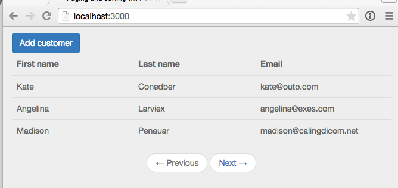
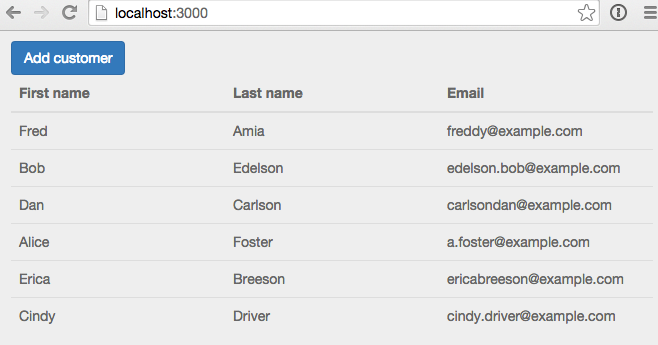

In this post we are going to take a look at how to page data in Meteor, in part 2 we'll also add sorting.

These days <a href="http://www.smashingmagazine.com/2013/05/03/infinite-scrolling-lets-get-to-the-bottom-of-this/" target="_blank">infinite scrolling</a> is a popular way to achieve paging but isn't always appropriate for every situation.  Infinite scrolling works great for a news feed or user posts, but not so much for something like a customer list.

If you'd rather grab the source code directly rather than follow along, it's available on <a href="https://github.com/riebeekn/paging-and-sorting/tree/part-1" target="_blank">GitHub</a>.

##What we'll build
To demonstrate paging we're going to build a simple list of customers.

##Creating the app
As a starting point, we'll clone an initial version of the application from GitHub.  The initial version contains our list of customers and the ability to add more customers.

###Clone the Repo
Note, if you aren't familiar with Git and / or don't have it installed you can download a zip of the code <a href="https://github.com/riebeekn/paging-and-sorting/tree/part-0" target="_blank">here</a>.  Otherwise let's gitty up (yes that's supposed to be a joke).

#####Terminal

git clone -b part-0 https://github.com/riebeekn/paging-and-sorting.git
cd paging-and-sorting


###A quick over-view of where we're starting from
Open up the code in your text editor of choice and you'll see a pretty standard file structure.

We'll primarily be dealing with the customer templates / helper files as well as the `customer-routes.js` file.

As far as packages go, we've added: 

* <a href="https://atmospherejs.com/iron/router" target="_blank">Iron Router</a> - to provide routing functionality.
* <a href="https://atmospherejs.com/twbs/bootstrap" target="_blank">Bootstrap</a> - for some simple styling (note see this <a href="http://www.manuel-schoebel.com/blog/meteorjs-and-twitter-bootstrap---the-right-way" target="_blank">article</a> for better way of adding Bootstrap in a production application).
*  - To provide a nice waiting indicator.
*  - To help create some fixture data.

<a href="https://atmospherejs.com/meteor/autopublish" target="_blank">Autopublish</a>  and <a href="https://atmospherejs.com/meteor/insecure" target="_blank">Insecure</a> have been removed.

###Start up the app

#####Terminal

meteor


You should now see the starting point for our application when you navigate your browser to <a href="http://localhost:3000" target="_blank">http://localhost:3000</a>.

##Adding paging

###Updating the UI
The first thing we'll do to get our paging rolling is to update the UI.  We'll add previous and next links at the bottom of our table.

#####/client/templates/customers/listCustomers.html

<template name="listCustomers">
  <!-- existing code ... -->
  <nav>
    <ul class="pager">
      <li class="{{prevPageClass}}">
        <a id="prevPage" href="{{prevPage}}">
          &larr; Previous
        </a>
      </li>
      <li class="{{nextPageClass}}">
        <a id="nextPage" href="{{nextPage}}">
          Next &rarr;
        </a>
      </li>
    </ul>
  </nav>
</template>


Pretty simple, at the bottom of our template we've added HTML that corresponds to a <a href="http://getbootstrap.com/components/#pagination-pager" target="_blank">Bootstrap pager</a>.  We've got <a href="http://docs.meteor.com/#/full/spacebars" target="_blank">spacebars</a> directives defined for both the class to apply to the previous and next buttons as well as the URL of the buttons.

The class directives will disable the buttons where appropriate (i.e. the previous button when on the first page of results), and obviously the URL's correspond to the URL for the next or previous page.

###Fake it until you make it
So obviously our buttons don't do anything yet, let's start out by coming up with a simplified implementation just to get a basic working example, we'll then refactor it to something more appropriate.

We know in our customers publication we're going to want to do two things:

* Restrict the number of records returned.
* Skip the first "x" records depending on what page is being displayed.

So let's update our publication to do the above.

#####/server/publications.js

Meteor.publish('customers', function(skipCount) {
  return Customers.find({}, {
    limit: 3, // records to show per page
    skip: skipCount
  });
});


With the above change, you'll now see only the first 3 records being returned.

We're hard-coding the number of records to return to 3, with the `limit: 3` parameter in the `find()` call.  The skip value is the number of records to skip over and is determined by the `skipCount` parameter we'll pass to the function.  Since we aren't passing anything in as the `skipCount` currently, the value of `skipCount` will be 'undefined' and therefore no records will be skipped over.

We can easily pass in a `skipCount` and have what is shown determined by our page parameter by changing the subscription our router.

#####/lib/router/customer-routes.js

Router.route('/:page?', {  
  name: 'listCustomers',
  waitOn: function() {
    var currentPage = parseInt(this.params.page) || 1; 
    var skipCount = (currentPage - 1) * 3; // 3 records per page     
    return Meteor.subscribe('customers', skipCount);  
  }
});
...
...


What we've done is add some additional logic to our `waitOn` function.  First we calculate the current page.  We grab the current page from the URL if it's present in the URL otherwise we default to the first page.

The skip count is determined by taking the zero-based index (i.e. if we're on the first page, the zero based index for that page is 0) and multiplying it by the number of records to display per page.

We can now switch the page manually by entering a page number into the URL.  Without a page number or when the page number is "1" the first page is displayed, entering "2" displays the second page, and anything larger than 2 is going to display an empty table as we only have 6 records in our database.

OK, so not a bad job of faking it!  Paging is working we just need to get it hooked up to the next and previous buttons.  

Before doing so, let's perform a small refactoring, hard-coding the number of records to display per page (i.e. 3) in the code doesn't seem like the best idea.  There are a number of approaches we could take to handle this, the option we'll go with is to place the value in a `settings.json` file.

#####Terminal

touch settings.json


#####/setting.json

{
  "public": {
    "recordsPerPage" : "3"
  }
}


Since we need to access the number of records per page on both the client and server we need to create a public settings entry.

In order for Meteor to pick up the settings value, we'll need to restart Meteor and point to the settings file.

#####Terminal

meteor --settings settings.json


With all that taken care of we'll replace our hard-coded values in both the router and the publication.

#####/lib/router/customer-routes.js

Router.route('/:page?', {  
  name: 'listCustomers',
  waitOn: function() {
    var currentPage = parseInt(this.params.page) || 1; 
    var skipCount = (currentPage - 1) * Meteor.settings.public.recordsPerPage;....
    ...


#####/server/publications.js

Meteor.publish('customers', function(skipCount) {
  return Customers.find({}, {
    limit: parseInt(Meteor.settings.public.recordsPerPage),
    skip: skipCount
  });
});


###No more faking
As much fun as it is to type page numbers into the URL, I think we're going to want to get those buttons working... so let's get to it!

####Setting the button link values
If we look at our `list-customers.html` template we've already got a <a href="http://docs.meteor.com/#/full/spacebars" target="_blank">spacebars</a> directive set-up for the links.

#####/client/templates/customers/list-customers.html

...
...
<a id="prevPage" href="{{prevPage}}">
...
...
<a id="nextPage" href="{{nextPage}}">
...
...


So we just need to create helpers to fill in those values.

#####/client/templates/customers/list-customers.js

Template.listCustomers.helpers({
  customers: function() {
    return Customers.find();
  },
  prevPage: function() {
    var currentPage = parseInt(Router.current().params.page || 1);
    var previousPage = currentPage === 1 ? 1 : currentPage - 1;
    return Router.routes.listCustomers.path({page: previousPage});
  },
  nextPage: function() {
    var currentPage = parseInt(Router.current().params.page || 1);
    var nextPage = currentPage + 1;
    return Router.routes.listCustomers.path({page: nextPage});
  }
});
...
...


Let's look at the `prevPage` function, so the first thing we do when calculating the URL for the previous page is to calculate the current page from the URL, i.e. `Router.current().params.page`.  If there is not page parameter in the URL we default to 1.

Next we assign `previousPage` to the current page minus 1... unless of course the current page is the first page in which case there is no previous page so we set `previousPage` to 1.

Lastly we return the listCustomers route passing in the previous page to the page parameter.  Pretty simple!

The next page is even simpler we just add 1 to the current page value... but you can probably guess where this implementation falls down.

Hmm, we can just keep on paging past the point where we have any records to display, that won't do!

We're going to need a count of the total records in order to determine whether the next button should move onto a next page or stay where it is.  We also need the count to be <a href="http://docs.meteor.com/#/full/reactivity" target="_blank">reactive</a> as if one user is adding records while another is viewing records we want the count to update so that the viewing user is able to see the new records.

Luckily there is a great <a href="https://atmospherejs.com/tmeasday/publish-counts" target="_blank">package</a> that will help us along with this.

#####Terminal

meteor add tmeasday:publish-counts


With the publish-counts package added we can make use of it in our publication.

#####/server/publications.js

Meteor.publish('customers', function(skipCount) {
  Counts.publish(this, 'customerCount', Customers.find(), { 
    noReady: true
  });

  return Customers.find({}, {
    limit: parseInt(Meteor.settings.public.recordsPerPage),
    skip: skipCount
  });
});


Pretty neat, right inside our `customers` publication we can publish the count.  The `noReady` flag indicates that there is more data being sent down the line in the publication than just the count.  The <a href="https://atmospherejs.com/tmeasday/publish-counts" target="_blank">package</a> documentation contains more details.

OK, so our publication is all set, let's update our next link helper to take advantage of our newly acquired count.

#####/client/templates/customers/list-customers.js

var hasMorePages = function() {
  var currentPage = parseInt(Router.current().params.page || 1);
  var totalCustomers = Counts.get('customerCount');
  return currentPage * parseInt(Meteor.settings.public.recordsPerPage) < totalCustomers;
}

Template.listCustomers.helpers({
...
...
  nextPage: function() {
    var currentPage = parseInt(Router.current().params.page || 1);
    var nextPage = hasMorePages() ? currentPage + 1 : currentPage;
    return Router.routes.listCustomers.path({page: nextPage});
  }
});
...
...


We've created a `hasMorePages` function that we call from within the `nextPage` function.  If we have more pages we increment the page number otherwise we stay where we are.

`hasMorePages` is pretty straight-forward, we're just checking whether the current page multiplied by the number of items per page is less than the total number of customer records.  If it is we know we've got more records.

Now, if you try to navigate past the 2nd page you won't be able to.

####What's that smell?
Before getting too excited, we're seeing some code smells leak into our implementation.  The code that determines the `currentPage` appears in a bunch of places in `list-customers.js`, and it even appears in `customer-routes.js`.

We're going to want to tighten that up and ensure this logic appears in only one place.  We're going to make use of a route controller and define the logic in the route, and reference it in the helpers.

So first let's refactor the router.

#####/lib/router/customer-routes.js

CustomersListController = RouteController.extend({  
  template: 'listCustomers',  
  currentPage: function() {     
    return parseInt(this.params.page) || 1;  
  },
  subscriptions: function() {
    var skipCount = (this.currentPage() - 1) 
      * parseInt(Meteor.settings.public.recordsPerPage)
    this.customersSub = Meteor.subscribe('customers', skipCount);  
  },
  data: function() {
    return {        
      ready: this.customersSub.ready,
      currentPage: this.currentPage()
    };  
  }
});

Router.route('/:page?', {  
  name: 'listCustomers',  
  controller: CustomersListController
});

Router.route('/customer/add', {
  name: 'addCustomer'
});


We're now defining our current page function in the route controller and returning it in the `data` section of the controller so that it is accessible in the helpers.  We're also handling our wait indicator a little differently by returning a ready flag.

We can now update `list-customers.js`.

#####/client/templates/customers/list-customers.js

var hasMorePages = function() {
  var totalCustomers = Counts.get('customerCount');
  return Router.current().currentPage() 
    * parseInt(Meteor.settings.public.recordsPerPage) < totalCustomers;
}

Template.listCustomers.helpers({
  customers: function() {
    return Customers.find();
  },
  prevPage: function() {
    var previousPage = Router.current().currentPage() === 1 
      ? 1 : Router.current().currentPage() - 1;
    return Router.routes.listCustomers.path({page: previousPage});
  },
  nextPage: function() {
    var nextPage = hasMorePages() 
      ? Router.current().currentPage() + 1 : Router.current().currentPage();
    return Router.routes.listCustomers.path({page: nextPage});
  }
});

Template.listCustomers.events({
  'click #btnAddCustomer': function(e) {
    e.preventDefault();

    Router.go('addCustomer', {page: Router.current().params.page});
  }
});


Nothing special going on here, we've just replaced the locally calculated current page functions with the router function, i.e. `Router.current().currentPage()`.

The last thing to update is `list-customers.html`, we need it to take into account our ready state.

#####/client/templates/customers/list-customers.html

<template name="listCustomers">
  

    

      <a class="btn btn-primary" id="btnAddCustomer">Add customer</a>
    

  

  {{#unless ready}}        
    {{> spinner}}      
  {{/unless}}
  <table class="table">
  ...
  ...


All we're doing here is over-laying a spinner icon over the table when the subscription has not yet loaded.

####Setting the button classes
It would be nice to give the user a visual cue when they've reached the first or last page of records so let's accomplish that by changing up the class of the next and previous buttons when appropriate.

We already added our spacebar directives for the classes earlier:

#####/client/templates/customers/list-customers.html

...
<li class="{{prevPageClass}}">
...
<li class="{{nextPageClass}}">
...


Now we'll add the helper code, this just requires an update to the helper section of `list-customers.js`.

#####/client/templates/customers/list-customers.js

// existing code...

Template.listCustomers.helpers({
  customers: function() {
    return Customers.find();
  },
  prevPage: function() {
    var previousPage = Router.current().currentPage() === 1 
      ? 1 : Router.current().currentPage() - 1;
    return Router.routes.listCustomers.path({page: previousPage});
  },
  nextPage: function() {
    var nextPage = hasMorePages() 
      ? Router.current().currentPage() + 1 : Router.current().currentPage();
    return Router.routes.listCustomers.path({page: nextPage});
  },
  prevPageClass: function() {
    return Router.current().currentPage() <= 1 ? "disabled" : "";
  },
  nextPageClass: function() {
    return hasMorePages() ? "" : "disabled";
  }
});

// existing code...


So here all we're doing is returning an empty string when the buttons should display as normal and returning "disabled" when the buttons should be disabled.

This results in a visual clue for the user:

##Summary
OK, so that's it for the exciting world of paging in Meteor, thanks for reading and hope you enjoyed the post.  In part two we'll look at adding sorting.
