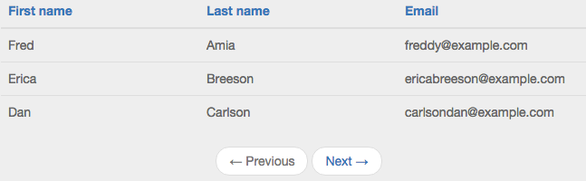
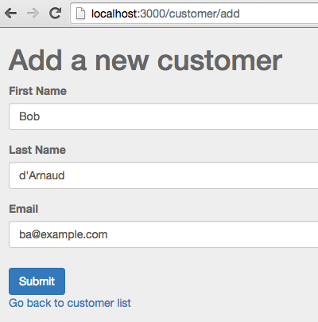
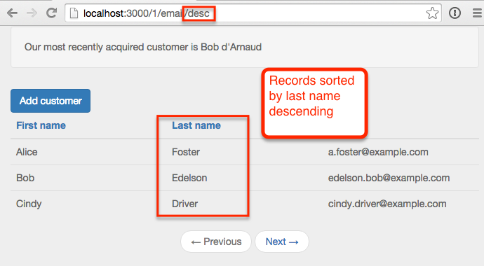
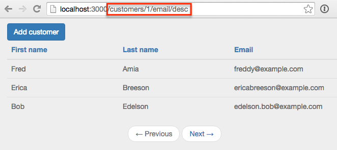
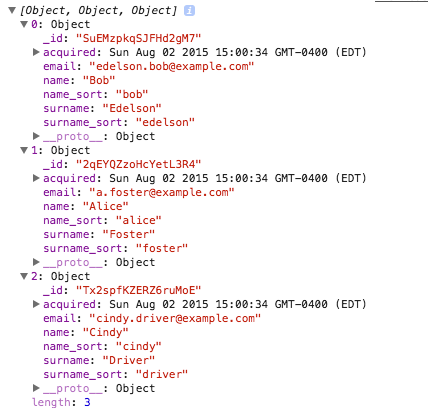
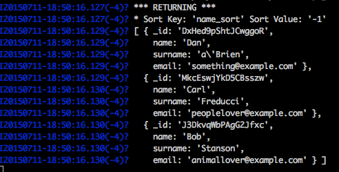
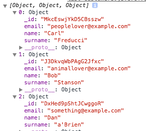

This is the second of a two part post on paging and sorting.  In <a href="/paging-and-sorting-part-1/index.html" target="_blank">part 1</a> we looked at how to add paging, in this post we'll add the sorting component.

If you'd rather grab the source code directly rather than follow along, it's available on <a href="https://github.com/riebeekn/paging-and-sorting" target="_blank">GitHub</a>.

##What we'll build
To demonstrate paging and sorting we're going to build a simple list of customers.

##Creating the app
If you followed along with <a href="/paging-and-sorting-part-1/index.html" target="_blank">part 1</a> you're all set.  If not and you want to jump right into part 2, you can clone part 1 from GitHub as a starting point.  This version of the application contains a paged list of customers and the ability to add more customers.

###Clone the Repo
Note, if you aren't familiar with Git and / or don't have it installed you can download a zip of the code <a href="https://github.com/riebeekn/paging-and-sorting/tree/part-1" target="_blank">here</a>.  Otherwise time to git down.

#####Terminal

git clone -b part-1 https://github.com/riebeekn/paging-and-sorting.git
cd paging-and-sorting


###Start up the app

#####Terminal

meteor --settings settings.json


You should now see the starting point for our application when you navigate your browser to <a href="http://localhost:3000" target="_blank">http://localhost:3000</a>.

##Adding sorting

###Updating the table headers
The first thing we'll do is update the UI to have click-able headers, substituting links for the current headers.

#####/client/templates/customers/list-customers.html

<template name="listCustomers">
  

    

      <a class="btn btn-primary" id="btnAddCustomer">Add customer</a>
    

  

  {{#unless ready}}        
    {{> spinner}}      
  {{/unless}}
  <table class="table">
    <thead>
      <tr>
        <th>
          <a id="firstName" href="#">First name</a>
        </th>
        <th>
          <a id="lastName" href="#">Last name</a>
        </th>
        <th>
          <a id="email" href="#">Email</a>
        </th>
      </tr>
    </thead>
    <tbody>
      {{#each customers}}
      ...
      ...


OK, nothing complicated there, but before hooking up the links let's switch gears and figure out what we want to have happen on the server.  We'll want to specify not only a sort field but also a sort direction.  This will require a change to both the publication and the subscription.

###Updating the publication and subscription

Let's update the publication first.

#####/server/publications.js

Meteor.publish('customers', function(skipCount, sortField, sortDirection) {
  Counts.publish(this, 'customerCount', Customers.find(), { 
    noReady: true
  });

  var sortParams = {};
  sortParams[sortField] = sortDirection;
  return Customers.find({}, {
    limit: parseInt(Meteor.settings.public.recordsPerPage),
    skip: skipCount,
    sort: sortParams
  });
});


Nothing too crazy, we're passing two additional parameters to our publication, one for the sort field and the other for the sort direction.  The find call has been updated to take the new parameters into account.

Let's check out our app:

That's no good, but expected, we need to update our subscription to include the two new parameters.  To get things back to a working state we'll initially hard-code some values and then build out the full implementation.

First off though, to figure out what we're going to need to do, let's have a quick look at our database records with <a href="http://robomongo.org/" target="_blank">Robomongo</a>.

We can see we have 5 fields in our customer record, 3 of which we are displaying in the UI.  Also the column names are slightly different from the table headers, so when we specify the sort field we need to keep in mind the column names in the database.

Let's start off by sorting via the surname with an order value of 1 (i.e. an ascending sort direction).

#####/lib/router/customer-routes.js

CustomersListController = RouteController.extend({  
  template: 'listCustomers',  
  currentPage: function() {     
    return parseInt(this.params.page) || 1;  
  },
  subscriptions: function() {
    var skipCount = (this.currentPage() - 1) 
      * parseInt(Meteor.settings.public.recordsPerPage)
    this.customersSub = Meteor.subscribe('customers', skipCount, "surname", 1);  
  },


After hard-coding the surname as the sort field and ascending as the sort order, everything should be back working and we'll see our list of customers is now sorted by surname.

Since we're only using some of the columns from our database records, we should also update our publication to reflect this.

#####/server/publications.js

Meteor.publish('customers', function(skipCount, sortField, sortDirection) {
  Counts.publish(this, 'customerCount', Customers.find(), { 
    noReady: true
  });

  var sortParams = {};
  sortParams[sortField] = sortDirection;
  return Customers.find({}, {
    fields: {'name':1, 'surname':1, 'email':1},
    limit: parseInt(Meteor.settings.public.recordsPerPage),
    skip: skipCount,
    sort: sortParams
  });
});


We're now explicitly specifying which fields to return in the publication (note the `_id` will be returned automatically).  Although not a big deal in this particular instance, specifying the columns to return to the client is a good practice.  There is not point in bringing down data that you don't need and in some cases there might be columns in your database that you don't want to expose to the client.

###An issue
Hmm, I'm getting bored having only 6 customers in our database, how about we add a new customer via the `Add Customer` button.

Awesome, we have a new customer... but hey what is up with the sort order?  Our newly added customer is way back on the last page.

Well turns out Mongo does not support <a href="http://stackoverflow.com/questions/22931177/mongo-db-sorting-with-case-insensitive" target="_blank">case insensitive sorting</a>, and uppercase words will always come prior to lowercase words when sorted.  Holy smokes, what are we going to do?

###A solution
Turns out a common pattern when needing to sort on String columns in Mongo is to duplicate a lowercased version of the field for the purpose of sorting.  Coming from a traditional database background, this seems a little strange, but that's just the way it's done in Mongo, denormalization and duplication is fairly common.

So how can we accomplish this in our application?  There's a package for that (well sort of)!

We'll add the <a href="https://github.com/aldeed/meteor-collection2" target="_blank">collection2</a> package which will allow use to automatically create lower-cased versions of our String fields on insert.  Let's see how it all works.

#####Terminal

meteor add aldeed:collection2


Now we'll create a <a href="https://github.com/aldeed/meteor-collection2#attaching-a-schema-to-a-collection" target="_blank">schema</a> for our customer collection.

#####Terminal

mkdir lib/schemas
touch lib/schemas/customers.js


#####/lib/schemas/customers.js

Customers.attachSchema(new SimpleSchema({
  name: {
    type: String
  },

  name_sort: {
    type: String,
    optional: true,
    autoValue: function() {
      var name = this.field("name");
      if (name.isSet) {
        return name.value.toLowerCase();
      } else {
        this.unset(); // Prevent user from supplying her own value
      }
    }
  },
 
  surname: {
    type: String
  },

  surname_sort: {
    type: String,
    optional: true,
    autoValue: function() {
      var surname = this.field("surname");
      if (surname.isSet) {
        return surname.value.toLowerCase();
      } else {
        this.unset(); // Prevent user from supplying her own value
      }
    }
  },

  email: {
    type: String,
    autoValue: function() {
      return this.value.toLowerCase(); // store emails as lower-case
    }
  }
})); 


In the schema file we're specifying the types of our fields, i.e. `type: String` and then using the `autoValue` property to create and assign a value to our sort specific columns.  The code that assigns the value is pretty straight-forward, we're just lower-casing the value of the primary column.

We'll want to reset our app so that our fixture data gets the new auto value data.  So stop, reset and re-start the meteor server.

#####Terminal

meteor reset
meteor --settings settings.json


And now re-adding Bob d'Arnaud, puts him in the right place... after we make a small change to our subscription, using the `surname_sort` column instead of `surname` as the sort column.

#####/lib/router/customer-routes.js

CustomersListController = RouteController.extend({  
  template: 'listCustomers',  
  currentPage: function() {     
    return parseInt(this.params.page) || 1;  
  },
  subscriptions: function() {
    var skipCount = (this.currentPage() - 1) 
      * parseInt(Meteor.settings.public.recordsPerPage)
    this.customersSub = Meteor.subscribe('customers', skipCount, "surname_sort", 1);  
  },
  ...
  ...


There we go, Bob is now where he belongs.

#NEW

###Dynamic sorting based on the URL
OK, so we have sorting working with hard-coded values, now let's see if we can get the sort field and sort direction to react to the current URL.  Similar to what we did with paging we'll initially manually update the URL and then hook in the UI links.

What we're aiming to accomplish is the following:

So the URL contains the sort field and direction we should be applying... let's work on getting rid of that 404.

####Update the router
The first step is to update our routes so that Meteor understands what to do with the new URL parameters.

#####/lib/router/customer-routes.js

... existing code

Router.route('/:page?/:sortField?/:sortDirection?', {  
  name: 'listCustomers',  
  controller: CustomersListController
});

Router.route('/customer/add', {
  name: 'addCustomer'
});


All we've done is add optional parameters for the sort field and direction.  This will get rid of the 404 but the parameters aren't going to have any affect on our application... so let's get that sorted.

####Implementing the sort direction
So let's work on the sort direction first.  We'll need to make a small change to the subscription in our route.

#####/lib/router/customer-routes.js

...
subscriptions: function() {
  var skipCount = (this.currentPage() - 1) 
    * parseInt(Meteor.settings.public.recordsPerPage);
  this.customersSub = Meteor.subscribe('customers', skipCount, 
    "surname_sort", 
    this.params.sortDirection);  
},
...


So we're just passing along the value of the `sortDirection` parameter to the subscription.

Now we need to update the publication to handle the parameter properly.

#####/server/publications.js

var buildSortParams = function(sortField, sortDirection) {
  var sortParams = {};
  var direction = sortDirection || 1;
  if (direction === 'desc') {
    direction = -1;
  } else {
    direction = 1;
  }
  sortParams[sortField] = direction;

  return sortParams;
}

Meteor.publish('customers', function(skipCount, sortField, sortDirection) {
  check(skipCount, Number);
  if (sortField) {
    check(sortField, String);
  }
  if (sortDirection) {
    check(sortDirection, String);
  }

  Counts.publish(this, 'customerCount', Customers.find(), { 
    noReady: true
  });

  return Customers.find({}, {
    fields: {'name':1, 'surname':1, 'email':1},
    limit: parseInt(Meteor.settings.public.recordsPerPage),
    skip: skipCount,
    sort: buildSortParams(sortField, sortDirection)
  });
});


The logic around the sort parameters is starting to get a little bit involved so we've refactored that out into a separate method, `buildSortParams`.  The method itself is fairly simple however, we're just checking the value of the `sortDirection` that has been passed in.  If the value is `null` or not `desc` we default to an ascending sort.

The only other change is we've added some checks for our input parameters, this is a good practice and is something we should have done off the drop... but better later than never!

With the above in place we can now affect the sort order of our records by manually entering a sort direction into the URL of our application.

Of course, the sort field is still always going to be the last name field, since we haven't yet hooked up the sort field functionality... let's do that next.

####Implementing the sort field
The sort field implementation is going to be very similar to what we did for the sort direction.  First off let's update our routing code to make use of the sort field parameter.

#####/lib/router/customer-routes.js

...
subscriptions: function() {
  var skipCount = (this.currentPage() - 1) 
    * parseInt(Meteor.settings.public.recordsPerPage);
  this.customersSub = Meteor.subscribe('customers', skipCount, 
    this.params.sortField, 
    this.params.sortDirection);  
},
...


A very small change is required here, just swapping out the hard-coded `surname_sort` parameter value with the actual route parameter, i.e. `this.params.sortField`.

Now onto the publication.

#####/server/publications.js

var buildSortParams = function(sortField, sortDirection) {
  var sortParams = {};
  
  var direction = sortDirection || 1;
  if (direction === 'desc') {
    direction = -1;
  } else {
    direction = 1;
  }

  var field = sortField || 'surname_sort';
  if (sortField === 'firstname') {
    field = 'name_sort';
  } else if (sortField === 'lastname') {
    field = 'surname_sort';
  } else if (sortField === 'email') {
    field = 'email';
  } 

  sortParams[field] = direction;

  return sortParams;
}
...
...


So the only thing we've changed is to add some logic to handle the `sortField` value that gets passed in.  We're defaulting to sorting via last name when a value is not passed in, otherwise we sort on the appropriate column.

And with that we are able to manually sort our records via the URL.

####A small problem
Before moving on, let's add a new customer to our site via the add customer button.

Hey, that doesn't look right, why are we still seeing our list of customers?  The problem is now that we have added 3 optional parameters to our `root` route, our pattern for our `add customer` route is matching with the `root` route.  `customer` is being treated as the first optional parameter, `add` as the second optional parameter.

This isn't something you'd probably ever run into with a 'real' application as you'll usually have some sort of landing page for the root of your application and won't have a bunch of optional parameters assigned to the root route, it is something to keep in mind when using optional parameters however, if you aren't careful you can get unintentional route matching going on... reword!

So in order to fix this we're just going to move our customer list off the root.

#####/lib/router/customer-routes.js

... existing code

Router.route('customers/:page?/:sortField?/:sortDirection?', {  
  name: 'listCustomers',  
  controller: CustomersListController
});
...


So all we've done is changed the URL where our customers will show up.

 In this way we no longer have conflict with the `addCustomer` route.

#OLD

###Hooking up the header links
OK, so we have our sorting working, now we just need to hook it into our header links.  Let's add some events for the links.

#####/client/templates/customers/list-customers.js

... existing code

Template.listCustomers.events({
  'click #btnAddCustomer': function(e) {
    e.preventDefault();

    Router.go('addCustomer', {page: Router.current().params.page});
  },
  'click #firstName,#lastName,#email': function(e) {
    e.preventDefault();

    if (e.target.id === 'firstName') {
      navigateToCustomersRoute('firstname');
    } else if (e.target.id === 'lastName') {
      navigateToCustomersRoute('lastname');
    } else if (e.target.id === 'email') {
      navigateToCustomersRoute('email');
    }
  }
});

var navigateToCustomersRoute = function(sortField) {
  Router.go('listCustomers', {
    page: Router.current().params.page || 1,
    sortField: sortField,
    sortDirection: toggleSortDirection(sortField)
  });
}

var toggleSortDirection = function(sortBy) {
  var currentSortField = Router.current().params.sortField || 'lastname';
  if (currentSortField !== sortBy) {
    return 'asc';
  } else {
    var currentSortDirection = Router.current().params.sortDirection || 'asc';
    if (currentSortDirection === 'asc') {
      return 'desc';
    } else {
      return 'asc';
    }
  }
}


OK, that's a bit of a code dump but it's all pretty straight-forward.  

In the event handler we're checking which header was clicked, i.e. `e.target.id === 'firstName`, and based on that, pass in the appropriate sort column to the `navigateToCustomersRoute` function.

In `navigateToCustomersRoute` we just navigate to the `listCustomers` route with the appropriate parameters.  Notice we are checking whether the `page` parameter has been set or not and if not we default to page 1.  We need to explicitly set the page so that the route will be something like: `http://localhost:3000/customers/1/firstname/desc`.  If we don't explicitly set a page parameter and the user clicks a header from the default customers view, i.e. `http://localhost:3000/customers/`, we'll end up with an invalid route.  The first time a header is clicked the route will be `http://localhost:3000/customers/firstname/asc`, when it should be `http://localhost:3000/customers/1/firstname/asc`.  If the name header is clicked again, now `firstname` will be grabbed as the page parameter and we'll end up with `http://localhost:3000/customers/firstname/firstname/asc`.

We call into a separate function to determine the sort direction, if we're sorting by a new column we default to ascending otherwise we toggle the sort direction.

And with that we should have our sorting all working.

... but hey what's going on, Carl's not even moving, how can that be, everything worked when we were manually entering URLs, so what's going on now?

####Some debugging

Let's add some console logging to both our server and client code to see if we can figure things out.  We'll be removing the `DEBUG` code we're adding below so feel free to just read this section and skip actually updating your own code.

#####/server/publications.js

  ...
  ...

  var sortInfo = buildSortParams(sortField, sortDirection);

  var c = Customers.find({}, {
    fields: {'name':1, 'surname':1, 'email':1},
    limit: parseInt(Meteor.settings.public.recordsPerPage),
    skip: skipCount,
    sort: buildSortParams(sortField, sortDirection)
  });

  // DEBUG
  var sortKey = Object.keys(sortInfo)[0];
  var sortValue = sortInfo[sortKey];
  var fetched = c.fetch();

  console.log('*** RETURNING ***');
  console.log("* Sort Key: '" + sortKey + "' Sort Value: '" + sortValue + "'");
  console.log(c.fetch());

  return c;
});


OK, we're just throwing both our sort parameters and the records returned from the publication into the console.

We'll do something similar with our subscription:

#####/client/templates/customers/list-customers.js

Template.listCustomers.helpers({
  customers: function() {
    var c = Customers.find({}, {limit: parseInt(Meteor.settings.public.recordsPerPage)});
    console.log(c.fetch());
    return c;
  },
  ...
  ...


Now with that all in place let's see what happens when first click the first name header.

So the output of our publication is what we would expect, we are getting 3 records and the records are sorted by first name ascending.

What's up with the client thou?  We have the expected 3 records but they look to be getting sorted in descending order.  Very strange, let's click the header again and see what happens.

Again the publication looks a-ok.  We get 3 records sorted by first name descending.  How about the client?

Once again we see the expected 3 records on the client, but they are ordered... randomly?

So what's going on?  The problem is that the sort order of a publication does not guarantee anything on the client.  The sorting in the publication only ensures that the correct records are sent over to the client.  On the client end we need to once again explicitly sort the records we get from the publication to ensure they display in the correct order.

`Any explanation for why when enter URL explicity it works????`

####Sorting on the client
So now that we've figured out that we'll have to apply our sort parameters on both the server and the client, we should first suck our sort parameter logic into a common function we can access on both the client and server.

#####Terminal

mkdir lib/helpers
touch lib/helpers/customer-sort-settings.js


#####/lib/helpers/customer-sort-settings.js

CustomerSortSettings = {};

CustomerSortSettings.build = function(sortField, sortDirection) {
  var sortParams = {};
  
  var direction = sortDirection || 1;
  if (direction === 'desc') {
    direction = -1;
  } else {
    direction = 1;
  }

  var field = sortField || 'surname_sort';
  if (sortField === 'firstname') {
    field = 'name_sort';
  } else if (sortField === 'lastname') {
    field = 'surname_sort';
  } else if (sortField === 'email') {
    field = 'email';
  } 

  sortParams[field] = direction;

  return sortParams;
}


All we've done here is to copy the sort code pretty much verbatim out of `publication.js` and into a helper function in the `\lib` directory so that it can be accessed both client and server side.

So let's remove the debug code from our publication and make use of our new `customer-sort-settings.js` helper.

#####/server/publications.js

Meteor.publish('customers', function(skipCount, sortField, sortDirection) {
  check(skipCount, Number);
  if (sortField) {
    check(sortField, String);
  }
  if (sortDirection) {
    check(sortDirection, String);
  }

  Counts.publish(this, 'customerCount', Customers.find(), { 
    noReady: true
  });

  return Customers.find({}, {
    fields: {
      'name':1, 'name_sort':1, 
      'surname':1, 'surname_sort':1,
      'email':1
    },
    limit: parseInt(Meteor.settings.public.recordsPerPage),
    skip: skipCount,
    sort: CustomerSortSettings.build(sortField, sortDirection)
  });
});


So we've removed the code that builds the sort parameters and instead are calling into `CustomerSortSettings.build...`.  We're also now returning the sort fields (i.e. `name_sort` and `surname_sort`) as we'll now need those on the client to perform our client sort.

So let's remove the debug code from the client and perform a client side sort.

#####/client/templates/customers/list-customers.js

Template.listCustomers.helpers({
  customers: function() {
    return Customers.find({}, {
      limit: parseInt(Meteor.settings.public.recordsPerPage),
      sort: CustomerSortSettings.build(
        Router.current().params.sortField || 'lastname', 
        Router.current().params.sortDirection || 'asc')
    });
  },
  ...
  ...


Super easy, we've just added a sort to our `find()` call which makes use of the helper we created earlier.

One thing worth cleaning up is the minor logic around the default sort field and direction, we'll pull that into `CustomerSortSettings` along with the sort direction toggle.

#####/lib/helpers/customer-sort-settings.js

...
...

CustomerSortSettings.sortDirection = function() {
  return Router.current().params.sortDirection || 'asc';
}

CustomerSortSettings.sortField = function() {
  return Router.current().params.sortField || 'lastname';
}

CustomerSortSettings.toggleSortDirection = function(sortBy) {
  if (this.sortField() !== sortBy) {
    return 'asc';
  } else {
    if (this.sortDirection() === 'asc') {
      return 'desc';
    } else {
      return 'asc';
    }
  }
}


OK, again we're essentially just moving code around, copying code from `list-customers.js` into our helper class.

Now we can update `list-customers`.

#####/client/templates/customers/list-customers.js

Template.listCustomers.helpers({
  customers: function() {
    return Customers.find({}, {
      // limit: parseInt(Meteor.settings.public.recordsPerPage),
      sort: CustomerSortSettings.build(
        CustomerSortSettings.sortField(), 
        CustomerSortSettings.sortDirection())
    });
  },
  ...
  ...

var navigateToCustomersRoute = function(sortField) {
  Router.go('listCustomers', {
    page: Router.current().params.page || 1,
    sortField: sortField,
    sortDirection: CustomerSortSettings.toggleSortDirection(sortField)
  });
}


OK, so in our `find` call we now get the sort direction and field from the helper.

In the `navigate...` function we now call into the toggleSortDirection that we've moved out of `list-customers` and into the helper.

###Adding a sort indicator
It would be nice to have a sort indicator to provide some visual feedback to the user regarding how the table is currently sorted.  We'll use <a href="http://fortawesome.github.io/Font-Awesome/" target="_blank">font awesome</a> icons to indicate the sort direction.  A <a href="https://atmospherejs.com/natestrauser/font-awesome" target="_blank">package</a> is available, so lets get that added.

#####Terminal

meteor add natestrauser:font-awesome


Now we'll update our table headers to include an icon.

#####/client/templates/customers/list-customers.js

<template name="listCustomers">
  

    

      <a class="btn btn-primary" id="btnAddCustomer">Add customer</a>
    

  

  {{#unless ready}}        
    {{> spinner}}      
  {{/unless}}
  <table class="table">
    <thead>
      <tr>
        <th>
          <a id="firstName" href="#">First name
            
              <i class="{{firstNameIconClass}}"></i>
            
          </a>
        </th>
        <th>
          <a id="lastName" href="#">Last name
            
              <i class="{{lastNameIconClass}}"></i>
            
          </a>
        </th>
        <th>
          <a id="email" href="#">Email
            
              <i class="{{emailIconClass}}"></i>
            
          </a>
        </th>
      </tr>
    </thead>
    <tbody>
    ...
    ...


So we've added icon classes to each header.  Now we need to define those in `list-customers.js`.

#####/client/templates/customers/list-customers.js

... existing code

Template.listCustomers.helpers({
  customers: function() {
    return Customers.find();
  },
  ...
  ...
  ,
  firstNameIconClass: function() {
    return CustomerSortSettings.getSortIconClass("name_sort");
  },
  lastNameIconClass: function() {
    return CustomerSortSettings.getSortIconClass("surname_sort");
  },
  emailIconClass: function() {
    return CustomerSortSettings.getSortIconClass("email");
  }
});
...
...


All we're doing is calling into a new function we've created in `customer-sort-settings.js`.

#####/lib/customer-sort-settings.js

... existing code

CustomerSortSettings.getSortIconClass = function(element) {
  if (this.sortField() === element) {
    return this.sortDirection() === "asc" ? 
      "fa fa-sort-asc" : "fa fa-sort-desc";
  } else {
    return "fa fa-sort";
  }
}


Pretty simple, if the passed in element is the current sort field, we return the `fa-sort-asc` or `fa-sort-desc` icon class based on the current sort direction.  Otherwise we return the double-arrow default sort icon, i.e. `fa-sort`.

##Summary
And with that... sorting, paging, icons... done!

Thanks for reading and hope this series of posts helped you get sorted (ha, ha, sorry... bad jokes are the only ones I got).
