In this post we are going to look at how to handle file uploads in Meteor.

i = Images.find().fetch()[1]
i.update({$set:{'metadata.userId':"vT9qFHtEStHTMEazx"}});

##What we'll build
To demonstrate file uploads we're going to build a photo blog which is sort of a (very) poor man's <a href="https://www.tumblr.com/" target="_blank">Tumblr</a>.

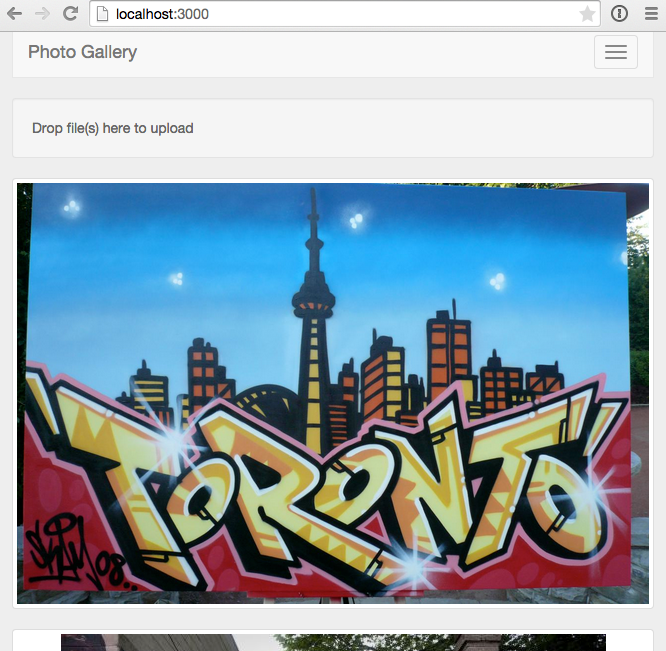

If you'd rather grab the source code directly rather than follow along, it's available on <a href="" target="_blank">GitHubFILL IN THE URL</a>, otherwise let's get started!

##Creating the app
We need to set-up a bit of plumbing as a starting point, so we'll grab a bare-bones skeleton of the application from GitHub.

###Clone the Repo
Note, if you aren't familiar with Git and / or don't have it installed you can download a zip of the code <a href="https://github.com/riebeekn/photo-blog/tree/part-0" target="_blank">here</a>.

#####Terminal

git clone -b part-0 https://github.com/riebeekn/photo-blog.git
cd photo-blog


###A quick over-view of where we're starting from
Open up the code in your text editor of choice and you'll see a pretty standard Meteor file structure.

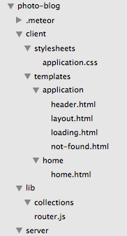

As far as packages go, we've added: 

* <a href="https://atmospherejs.com/iron/router" target="_blank">Iron Router</a> - to provide routing functionality.
* <a href="https://atmospherejs.com/twbs/bootstrap" target="_blank">Bootstrap</a> - for some simple styling (note see this <a href="http://www.manuel-schoebel.com/blog/meteorjs-and-twitter-bootstrap---the-right-way" target="_blank">article</a> for better way of adding Bootstrap in a production application).
* <a href="https://atmospherejs.com/sacha/spin" target="_blank">Spin</a> - To provide a waiting indicator.
* <a href="https://github.com/chrismbeckett/meteor-toastr" target="_blank">Toastr</a> - For growl style notifications.

<a href="https://atmospherejs.com/meteor/autopublish" target="_blank">Autopublish</a>  and <a href="https://atmospherejs.com/meteor/insecure" target="_blank">Insecure</a> have been removed.

###Start up the app

#####Terminal

meteor


You should now see the starting point for our application when you navigate your browser to <a href="http://localhost:3000" target="_blank">http://localhost:3000</a>.

Pretty impressive eh!  OK, not so much yet, but it'll get there.

##Uploading images

So a photo blog isn't going to be very useful unless we can upload some images, so let's tackle that first.  After we've got a few images uploaded we'll concentrate on how to display them.

###Updating the UI

First thing we'll do is update our UI to include a 'drop zone' where user's can drop files they want to upload.  We're going to use the <a href="https://github.com/CollectionFS" target="_blank">CollectionFS</a> package for our file upload functionality, and it happens to come with a complimentary <a href="https://github.com/CollectionFS/Meteor-ui-dropped-event" target="_blank">package</a> for drop zones.

So first, let's add the package.

#####Terminal

meteor add raix:ui-dropped-event


Now we'll update `home.html`, it's pretty darn minimal at this point.

#####/client/templates/home/home.html

<template name="home">
  {{> dropzone}}
</template>


We're going to throw our drop-zone markup in a separate template so all we're doing in `home.html` for now is rendering the drop zone template.

Let's get that created.

#####Terminal

touch client/templates/home/dropzone.html


#####/client/templates/home/dropzone.html

<template name="dropzone">
  

    

      

        

          Drop file(s) here to upload
        

      

    

  

</template>


So nothing complicated we're just adding the drop zone markup as specified in the <a href="https://github.com/CollectionFS/Meteor-ui-dropped-event/blob/master/README.md" target="_blank">package readme</a>.  We've got a couple of extra divs in the markup for our bootstrap styles.

With the above in place, we now see our drop zone in the UI.

If you drop an image on the drop zone, however your browser will just display the dropped image.  So let's hook into the dropped event.

#####Terminal

touch client/templates/home/dropzone.js


#####/client/templates/home/dropzone.js

Template.dropzone.events({
  'dropped #dropzone': function(e) {
    console.log('dropped a file');
  }
});


For now, all we are doing in our event handler is to log a message to the console.

If we drop a file we can confirm in the browser console that the drop zone is acting correctly.

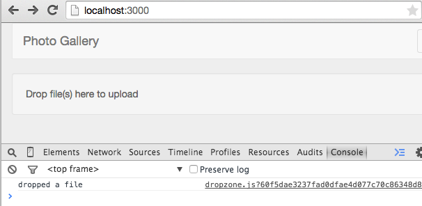

##Upload Ahoy!
OK, so we've got our UI all set up, but now comes the tricky part, actually getting it to do something.  As mentioned previously we'll be using the <a href="https://github.com/CollectionFS/Meteor-CollectionFS" target="_blank">CollectionFS</a> package to help with our file uploads.  There are a number of packages associated with CollectionFS, we've already added one for the drop-zone UI, now we'll add the packages that will handle the actual uploads.

#####Terminal

meteor add cfs:standard-packages cfs:gridfs cfs:s3 


So let's quickly go over what each of these packages gives us.

* <a href="https://atmospherejs.com/cfs/standard-packages" target="_blank">cfs:standard-packages</a> - this is a base wrapper package for CollectionFS and is required.  Anytime you use CollectionFS you'll be added the standard package.
* <a href="https://atmospherejs.com/cfs/gridfs" target="_blank">cfs:gridfs</a> - this package is used to store file data in chunks in the MongoDB.  In our case we won't actually be storing our images in our MongoDB, we'll be storing them on <a href="http://aws.amazon.com/s3/" target="_blank">Amazon S3</a>.  However CollectionFS uses either the GridFS or <a href="https://atmospherejs.com/cfs/filesystem" target="_blank">FileSystem</a> packages as a temporary store when uploading files to S3, so we need to include one of them.
* <a href="https://atmospherejs.com/cfs/s3" target="_blank">cfs:s3</a> - this is the package that handles the uploads to S3.

###Setting up S3

Before we get to the coding we need to set-up a bucket on S3 to contain our images.  Setting up a bucket is a little tedious but not too bad. 

list the steps here!!!!!!!!! 

####Sign-up

First off, if you don't already have an S3 account <a href="http://docs.aws.amazon.com/AmazonS3/latest/gsg/GetStartedWithS3.html" target="_blank">here</a> is a good guide for getting started.

Once you have an account set-up and are signed in, it's time to create our bucket.

First access S3.

####Creating a bucket

Next we'll create a new bucket.

Choose a name for the bucket and save.

With our bucket created the next step is to set-up a user account that we can use to access the bucket from our application.  This is done thru the Identity and Access Management settings.

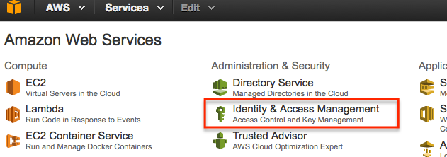

####Creating a policy

Now the first step is to create a 'policy' that will grant access just to the bucket we created.

So from IAM, select 'Policies' and then 'Create Policy'.

From the create policy select the 'Copy an AWS Managed Policy' option.

Enter 's3' in the search box and select 'AmazonS3FullAccess' policy.

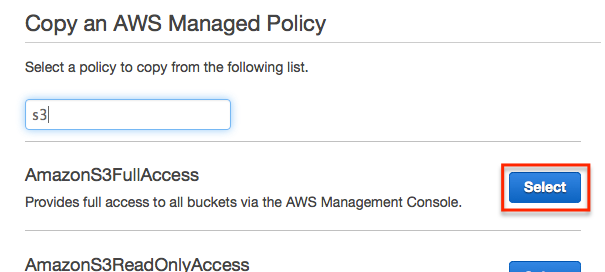

The default policy document is.


{
    "Version": "2012-10-17",
    "Statement": [
        {
            "Effect": "Allow",
            "Action": "s3:*",
            "Resource": "*"
        }
    ]
}


We'll want to update the name, description and policy.

Alter it to limit the policy to just the bucket you created, for instance with the bucket 'nicks-photo-blog', the policy would be.


{
    "Version": "2012-10-17",
    "Statement": [
        {
            "Effect": "Allow",
            "Action": "s3:*",
            "Resource": [
                "arn:aws:s3:::nicks-photo-blog",
                "arn:aws:s3:::nicks-photo-blog/*"
            ]
        }
    ]
}


The final policy should look something like.

Click the 'Validate Policy' button and ensure the policy you've entered in valid.  If so finish creating the policy by clicking the 'Create Policy' button.

####Creating a group

The next step is to create a group and then a user

From IAM, select 'Groups' and 'Create New Group'.

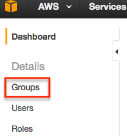

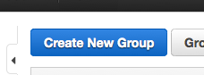

Choose a name for the group, preferably something that makes it obvious it is related to the bucket we created.

Click next, and then search for the policy created earlier.

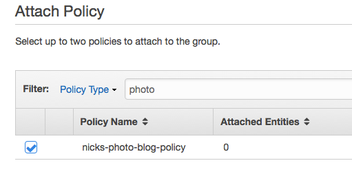

In the next screen just click 'Create Group'

####Creating a user

Next step is to create a user, so select 'Users' from IAM and then 'Create New Users'.

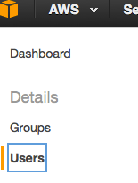

Enter a user name and click 'Create'.

Then download the user credentials.

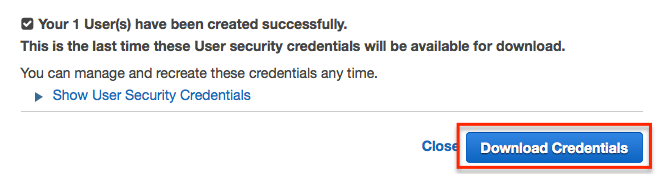

Click 'Close' after the credentials download and you'll be back at the User page.  The final step is to assign the user to the group we created... so select the created user and then select 'Add User to Groups'.

Then select the group we created and select 'Add to Groups'.

Phew, that was a bit of a bear, we're good to go now thou, so let's get our S3 credentials set-up with our application.

###Including our S3 keys in our application

We're going to need to provide our application with access to our S3 keys, and a good place to put them is in a `settings.json` file.  We want to make sure we don't check our S3 keys into source control however, so usually what I will do is create a `settings.json.template` file which contains dumby values that I then replace in the actual `settings.json` file.  I find having a `.template` file helps me out in remembering what settings I need to specify when I've been away from an application for awhile.  

Also we'll add a `.gitignore` file so that if we do add our application to source control `settings.json` won't be included.

#####Terminal

touch .gitignore
touch settings.json.template
cp settings.json.template settings.json


#####/.gitignore

settings.json


#####/settings.json.template

{
  "AWSAccessKeyId" : "<AWS KEY>",
  "AWSSecretAccessKey" : "<AWS SECRET>",
  "AWSBucket" : "<AWS BUCKET>"
}


OK, now we need to fill in our actual `settings.json` file, this is where the credentials.csv that we downloaded when creating our user in IAM comes into play.

#####/settings.json

{
  "AWSAccessKeyId" : "Put the access key id from credentials.csv here",
  "AWSSecretAccessKey" : "Put the secret access key from crendentials.csv here",
  "AWSBucket" : "Put the name of your bucket here"
}


So your `settings.json` file should look something like:

#####/settings.json

{
  "AWSAccessKeyId" : "ABCDEFGHIJKLMNOPQRST",
  "AWSSecretAccessKey" : "abCdefgHIJklmnopqrstuvwxyz1234567890abcd",
  "AWSBucket" : "nicks-photo-blog"
}


Now so that Meteor picks up our settings we need to stop the server and then restart it with the settings option.

#####Terminal

meteor --settings settings.json


###Adding the code to do the actual image upload
OK, so with all that out of the way we're now ready to get back to some coding.  The first thing we'll need is a <a href="http://docs.meteor.com/#/full/mongo_collection" target="_blank">Collection</a> to store our images.  So let's get that set-up.

#####Terminal

touch lib/collections/images.js


#####/lib/collections/images.js

if (Meteor.isServer) {
  var imageStore = new FS.Store.S3("images", {
    /* REQUIRED */
    accessKeyId: Meteor.settings.AWSAccessKeyId, 
    secretAccessKey: Meteor.settings.AWSSecretAccessKey, 
    bucket: Meteor.settings.AWSBucket
  });

  Images = new FS.Collection("Images", {
    stores: [imageStore],
    filter: {
      allow: {
        contentTypes: ['image/*']
      }
    }
  });
}

// On the client just create a generic FS Store as don't have
// access (or want access) to S3 settings on client
if (Meteor.isClient) {
  var imageStore = new FS.Store.S3("images");
  Images = new FS.Collection("Images", {
    stores: [imageStore],
    filter: {
      allow: {
        contentTypes: ['image/*']
      },
      onInvalid: function(message) {
        toastr.error(message);
      }
    }
  });
}

// Allow rules
Images.allow({
  insert: function() { return true; },
  update: function() { return true; }
});


So that is a bit of a code dump, let's take it from the top down.  First we have the `if (Meteor.isServer)...` block which defines the server version of our Collection.  Here we are setting up the 'store' for FSCollection to use.  This is what determines where images are actually stored when they get uploaded.  In our case we're setting up an S3 store, this is where we pass in our S3 credentials.  We then define our collection, which we are naming 'Images'.  In our collection definition we specify the store and a filter, which just limits uploads to image file types.

The `if (Meteor.isClient)...` block defines the client version of the Collection.  The main difference being that we don't set our S3 keys.  This is a key point, we don't want to make our keys available on the client, if we did someone could grab them using the browser console, i.e.

#####/settings.json

{
  "public": {
    "AWSAccessKeyId" : "not-really-my-key",
    "AWSSecretAccessKey" : "not-really-my-secret",
    "AWSBucket" : "not-really-my-bucket"
  }
}


Would make the S3 settings available in the client so we could have just a single collection definition for both the client and server but then someone could easily steal our S3 credentials:

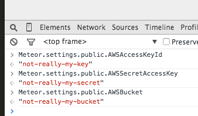

Other than not specifying the S3 keys the only difference with the client code is that we spit out a toast message if the file upload fails, for instance if the user tries to upload a file which isn't an image.

The final code block just specifies our current allow rules on the collection.  For now we allow any inserts so just return true.  The Update rule is also required when using the S3 store, I believe it has something to do with the way FSCollection streams the file to S3.

OK, so we've got our collection all set-up, now we just need to hook it up in our client code.  We'll alter our `dropzone.js` file so that it does something other than spit out a console message.

#####/client/templates/home/dropzone.js

Template.dropzone.events({
  'dropped #dropzone': function(e) {
      FS.Utility.eachFile(e, function(file) {
        var newFile = new FS.File(file);
        
        Images.insert(newFile, function (error, fileObj) {
          if (error) {
            toastr.error("Upload failed... please try again.");
          } else {
            toastr.success('Upload succeeded!');
          }
      });
    });
  }
});


Pretty simple, we're just creating a `FS.File` object for each file that gets placed in the drop-zone, we then insert it into our Images collection and FSCollection takes care of everything else.

After you've added the above code, dropping an image file on the drop-zone will result in a success message in the UI.

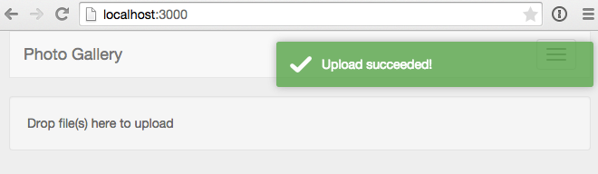

And the image will be in your S3 bucket.

If you attempt to upload an invalid file type, you can see our toast error message is acting as expected.

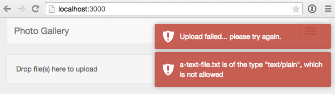

So that's all good, but we're probably not going to want to view our images via the S3 management console, so let's get onto displaying our images.

##Displaying images

###Setting up a publication and subscribing to it

So first thing we need to do is create a <a href="http://docs.meteor.com/#/full/meteor_publish" target="_blank">publication for our images that we can subscribe to</a>.  First let's set up the publication.

#####Terminal

touch server/publications.js


#####/server/publications.js

Meteor.publish('images', function(limit) {
  return Images.find({}, {
    limit: limit
  });
});


Nothing complicated going on here, we are simply returning our images.  Also we are going to specify a limit in our publication so that the user doesn't need to download all the images in one go.  We'll implement infinite scrolling on the client instead of loading everything in one shot.

OK now let's subscribe to our publication.  Instead of subscribing to our data in the `router`, we'll do so in our template... this will make implementing the infinite scrolling a snap.

#####Terminal

touch client/templates/home/home.js


We'll be making use of a <a href="http://docs.meteor.com/#/full/reactivevar" target="_blank">reactive var</a> in `home.js` so we'll need to add the package.

#####Terminal

meteor add reactive-var


#####/client/templates/home/home.js

Template.home.created = function() {
  var self = this;

  self.limit = new ReactiveVar;
  self.limit.set(parseInt(Meteor.settings.public.recordsPerPage));
  
  Deps.autorun(function() {
    Meteor.subscribe('images', self.limit.get());
  })
}

Template.home.rendered = function() {
  var self = this;
  // is triggered every time we scroll
  $(window).scroll(function() {
    if ($(window).scrollTop() + $(window).height() > $(document).height() - 100) {
      incrementLimit(self);
    }
  });
}

Template.home.helpers({
  'images': function() {
    return Images.find();
  }
});

var incrementLimit = function(templateInstance) {
  var newLimit = templateInstance.limit.get() + 
    parseInt(Meteor.settings.public.recordsPerPage);
  templateInstance.limit.set(newLimit);
}


So first off, we are setting up our subscription in the `created` event of the template.  The subscription is wrapped in `Deps.autorun` which will cause the subscription to be re-run anytime the `limit` reactive variable changes.  So basically we control the number of records that are displayed on the page by changing the `limit` reactive variable which we initially have set to a Meteor settings value (which we'll add in the next step).  Reactive variables act pretty much the same as Session variables but they are scoped to a local variable instead of a global instance and thus are a little cleaner and not as likely to cause conflicts or unintended overwrites... blah, word better.

The `Template.home.rendered` block is what updates our `limit` variable and causes more data to load when the user scrolls to the bottom of the page.  This is accomplished by the `incrementLimit` function which just adds to the current limit value.

Finally the `images` helper simply makes our image records available to `home.html`.

OK, so we need to update `settings.json` to include our `recordsPerPage` value.  Since we need access to this value on the client, we need to specify it as public... and while we're at it, although unnecessary we'll explicitly put our AWS values in a private block.  By default settings values are private (i.e. only available on the server) but I think it's a little cleaner to explicitly specify a private block when mixing private and public settings.

#####/settings.json.template and settings.json

{
  "public": {
    "recordsPerPage" : "5"
  },
  "private": {
    "AWSAccessKeyId" : "<AWS KEY>",
    "AWSSecretAccessKey" : "<AWS SECRET>",
    "AWSBucket" : "<AWS BUCKET>"
  }
}


Obviously in `settings.json` you'll be specifying your real AWS credentials as before.

The change to `settings.json` requires a corresponding change to our images collection.

#####/lib/collections/images.js

if (Meteor.isServer) {
  var imageStore = new FS.Store.S3("images", {
    /* REQUIRED */
    accessKeyId: Meteor.settings.private.AWSAccessKeyId, 
    secretAccessKey: Meteor.settings.private.AWSSecretAccessKey, 
    bucket: Meteor.settings.private.AWSBucket
  });

  Images = new FS.Collection("Images", {
  ...
  ...


So we've just updated the `Meteor.settings` values to include `private` in the path.

###Updating the UI

Now that the publication and subscription are set-up, we just need to hook up the UI, so first off let's alter our `home` template, we'll add a call into a separate template that will render the actual images.

#####/client/templates/home/home.html

<template name="home">
  {{> dropzone}}

  {{#each images}}
    {{> image}}
  {{/each}}
</template>


OK, nothing unusual there, now we'll create the `image` template.

#####Terminal

touch client/templates/home/image.html


#####/client/templates/home/image.html

<template name="image">
  

    

      
    

  

</template>


So a super simple template, we're just displaying the image within a link and applying a <a href="http://getbootstrap.com/components/#thumbnails" target="_blank">Bootstrap thumbnail</a> class to the image.

So now we should be all good!

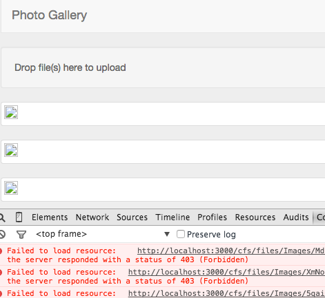

Hmm, maybe not, the browser console provides a good hint as to what is going on however.  Looks like a permissions issue.  A quick change to our allow rules will fix that up.

#####/lib/collections/images.js

// existing code...

// Allow rules
Images.allow({
  insert: function() { return true; },
  update: function() { return true; },
  download: function() { return true; }
});


And with that small change, we're up and running... and with more than 5 images uploaded we can see our infinite scrolling in action.

##Summary
So that's it for part 1, we've covered how to upload and display files from <a href="http://aws.amazon.com/s3/" target="_blank">S3</a>using the <a href="https://github.com/CollectionFS/Meteor-CollectionFS" target="_blank">CollectionFS</a> package.

In part 2 we'll add user's and associate and limit uploads to signed in users.  We'll also add the ability to remove images and tidy up the displaying of images some.

Hope you enjoyed part 1 and thanks for reading!
