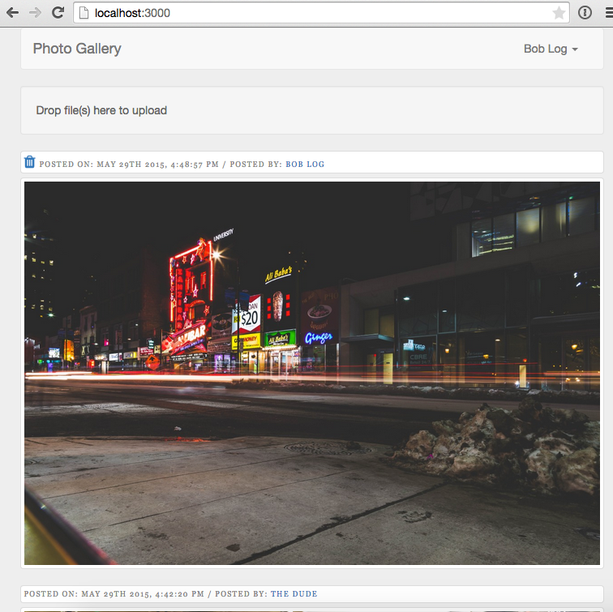
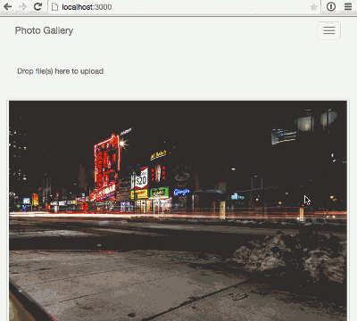
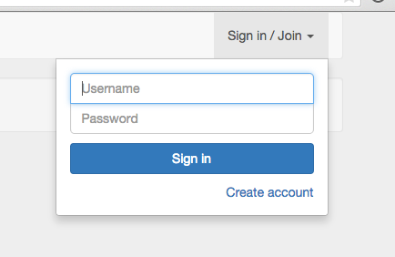
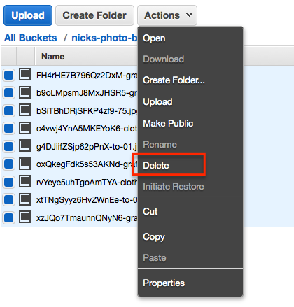
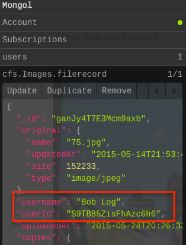
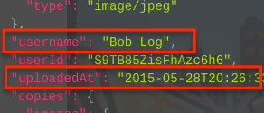
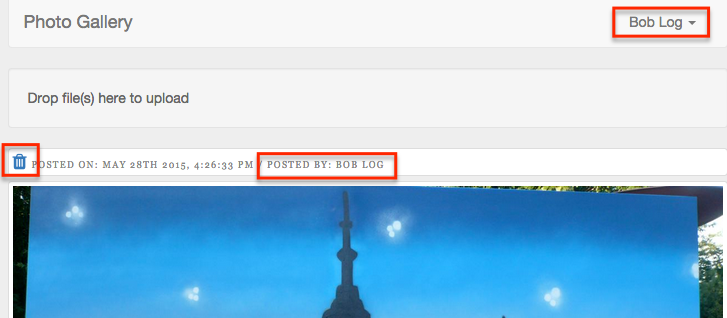
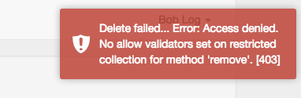
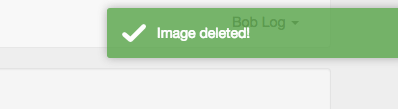

i = Images.find().fetch()[1]
i.update({$set:{'metadata.userId':"vT9qFHtEStHTMEazx"}});

This is the second of a two part post on handling images in Meteor.  In this post we'll expand on the application we created in <a href="/photo-blog-part-1/index.html" target="_blank">part 1</a>.

Some of the things we'll tackle in this post are:

* Adding user's so that we can associate and limit uploads to signed in users.
* Adding the ability for user's to remove images they've uploaded.
* Sorting the displayed images so that the most recently uploaded images are displayed first.
* Create user-specific URL's which will display only the images associated to a particular user.

If you'd rather grab the source code directly rather than follow along, it's available on <a href="https://github.com/riebeekn/photo-blog" target="_blank">GitHub</a>.

##What we'll build
We'll create a simplified version of a photo blog, similar to <a href="https://www.tumblr.com/" target="_blank">Tumblr</a>

##Creating the app
If you followed along with <a href="/photo-blog-part-1/index.html" target="_blank">part 1</a> you can continue on from the code we built out in that post.  If not and you want to jump right into part 2, you can clone part 1 from GitHub as a starting point.  The part 1 version of the application allows for file uploads and the basic display of uploads.  Note that if you are starting from this post, you'll need to update the `settings.json` file.

###Clone the Repo
Note, if you aren't familiar with Git and / or don't have it installed you can download a zip of the code <a href="https://github.com/riebeekn/photo-blog/tree/part-1" target="_blank">hereFIXURL</a>.

#####Terminal

git clone -b part-1 https://github.com/riebeekn/photo-blog.git
cd photo-blog


###Start up the app

#####Terminal

meteor --settings settings.json


You should now see the starting point for our application when you navigate your browser to <a href="http://localhost:3000" target="_blank">http://localhost:3000</a>.  If you've uploaded some images you'll see something similar to:

##Adding users
So the first enhancement we're going to be making is to add user's to our application.  

###Adding users to the application

OK, let's get users added to the application.  Meteor makes this super simple via the built-in <a href="http://docs.meteor.com/#/full/accounts_api" target="_blank">accounts</a> functionality.

We'll add the <a href="https://atmospherejs.com/meteor/accounts-password" target="_blank">accounts password</a> package, along with a <a href="https://atmospherejs.com/ian/accounts-ui-bootstrap-3" target="_blank">3rd party package</a> which provides a login UI control.

#####Terminal

meteor add accounts-password ian:accounts-ui-bootstrap-3


By default the accounts package requires an email and password for sign up / log in.  For our purposes however we'll use a user name instead of an email.

This can be easily configured.

#####Terminal

touch client/config.js


#####/client/config.js

Accounts.ui.config({
  passwordSignupFields: 'USERNAME_ONLY'
});


With the packages and configuration in place, all we need to do is update our UI to include the login controls.

#####/client/templates/application/header.html

... existing code

      
        
        <ul class="nav navbar-nav navbar-right">          
          {{> loginButtons}}  
        </ul>      
      
    
    
  
  </nav>
</template>


Bam!  User's... done.

It's kinda' crazy how easy it is to add user accounts to a Meteor application... thanks Meteor!

###Restricting uploads to logged in users

Next step is to restrict our upload functionality to user's that have an account and are logged in.

####Updating the UI

So we want to restrict our drop-zone to only appear for logged in users.  Once again Meteor makes this super simple, we can use the <a href="http://docs.meteor.com/#/full/template_currentuser" target="_blank">currentUser</a> object.

#####/client/templates/home/home.html

<template name="home">
    <!-- show drop zone if signed in -->
    {{#if currentUser}}
        {{> dropzone}}
    {{/if}}

    <!-- existing images -->
    {{#each images}}
        {{> image}}
    {{/each}}
</template>


Nice, that takes care of the UI.  In cases where there is no logged in user, `currentUser` will return false and the drop-zone won't render.  `currentUser` returns true when a user is logged in, so in that situation the drop-zone will appear.

####Updating the allow rules
We'll also want to alter the `allow` rules on the `images` collection so that we aren't relying exclusively on the UI to enforce our image upload restriction.

#####/lib/collections/images.js

... existing code

// Allow rules
Images.allow({
  insert: function(userId) { return userId != null; },
  update: function(userId) { return userId != null; },
  download: function() { return true; }
});


All we are doing here is adding the optional `userId` parameter to the insert and update callback functions in the allow rules.  The insert / update <a href="http://docs.meteor.com/#/full/allow" target="_blank">callbacks</a> can take the following parameters:

* insert(userId, doc)
* update(userId, doc, fieldNames, modifier)

We're making use of the `userId` parameter and checking that it's value is not null.  When the user attempting an upload is signed in to the application the value of `userId` will be the signed in user's id.  When the user attempting the upload is an anonymous user (i.e. not signed in) the `userId` will be null and we thus reject the upload.  

You can test that this works by commenting out the `{{#if currentUser}}` control statement in `home.html` and attempting to upload an image when not signed in.

Having a restriction in the allow rules ensures that we don't need to worry about unauthorized user's uploading images to our application even if they get around the disappearing drop-zone UI restriction we've put in place.

###Associating uploaded images to users

Now that we have user's, we'll want to associate images with the user who uploaded the image.

####Resetting any existing data
We'll be associating uploads to a specific user, so let's start from a clean slate and get rid of any images we've uploaded that aren't currently associated to a user.

First reset the Mongo database and restart the application.

#####Terminal

meteor reset
meteor --settings settings.json


Next clear out anything in our S3 bucket:

####Associating the uploads with a user
This is surprisingly simple, we'll just add two additional fields to the File we are inserting into the images collection.

#####/client/templates/home/dropzone.js

Template.dropzone.events({
  'dropped #dropzone': function(e) {
    var user = Meteor.user();

    FS.Utility.eachFile(e, function(file) {
      var newFile = new FS.File(file);
      newFile.username = user.username;
      newFile.userId = user._id;
      
      Images.insert(newFile, function (error, fileObj) {
        if (error) {
          toastr.error("Upload failed... please try again.");
        } else {
          toastr.success('Upload succeeded!');
        }
      });
    });
  }
});


So all we've done is grab the currently logged in user (via `Meteor.user()`) and then add the `username` and `_id` values of the user to the `File` object being inserted.  Simple as pie!

Let's have a quick look with <a href="https://atmospherejs.com/msavin/mongol" target="_blank">Mongol</a> to see what our Images look like now.

#####Terminal

meteor add msavin:mongol


After the package installs, click control-M from within the browser to bring up Mongol and click on the cfs.Images.filerecord item.

Voila, we've got a username and user id associated with our uploaded images.

####Updating the UI
Let's update the UI to make use of the new information we've stored about our images.  

It would make sense to display the date an image was uploaded at and who uploaded it.

Both of these fields are available in the `images` collection: 

So adding them to the UI will be easy, we can display the user name as is but we'll want to format the date so it is in a more read-able format.  Let's add a helper that will make use of the <a href="https://atmospherejs.com/momentjs/moment" target="_blank">Moment JS</a> package.

#####Terminal

meteor add momentjs:moment
touch client/templates/home/image.js


#####/client/templates/home/image.js

Template.image.helpers({
  postDate: function() {
    return moment(this.uploadedAt).format('MMMM Do YYYY, h:mm:ss a');
  }
});


Nothing complicated here, we're just using the <a href="http://momentjs.com/" target="_blank">moment.js</a> library to format our date.

Now let's update the `image.html` template file.

#####/client/templates/home/image.html

<template name="image">
  <!-- image info -->
  

    

      

        Posted on: {{postDate}} / 
        Posted by: {{userName}}
      
 
    

  

  <!-- the image -->
  

    

      
    

  

</template>


All we've done is added a new `div` which we are using to display some information about the uploaded images, simply hooking into the `username` value of the `images` collection and calling into our `postDate` helper that we just defined.

Finally, let's add a bit of styling to get things looking a little more presentable.

#####Terminal

touch client/stylesheets/image.css


#####/client/stylesheets/image.css

.image-info {
  color: #888;
  font-family: Rockwell,Georgia,Arial;
  font-size: 9px;
  letter-spacing: 0.15em;
  text-transform: uppercase;
  background-color: #fff;
  display: block;
  padding: 4px;
  margin-bottom: 5px;
  line-height: 1.42857143;
  border: 1px solid #ddd;
  border-radius: 4px;
  -webkit-transition: border .2s ease-in-out;
  -o-transition: border .2s ease-in-out;
  transition: border .2s ease-in-out;
}


And with that in place, we've got some header information displaying with our images.

##Deleting images
OK, the next step is we want to allow user's to delete images they've uploaded.  We'll start with updating the UI, then implement our delete functionality.

###Updating the UI
First off, let's add a <a href="http://fortawesome.github.io/Font-Awesome/" target="_blank">font awesome</a> icon <a href="https://atmospherejs.com/natestrauser/font-awesome" target="_blank">package</a> so that we can have a nice delete icon to display on our UI.

#####Terminal

meteor add natestrauser:font-awesome


Now let's update the `image.html` template.

#####/client/templates/home/image.html

<template name="image">
  <!-- image info -->
  

    

      

        {{#if ownImage}}
          <a class="delete-image">
            <i class="fa fa-trash fa-2x"></i>
          </a>
        {{/if}}
        ... existing code


All we've done here is to add a delete icon to any images that the current user is the owner of via the `{{#if ownImage}}` conditional.

We need to create a helper for `ownImage`, so let's do that next.

#####/client/templates/home/image.js

Template.image.helpers({
  postDate: function(date) {
    return moment(this.uploadedAt).format('MMMM Do YYYY, h:mm:ss a');
  },
  ownImage: function() {
    return this.userId === Meteor.userId();
  }
});


So pretty simple, we're just checking whether the current `userId` associated with the images matches the current logged in `userId`.  If so we display our delete icon, if not the icon will not show up.

We'll also apply a small bit of CSS to our delete link.

#####/client/stylesheets/image.css

// ...
// existing image-info style
// ...

.delete-image {
  cursor: pointer;
}

.delete-image:hover {
  text-decoration: none;
}


So we should now see our icon showing up when viewing an image uploaded by the currently logged in user.

###Implementing deletion
OK, so our UI is sorted, but if you click the delete icon you'll notice is doesn't do anything as of yet... so let's get that hooked up.

We'll handle the image deletion via an event handler in `image.js`.

#####/client/templates/home/image.js

... existing code

Template.image.events({
  'click .delete-image': function(e) {
    e.preventDefault();

    var sure = confirm('Are you sure you want to delete this image?');
    if (sure === true) {
      Images.remove({ _id:this._id }, function(error,result) {
        if (error) {
          toastr.error("Delete failed... " + error);
        } else {
          toastr.success('Image deleted!');
        }
      })
    }
  }
});


Again, pretty simple, we're over-riding the default behavior with `e.preventDefault()` and then throwing up a confirmation dialog.  If the user confirms they would like to delete the image, we remove it from our `images` collection.

If you give it a go, you'll see the following error however:

You can probably guess what needs to happen based on the error message.

#####/lib/collection/images.js

... existing code

// Allow rules
Images.allow({
  insert: function(userId) { return userId != null; },
  update: function(userId) { return userId != null; },
  remove: function(userId, file) { return userId === file.userId; },
  download: function() { return true; }
});


And with that, we can now delete images.

###Oh oh, spaghettios

#FIRST MAKE SURE CAN FIX HACK

* allow / deny hard
* methods often better
* link to DM meteor method
* go thru the hack
* fix the hack

##Sorting images

##Adding user specific URLs

##Summary
