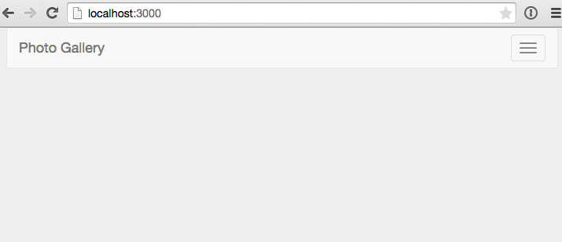

In this post we are going to look at how to handle file uploads in Meteor.

i = Images.find().fetch()[1]
i.update({$set:{'metadata.userId':"vT9qFHtEStHTMEazx"}});

##What we'll build

##Creating the app

###Clone the Repo
Note, if you aren't familiar with Git and / or don't have it installed you can download a zip of the code <a href="https://github.com/riebeekn/photo-blog/tree/part-1" target="_blank">here</a>.

#####Terminal

git clone -b part-1 https://github.com/riebeekn/photo-blog.git
cd photo-blog


###A quick over-view of where we're starting from
Open up the code in your text editor of choice and you'll see a pretty standard Meteor file structure.

As far as packages go, we've added: 

* <a href="https://atmospherejs.com/iron/router" target="_blank">Iron Router</a> - to provide routing functionality.
* <a href="https://atmospherejs.com/twbs/bootstrap" target="_blank">Bootstrap</a> - for some simple styling (note see this <a href="http://www.manuel-schoebel.com/blog/meteorjs-and-twitter-bootstrap---the-right-way" target="_blank">article</a> for better way of adding Bootstrap in a production application).
* <a href="https://atmospherejs.com/sacha/spin" target="_blank">Spin</a> - To provide a waiting indicator.
* <a href="https://github.com/chrismbeckett/meteor-toastr" target="_blank">Toastr</a> - For growl style notifications.

<a href="https://atmospherejs.com/meteor/autopublish" target="_blank">Autopublish</a>  and <a href="https://atmospherejs.com/meteor/insecure" target="_blank">Insecure</a> have been removed.

###Start up the app

- note need to update the settings file

#####Terminal

meteor --settings settings.json


You should now see the starting point for our application when you navigate your browser to <a href="http://localhost:3000" target="_blank">http://localhost:3000</a>.

Pretty impressive eh!  OK, not so much yet, but it'll get there.

##Uploading images

###Updating the UI

##Upload Ahoy!

###Setting up S3

####Sign-up

####Creating a bucket

###Including our S3 keys in our application

###Adding the code to do the actual image upload

##Displaying images

###Setting up a publication and subscribing to it

###Updating the UI

##Summary
