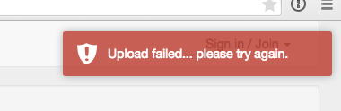
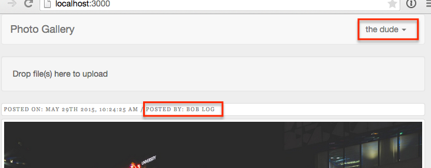

This is the second of a two part post on handling images in Meteor.  In this post we'll expand on the application we created in <a href="/photo-blog-part-1/index.html" target="_blank">part 1</a>.

Some of the things we'll tackle in this post:

* We'll be adding the concept of user accounts to the application in order to associate and limit uploads to signed in users.
* We'll allow user's to remove images they've uploaded.
* We'll sort the displayed images so the most recently uploaded images are displayed first.
* We'll create user-specific URL's which will display only the images associated with a particular user.

If you'd rather grab the source code directly rather than follow along, it's available on <a href="https://github.com/riebeekn/photo-blog" target="_blank">GitHub</a>.

##What we'll build
In <a href="/photo-blog-part-1/index.html" target="_blank">part 1</a> we created a simplified version of a photo blog, similar to <a href="https://www.tumblr.com/" target="_blank">Tumblr</a>.  By the end of this post our application will have a few more features and look similar to:

##Creating the app
If you followed along with <a href="/photo-blog-part-1/index.html" target="_blank">part 1</a> just continue on with the code you created as part of that post.  If not and you want to jump right into part 2, you can clone part 1 from GitHub as a starting point.  

Note that if you decide to skip part 1, you'll need to create a `settings.json` file.  A template of the file is included in the GitHub code under `settings.json.template`.

###Clone the Repo
If grabbing the code from GitHub instead of continuing along from part 1, the first step is to clone the repo.  Note, if you aren't familiar with Git and / or don't have it installed you can download a zip of the code <a href="https://github.com/riebeekn/photo-blog/archive/part-1.zip" target="_blank">here</a>.

#####Terminal

git clone -b part-1 https://github.com/riebeekn/photo-blog.git
cd photo-blog


###Start up the app
OK, you've either gotten the code from GitHub or are using the existing code you created in Part 1, let's see where we're starting from.

#####Terminal

meteor --settings settings.json


You should now see the starting point for our application when you navigate your browser to <a href="http://localhost:3000" target="_blank">http://localhost:3000</a>.  If you've uploaded some images you'll see something similar to:

##Adding users
The first enhancement we're going to make is to add user's to our application.  This will allow us to restrict image uploads to signed in user's and also allow us to associate user's with the images they upload.

###Adding users to the application

OK, let's get started.  Meteor makes this super simple via the built-in <a href="http://docs.meteor.com/#/full/accounts_api" target="_blank">accounts</a> functionality.

We'll add the <a href="https://atmospherejs.com/meteor/accounts-password" target="_blank">accounts password</a> package, along with a <a href="https://atmospherejs.com/ian/accounts-ui-bootstrap-3" target="_blank">3rd party package</a> which provides a login UI control.

#####Terminal

meteor add accounts-password ian:accounts-ui-bootstrap-3


By default the accounts package requires an email and password for sign up / log in.  For our purposes however we'll go with a user name instead of an email.

Configuring this is easy.

#####Terminal

touch client/config.js


#####/client/config.js

Accounts.ui.config({
  passwordSignupFields: 'USERNAME_ONLY'
});


With the packages and configuration in place, all we need to do is update our UI to include the login controls.

#####/client/templates/application/header.html

... existing code

      
        
        <ul class="nav navbar-nav navbar-right">          
          {{> loginButtons}}  
        </ul>      
      
    
    
  
  </nav>
</template>


So we're just rendering the login template by adding `{{> loginButtons}}`.

Bam!  User's... done.

It's kinda' crazy how easy it is to add user accounts to a Meteor application... thanks Meteor!

###Restricting uploads to logged in users

Next step is to restrict our upload functionality to user's that have an account and are logged in.

####Updating the UI

So we want to restrict our image upload drop-zone to only appear for logged in users.  Once again Meteor makes this super simple, via the <a href="http://docs.meteor.com/#/full/template_currentuser" target="_blank">currentUser</a> object.

#####/client/templates/home/home.html

<template name="home">
  <!-- show drop zone if signed in -->
  {{#if currentUser}}
    {{> dropzone}}
  {{/if}}

  <!-- existing images -->
  {{#each images}}
    {{> image}}
  {{/each}}
</template>


Nice, that takes care of the UI.  In cases where there is no logged in user, `currentUser` will return false and the drop-zone won't render.  Conversely `currentUser` returns true when a user is logged in, so the drop-zone will show up.

####Updating the allow rules
We'll also want to alter the `allow` rules on the `images` collection so that we aren't relying exclusively on the UI to enforce our image upload restriction.

#####/lib/collections/images.js

... existing code

// Allow rules
Images.allow({
  insert: function(userId) { return userId != null; },
  update: function(userId) { return userId != null; },
  download: function() { return true; }
});


First thing we've done is to add the optional `userId` parameter to the insert and update callbacks.  The insert / update <a href="http://docs.meteor.com/#/full/allow" target="_blank">callbacks</a> can take the following parameters:

* `insert(userId, doc)`
* `update(userId, doc, fieldNames, modifier)`

We're making use of the `userId` parameter and checking that it's value is not null.  When the user attempting an upload is signed in to the application, the value of `userId` will be that user's id.  However in the case of an anonymous user (i.e. someone who has not signed in) the `userId` will be null and we reject the upload.  

You can test that this works by commenting out the `{{#if currentUser}}` control statement in `home.html` so that the drop-zone always appears; then attempt to upload an image when not signed in.

Having a restriction in the allow rules ensures that we don't need to worry about unauthorized user's uploading images even if they get around the disappearing drop-zone UI.  In general you never want to rely on the UI to enforce an access / security rule.

###Associating uploaded images to users

Now that we have user's, we're going to associate images to our user's.

####Resetting any existing data
Any existing images in our application don't have any user data associated with them, so let's clear out our images and start from a clean slate.

First reset the Mongo database and restart the application.

#####Terminal

meteor reset
meteor --settings settings.json


Next you might want to clear out anything in the S3 bucket via the AWS S3 console:

OK, onto the code.

#####/client/templates/home/dropzone.js

Template.dropzone.events({
  'dropped #dropzone': function(e) {
    var user = Meteor.user();

    FS.Utility.eachFile(e, function(file) {
      var newFile = new FS.File(file);
      newFile.username = user.username;
      newFile.userId = user._id;
      
      Images.insert(newFile, function (error, fileObj) {
        if (error) {
          toastr.error("Upload failed... please try again.");
        } else {
          toastr.success('Upload succeeded!');
        }
      });
    });
  }
});


So all we've done is grab the currently logged in user (via `var user = Meteor.user()`) and then add the `username` and `_id` values of the user to the `File` object being inserted (i.e. `newFile.username = user.username` and `newFile.userId = user._id`).  Simple as pie!

Sign in to the application, upload a few images and then let's have a quick look with <a href="https://atmospherejs.com/msavin/mongol" target="_blank">Mongol</a> to see what our `Images` look like in the database now.

#####Terminal

meteor add msavin:mongol


After the package installs, click control-M from within the browser to bring up Mongol and click on the cfs.Images.filerecord item.

And there we go, we've got a username and user id associated with our uploaded images.

####Updating the UI
Let's update the UI to make use of the new information we've stored about the images.  

It would make sense to display the date an image was uploaded and who uploaded it.

Both of these fields are available in the `images` collection: 

So adding them to the UI will be easy, we can display the user name as is but we'll want to format the date so it is in a more read-able format.  Let's add a helper that will make use of the <a href="https://atmospherejs.com/momentjs/moment" target="_blank">Moment JS</a> package.

#####Terminal

meteor add momentjs:moment
touch client/templates/home/image.js


#####/client/templates/home/image.js

Template.image.helpers({
  postDate: function() {
    return moment(this.uploadedAt).format('MMMM Do YYYY, h:mm:ss a');
  }
});


Nothing complicated here, we're just using the <a href="http://momentjs.com/" target="_blank">moment.js</a> library to format our date.

Now let's update the `image.html` template file.

#####/client/templates/home/image.html

<template name="image">
  <!-- image info -->
  

    

      

        Posted on: {{postDate}} / 
        Posted by: {{username}}
      
 
    

  

  <!-- the image -->
  

    

      
    

  

</template>


We've added a new `div` in which we are displaying the `username` value of the `images` collection and the value returned from the `postDate` helper we just defined.

Finally, let's add a bit of styling to get things looking a little more presentable.

#####Terminal

touch client/stylesheets/image.css


#####/client/stylesheets/image.css

.image-info {
  color: #888;
  font-family: Rockwell,Georgia,Arial;
  font-size: 9px;
  letter-spacing: 0.15em;
  text-transform: uppercase;
  background-color: #fff;
  display: block;
  padding: 4px;
  margin-bottom: 5px;
  line-height: 1.42857143;
  border: 1px solid #ddd;
  border-radius: 4px;
  -webkit-transition: border .2s ease-in-out;
  -o-transition: border .2s ease-in-out;
  transition: border .2s ease-in-out;
}


And with that in place, we've got some header information displaying with our images.

##Deleting images
OK, next we want to allow user's to delete images they've uploaded.  We'll start with updating the UI, then we'll implement the delete functionality.

###Updating the UI
First off, let's add the <a href="http://fortawesome.github.io/Font-Awesome/" target="_blank">font awesome</a> icon <a href="https://atmospherejs.com/natestrauser/font-awesome" target="_blank">package</a> so that we can have a nice delete icon to display on our UI.

#####Terminal

meteor add natestrauser:font-awesome


Now let's update the `image.html` template.

#####/client/templates/home/image.html

<template name="image">
  <!-- image info -->
  

    

      

        {{#if ownImage}}
          <a class="delete-image">
            <i class="fa fa-trash fa-2x"></i>
          </a>
        {{/if}}
        Posted on: {{postDate}} / 
        ... existing code


All we've done here is to add a delete icon to any images that the current user is the owner of via the `{{#if ownImage}}` conditional.

We need to create a helper for `ownImage`, so let's do that next.

#####/client/templates/home/image.js

Template.image.helpers({
  postDate: function(date) {
    return moment(this.uploadedAt).format('MMMM Do YYYY, h:mm:ss a');
  },
  ownImage: function() {
    return this.userId === Meteor.userId();
  }
});


So pretty simple, we're checking whether the current `userId` associated with the displayed image matches up with the current logged in `userId`.  If so we display the delete icon, if not the icon will not show up.

We'll also apply a small bit of CSS to our delete link.

#####/client/stylesheets/image.css

// ...
// existing image-info style
// ...

.delete-image {
  cursor: pointer;
}

.delete-image:hover {
  text-decoration: none;
}


So a delete icon now appears when viewing an image uploaded by the currently logged in user.

###Implementing deletion
OK, so our UI is sorted, but if you click the delete icon you'll notice is doesn't do anything... so let's get that hooked up.

We'll handle the image deletion via an event handler in `image.js`.

#####/client/templates/home/image.js

... existing code

Template.image.events({
  'click .delete-image': function(e) {
    e.preventDefault();

    var sure = confirm('Are you sure you want to delete this image?');
    if (sure === true) {
      Images.remove({ _id:this._id }, function(error,result) {
        if (error) {
          toastr.error("Delete failed... " + error);
        } else {
          toastr.success('Image deleted!');
        }
      })
    }
  }
});


Again, pretty simple, we're over-riding the default behavior with `e.preventDefault()` and then throwing up a confirmation dialog.  If the user confirms they would like to delete the image, we remove it from our `images` collection.

If you give it a go, you'll see the following error however:

You can probably guess what needs to happen based on the text of the error message.

#####/lib/collection/images.js

... existing code

// Allow rules
Images.allow({
  insert: function(userId) { return userId != null; },
  update: function(userId) { return userId != null; },
  remove: function(userId, image) { return userId === image.userId; },
  download: function() { return true; }
});


Just a small addition to our allow rules.  Notice we're re-checking that the `userIds` match up, we don't want to allow anyone to delete an image, just the user who owns (i.e. uploaded) it.

And with that, we can now delete images.

###Oh oh, spaghettios

Some of you astute reader's may have noticed we have a pretty stupendous security error in our application.  Let's have a look.

So what's going on here is that `Bob Log` has uploaded an image but we are currently logged in as a different user `the dude`.

Now `the dude` is a bit of a shady character and wants to mess with Bob, let's see what he can get up to.

OK, so first `the dude` figures out what his own `userId` is.  He can easily do this thru the browser console.

Next he stores an instance of the image Bob uploaded into a variable.

Being the sneaky guy he is, he now changes the `userId` associated with the image to his own `userId`!

We can see that he now has the delete icon showing up on Bob's image.

Even worse he can successfully delete the image.

So how do we fix this?  We just need to tighten up our allow rules a bit.

#####/lib/collections/images.js

... existing code

// Allow rules
Images.allow({
  insert: function(userId) { return userId != null; },
  update: function(userId, image) { return userId === image.userId; },
  remove: function(userId, image) { return userId === image.userId; },
  download: function() { return true; }
});


Now when 'the dude' attempts to assign his own `userId` to images uploaded by `Bob Log`, he won't be able to.

What the above illustrates is that allow / deny rules can be really tricky; making a small over-sight can have a significant impact on your application.

For this reason, many people <a href="https://www.discovermeteor.com/blog/meteor-methods-client-side-operations/" target="_blank">argue</a> that using Meteor methods are a better approach to take when possible.

The counter-argument is that allow / deny rules provide a common place to define your security settings on a particular collection.

I tend to favor methods over allow / deny rules but in the case of our FSCollection allow / deny rules are what works with the package so we just need to be extra careful that we set them up correctly.

##Sorting images
One thing we want to change is the order in which images display.  Currently we are not specifying an order but we'd like to show the most recently uploaded images first.

So we'll need to add a sort order to both our publication and our images helper.

Let's start with the publication.

#####/server/publications.js

Meteor.publish('images', function(limit) {
  check(limit, Number);

  return Images.find({}, {
    limit: limit,
    sort: {uploadedAt:-1}
  });
});


A very simple change, we've just added a `sort` condition to the `find` query.

If you view the application after this change, you might see that the images are still not sorted by the most recent upload date.  This is because the publication does not guarantee a sort order on the client.  The sort statement in the publication just ensures the correct documents get passed to the client, the client itself needs to handle displaying them in the correct order.  So let's get that in place.

#####/client/templates/home/home.js

... existing code

Template.home.helpers({
  'images': function() {
    return Images.find({}, {sort:{uploadedAt:-1}});
  }
});

... existing code


Simple, all we've done is to add the `sort` condition to the `images` helper and we now have sorted images on the client... sweet!

##Adding user specific URLs
OK we're hitting the home stretch now, the final thing we want to add to our application is user specific URLs.  These will display only the images uploaded by a particular user.

First let's update our UI, we've got a small change to make to the `image` template.

#####/client/templates/home/image.html

... existing code

        Posted on: {{postDate}} / 
        Posted by: 
        <a class="user-link" href="{{pathFor route='userPage' username=this.username}}">
          {{username}}
        </a>
      
 

... existing code


The only change here, is that we've enclosed the 'Posted by' `{{username}}`  field in a link.  

We now need a new route to handle the link.

#####/lib/router.js

... existing code

Router.route('/:username', {
  name: 'userPage', 
  template: 'home'
});

Router.onBeforeAction('loading');


So this is a simple route that appends a user name to the root URL.

In order to take advantage of this new route, we'll have to change both the  subscription and the publication.

Let's start by changing the subscription.

#####/client/templates/home/home.js

Template.home.created = function() {
  var self = this;

  self.limit = new ReactiveVar;
  self.limit.set(parseInt(Meteor.settings.public.recordsPerPage));
  
  Deps.autorun(function() {
    Meteor.subscribe('images', self.limit.get(), Router.current().params.username);
  });
}
...
...


The only thing we've changed is the `Meteor.subscribe` call, where we're now passing in the user name contained in the URL.

Next we need to update our publication.

#####/server/publications.js

Meteor.publish('images', function(limit, username) {
  check(limit, Number);

  var findQuery = {};
  if (username) {
    check(username, String);
    findQuery = { username : username };
  }

  return Images.find(findQuery, {
    limit: limit,
    sort: { uploadedAt: -1 }
  });
});


Here we're checking if a `username` has been passed into the publication, and if so we filter by the `username` value in the `find` clause.

With this in place we can now navigate to user specific pages.  You can test this out by clicking on a user name of an image... you'll now only see images uploaded by that user.  Clicking on the main 'Photo Gallery' link will bring back all images.

###Friendly URLs
One thing that isn't great with our user URLs is they aren't <a href="http://en.wikipedia.org/wiki/Semantic_URL#Slug" target="_blank">slugified</a>.  This means we have ugly encoded URL's such as `http://localhost:3000/Bob%20Log`.  That `%20` is not ideal so let's slug up our URL's.

We're going to be using a new field in our collection that we will call `slug` to handle the slugged routes.  So let's update the `userPage` route in `router.js` to use a similarly named parameter.

#####/lib/router.js

... existing code

Router.route('/:userSlug', {
  name: 'userPage', 
  template: 'home'
});

Router.onBeforeAction('loading');


So instead of `/:username` we're calling our route parameter `/:userSlug`.  It doesn't really matter what we call our route parameter but it can get confusing if route parameter names aren't easily associated with the database fields they refer to.

Changing the route parameter name means we'll have to change our subscription and publication to reflect the name change.

#####/client/templates/home/home.js

Template.home.created = function() {
  var self = this;

  self.limit = new ReactiveVar;
  self.limit.set(parseInt(Meteor.settings.public.recordsPerPage));
  
  Deps.autorun(function() {
    Meteor.subscribe('images', self.limit.get(), Router.current().params.userSlug);
  })
}
...
...


We've changed our subscription to grab our renamed router parameter (i.e. `userSlug` instead of `username`).

Now for the publication.

#####/server/publications.js

Meteor.publish('images', function(limit, userSlug) {
  check(limit, Number);

  var findQuery = {};
  if (userSlug) {
    check(userSlug, String);
    findQuery = { userSlug : userSlug };
  }
  ...
  ...


Again all we're doing is renaming the parameter.  A key change to make note of is that we are filtering on a different field in our `findQuery`, instead of the `username` column we are filtering on the `userSlug` field.

This field isn't currently part of our `images` collection so let's change that.

#####/client/templates/home/dropzone.js

Template.dropzone.events({
  'dropped #dropzone': function(e) {
    var user = Meteor.user();

    FS.Utility.eachFile(e, function(file) {
      var newFile = new FS.File(file);
      newFile.username = user.username;
      newFile.userId = user._id;
      newFile.userSlug = Slug.slugify(user.username);
      ...
      ...


We're adding the new `userSlug` field to our `images` collection via the `newFile.userSlug = ...` line.

To create the actual slug value we're calling into a helper method which we need to create.

#####Terminal

mkdir client/helpers
touch client/helpers/slug.js


#####/client/helpers/slug.js

Slug = {};

// taken from http://themeteorchef.com/recipes/slugged-routes/
Slug.slugify = function(value) {
  // Take our passed value and format it using a series of regular expressions.
  // The solution for this was derrived from a bit of experimentation and some
  // information found here: http://bit.ly/1LtXYCn.
  var formatted = value
                  // Take our passed value and convert it to lower case.
                  .toLowerCase()
                  // Replace all of the spaces in our value with hyphens (-).
                  .replace(/ /g,'-')
                  // Replace any hyphens (-) that come *after* another hyphen
                  // like --. This helps us prevent slugs like this--url-is-great.
                  .replace(/[-]+/g, '-')
                  // Replace any non-alphanumeric characters, but skip non-english
                  // characters like ü or é and hyphens (we've already done this).
                  // We also use /g to do this globally across the entire string
                  // as opposed to just on the first occurrence.
                  .replace(/[^\w\x80-\xFF-]+/g,'');

  return formatted;
}


This helper method is just a series of regular expressions which clean up our URL's.  This code is taken directly from <a href="http://themeteorchef.com/recipes/slugged-routes/" target="_blank">this post</a> by the <a href="http://themeteorchef.com/" target="_blank">The Meteor Chef</a>.  If you haven't checked out his tutorials I would highly recommend you do so, he's got some absolutely fantastic articles he's put together.

OK, now the final step is to update the `image.html` template.

#####/client/templates/home/image.html

...

        Posted on: {{postDate}} / 
        Posted by: 
        <a class="user-link" href="{{pathFor route='userPage' userSlug=this.userSlug}}">
          {{username}}
        </a>
        ...
        ...


We've updated our user link to link on `this.userSlug` instead of the user name.

Now any new images you upload will have slugs attached, old uploads won't work as they won't have the `userSlug` attribute, so you may want to reset your Meteor DB (i.e. via `meteor reset`).

With the slugs, we now get much nicer URL's with no nasty encodings.

##Summary
OK, that's it, we now have a functional, albeit simple photo blog.

Thanks for reading and hope you found something useful in this two part series on uploading images to S3 via Meteor.

