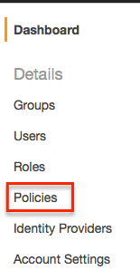

In this post we are going to look at how to handle file uploads to Amazon S3 in Meteor.

##What we'll build
To demonstrate file uploads we're going to build a simple photo blog similar to <a href="https://www.tumblr.com/" target="_blank">Tumblr</a>.  At the end of Part 1 we'll be able to upload and display images:

If you'd rather grab the source code directly rather than follow along, it's available on <a href="https://github.com/riebeekn/photo-blog/tree/part-1" target="_blank">GitHub</a>, otherwise let's get started!

##Creating the app
We need to set-up a bit of plumbing as a starting point, so let's grab a bare-bones skeleton of the application from GitHub.

###Clone the Repo
Note, if you aren't familiar with Git and / or don't have it installed you can download a zip of the code <a href="https://github.com/riebeekn/photo-blog/archive/part-0.zip" target="_blank">here</a>.  Otherwise we can clone the repo via the terminal.

#####Terminal

git clone -b part-0 https://github.com/riebeekn/photo-blog.git


###A quick over-view of where we're starting from
Open the code in your text editor of choice and you'll see a pretty standard Meteor file structure.

As far as packages go, we've added: 

* <a href="https://atmospherejs.com/iron/router" target="_blank">Iron Router</a> - to provide routing functionality.
* <a href="https://atmospherejs.com/twbs/bootstrap" target="_blank">Bootstrap</a> - for some simple styling (note see this <a href="http://www.manuel-schoebel.com/blog/meteorjs-and-twitter-bootstrap---the-right-way" target="_blank">article</a> for better way of adding Bootstrap in a production application).
* <a href="https://atmospherejs.com/sacha/spin" target="_blank">Spin</a> - To provide a waiting indicator.
* <a href="https://github.com/chrismbeckett/meteor-toastr" target="_blank">Toastr</a> - For growl style notifications.

<a href="https://atmospherejs.com/meteor/autopublish" target="_blank">Autopublish</a>  and <a href="https://atmospherejs.com/meteor/insecure" target="_blank">Insecure</a> have been removed.

###Start up the app

#####Terminal

cd photo-blog
meteor


You should now see the starting point for our application when you navigate your browser to <a href="http://localhost:3000" target="_blank">http://localhost:3000</a>.

Pretty impressive eh!  OK, not so much yet, but it'll get there.

##Uploading images

A photo blog isn't going to be very useful unless we can upload some images, so let's tackle that first.  After we've got a few images uploaded we'll figure out how to display them.

###Updating the UI

First thing we'll do is update our UI to include a 'drop zone' where user's can drop files they want to upload.  We're going to use the <a href="https://github.com/CollectionFS" target="_blank">CollectionFS</a> package for our file upload functionality, and it happens to come with an associated <a href="https://github.com/CollectionFS/Meteor-ui-dropped-event" target="_blank">package</a> for drop zones.

So let's add the package.

#####Terminal

meteor add raix:ui-dropped-event


Now we'll update `home.html`, it's pretty darn minimal at this point.

#####/client/templates/home/home.html

<template name="home">
  {{> dropzone}}
</template>


We're going to throw our drop-zone markup in a separate template so all we're doing in `home.html` is rendering the drop zone template.

Let's create the drop-zone template.

#####Terminal

touch client/templates/home/dropzone.html


#####/client/templates/home/dropzone.html

<template name="dropzone">
  

    

      

        

          Drop file(s) here to upload
        

      

    

  

</template>


So nothing complicated, we're just adding the drop zone markup as specified in the <a href="https://github.com/CollectionFS/Meteor-ui-dropped-event/blob/master/README.md" target="_blank">package readme</a>.  We've got a couple of extra divs in the markup for our <a href="http://getbootstrap.com/" target="_blank">bootstrap</a> styles.

With the above in place, we now see our drop zone in the UI.

If you drop an image on the drop zone, however, your browser will just explicitly display the dropped image.  

So let's hook into the `dropped` event so that we can over-ride the default behavior of the browser.

#####Terminal

touch client/templates/home/dropzone.js


#####/client/templates/home/dropzone.js

Template.dropzone.events({
  'dropped #dropzone': function(e) {
    console.log('dropped a file');
  }
});


For now, all we're doing in our event handler is to log to the console.

After the above change, if we place a file in the drop zone, we can confirm via the browser console that the drop zone is acting as expected.

##Upload Ahoy!
OK, so we've got our UI all set up, but now comes the tricky part, actually performing an upload.  As mentioned previously we'll be using the <a href="https://github.com/CollectionFS/Meteor-CollectionFS" target="_blank">CollectionFS</a> package to help with our file uploads.  There are a number of packages associated with CollectionFS that we'll need to add.  We've already added a package for the drop-zone UI, now we'll add the packages that will handle the uploads.

#####Terminal

meteor add cfs:standard-packages cfs:gridfs cfs:s3 


Let's quickly go over what each of these packages gives us.

* <a href="https://atmospherejs.com/cfs/standard-packages" target="_blank">cfs:standard-packages</a> - this is a base wrapper package for CollectionFS and is required.  Anytime you use CollectionFS you'll be adding the standard packages package.
* <a href="https://atmospherejs.com/cfs/gridfs" target="_blank">cfs:gridfs</a> - this package is used to store file data in chunks in MongoDB.  In our case we won't actually be storing our images in our Mongo database, we'll be storing them on <a href="http://aws.amazon.com/s3/" target="_blank">Amazon S3</a>.  However CollectionFS uses either the <a href="https://atmospherejs.com/cfs/gridfs" target="_blank">GridFS</a>  or <a href="https://atmospherejs.com/cfs/filesystem" target="_blank">FileSystem</a> packages as a temporary store when uploading files to S3, so we need to include one of them and we've chosen GridFS.
* <a href="https://atmospherejs.com/cfs/s3" target="_blank">cfs:s3</a> - this is the package that handles the uploads to S3.

###Setting up S3

Sigh... OK, prepare yourself, here comes the not so fun part.  Before we get to the actual coding we need to set-up S3 to store our uploaded images.  This section is a little tedious but hopefully it won't be too painful.

The steps in setting up S3 are:

* Signing up for S3 (if you aren't already signed up).
* Creating a bucket to store our images (buckets essentially act like folders on S3).
* Creating a policy for our bucket.  The policy is what determines the access permissions to a bucket.
* Creating a group.  We'll create a group and assign the policy from the previous step to the group.
* Creating a user.  We'll create a user and assign the group from the previous step to the user.

The user we create in the last step is what we are ultimately after.  We'll be able to use the user's credentials in our application to access the S3 bucket we created.  Since we assign the user to the group we created, which in turn is assigned to the policy that grants access to our bucket, our user has access to our bucket.  Phew, if you're feeling a little confused, don't worry, me too, but everything should become clear as mud as we run thru each step.

####Sign-up

First off, if you don't already have an S3 account, you'll need to sign-up for one.  Go to <a href="http://aws.amazon.com/" target="_blank">http://aws.amazon.com/</a> and click the 'Create a Free Account' button.  Follow the on screen instructions to complete the sign-up process.

Once you have an account set-up, sign-in to the AWS console.

####Creating a bucket

OK now that we have an account and are signed in to the AWS console it is time to create our bucket.  The first step is to access S3 from the AWS console.

Next we'll create a new bucket.

Choose a name for the bucket and click the 'Create' button to create it.

####Creating a policy

With our bucket created the next step is to set-up a policy for the bucket.  This is done thru the Identity and Access Management (IAM for short) settings.

So go back to the main AWS console page and then click IAM settings.

The policy we will create will grant access just to the bucket we created.

From IAM, select 'Policies' and then 'Create Policy'.

From the create policy page, select the 'Copy an AWS Managed Policy' option.

Enter 's3' in the search box and select 'AmazonS3FullAccess' policy.

We'll want to update the name, description and document of the policy.

So first off, enter a name and description for the policy.  Using a descriptive name is always a good idea so that you are able to recognize what the policy refers to just by the name.  For instance, I will use a name of 'nicks-photo-blog-policy'.

Next, alter the policy document to limit the policy to just the bucket created earlier.  For example the default policy document is:


{
    "Version": "2012-10-17",
    "Statement": [
        {
            "Effect": "Allow",
            "Action": "s3:*",
            "Resource": "*"
        }
    ]
}


Following our example with a bucket named 'nicks-photo-blog', we would alter the policy like so:


{
    "Version": "2012-10-17",
    "Statement": [
        {
            "Effect": "Allow",
            "Action": "s3:*",
            "Resource": [
                "arn:aws:s3:::nicks-photo-blog",
                "arn:aws:s3:::nicks-photo-blog/*"
            ]
        }
    ]
}


The final policy should look something like.

Click the 'Validate Policy' button and ensure the policy you've entered is valid; if so finish creating the policy by clicking the 'Create Policy' button.

####Creating a group

Our next step is to create a group.

From IAM, select 'Groups' and 'Create New Group'.

Choose a name for the group, preferably something that makes it obvious it is related to the bucket we created.

Click 'Next Step', and then search for the policy created earlier.  Select the policy and then click 'Next Step'.

In the following screen just click 'Create Group'

####Creating a user

OK, we're getting close to being done, I promise!  The final step is to create a user, select 'Users' from IAM and then 'Create New Users'.

Enter a user name and click 'Create' (leave the Generate an access key for each user check-box selected).

Next download the user credentials and make note of where the credentials file is saved as you'll need it later.

Click 'Close' after the credentials download and you'll be back at the main IAM User page.

Now we need to assign the user to the group we created... so select the created user and then select 'Add User to Groups'.

Then select the group we created and select 'Add to Groups'.

And... that's it, all done!

Phew, that was a bit of a bear, we're good to go now thou, so let's get our S3 credentials set-up within our application... then maybe we can finally get back to some coding!

###Including our S3 keys in our application

We're going to need to provide our application with access to our S3 credentials, and a good place to put them is in a `settings.json` file.  We want to make sure we don't check our S3 keys into source control however, so usually what I will do is create a `settings.json.template` file which contains place-holder values that I then replace in the actual `settings.json` file.  I find having a `.template` file helps me remember what settings I need to provide when I've been away from an application for awhile and perhaps I've deleted my local `setting.json` file.  

Also we'll add a `.gitignore` file so that if we do add our application to source control at one point `settings.json` won't be included.

#####Terminal

touch .gitignore
touch settings.json.template
cp settings.json.template settings.json


#####/.gitignore

settings.json


Here we're just telling Git to ignore the settings.json file and not include it in our source control repository.

#####/settings.json.template

{
  "AWSAccessKeyId" : "<AWS KEY>",
  "AWSSecretAccessKey" : "<AWS SECRET>",
  "AWSBucket" : "<AWS BUCKET>"
}


With `settings.json.template` we're specifying what our `settings.json` file should look like... minus the actual values.  Including a template file means it should be easy for someone using our code to figure out what is required as far as settings go.

OK, now we need to fill in our actual `settings.json` file, this is where the credentials.csv that we downloaded when creating our user in IAM comes into play.

#####/settings.json

{
  "AWSAccessKeyId" : "Put the access key id from credentials.csv here",
  "AWSSecretAccessKey" : "Put the secret access key from crendentials.csv here",
  "AWSBucket" : "Put the name of your bucket here"
}


So your `settings.json` file should look something like:

#####/settings.json

{
  "AWSAccessKeyId" : "ABCDEFGHIJKLMNOPQRST",
  "AWSSecretAccessKey" : "abCdefgHIJklmnopqrstuvwxyz1234567890abcd",
  "AWSBucket" : "nicks-photo-blog"
}


In order for Meteor to pick up our settings we need to stop the server and then restart it with the `--settings` option specified.

#####Terminal

meteor --settings settings.json


###Adding the code to do the actual image upload
OK, so with all that out of the way we're ready to get back to some coding (finally)!  The first thing we'll need is a <a href="http://docs.meteor.com/#/full/mongo_collection" target="_blank">Collection</a> to store information about our images.  So let's get that set-up.

#####Terminal

mkdir lib/collections
touch lib/collections/images.js


#####/lib/collections/images.js

if (Meteor.isServer) {
  var imageStore = new FS.Store.S3("images", {
    /* REQUIRED */
    accessKeyId: Meteor.settings.AWSAccessKeyId, 
    secretAccessKey: Meteor.settings.AWSSecretAccessKey, 
    bucket: Meteor.settings.AWSBucket
  });

  Images = new FS.Collection("Images", {
    stores: [imageStore],
    filter: {
      allow: {
        contentTypes: ['image/*']
      }
    }
  });
}

// On the client just create a generic FS Store as don't have
// access (or want access) to S3 settings on client
if (Meteor.isClient) {
  var imageStore = new FS.Store.S3("images");
  Images = new FS.Collection("Images", {
    stores: [imageStore],
    filter: {
      allow: {
        contentTypes: ['image/*']
      },
      onInvalid: function(message) {
        toastr.error(message);
      }
    }
  });
}

// Allow rules
Images.allow({
  insert: function() { return true; },
  update: function() { return true; }
});


So that is a bit of a code dump, let's take it from the top down.  First we have the `if (Meteor.isServer)...` block which defines the server version of our Collection.  Here we are setting up the 'store' for CollectionFS to use.  This is what determines where images are actually stored when they get uploaded.  In our case we're setting up an S3 store, and this is where we pass in our S3 credentials.  

*Note: depending on the region you selected for your S3 bucket, you may need to pass in the region value to the S3 store.  If you get an error such as 'Hostname/IP doesn't match certificate's altnames', try adding a region value:*

#####/lib/collections/image.js

if (Meteor.isServer) {
  var imageStore = new FS.Store.S3("images", {
    /* OPTIONAL IN MOST CASES
      region: "eu-west-1", // substitute the region you selected
    */

    /* REQUIRED */
    accessKeyId: Meteor.settings.AWSAccessKeyId, 
    secretAccessKey: Meteor.settings.AWSSecretAccessKey, 
    bucket: Meteor.settings.AWSBucket
  });
  ...
  ...


After setting up our image store, we then define our collection, which we are naming 'Images'.  In our collection definition we specify the store (which we defined via the `imageStore` variable) and a filter, the filter just limits the type of files that can be uploaded, in our case we are restricting uploads to images.

The `if (Meteor.isClient)...` block defines the client version of the Collection.  The main difference being that we don't set our S3 keys.  This is a key point, we don't want to make our keys available on the client, if we did someone could grab them using the browser console, for instance if we defined `settings.json` like so:

#####/settings.json

{
  "public": {
    "AWSAccessKeyId" : "not-really-my-key",
    "AWSSecretAccessKey" : "not-really-my-secret",
    "AWSBucket" : "not-really-my-bucket"
  }
}


We could then change `images.js` to have a single collection definition (i.e. just the `isServer` version).  Less code, great!  

Except then someone could easily steal our S3 credentials:

Other than not specifying the S3 keys the only other difference with the client code is that we spit out a toast message if the file upload fails.

The `Images.allow...` code block specifies the allow rules on the collection.  For now we allow any inserts so return true for inserts.  The Update rule is also required when using the S3 store, I believe it has something to do with the way CollectionFS streams the file to S3.

OK, so we've got our collection all set-up, now we just need to hook it up in our client code.  We'll alter our `dropzone.js` file so that it does something other than print out a console message.

#####/client/templates/home/dropzone.js

Template.dropzone.events({
  'dropped #dropzone': function(e) {
      FS.Utility.eachFile(e, function(file) {
        var newFile = new FS.File(file);
        
        Images.insert(newFile, function (error, fileObj) {
          if (error) {
            toastr.error("Upload failed... please try again.");
          } else {
            toastr.success('Upload succeeded!');
          }
      });
    });
  }
});


Pretty simple, we're just creating a `FS.File` object for each file that gets placed in the drop-zone, we then insert it into our Images collection and CollectionFS takes care of everything else.

After you've added the above code, dropping an image file on the drop-zone will result in a success message in the UI.

And the image will be in your S3 bucket.

If you attempt to upload an invalid file type, our toast message will let us know the upload attempt has failed.

So that's all good, but we're probably not going to want to view our images via the S3 management console, so let's get onto displaying our images.

##Displaying images

###Setting up a publication and subscribing to it

First thing we need to do is create a <a href="http://docs.meteor.com/#/full/meteor_publish" target="_blank">publication</a> for our images that we can subscribe to.  Let's set up the publication.

#####Terminal

mkdir server
touch server/publications.js


#####/server/publications.js

Meteor.publish('images', function(limit) {
  check(limit, Number);

  return Images.find({}, {
    limit: limit
  });
});


Nothing complicated going on here, first we check that the limit parameter is a valid number then we are simply returning our images.  We are specifying a limit in our publication so that the user doesn't need to download all the images in one go.  We'll implement infinite scrolling on the client instead of loading everything in one shot.

OK now let's subscribe to our publication.  Instead of subscribing to our data in the `router`, we'll do so in our template... this will make implementing the infinite scrolling a snap.

#####Terminal

touch client/templates/home/home.js


We'll be making use of a <a href="http://docs.meteor.com/#/full/reactivevar" target="_blank">reactive variable</a> in `home.js` so we'll need to add the reactive var package.

#####Terminal

meteor add reactive-var


Now we'll add the code for `home.js`, note that you'll get an error in the browser console until we update `settings.json` in the next step.

#####/client/templates/home/home.js

Template.home.created = function() {
  var self = this;

  self.limit = new ReactiveVar;
  self.limit.set(parseInt(Meteor.settings.public.recordsPerPage));
  
  Tracker.autorun(function() {
    Meteor.subscribe('images', self.limit.get());
  });
}

Template.home.rendered = function() {
  var self = this;
  // is triggered every time we scroll
  $(window).scroll(function() {
    if ($(window).scrollTop() + $(window).height() > $(document).height() - 100) {
      incrementLimit(self);
    }
  });
}

Template.home.helpers({
  'images': function() {
    return Images.find();
  }
});

var incrementLimit = function(templateInstance) {
  var newLimit = templateInstance.limit.get() + 
    parseInt(Meteor.settings.public.recordsPerPage);
  templateInstance.limit.set(newLimit);
}


So first off, we are setting up our subscription in the `created` event of the template.  The subscription is wrapped in `Tracker.autorun` which will cause the subscription to be re-run anytime the `limit` reactive variable changes.  So basically we control the number of records that are displayed on the page by changing the `limit` reactive variable.  We set an initial value for the limit based on a Meteor settings value (which we'll add in the next step).  Reactive variables act pretty much the same as <a href="http://docs.meteor.com/#/full/session" target="_blank">Session</a> variables but they are scoped to a local variable instead of a global instance and thus are a little cleaner and not as likely to cause conflicts or unintended overwrites.

The `Template.home.rendered` block is what updates the `limit` variable and causes more data to load when the user scrolls.  We've created a separate function, `incrementLimit` which handles the actual incrementing of the `limit` variable.  It's super simple, just adding the `recordsPerPage` `settings.json` value to the current value of `limit`.

Finally the `images` helper simply makes our image records available to our HTML template.

OK, so we need to update `settings.json` to include our `recordsPerPage` value.  Since we need access to this value on the client, we need to specify it as public... and while we're at it, although unnecessary we'll explicitly put our AWS values in a private block.  By default settings values are private (i.e. only available on the server) but I think it's a little cleaner to explicitly specify a private block when mixing private and public settings.

#####/settings.json.template and /settings.json

{
  "public": {
    "recordsPerPage" : "5"
  },
  "private": {
    "AWSAccessKeyId" : "<AWS KEY>",
    "AWSSecretAccessKey" : "<AWS SECRET>",
    "AWSBucket" : "<AWS BUCKET>"
  }
}


Obviously in `settings.json` you'll be specifying your real AWS credentials as before.

The change to `settings.json` requires a corresponding change to our images collection.

#####/lib/collections/images.js

if (Meteor.isServer) {
  var imageStore = new FS.Store.S3("images", {
    /* REQUIRED */
    accessKeyId: Meteor.settings.private.AWSAccessKeyId, 
    secretAccessKey: Meteor.settings.private.AWSSecretAccessKey, 
    bucket: Meteor.settings.private.AWSBucket
  });

  Images = new FS.Collection("Images", {
  ...
  ...


All we've done here is update the `Meteor.settings` values to include `private` in the path.

###Updating the UI

Now that the publication and subscription are set-up, we just need to hook up the UI, so first off let's alter our `home` template, we'll add a call into a separate template that will render the actual images.

#####/client/templates/home/home.html

<template name="home">
  {{> dropzone}}

  {{#each images}}
    {{> image}}
  {{/each}}
</template>


OK, nothing unusual there, we're just iterating over the images made available by the images helper in `home.js` and calling out to a template to render each image.

Let's create the `image` template.

#####Terminal

touch client/templates/home/image.html


#####/client/templates/home/image.html

<template name="image">
  

    

      
    

  

</template>


So a super simple template, we're just displaying the image within a link and applying a <a href="http://getbootstrap.com/components/#thumbnails" target="_blank">Bootstrap thumbnail</a> class to the image.

Assuming we've uploaded some images, they should be displaying and we are all good to go!

Hmm, maybe not, the browser console provides a good hint as to what is going on however.  Looks like a permissions issue.  A quick change to our allow rules will fix that up.

#####/lib/collections/images.js

// existing code...

// Allow rules
Images.allow({
  insert: function() { return true; },
  update: function() { return true; },
  download: function() { return true; }
});


And with that small change, we're up and running... and with more than 5 images uploaded we can see our infinite scrolling in action.

##Summary
So that's it for part 1, we've covered how to upload and display files from <a href="http://aws.amazon.com/s3/" target="_blank">S3</a> using the <a href="https://github.com/CollectionFS/Meteor-CollectionFS" target="_blank">CollectionFS</a> package.

In part 2 we'll: 

* Add user's, associating and limiting uploads to signed in users.
* Add the ability for user's to remove images they've uploaded.
* Improve the way we display images.
  - Sorting them to show the most recently uploaded images first.
  - Provide the ability to only view images uploaded by a specific user.

Hope you enjoyed part 1 and thanks for reading!
