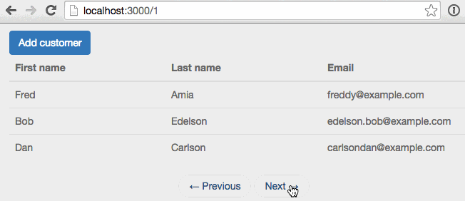

In this post we're going to take a look at how to page data in Meteor.  In an upcoming part 2 we'll add sorting.

These days <a href="http://www.smashingmagazine.com/2013/05/03/infinite-scrolling-lets-get-to-the-bottom-of-this/" target="_blank">infinite scrolling</a> is a popular way to achieve paging but isn't always appropriate for every situation.  Infinite scrolling works great for a news feed or user posts, but not so much for something like a customer list.  So we'll be looking at how we can go about implementing traditional style paging.

##What we'll build
To demonstrate paging we're going to build a simple list of customers.

If you'd rather grab the source code directly rather than follow along, it's available on <a href="https://github.com/riebeekn/paging-and-sorting/tree/part-1" target="_blank">GitHub</a>, otherwise let's get started!

##Creating the app
As a starting point, we'll clone a version of the application from GitHub.  This initial version contains an unpaged list of customers and the ability to add more customers.

###Clone the Repo
Note, if you aren't familiar with Git and / or don't have it installed you can download a zip of the code <a href="https://github.com/riebeekn/paging-and-sorting/archive/part-0.zip">here</a>.  Otherwise let's gitty up (and yes that's supposed to be a joke).

#####Terminal

git clone -b part-0 https://github.com/riebeekn/paging-and-sorting.git


###A quick over-view of where we're starting from
Open up the code in your text editor of choice and you'll see a pretty standard Meteor file structure.

We'll primarily be dealing with `list-customers.js`, `list-customers.html` and `publications.js`.

As far as packages go, we've added: 

* <a href="https://atmospherejs.com/iron/router" target="_blank">Iron Router</a> - to provide routing functionality.
* <a href="https://atmospherejs.com/twbs/bootstrap" target="_blank">Bootstrap</a> - for some simple styling (note see this <a href="http://www.manuel-schoebel.com/blog/meteorjs-and-twitter-bootstrap---the-right-way" target="_blank">article</a> for better way of adding Bootstrap in a production application).
* <a href="https://atmospherejs.com/sacha/spin" target="_blank">Spin</a> - To provide a nice waiting indicator.

<a href="https://atmospherejs.com/meteor/autopublish" target="_blank">Autopublish</a>  and <a href="https://atmospherejs.com/meteor/insecure" target="_blank">Insecure</a> have been removed.

###Start up the app

#####Terminal

cd paging-and-sorting
meteor


You should now see the starting point for our application when you navigate your browser to <a href="http://localhost:3000" target="_blank">http://localhost:3000</a>.

##A quick diversion
Initially I placed the client subscription code in the router.  After some experimentation, I've found a template level subscription seems a bit cleaner.  This also fits in well with the fact the customer data is only required in a single template.  

So... let's start off the tutorial by switching up where our subscription is happening.

###Moving the subscription into the template
So first thing, we'll update the router code... simplifying it by removing the subscription.

#####/lib/router/customer-routes.js

Router.route('/', {  
  name: 'listCustomers'
});

Router.route('/customer/add', {
  name: 'addCustomer'
});


With the subscription gone, we won't see any data in our application anymore, so let's add the subscription to the template.

#####/client/templates/customers/list-customers.js

Template.listCustomers.onCreated(function() {
  this.subscribe('customers');
});

Template.listCustomers.helpers({
  ...
  ...


Voila!  We've now moved the subscription logic out of the router... how simple was that?  Pretty simple.  For a great explanation of template level subscriptions check out this great <a href="https://www.discovermeteor.com/blog/template-level-subscriptions/" target="_blank">great Discover Meteor blog post</a>.

##Adding paging
OK, with that out of the way, let's get onto this paging thing!

###Updating the UI
The first thing we'll do is to update the UI.  We'll add previous and next links at the bottom of our table.

#####/client/templates/customers/list-customers.html

<template name="listCustomers">
  <!-- existing code ... -->
  <nav>
    <ul class="pager">
      <li class="{{prevPageClass}}">
        <a id="prevPage" href="{{prevPage}}">
          &larr; Previous
        </a>
      </li>
      <li class="{{nextPageClass}}">
        <a id="nextPage" href="{{nextPage}}">
          Next &rarr;
        </a>
      </li>
    </ul>
  </nav>
</template>


Pretty simple, at the bottom of our template we've added HTML that corresponds to a <a href="http://getbootstrap.com/components/#pagination-pager" target="_blank">Bootstrap pager</a>.  We've got <a href="http://docs.meteor.com/#/full/spacebars" target="_blank">spacebar</a> directives defined for the classes to apply to the previous and next buttons as well as the URL's for the buttons.

Eventually we'll hook up the `{{prevPageClass}}` and `{{nextPageClass}}` class directives so they disable the buttons where appropriate (i.e. the previous button when on the first page of results).  Likewise the `{{prevPage}}`  and `{{nextPage}}` directives will represent the URL for the next or previous page.

###Fake it until you make it
So our buttons don't do anything yet, let's start out by coming up with a simplified paging implementation, just to get a basic working example.  We'll then refactor to something more complete.

We have an existing customers publication which needs to change, we're going to want to do two things:

* Restrict the number of records returned.
* Skip the first "x" records depending on what page is being displayed.

So let's update our publication to do just that.

#####/server/publications.js

Meteor.publish('customers', function(skipCount) {
  var positiveIntegerCheck = Match.Where(function(x) {
    check(x, Match.Integer);
    return x >= 0;
  });
  check(skipCount, positiveIntegerCheck);
  
  return Customers.find({}, {
    limit: 3, // records to show per page
    skip: skipCount
  });
});


There's nothing too complicated about the publication code, let's go through it step by step.  

In our function definition we've added a `skipCount` parameter, the first thing we do is perform a validation check on the parameter.  

The <a href="http://themeteorchef.com/" target="_blank">Meteor Chef</a> has a great article on <a href="http://themeteorchef.com/snippets/using-the-check-package/" target="_blank">using the check package</a> for parameter validation, and why it's important, check it out!

We could perform a simple check on `skipCount`, something like `check(skipCount, Number)` but we can get more specific.  We know the `skipCount` should be an `Integer` and greater than or equal to 0 (i.e. for the first page of records we'll be skipping no results, for subsequent pages we'll be skipping a positive number of results based on the page and number of records per page), so we create a positive integer function to validate the `skipCount`.

Next we perform a find query on our customers, restricting the number of records to return via the `limit: 3` statement.  

The `skip` value in the find query indicates the number of records to skip over and is set to whatever is passed into the `skipCount` parameter.  

Since we aren't currently passing anything to `skipCount`, the validation will fail and we won't see any records showing up in our browser.

One thing to note is that validation failures with `check` don't bubble up to the browser, you can see the error in the server console however:

Let's get that `skipCount` variable sorted so we can get some records showing.  We'll pass a `page` parameter in from the client, the `page` value will come from the browser URL so first let's update the route.

#####/lib/router/customer-routes.js

Router.route('/:page?', {  
  name: 'listCustomers'
});
...


OK, all we've done is change our route from `/` to `/:page?`.  This indicates there is an optional `page` parameter that the route can consume and match on.

Next we need to update the subscription to make use of the new route parameter. 

#####/client/templates/customers/list-customers.js

Template.listCustomers.onCreated(function() {
  var currentPage = parseInt(Router.current().params.page) || 1;
  var skipCount = (currentPage - 1) * 3; // 3 records per page
  
  this.subscribe('customers', skipCount);
});
...
...


Nothing too tricky, first we calculate the current page.  This is done by grabbing the current page from the URL if it's present (i.e. the URL for page 2 would be `http://localhost:3000/2`), otherwise we default to the first page.

The skip count is determined by taking the zero-based index (i.e. if we're on the first page, the zero based index for that page is 0) and multiplying it by the number of records to display per page.  So for the first page (0 * 3) we skip no records, for the second page (1 * 3) we skip 3 records and so on.

With the above changes, we can now switch the page manually by entering a page number into the URL.  Without a page number or when the page number is "1" the first page of records is displayed, entering "2" displays the second page, and anything larger than 2 is going to display an empty table as we only have 6 records in our database.

OK, so not a bad job of faking it! Note that since we aren't applying a sort order to our records, they're going to come out in whatever order they are in the database.  In part 2 when we add sorting we'll address the ordering of records.  

####A quick refactor

Before moving on, let's perform a small refactoring, hard-coding the number of records to display per page (i.e. 3) in the code doesn't seem like the best idea.  There are a number of approaches we could take to handle this, the option we'll go with is to place the value in a `settings.json` file.

#####Terminal

touch settings.json


#####/settings.json

{
  "public": {
    "recordsPerPage" : "3"
  }
}


Since we need to access the number of records per page on both the client and server we need to create a public entry.

In order for Meteor to pick up the settings value, we'll need to restart Meteor and point to the settings file.

#####Terminal

meteor --settings settings.json


Now we'll replace our hard-coded values in both the template and the publication.

#####/client/templates/customers/list-customers.js

Template.listCustomers.onCreated(function() {
  var currentPage = parseInt(Router.current().params.page) || 1;
  var skipCount = (currentPage - 1) * Meteor.settings.public.recordsPerPage;
    ...
    ...


#####/server/publications.js

Meteor.publish('customers', function(skipCount) {
  var positveIntegerCheck = Match.Where(function(x) {
    check(x, Match.Integer);
    return x >= 0;
  });
  check(skipCount, positveIntegerCheck);

  return Customers.find({}, {
    limit: parseInt(Meteor.settings.public.recordsPerPage),
    skip: skipCount
  });
});


And with that, our hard-coded page limit is gone.

###No more faking
As much fun as it is to type page numbers into the URL, I think we're going to want to get those buttons working... so let's get to it!

####Setting the button link values
If we look at our `list-customers.html` template we've already got a <a href="http://docs.meteor.com/#/full/spacebars" target="_blank">spacebars</a> directive set-up for the links.

#####/client/templates/customers/list-customers.html

...
...
<a id="prevPage" href="{{prevPage}}">
...
...
<a id="nextPage" href="{{nextPage}}">
...
...


So we just need to create helpers to fill in those values.

#####/client/templates/customers/list-customers.js

Template.listCustomers.helpers({
  customers: function() {
    return Customers.find();
  },
  prevPage: function() {
    var currentPage = parseInt(Router.current().params.page) || 1;
    var previousPage = currentPage === 1 ? 1 : currentPage - 1;
    return Router.routes.listCustomers.path({page: previousPage});
  },
  nextPage: function() {
    var currentPage = parseInt(Router.current().params.page) || 1;
    var nextPage = currentPage + 1;
    return Router.routes.listCustomers.path({page: nextPage});
  }
});
...
...


First let's look at the `prevPage` function.  The first thing we do when calculating the URL for the previous page is to grab the current page parameter from the URL, i.e. `Router.current().params.page`.  If there is no page parameter in the URL we default to 1.

Next we assign `previousPage` to the current page minus 1... unless of course the current page is the first page in which case there is no previous page so we keep `previousPage` at 1.

Lastly we return the listCustomers route passing in our calculated `previousPage` parameter.  Pretty simple!

The next page is even simpler we just add 1 to the current page value.

Now our buttons should work right?   Wrong!

So our URL is changing as expected but our data is just sitting there on the first page, drat!

The problem is our subscription isn't aware anything is changing so it doesn't refresh.  We can fix this by placing the subscribe logic inside an `autorun` function.

#####/client/templates/customers/list-customers.js

Template.listCustomers.onCreated(function() {
  var template = this;

  template.autorun(function() {
    var currentPage = parseInt(Router.current().params.page) || 1;
    var skipCount = (currentPage - 1) * Meteor.settings.public.recordsPerPage;
    template.subscribe('customers', skipCount);
  });
});
...


Here we've just wrapped out code inside an `autorun`, so when the page parameter changes, `autorun` will pick up on that and the subscription gets refreshed.

Note, we need to store an instance of the template, i.e. `var template = this;` prior to entering the `autorun` function as the value of `this` will change within the function, so we won't be able to get at the template instance if we don't store it.

So that's all good, but we also have an issue with our next page functionality... you can probably guess where the current implementation falls down.

Hmm, we can just keep on paging past the point where we have any records to display, that won't do!

We're going to need a count of the total records in order to determine whether the next button should move onto a next page or stay where it is.  We also need the count to be <a href="http://docs.meteor.com/#/full/reactivity" target="_blank">reactive</a> as if one user is adding records while another is viewing records we want the count to update so that the viewing user is able to see the new records.

Luckily there is a great <a href="https://atmospherejs.com/tmeasday/publish-counts" target="_blank">package</a> that will help us accomplish just what we want.

#####Terminal

meteor add tmeasday:publish-counts


Now we update the publication.

#####/server/publications.js

Meteor.publish('customers', function(skipCount) {
  var positiveIntegerCheck = Match.Where(function(x) {
    check(x, Match.Integer);
    return x >= 0;
  });
  check(skipCount, positiveIntegerCheck);

  Counts.publish(this, 'customerCount', Customers.find(), { 
    noReady: true
  });
  
  return Customers.find({}, {
    limit: parseInt(Meteor.settings.public.recordsPerPage),
    skip: skipCount
  });
});


Pretty neat!  Inside our existing `customers` publication we can also publish the count via the `Counts...` statement.  The `noReady` flag indicates there is more data than just the count being sent down the line.  The <a href="https://atmospherejs.com/tmeasday/publish-counts" target="_blank">package</a> documentation contains more details, but basically we don't want our subscription thinking all the data is ready when we've still got some more data to retrieve.

OK, so our publication is all set, let's update our `nextPage` helper to take advantage of our newly acquired count.

#####/client/templates/customers/list-customers.js


Template.listCustomers.helpers({
...
...
  nextPage: function() {
    var currentPage = parseInt(Router.current().params.page) || 1;
    var nextPage = hasMorePages() ? currentPage + 1 : currentPage;
    return Router.routes.listCustomers.path({page: nextPage});
  }
});
...
...

Template.listCustomers.events({
  ...
  ...
});

var hasMorePages = function() {
  var currentPage = parseInt(Router.current().params.page) || 1;
  var totalCustomers = Counts.get('customerCount');
  return currentPage * parseInt(Meteor.settings.public.recordsPerPage) < totalCustomers;
}


We've created a `hasMorePages` function that we call from within `nextPage`.  In `nextPage` if we have more pages we increment the page number otherwise we stay where we are.

`hasMorePages` is pretty straight-forward, with the publish-counts package it's easy to get the record count on the client via `Counts.get(...`.
Then we're just checking whether the current page multiplied by the number of items per page is less than the total number of customer records.  If it is we know we've got more records.  

Now, if you try to navigate past the 2nd page you won't be able to.

####What's that smell?
Before getting too excited, we're seeing some code smells leak into our implementation.  The code that determines the `currentPage` is duplicated in a few places in `list-customers.js`.

We're going to want to tighten that up and ensure this logic appears in only one place.  

Let's update `list-customers.js`, we'll just create a simple function to calculate the current page.

#####/client/templates/customers/list-customers.js

Template.listCustomers.onCreated(function() {
  var template = this;

  template.autorun(function() {
    var skipCount = (currentPage() - 1) * Meteor.settings.public.recordsPerPage;
    template.subscribe('customers', skipCount);
  });
});

Template.listCustomers.helpers({
  customers: function() {
    return Customers.find();
  },
  prevPage: function() {
    var previousPage = currentPage() === 1 ? 1 : currentPage() - 1;
    return Router.routes.listCustomers.path({page: previousPage});
  },
  nextPage: function() {
    var nextPage = hasMorePages() ? currentPage() + 1 : currentPage();
    return Router.routes.listCustomers.path({page: nextPage});
  }
});

Template.listCustomers.events({
  'click #btnAddCustomer': function(e) {
    e.preventDefault();

    Router.go('addCustomer');
  }
});

var hasMorePages = function() {
  var totalCustomers = Counts.get('customerCount');
  return currentPage() * parseInt(Meteor.settings.public.recordsPerPage) < totalCustomers;
}

var currentPage = function() {
  return parseInt(Router.current().params.page) || 1; 
}


Nothing special going on here, where we were previously calculating the current page value in multiple places we now just call out to the `currentPage` function we've defined.  Considering `currentPage` is a one-liner you could argue that it's not worth creating a separate function for it... it contains some (albeit minor) logic however so I feel it's worthwhile splitting it out.

###Adding a wait indicator
At this point the core implementation is done, but there's some gravy we can add to make things a little more user friendly.

Currently we don't have a wait indicator to signal data is loading.  This becomes apparent if you add a wait in the publication.

#####/server/publications.js

Meteor.publish('customers', function(skipCount) {
  Meteor._sleepForMs(1000);
  ...


You'll now see the UI is pretty pokey, both on initial load and when the pager buttons are pressed.

We can update `list-customers.html`, to take into account our ready state.

#####/client/templates/customers/list-customers.html

<template name="listCustomers">
  

    

      <a class="btn btn-primary" id="btnAddCustomer">Add customer</a>
    

  

  {{#unless Template.subscriptionsReady}}
    {{> spinner}}
  {{/unless}}
  <table class="table">
  ...
  ...


All we're doing here is over-laying a spinner icon over the table when the subscription has not yet loaded.  Now if our application is pokey at least the user is given a visual clue that something is happening.

Don't forget to remove the wait from `publications.js`... unless you like pokey apps that is!

####Setting the button classes
The last thing we'll do is give the user a visual cue when they've reached the first or last page of records.  We'll accomplish this by changing up the class of the next and previous buttons when appropriate.

We already have our spacebar directives for the classes:

#####/client/templates/customers/list-customers.html

...
<li class="{{prevPageClass}}">
...
<li class="{{nextPageClass}}">
...


Now we'll add the corresponding functions to the helper section of `list-customers.js`.

#####/client/templates/customers/list-customers.js

// existing code...

Template.listCustomers.helpers({
  customers: function() {
    return Customers.find();
  },
  prevPage: function() {
    var previousPage = currentPage() === 1 ? 1 : currentPage() - 1;
    return Router.routes.listCustomers.path({page: previousPage});
  },
  nextPage: function() {
    var nextPage = hasMorePages() ? currentPage() + 1 : currentPage();
    return Router.routes.listCustomers.path({page: nextPage});
  },
  prevPageClass: function() {
    return currentPage() <= 1 ? "disabled" : "";
  },
  nextPageClass: function() {
    return hasMorePages() ? "" : "disabled";
  }
});

// existing code...


We return an empty string when the buttons should display as normal and return a CSS class of "disabled" when the buttons should be disabled.

The logic behind what class to return is pretty self explanatory; if we're on page 1 we disable the previous link, if we don't have any more pages we disable the next link.

And voila we have a visual clue on the links:

##Summary
OK, so that's it for the exciting world of paging in Meteor, thanks for reading and hope you enjoyed the post.  In part two we'll look at adding sorting.
