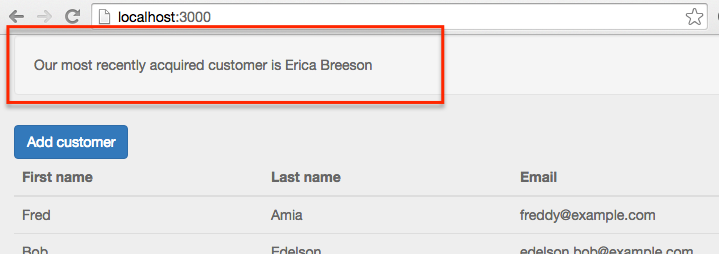
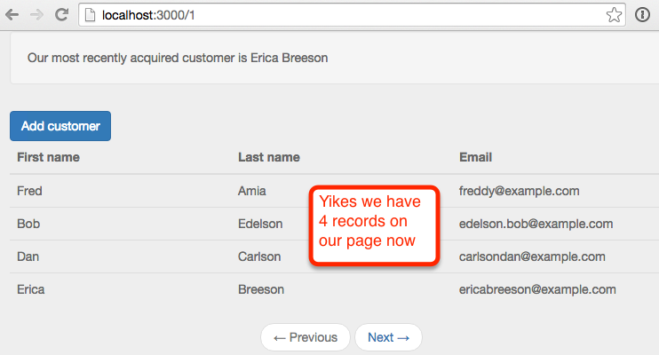

In <a href="/paging-and-sorting-part-1/index.html" target="_blank">part 1</a> we implemented paging for our list of customers.  Although our paged customers are looking all good, there is a pretty significant limitation with the current code.  Problems start to arise if there are multiple subscriptions against the paged data set.

In this short(ish) post we'll replicate the issue and then implement a solution.

Thanks go to <a href="https://disqus.com/by/EliezerS/" target="_blank">EliezerS</a> for identifying the issue, and to <a href="https://disqus.com/by/disqus_LhObMlEdMU/" target="_blank">Seba</a> for suggesting a solution. It's great to get feedback, and I hadn't previously paged anything with multiple subscriptions so getting this going was a great learning experience.  Thanks guys!

## The code
If you've been following along from <a href="/paging-and-sorting-part-1/index.html" target="_blank">part 1</a> you're good to go, otherwise you can grab the part 1 code from GitHub.

##### Terminal

git clone -b part-1 https://github.com/riebeekn/paging-and-sorting.git


## The problem
So let's start off by replicating the problem and then we can look at the solution.

To illustrate our issue, we're going to update our application to display the latest customer that we've acquired.  This is just the latest customer record that has been added to the application.

### Update the test data
We'll make a quick change to our fixture data, we're going to add an acquired field, which will represent when a customer was added.

##### /server/fixtures.js

// Fixture data
Meteor.startup(function() {
  if (Customers.find().count() === 0) {
    Customers.insert({
      name: 'Fred',
      surname: "Amia",
      email: 'freddy@example.com',
      acquired: new Date(2015, 2, 23)
    });
    Customers.insert({
      name: 'Bob',
      surname: 'Edelson',
      email: 'edelson.bob@example.com',
      acquired: new Date(2015, 3, 2)
    });
    Customers.insert({
      name: 'Dan',
      surname: "Carlson",
      email: 'carlsondan@example.com',
      acquired: new Date(2015, 2, 13)
    });
    Customers.insert({
      name: 'Alice',
      surname: 'Foster',
      email: 'a.foster@example.com',
      acquired: new Date(2015, 4, 15)
    });
    Customers.insert({
      name: 'Erica',
      surname: "Breeson",
      email: 'ericabreeson@example.com',
      acquired: new Date(2015, 5, 5)
    });
    Customers.insert({
      name: 'Cindy',
      surname: 'Driver',
      email: 'cindy.driver@example.com',
      acquired: new Date(2015, 1, 25)
    });
  }
});


All very straight forward, we have some test data in `fixture.js` to which we've added an `acquired` field with some faked up dates.

While we're at it, we'll make a quick change to the method which inserts new customers.  We want to populate the acquired field when a customer is added.

##### /lib/collections/customers.js

Customers = new Mongo.Collection('customers');

Meteor.methods({
  customerInsert: function(customerAttributes) {
    check(customerAttributes, {
      name: String,
      surname: String,
      email: String
    });

    var customer = _.extend(customerAttributes, {
      acquired: new Date()
    });

    Customers.insert(customer);
  }
});


We've included the current date / time via the `_.extend(...` call.  This way when we insert a new customer, they'll have an `acquired` value associated with them.

To get our new fixture data in the DB, stop, reset and restart meteor.

##### Terminal

meteor reset
meteor --settings settings.json


### Updating the UI
We're going to need a new template for the 'newest customer' display, let's get that out of the way.

##### Terminal

touch client/templates/customers/newest-customer.html
touch client/templates/customers/newest-customer.js


We'll display our new template by linking to it from `list-customers`.

##### /client/templates/customers/lists-customers.html

<template name="listCustomers">
  {{> newestCustomer}}
  

    

    ...


Just a one line addition calling out to the new template, simple.

Next let's create the HTML for the new template.

##### /client/templates/customers/newest-customers.html

<template name="newestCustomer">
  

    Our most recently acquired customer is {{customerName}}
  

</template>


Nothing complicated, just a standard <a href="http://getbootstrap.com/components/#wells" target="_blank">Bootstrap well</a> inside of which we are displaying our newest customer.  We'll hook up `{{customerName}}` in a little bit.

Next let's create a new publication so that we can get at the data for our most recently added customer.

##### /server/publications.js

Meteor.publish('customers', function(skipCount) {
  ... existing code ...
});

Meteor.publish('newestCustomer', function() {
  return Customers.find({}, {
    limit: 1,
    sort: {'acquired': -1}
  });
});


Again, straight-forward, we are returning a single record (via `limit: 1`) and we're doing a descending sort by the `acquired` field in order to get the most recent record.

Let's subscribe to the new publication and create the helper for `{{customerName}}`.

##### /client/templates/customers/newest-customers.js

Template.newestCustomer.onCreated(function() {
  this.subscribe('newestCustomer');
});

Template.newestCustomer.helpers({
  'customerName': function() {
    var customer = Customers.find({}, {
      limit: 1,
      sort: {'acquired': -1}
    }).fetch();

    if (customer.length > 0) {
      return customer[0].name + ' ' + customer[0].surname;
    }

    return "... actually we appear to have no customers!";
  }
});


The subscription is very straight-forward, no explanation required.

With the `customerName` helper we need to include the same `sort` and `limit` parameters as we did in the `newestCustomer` publication.  This is required as there is only a single `Customers` collection present in the client side <a href="https://www.meteor.com/mini-databases" target="_blank">Minimongo</a> database.

The data from both the `customers` and `newestCustomer` subscriptions will be combined into this single client side collection.  Therefore in order to grab the latest customer we need to apply a `limit` and `sort` on the collection.

I bet you can guess how the single client side collection is going to affect the paged table.

So what's happening here?

Well Erica is our newest customer so she gets pulled in by the `newestCustomer` subscription.

She's supposed to appear on the 2nd page of results however so the `customers` subscription doesn't contain her as one of it's results, Fred, Bob and Dan are returned.  So we now have 4 records in the client side `Customers` collection (Erica from `newestCustomer` and Fred, Bob and Dan from `customers`); thus 4 records show up in the table.

If you navigate to the 2nd page, we'll be back to 3 records.

The `newestCustomer` subscription returns Erica and the `customers` subscription returns Erica, Alice and Cindy.  The 2 subscriptions get combined and the result is a 3 record collection of Erica, Alice and Cindy.

## A solution
So how can we deal with this?  Well luckily there is a package that can help us out.  The <a href="https://atmospherejs.com/percolate/find-from-publication" target="_blank">find from publication</a> package can be used to limit a client side `find()` to a specific publication.

Let's see it in action.

##### Terminal

meteor add percolate:find-from-publication


The package is super easy to plug into the existing code; we'll make use of it on both of our customer publications.

##### /server/publications.js

FindFromPublication.publish('customers', function(skipCount) {
  ...
  ...
});

FindFromPublication.publish('newestCustomer', function() {
  ...
  ...
});


The only change required is to switch out `Meteor.publish` with `FindFromPublication.publish`, how easy is that!

Now we can update our client side find calls.

##### /client/templates/customers/list-customers.js

... existing code

Template.listCustomers.helpers({
  customers: function() {
    return Customers.findFromPublication('customers');
  },
  ...
  ...


Again a very small change, `find` get replaced with `findByPublication` and the name of the publication.  Now for the `newestCustomer` find call.

##### /client/templates/customers/newest-customer.js

... existing code

Template.newestCustomer.helpers({
  'customerName': function() {
    var customer = Customers.findFromPublication('newestCustomer').fetch();

    if (customer.length > 0) {
      return customer[0].name + ' ' + customer[0].surname;
    }

    return "... actually we appear to have no customers!";
  }
});


Nice!  By using `findFromPublication` we can get rid of the `limit` and `sort` parameters.

And best of all, no more multiple subscriptions, same collection, bad paging going on!

*Note: With the 2 subscriptions the sort order of the records on each individual page may not exactly match the ordering in the database.*

*For instance Erica is the 5th record in our database, and although on the right page she shows up in the 4th spot when she is the newest customer (i.e. before we add John Doe).  This is because the `newestCustomer` subscription returns prior to the `customers` subscription.*

*For now, we're not concerned with sorting, we'll tackle that in part 2.  If not planning to implement interactive sort thou, a default sort order is probably a good idea.*

## Summary
Although the original implementation is safe in the absence of multiple subscriptions, even if not planning on multiple subscriptions I think it's a good idea to use `findFromPublication`.

That way there is no worry of adding another subscription down the road and experiencing an unintended pagetastrophe!

Thanks for reading!
