This is the second(ish) of a two part post on paging and sorting.  In <a href="/paging-and-sorting-part-1/" target="_blank">part 1</a> and  <a href="/paging-and-sorting-part-1a/" target="_blank">part 1a</a> we looked at paging, now we'll add sorting.

If you'd rather grab the source code directly rather than follow along, it's available on <a href="https://github.com/riebeekn/paging-and-sorting" target="_blank">GitHub</a>.

## What we'll build
By the end of this post we'll have updated our simple customer application to include sorting via click-able table headers.

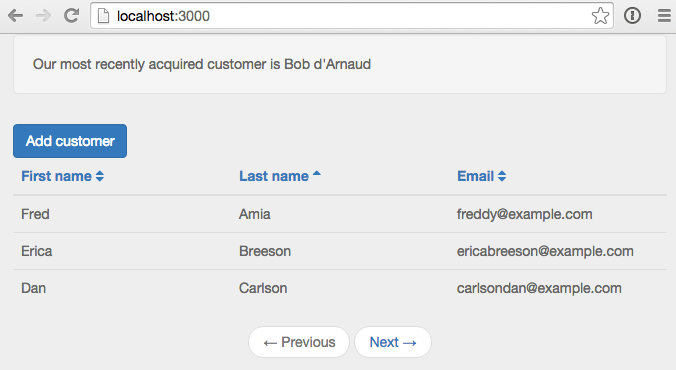

## Creating the app
If you followed along with part 1 and 1a you're all set.  If not and you want to jump right into part 2, you can clone part 1a from GitHub as a starting point.

### Clone the Repo
Note, if you aren't familiar with Git and / or don't have it installed you can download a zip of the code <a href="https://github.com/riebeekn/paging-and-sorting/archive/part-1a.zip">here</a>.

##### Terminal

git clone -b part-1a https://github.com/riebeekn/paging-and-sorting.git


### Start up the app
OK, you've either gotten the code from GitHub or are using the existing code you created in Part 1 and 1a, let's see where we're starting from.

##### Terminal

cd paging-and-sorting
meteor --settings settings.json


You should now see the starting point for our application when you navigate your browser to <a href="http://localhost:3000" target="_blank">http://localhost:3000</a>.

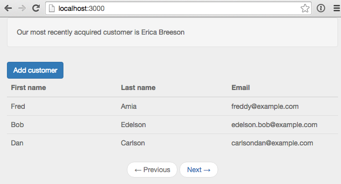

## Adding sorting

### Updating the table headers
The first thing we'll do is update the UI to have click-able table headers.

##### /client/templates/customers/list-customers.html

<template name="listCustomers">
  {{> newestCustomer}}
  

    

      <a class="btn btn-primary" id="btnAddCustomer">Add customer</a>
    

  

  {{#unless Template.subscriptionsReady}}
    {{> spinner}}
  {{/unless}}
  <table class="table">
    <thead>
      <tr>
        <th>
          <a id="firstName" href="#">First name</a>
        </th>
        <th>
          <a id="lastName" href="#">Last name</a>
        </th>
        <th>
          <a id="email" href="#">Email</a>
        </th>
      </tr>
    </thead>
    <tbody>
      {{#each customers}}
      ...
      ...


OK, nothing complicated.  We've just switched out the regular table headers with links.

Before hooking up the links let's switch gears and figure out what we want to have happen on the server.  We'll want to specify not only a sort field but also a sort direction.  This is going to require a change to the publication and then client side we'll need to update the subscription.

### Updating the publication and subscription

Let's update the publication first.

##### /server/publications.js

FindFromPublication.publish('customers', function(skipCount, sortField, sortDirection) {
  var positiveIntegerCheck = Match.Where(function(x) {
    check(x, Match.Integer);
    return x >= 0;
  });
  check(skipCount, positiveIntegerCheck);

  Counts.publish(this, 'customerCount', Customers.find(), {
    noReady: true
  });

  var sortParams = {};
  sortParams[sortField] = sortDirection;
  return Customers.find({}, {
    limit: parseInt(Meteor.settings.public.recordsPerPage),
    skip: skipCount,
    sort: sortParams
  });
});
...
...


Nothing too crazy, we're passing in two additional input parameters to the function, one for the sort field and the other for the sort direction.  Then the find call has been updated to take the new parameters into account via the `sortParams` variable.

*Note: for now we're not performing a check on our new input parameters, but we'll do so in a bit once we've solidified the valid values that can be passed into the function.*

Let's check out our app:

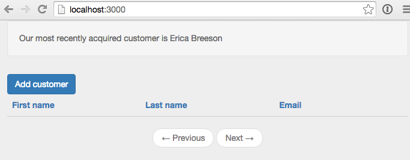

That's no good, but expected, we need to update our subscription to include the two new parameters.  To get things back to a working state we'll initially hard-code some values and then build out the full implementation.

First off though, to figure out what we're going to need to do, let's have a quick look at our database records with <a href="http://robomongo.org/" target="_blank">Robomongo</a>.

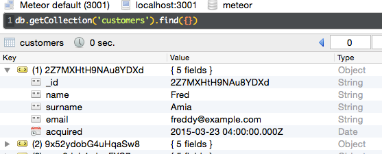

We can see we have 5 fields in our customer records, 3 of which are displayed in the UI.  Also the column names are slightly different from what we're using for the table headers in the UI, so when we specify the sort field we need to keep in mind the column names in the database.

Let's start off by sorting via surname with an order value of 1 (i.e. an ascending sort direction, -1 would result in a descending sort).

##### /client/templates/customers/list-customers.js

Template.listCustomers.onCreated(function() {
  var template = this;

  template.autorun(function() {
    var skipCount = (currentPage() - 1) * Meteor.settings.public.recordsPerPage;
    template.subscribe('customers', skipCount, "surname", 1);
  });
});
...


The only change we've made is to the `template.subscribe...` line.  After hard-coding the surname as the sort field and ascending as the sort order, everything should be back working and we'll see our list of customers is now sorted by surname.

### An issue
Hmm, I'm getting bored having only 6 customers in our database, how about we add a new customer via the `Add Customer` button.

Awesome, we have a new customer... but hey what is up with the sort order?  Our newly added customer is way back on the last page.

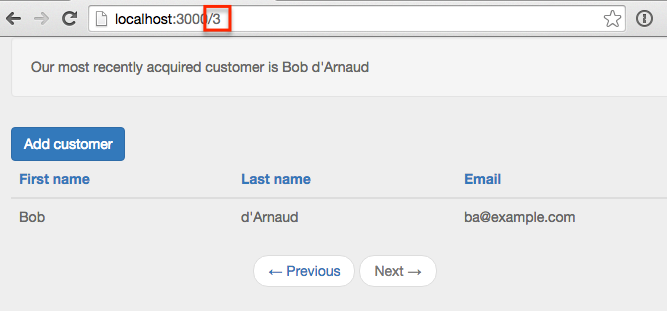

Well turns out Mongo does not support <a href="http://stackoverflow.com/questions/22931177/mongo-db-sorting-with-case-insensitive" target="_blank">case insensitive sorting</a>, and uppercase words will appear prior to lowercase words when sorted.  Holy smokes, what are we going to do?

### A solution
Turns out a common pattern when needing to sort on String columns in Mongo is to duplicate a lower-cased version of the field for the purpose of sorting.  Coming from a traditional database background, this seems a little strange, but that's just the way it's done in Mongo, denormalization and duplication is fairly common.

So how can we accomplish this in our application?  Duplicating and keeping in sync extra columns seems like it will be a huge error-prone headache!  Luckily there's a package that can help us out.

We'll add the <a href="https://github.com/aldeed/meteor-collection2" target="_blank">collection2</a> package which will allow us to automatically create lower-cased versions of our `String` fields.  Let's see how it all works.

##### Terminal

meteor add aldeed:collection2


Now we'll create a <a href="https://github.com/aldeed/meteor-collection2#attaching-a-schema-to-a-collection" target="_blank">schema</a> for our customer collection.

##### Terminal

mkdir lib/schemas
touch lib/schemas/customers.js


##### /lib/schemas/customers.js

Customers.attachSchema(new SimpleSchema({
  name: {
    type: String
  },

  name_sort: {
    type: String,
    optional: true,
    autoValue: function() {
      var name = this.field("name");
      if (name.isSet) {
        return name.value.toLowerCase();
      } else {
        this.unset(); // Prevent user from supplying her own value
      }
    }
  },

  surname: {
    type: String
  },

  surname_sort: {
    type: String,
    optional: true,
    autoValue: function() {
      var surname = this.field("surname");
      if (surname.isSet) {
        return surname.value.toLowerCase();
      } else {
        this.unset(); // Prevent user from supplying her own value
      }
    }
  },

  email: {
    type: String,
    autoValue: function() {
      return this.value.toLowerCase(); // store emails as lower-case
    }
  },

  acquired: {
    type: Date,
    autoValue: function() {
      if (this.isInsert) {
        return new Date();
      } else if (this.isUpsert) {
        return {$setOnInsert: new Date()};
      } else {
        this.unset();
      }
    }
  }
}));


In the schema file we're doing a couple of things.

First we're specifying the type of each column (notice we've added 2 new columns `name_sort` and `surname_sort` to handle our case insensitive sorting).

Next we're making use of the `autoValue` function on some of the columns.

For the sort specific columns we're just lower-casing the value of the primary column, i.e. `return surname.value.toLowerCase()`.  We're also lowercasing the email field to avoid any funkiness that might arise if a user enters a mixed case email address.

Finally we're automatically applying the current date / time to the `acquired` field on an insert and preventing any updates on the column. Since the acquired field represents when a customer was added to the application, the field should only be set on insert and never updated.

The `acquired` change means we can get rid of our default dates from `fixture.js` as they'll be over-written by the `autoValue` function anyway.

##### /server/fixtures.js

// Fixture data
Meteor.startup(function() {
  if (Customers.find().count() === 0) {
    Customers.insert({
      name: 'Fred',
      surname: "Amia",
      email: 'freddy@example.com'
    });
    Customers.insert({
      name: 'Bob',
      surname: 'Edelson',
      email: 'edelson.bob@example.com'
    });
    Customers.insert({
      name: 'Dan',
      surname: "Carlson",
      email: 'carlsondan@example.com'
    });
    Customers.insert({
      name: 'Alice',
      surname: 'Foster',
      email: 'a.foster@example.com'
    });
    Customers.insert({
      name: 'Erica',
      surname: "Breeson",
      email: 'ericabreeson@example.com'
    });
    Customers.insert({
      name: 'Cindy',
      surname: 'Driver',
      email: 'cindy.driver@example.com'
    });
  }
});


We can also remove the code from our customer collection that previously set our acquired dates on insert (i.e. `var customer = _.extend(...`) as this is now handled by the schema file.

##### /lib/collections/customers.js

Customers = new Mongo.Collection('customers');

Meteor.methods({
  customerInsert: function(customerAttributes) {
    check(customerAttributes, {
      name: String,
      surname: String,
      email: String
    });

    Customers.insert(customerAttributes);
  }
});


We'll want to reset our app so that our fixture data gets the new auto value data.  So stop, reset and re-start the meteor server.

##### Terminal

meteor reset
meteor --settings settings.json


After we make a small change to our subscription re-adding Bob d'Arnaud, will put him in the right place.

##### /client/templates/customers/list-customers.js

Template.listCustomers.onCreated(function() {
  var template = this;

  template.autorun(function() {
    var skipCount = (currentPage() - 1) * Meteor.settings.public.recordsPerPage;
    template.subscribe('customers', skipCount, "surname_sort", 1);
  });
});
...


We're using the `surname_sort` column instead of `surname` as the sort column and there we go, Bob is now where he belongs.

Also notice that before we added Bob, Cindy showed up as our newest customer instead of Erica.  With our auto assigned `acquired` values from the schema and the record for Cindy being the last record in `fixture.js`, hers is the last record to be inserted; and therefore contained the newest `acquired` value.

### Dynamic sorting based on the URL
OK, so we have sorting working with hard-coded values in the subscription, now let's see if we can get the sort field and sort direction to react to the current URL.  Similar to what we did with paging we'll initially manually update the URL and then hook in the UI links.

What we're aiming to accomplish is something like the following:

The URL contains the sort field and direction to apply... let's work on getting rid of that 404.

#### Update the router
The first step is to update our routes so that Meteor understands what to do with the new URL parameters.

##### /lib/router/customer-routes.js

Router.route('/:page?/:sortField?/:sortDirection?', {
  name: 'listCustomers'
});

Router.route('/customer/add', {
  name: 'addCustomer'
});


All we've done is add optional parameters for the sort field and direction.  This will get rid of the 404 but the parameters aren't going to have any affect on our application... so let's get that sorted.

#### Implementing the sort direction
Let's work on sort direction first.  We'll need to make a small change to the subscription.

##### /client/templates/customers/list-customers.js

Template.listCustomers.onCreated(function() {
  var template = this;

  template.autorun(function() {
    var skipCount = (currentPage() - 1) * Meteor.settings.public.recordsPerPage;
    template.subscribe(
      'customers',
      skipCount,
      "surname_sort",
      Router.current().params.sortDirection
    );
  });
});
...


The only change is that we're now passing along the value of the `sortDirection` URL parameter to the subscription via `Router.current().params.sortDirection` instead of using a hard-coded value of `1`.

Let's update the publication to handle the parameter properly.

##### /server/publications.js

var buildSortParams = function(sortField, sortDirection) {
  var sortParams = {};
  var direction = sortDirection || 1;
  if (direction === 'desc') {
    direction = -1;
  } else {
    direction = 1;
  }
  sortParams[sortField] = direction;

  return sortParams;
}

FindFromPublication.publish('customers', function(skipCount, sortField, sortDirection) {
  var positiveIntegerCheck = Match.Where(function(x) {
    check(x, Match.Integer);
    return x >= 0;
  });
  check(skipCount, positiveIntegerCheck);

  var sortDirectionCheck = Match.Where(function(x) {
    if (x) {
      check(x, String);
      return x === 'asc' || x === 'desc';
    } else {
      return true;
    }
  });
  check(sortDirection, sortDirectionCheck)

  Counts.publish(this, 'customerCount', Customers.find(), {
    noReady: true
  });

  return Customers.find({}, {
    limit: parseInt(Meteor.settings.public.recordsPerPage),
    skip: skipCount,
    sort: buildSortParams(sortField, sortDirection)
  });
});
...
...


The logic around the sort parameters is starting to get a little bit involved so we've refactored it to a separate function, `buildSortParams`.  The method itself is fairly simple, we're just checking the value of the `sortDirection` that has been passed in.  If the value is `null` we default to ascending.  If the value is present we sort based on the value, converting `desc` to `-1`, otherwise defaulting to `1`.

In the main publication code we've added a check for the `sortDirection`, verifying that it is a `String` and set to either `asc` or `desc`.

The `sort:...` within the `find` call now takes advantage of the refactored out  `buildSortParams` function.

With the above in place we can now affect the sort order of our records by manually entering a sort direction into the URL of our application.

Of course, the sort field is still going to be the last name, since we haven't hooked up the sort field functionality... let's do that next.

#### Implementing the sort field
The sort field implementation is going to be very similar to what we did for the sort direction.  First off let's update our subscription to make use of the sort field URL parameter.

##### /client/templates/customers/list-customers.js

Template.listCustomers.onCreated(function() {
  var template = this;

  template.autorun(function() {
    var skipCount = (currentPage() - 1) * Meteor.settings.public.recordsPerPage;
    template.subscribe(
      'customers',
      skipCount,
      Router.current().params.sortField,
      Router.current().params.sortDirection
    );
  });
});
...


A very small change is required here, just swapping out the hard-coded `surname_sort` value with the actual route parameter, i.e. `Router.current().params.sortField`.

Now onto the publication.

##### /server/publications.js

var buildSortParams = function(sortField, sortDirection) {
  var sortParams = {};

  var direction = sortDirection || 1;
  if (direction === 'desc') {
    direction = -1;
  } else {
    direction = 1;
  }

  var field = sortField || 'surname_sort';
  if (sortField === 'firstname') {
    field = 'name_sort';
  } else if (sortField === 'lastname') {
    field = 'surname_sort';
  } else if (sortField === 'email') {
    field = 'email';
  }

  sortParams[field] = direction;

  return sortParams;
}

FindFromPublication.publish('customers', function(skipCount, sortField, sortDirection) {
  var positiveIntegerCheck = Match.Where(function(x) {
    ...
    ...
  }

  var sortFieldCheck = Match.Where(function(x) {
    if (x) {
      check(x, String);
      return x === 'firstname' || x === 'lastname' || x ==='email';
    } else {
      return true;
    }
  });
  check(sortField, sortFieldCheck);

  var sortDirectionCheck = Match.Where(function(x) {
    ...
    ...
}


So we've added some logic to handle the `sortField` value in the `buildSortParams` function.  We're defaulting to sorting via last name when a value is not passed in, otherwise we sort on the appropriate column.

We've also added a check for the `sortField` in the main publication code.  It's very similar to the `sorDirectionCheck`, we make sure the value is a string and that is it one of our 3 valid sort fields.

And with that we are able to manually sort our records via the URL.

#### A bit of weirdness
Did you see anything a little strange in the screen grab above?  Let's do a freeze frame on our first name ascending sort.

As we all know users are always being difficult, use software wrong and in general mess up the lives of developers... and this is yet another example of that, imagine 2 customers having the same name... ridiculous!

All joking aside, since we can expect duplicate first and last names, we should adjust our sorting logic to deal with duplicates in a reasonable manner.  When ordering on a name field it makes sense to order by the selected name field (i.e. first name, if the first name header is clicked) and then the secondary non-selected name field (i.e. last name).

So how can we apply a multi column `sort` to a `find` call?  Well turns out the value of a `sort` parameter can be an object (like what we've been doing so far) or an array of arrays.  This second option is what will allow for a multi column sort.  We can pass something like `[["name_sort", "asc"],["surname_sort", "asc"]]` into the find call in order to perform a multi column sort.

Let's update `buildSortParameters` to do just that.

##### /server/publications.js
 
 var buildSortParams = function(sortField, sortDirection) {
  var sortParams = [];

  var direction = sortDirection || 'asc';

  var field = sortField || 'surname_sort';
  if (sortField === 'firstname') {
    sortParams.push(['name_sort', direction]);
    sortParams.push(['surname_sort', direction])
  } else if (sortField === 'lastname') {
    sortParams.push(['surname_sort', direction]);
    sortParams.push(['name_sort', direction]);
  } else if (sortField === 'email') {
    sortParams.push(['email', sortDirection]);
  }

  return sortParams;
}
...
...


Pretty straight forward, instead of an object we're returning an array of arrays.  In the case of a first or last name sort we're applying a secondary sort on the appropriate name field.

Now when we sort by first name ascending, a secondary sort is performed on the last name... and the Bob's appear in a more logical order.

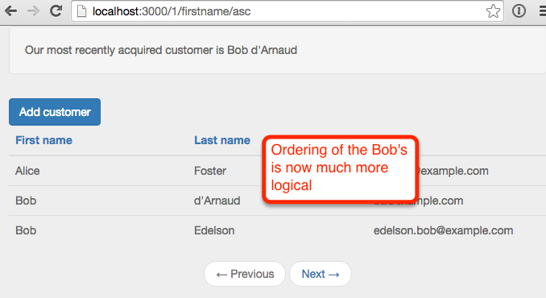

#### A quick refactor
One thing I'm not too happy about is all that parameter checking in our `customers` publication is starting to make it a little hard to see what we're actually doing in the publication, the check code takes up more space than the code that actually grabs the data!

Let's suck the check's into a helper class to thin out the publication.  As an added bonus we can also re-use the check code in other places down the road if we need to.

##### Terminal

mkdir server/helpers
touch server/helpers/custom-checks.js


##### /server/helpers/custom-checks.js

CustomChecks = {};

CustomChecks.positiveIntegerCheck = Match.Where(function(x) {
  check(x, Match.Integer);
  return x >= 0;
});

CustomChecks.sortFieldCheck = Match.Where(function(x) {
  if (x) {
    check(x, String);
    return x === 'firstname' || x === 'lastname' || x ==='email';
  } else {
    return true;
  }
});

CustomChecks.sortDirectionCheck = Match.Where(function(x) {
  if (x) {
    check(x, String);
    return x === 'asc' || x === 'desc';
  } else {
    return true;
  }
});


So with `custom-checks.js` all we've done is to extract the custom check code out of `publication.js`.

This makes our main publication method much more readable.

##### /server/publications.js

...
...
FindFromPublication.publish('customers', function(skipCount, sortField, sortDirection) {
  // parameter validations
  check(skipCount, CustomChecks.positiveIntegerCheck);
  check(sortField, CustomChecks.sortFieldCheck);
  check(sortDirection, CustomChecks.sortDirectionCheck)

  Counts.publish(this, 'customerCount', Customers.find(), {
    noReady: true
  });

  return Customers.find({}, {
    limit: parseInt(Meteor.settings.public.recordsPerPage),
    skip: skipCount,
    sort: buildSortParams(sortField, sortDirection)
  });
});
...
...


#### A small problem
Before moving on, let's add a new customer to our site via the add customer button.

Hey, that doesn't look right, why are we still on our list of customers?  If we look at the server console, we can see Meteor attempting to render our customer list but our parameter checks failed.

The issue is the 3 optional parameters on our `root` route. Our pattern for the `add customer` route is matching with the `root` route.  `customer` is being treated as the first optional parameter, `add` as the second optional parameter.

So there are a couple of ways that we could fix this.  We could move our customers list off the root route, for example:

##### /lib/router/customer-routes.js

Router.route('customers/:page?/:sortField?/:sortDirection?', {
  name: 'listCustomers'
});
...


Now we'd need to use a URL such as `http://localhost:3000/customers` to access our customers.

The other option is to change the ordering of the routes.  Since routes are evaluated in a top down order, switching the order of routes means a URL of `/customer/add` will be evaluated and matched by our `addCustomer` route before it ever gets to our root route.  This is the option we'll go with, so update `customer-routes.js` as follows:

##### /lib/router/customer-routes.js

Router.route('/customer/add', {
  name: 'addCustomer'
});

Router.route('/:page?/:sortField?/:sortDirection?', {
  name: 'listCustomers'
});


This is something to keep in mind when using optional parameters, if you aren't careful you can get unintentional route matching going on and you'll find your navigation is no longer doing what you want!

### Hooking up the header links
OK, so we have our sorting working when the URL is updated manually, now we just need to hook up our header links.  Let's add some events for the links.

##### /client/templates/customers/list-customers.js

... existing code

Template.listCustomers.events({
  'click #btnAddCustomer': function(e) {
    e.preventDefault();

    Router.go('addCustomer', {page: Router.current().params.page});
  },
  'click #firstName,#lastName,#email': function(e) {
    e.preventDefault();

    if (e.target.id === 'firstName') {
      navigateToCustomersRoute('firstname');
    } else if (e.target.id === 'lastName') {
      navigateToCustomersRoute('lastname');
    } else if (e.target.id === 'email') {
      navigateToCustomersRoute('email');
    }
  }
});

var navigateToCustomersRoute = function(sortField) {
  Router.go('listCustomers', {
    page: Router.current().params.page || 1,
    sortField: sortField,
    sortDirection: toggleSortDirection(sortField)
  });
}

var toggleSortDirection = function(sortBy) {
  var currentSortField = Router.current().params.sortField || 'lastname';
  if (currentSortField !== sortBy) {
    return 'asc';
  } else {
    var currentSortDirection = Router.current().params.sortDirection || 'asc';
    if (currentSortDirection === 'asc') {
      return 'desc';
    } else {
      return 'asc';
    }
  }
}
...
...


OK, that's a bit of a code dump but it's all pretty straight-forward.

In the event handler we're checking which header was clicked, i.e. `e.target.id === 'firstName`, and based on that, we pass in the appropriate sort column to the `navigateToCustomersRoute` function.

In `navigateToCustomersRoute` we just navigate to the `listCustomers` route with the appropriate parameters.

One thing to notice is that we are explicitly setting a `page` parameter via `page: Router.current().params.page || 1`.  We need to explicitly set the page otherwise we could end up with an invalid route.  For example if the user clicks the `First Name` header from the default customer page, i.e. `http://localhost:3000/`, the page parameter is empty.  If we don't set it explicitly to 1 we'll end up with a route of `http://localhost:3000/firstname/asc`, when it should be `http://localhost:3000/1/firstname/asc`.  Then if the `First Name` header is clicked yet again, `firstname` will be grabbed as the page parameter and we'll end up with `http://localhost:3000/firstname/firstname/asc`.

After setting our page and sort field, we call into the `toggleSortDirection` function to grab our sort direction.  The logic is pretty simple, if we're sorting by a new column we default to an ascending sort otherwise we toggle the current direction.

And with that we should have our sorting all working.

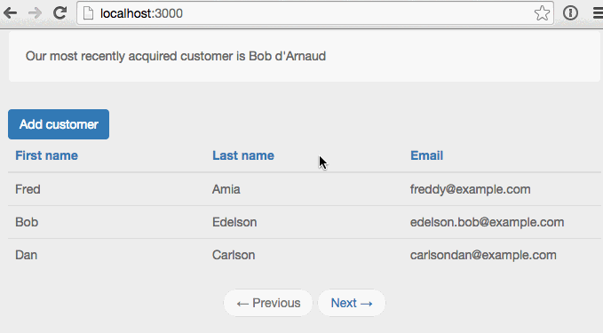

... but hey what's going on?  With that first sort by last name our records are not looking at all right, they should be sorting by last name descending.

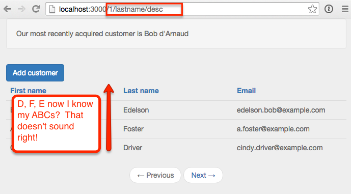

This isn't good, how can that be, everything worked when we were manually entering URLs, so what's going on now?  In fact the sort *still* works if we enter the URL manually and click enter.

#### Some debugging

Let's add some console logging to both our server and client code to see if we can figure things out.  We'll be removing the `DEBUG` code we're adding below so feel free to just read this section and skip actually updating your own code.

##### /server/publications.js

FindFromPublication.publish('customers', function(skipCount, sortField, sortDirection) {
  // parameter validations
  check(skipCount, CustomChecks.positiveIntegerCheck);
  check(sortField, CustomChecks.sortFieldCheck);
  check(sortDirection, CustomChecks.sortDirectionCheck)

  Counts.publish(this, 'customerCount', Customers.find(), {
    noReady: true
  });

  var sortInfo = buildSortParams(sortField, sortDirection);
  var c = Customers.find({}, {
    limit: parseInt(Meteor.settings.public.recordsPerPage),
    skip: skipCount,
    sort: buildSortParams(sortField, sortDirection)
  });

  // DEBUG
  var sortValue = sortInfo[0];
  var fetched = c.fetch();

  console.log('*** RETURNING ***');
  console.log("* ' Sort Value: '" + sortValue + "'");
  console.log(c.fetch());

  return c;
});


OK, we're just throwing both our sort parameters and the records returned from the publication into the console.

We'll do something similar with our subscription:

##### /client/templates/customers/list-customers.js

Template.listCustomers.helpers({
  customers: function() {
    var c = Customers.findFromPublication('customers');
    console.log(c.fetch());
    return c;
  },
  ...
  ...


Now with that all in place let's see what happens when we first click the last name header.

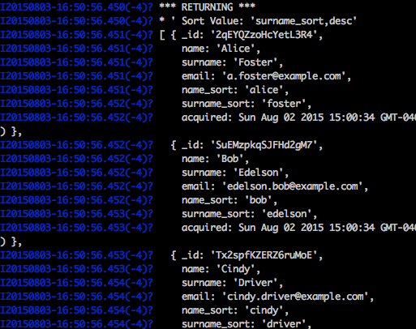

The output of our publication is what we would expect, we are getting 3 records and the records are sorted by last name descending.

What's up with the client thou?  We have the expected 3 records but the sort order is off.

So what's going on?  The problem is that the sort order of a publication does not guarantee anything on the client.  The sorting in the publication only ensures that the correct records are sent over to the client.  On the client side we need to once again explicitly sort the records we receive from the publication.

OK, so we can remove our debug code and get to fixing the issue.

#### Sorting on the client
Now that we've figured out that we'll need to apply the sort parameters on both the server and the client, we should refactor the sort parameter logic into a common function which can be used by both the client and server.

##### Terminal

mkdir lib/helpers
touch lib/helpers/customer-sort-settings.js


##### /lib/helpers/customer-sort-settings.js

CustomerSortSettings = {};

CustomerSortSettings.getSortParams = function(sortField, sortDirection) {
  var sortParams = [];

  var direction = sortDirection || 'asc';

  var field = sortField || 'lastname';
  if (field === 'firstname') {
    sortParams.push(['name_sort', direction]);
    sortParams.push(['surname_sort', direction])
  } else if (field === 'lastname') {
    sortParams.push(['surname_sort', direction]);
    sortParams.push(['name_sort', direction]);
  } else if (field === 'email') {
    sortParams.push(['email', sortDirection]);
  }

  return sortParams;
}


All we've done here is to copy the sort code pretty much verbatim out of `publication.js` and into a helper function.  We've placed the helper function in the `\lib` directory so that it can be accessed both client and server side.

Let's update our publication to make use of the new `customer-sort-settings.js` helper.

##### /server/publications.js

FindFromPublication.publish('customers', function(skipCount, sortField, sortDirection) {
  // parameter validations
  check(skipCount, CustomChecks.positiveIntegerCheck);
  check(sortField, CustomChecks.sortFieldCheck);
  check(sortDirection, CustomChecks.sortDirectionCheck)

  Counts.publish(this, 'customerCount', Customers.find(), {
    noReady: true
  });

  return Customers.find({}, {
    limit: parseInt(Meteor.settings.public.recordsPerPage),
    skip: skipCount,
    sort: CustomerSortSettings.getSortParams(sortField, sortDirection)
  });
});

FindFromPublication.publish('newestCustomer', function() {
  return Customers.find({}, {
    limit: 1,
    sort: {'acquired': -1}
  });
});


We've removed the code that previously built the sort parameters (i.e. `buildSortParameters()`) and instead call out into `CustomerSortSettings.getSortParams...` to get the sort values.

Next let's perform a client side sort.

##### /client/templates/customers/list-customers.js

Template.listCustomers.helpers({
  customers: function() {
    return Customers.findFromPublication('customers', {}, {
      sort: CustomerSortSettings.getSortParams(
        Router.current().params.sortField,
        Router.current().params.sortDirection)
    });
  },
  ...
  ...


Super easy, we've just added a sort to our `find()` call which makes use of the helper we created earlier.

One thing worth cleaning up is the minor logic around the default sort field and sort direction.  We'll pull that into `CustomerSortSettings` along with the sort direction toggle.

##### /lib/helpers/customer-sort-settings.js

...
...
CustomerSortSettings.sortField = function() {
  return Router.current().params.sortField || 'lastname';
}

CustomerSortSettings.sortDirection = function() {
  return Router.current().params.sortDirection || 'asc';
}

CustomerSortSettings.toggleSortDirection = function(sortBy) {
  if (this.sortField() !== sortBy) {
    return 'asc';
  } else {
    if (this.sortDirection() === 'asc') {
      return 'desc';
    } else {
      return 'asc';
    }
  }
}


OK, again we're essentially just moving code around, moving code from `list-customers.js` into our helper class.

Now we can update `list-customers`.  The entire file listing is included below but all we've done is to remove the `toggleSortDirection` function, update the `customers` helper and also the `navigateToCustomerRoute` function.

##### /client/templates/customers/list-customers.js

Template.listCustomers.onCreated(function() {
  var template = this;

  template.autorun(function() {
    var skipCount = (currentPage() - 1) * Meteor.settings.public.recordsPerPage;
    template.subscribe(
      'customers',
      skipCount,
      Router.current().params.sortField,
      Router.current().params.sortDirection
    );
  });
});

Template.listCustomers.helpers({
  customers: function() {
    return Customers.findFromPublication('customers', {}, {
      sort: CustomerSortSettings.getSortParams(
        CustomerSortSettings.sortField(),
        CustomerSortSettings.sortDirection())
    });
  },
  prevPage: function() {
    var previousPage = currentPage() === 1 ? 1 : currentPage() - 1;
    return Router.routes.listCustomers.path({page: previousPage});
  },
  nextPage: function() {
    var nextPage = hasMorePages() ? currentPage() + 1 : currentPage();
    return Router.routes.listCustomers.path({page: nextPage});
  },
  prevPageClass: function() {
    return currentPage() <= 1 ? "disabled" : "";
  },
  nextPageClass: function() {
    return hasMorePages() ? "" : "disabled";
  }
});

Template.listCustomers.events({
  'click #btnAddCustomer': function(e) {
    e.preventDefault();

    Router.go('addCustomer', {page: Router.current().params.page});
  },
  'click #firstName,#lastName,#email': function(e) {
    e.preventDefault();

    if (e.target.id === 'firstName') {
      navigateToCustomersRoute('firstname');
    } else if (e.target.id === 'lastName') {
      navigateToCustomersRoute('lastname');
    } else if (e.target.id === 'email') {
      navigateToCustomersRoute('email');
    }
  }
});

var navigateToCustomersRoute = function(sortField) {
  Router.go('listCustomers', {
    page: Router.current().params.page || 1,
    sortField: sortField,
    sortDirection: CustomerSortSettings.toggleSortDirection(sortField)
  });
}

var hasMorePages = function() {
  var totalCustomers = Counts.get('customerCount');
  return currentPage() * parseInt(Meteor.settings.public.recordsPerPage) < totalCustomers;
}

var currentPage = function() {
  return parseInt(Router.current().params.page) || 1;
}


So in our `find` call for the `customers` helper we now get the sort direction and sort field from the `CustomerSortSettings` helper.

In the `navigate...` function we now call into the toggleSortDirection that we also moved to `customer-sort-settings.js`.

And finally since `toggleSortDirection` is in `customer-sort-setting.js` we can remove it from `list-customers.js`.

### Updating the next and previous buttons
We still have one more problem... clicking the page buttons causes the sort field and direction to clear out.

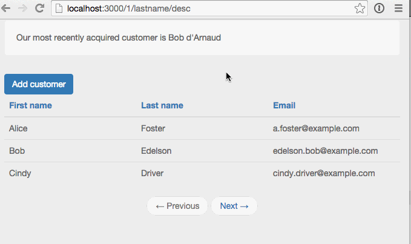

This is easy to fix, we just need to add the new URL parameters to our next and previous links.

##### /client/templates/customers/list-customers.js

...
prevPage: function() {
  var previousPage = currentPage() === 1 ? 1 : currentPage() - 1;
  return Router.routes.listCustomers.path({
    page: previousPage,
    sortField: Router.current().params.sortField,
    sortDirection: Router.current().params.sortDirection
  });
},
nextPage: function() {
  var nextPage = hasMorePages() ? currentPage() + 1 : currentPage();
  return Router.routes.listCustomers.path({
    page: nextPage,
    sortField: Router.current().params.sortField,
    sortDirection:Router.current().params.sortDirection
  });
},
...


And with that the home stretch is in sight, just one final step.

### Adding a sort indicator
It would be nice to have a sort indicator to provide some visual feedback to the user regarding how the table is currently sorted.  We'll use <a href="http://fortawesome.github.io/Font-Awesome/" target="_blank">font awesome</a> icons to indicate the sort direction.  A <a href="https://atmospherejs.com/natestrauser/font-awesome" target="_blank">package</a> is available, so lets get that added.

##### Terminal

meteor add natestrauser:font-awesome


Now we'll update our table headers to include an icon.

##### /client/templates/customers/list-customers.js

<template name="listCustomers">
  ...
  ...
  <table class="table">
    <thead>
      <tr>
        <th>
          <a id="firstName" href="#">First name
            
              <i class="{{firstNameIconClass}}"></i>
            
          </a>
        </th>
        <th>
          <a id="lastName" href="#">Last name
            
              <i class="{{lastNameIconClass}}"></i>
            
          </a>
        </th>
        <th>
          <a id="email" href="#">Email
            
              <i class="{{emailIconClass}}"></i>
            
          </a>
        </th>
      </tr>
    </thead>
    <tbody>
    ...
    ...


So we've added icon classes to each header.  Now we need to define those in `list-customers.js`.

##### /client/templates/customers/list-customers.js

... existing code

Template.listCustomers.helpers({
  ...
  ...
  ,
  firstNameIconClass: function() {
    return CustomerSortSettings.getSortIconClass("firstname");
  },
  lastNameIconClass: function() {
    return CustomerSortSettings.getSortIconClass("lastname");
  },
  emailIconClass: function() {
    return CustomerSortSettings.getSortIconClass("email");
  }
});
...
...


All we're doing is calling into a new function we've created in `customer-sort-settings.js`.

##### /lib/customer-sort-settings.js

... existing code

CustomerSortSettings.getSortIconClass = function(element) {
  if (this.sortField() === element) {
    return this.sortDirection() === "asc" ?
      "fa fa-sort-asc" : "fa fa-sort-desc";
  } else {
    return "fa fa-sort";
  }
}


Pretty simple, if the passed in element is the current sort field, we return the `fa-sort-asc` or `fa-sort-desc` icon class based on the current sort direction.  Otherwise we return the double-arrow default sort icon, i.e. `fa-sort`.

And with that... sorting, paging, icons... done!

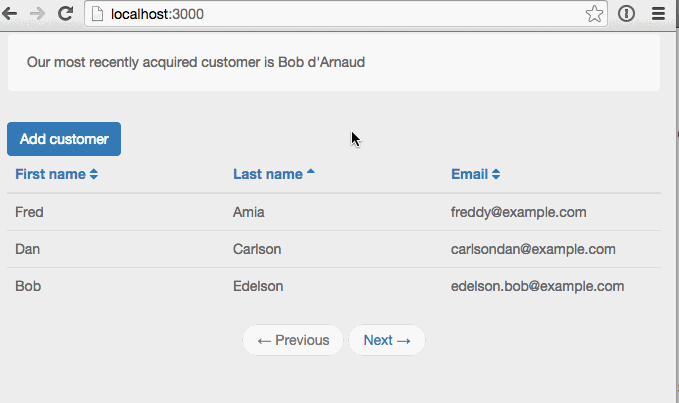

## Summary
So... paging and sorting turns out to be a little tricky in Meteor, as evidenced by <a href="/paging-and-sorting-part-1a/" target="_blank">part 1a</a> even trickier than I first imagined!  The good news is that with the help of some great 3rd party packages it's more than doable.

Thanks for reading and hope this series of posts helped you get sorted (ha, ha, sorry... bad jokes are the only ones I got).
