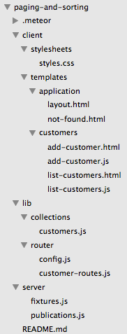

I recently viewed a great <a href="http://www.telescopeapp.org/blog/telescope-package-based-architecture/" target="_blank">screen cast</a> by <a href="http://sachagreif.com/" target="_blank">Sacha Grief</a> where he explains <a href="http://www.telescopeapp.org/" target="_blank">Telescope's</a> package based architecture.

We're going to take an existing application and apply the principles laid out in Sacha's screen cast to convert the application to a package based architecture.  We'll be replicating a lot of the conventions used in Telescope such as utilizing a lib and core package.

## Why packages?
So before we get going, what's the point of using a package based architecture?
Well, there are a number of reasons that Sacha covers in his screen cast:

* File load order.  The load order of files is explicit when using packages. This means you can avoid any load order issues that might occur with a traditional structure.
* Updates.  Updates on your application can be handled via Meteor update.
* Customizations are easier.  If someone alters the source to add features, this can be done via a package, thus ensuring the core code of the application is not compromised.
* Code organization.  With packages, organization of your code is more modular and coupling between components is reduced or eliminated completely.
  * Typically each feature has it's own package.
  * Each feature is independent, you can remove a package and the application still works.

## Why not packages?
The only real drawback to using a package based architecture is that it adds some minor complexity.

For smaller projects, a package approach *might* be overkill.  However, I'm very impressed with the package approach and feel even for small projects it could be worthwhile despite the added overhead.

## What we'll build

For those of you who have gone through the <a href="/paging-and-sorting-part-1/" target="_blank">paging and sorting</a> tutorial, this is going to look familiar.  Sorry about the recycled application, but taking an existing application seemed like a good way to demonstrate the differences between a standard and package based architecture.

Note we won't be doing much explanation or examination of the actual implementation code, mostly we'll be moving code around and dealing with `package.js` files.  If you want an explanation of the code, check out the <a href="/paging-and-sorting-part-1/" target="_blank">paging and sorting</a> tutorial.

## Creating the app
If you've gone through the paging and sorting tutorial you can use the existing code you built out from that.  If not or if you want to start from a fresh code base you can clone the starting point for this post from GitHub.

### Clone the Repo
Note, if you aren't familiar with Git and / or don't have it installed you can download a zip of the code <a href="https://github.com/riebeekn/package-based-architecture/archive/part-0.zip">here</a>.

##### Terminal

git clone -b part-0 https://github.com/riebeekn/package-based-architecture.git


### A quick over-view of where we're starting from
Open up the code in your text editor of choice and you'll see a pretty standard Meteor file structure.

By the time we're done, our project structure will look radically different: 

### Start up the app
OK, let's see where we're starting from.

##### Terminal

cd package-based-architecture
meteor --settings settings.json


You should now see the starting point for our application when you navigate your browser to <a href="http://localhost:3000" target="_blank">http://localhost:3000</a>.

## An over-view of the packages we'll be creating
Our goal is to break up the code into a package based structure.

Now our application is a contrived example and as a result we're going to go a little package crazy with it, we'll be splitting up the "list", "add", and "newest customer" functionality.

This is for illustration purposes, with a real application, likely all the customer functionality would be contained in a single package, i.e. `customertracker-customer`.

However, for our purposes, we'll be creating the following packages:

* customertracker-lib
* customertracker-core
* customertracker-customer
* customertracker-list
* customertracker-add
* customertracker-newest

We'll be taking an iterative approach so our application will continue be usable throughout the conversion process.

Let's get started!

## Creating the lib package
We'll be following the same convention as <a href="http://www.telescopeapp.org/" target="_blank">Telescope</a> and creating a `lib` package.  The purpose of this package is to contain all our core Meteor and 3rd party references.  This is also where we set up the global namespace for our application.

### Implementation
First off we need to create some directories and files.

##### Terminal

mkdir -p packages/customertracker-lib/lib
touch packages/customertracker-lib/package.js
touch packages/customertracker-lib/lib/core.js


Then we'll set up the global namespace.  We'll call our application 'Customer Tracker' so will go with that for the namespace.

##### /packages/customertracker-lib/lib/core.js

CustomerTracker = {};

CustomerTracker.VERSION = '0.0.1';


All we're doing here is setting up a namespace and setting a version attribute on the namespace.  The point of a global namespace is to ensure we don't end up with namespace collisions with 3rd party components or other javascript libraries.

Now let's move onto the `package.js` file.

The main purpose of the `lib` package is to reference our 3rd party packages, so let's see what packages our application currently uses:

##### Terminal

meteor list


Awesome, with the above information we can now fill in `package.js`.

##### /packages/customertracker-lib/package.js

Package.describe({
  name: 'customertracker:lib',
  summary: 'Customer tracker third party libraries and global namespace.',
  version: '0.0.1',
  git: 'https://github.com/riebeekn/package-based-architecture'
});

Package.onUse(function (api) {
  api.versionsFrom(['METEOR@1.0']);

  var packages = [
    'meteor-platform',
    'iron:router@1.0.9',
    'twbs:bootstrap@3.3.5',
    'sacha:spin@2.3.1',
    'tmeasday:publish-counts@0.6.0',
    'percolate:find-from-publication@0.1.0',
    'aldeed:collection2@2.3.3',
    'natestrauser:font-awesome@4.3.0',
    'iron:router@1.0.9'
  ];

  api.use(packages);

  api.imply(packages);

  api.addFiles([
    'lib/core.js',
  ], ['client', 'server']);

  api.export([
    'CustomerTracker'
  ]);
});


We'll quickly go over each section of `package.js`.  For an excellent and very detailed explanation of Meteor packages, check out <a href="http://themeteorchef.com/recipes/writing-a-package/" target="_blank">writing a package</a> by the <a href="http://themeteorchef.com/" target="_blank">Meteor Chef</a>.

#### The describe section


Package.describe({
  name: 'customertracker:lib',
  summary: 'Customer tracker third party libraries and global namespace.',
  version: '0.0.1',
  git: 'https://github.com/riebeekn/package-based-architecture'
});


This section of the file just sets some basic attributes for the package.  The `name` attribute is important as that is what we'll use to refer to the package when we add it to our application, i.e. when we issue the `meteor add` command.

The version is also a critical piece of information as it is used by `meteor update` to indicate when a new version of the package is available.

#### Specifying compatible Meteor versions


Package.onUse(function (api) {
  api.versionsFrom(['METEOR@1.0']);


OK, next we have the `package.onUse` block which is basically the definition of the package.  The `api.versionsFrom` line indicates the version of Meteor that our package requires.  We've specified `1.0`, so we're saying our package can be used with any version of Meteor 1.0 or higher.

#### Linking to 3rd party packages and Meteor core packages
Next we specify the packages our custom package uses.


var packages = [
  'meteor-platform',
  'iron:router@1.0.9',
  'twbs:bootstrap@3.3.5',
  'sacha:spin@2.3.1',
  'tmeasday:publish-counts@0.6.0',
  'percolate:find-from-publication@0.1.0',
  'aldeed:collection2@2.3.3',
  'natestrauser:font-awesome@4.3.0',
  'iron:router@1.0.9'
];

api.use(packages);

api.imply(packages);


Here's where the information we gleaned from `meteor list` comes into play.  We set up a `packages` array to contain our list of packages.  Note for third party packages the version number is required.

`api.use` indicates which packages are required by our custom package and makes use of the package array we put together.

`api.imply` exposes the internal packages of the `lib` package to any packages that in turn use `lib`.  This means for instance that if you use the `lib` package in a second package, say `secondpackage`, then `secondpackage` has access to `iron:router` etc. without having to explicitly include it in it's own `package.js` file.

This is very useful as it means you only need to specify a dependency once and don't need to worry about conflicting version numbers for the same 3rd party package creeping into different parts of your application's `package.js` files.  If you're a little confused, don't worry, when we implement the `core` package we'll see a concrete example of `imply` which will help to better illustrate why `imply` is so useful.

#### Specifying the files to load
Next we have the `addFiles` section.


api.addFiles([
  'lib/core.js',
], ['client', 'server']);


Unlike a traditionally structured Meteor application you need to explicitly specify which files Meteor should load.  For `lib`, we only have the one file, `core.js` and it should be available on both the client and server, thus the `['client', 'server']` array.

#### Exporting items available outside the package
Finally we need to export any variables we want to have access to outside of our package.


api.export([
  'CustomerTracker'
]);


We want access to the `CustomerTracker` namespace variable, so we've added an export entry for it.

### Usage
Now comes the exciting part, using the package we created.  First thing we'll do is blank out our existing package file.

##### /.meteor/packages.js

# Meteor packages used by this project, one per line.
# Check this file (and the other files in this directory) into your repository.
#
# 'meteor add' and 'meteor remove' will edit this file for you,
# but you can also edit it by hand.


Bam, as expected our app is now crashing hard!

Time for our new package to come to the rescue.

##### Terminal

meteor add customertracker:lib


And we're back working!

Also we now have access to our namespace variable.

Our main package file now contains the single custom package we created:

##### /.meteor/packages.js

# Meteor packages used by this project, one per line.
# Check this file (and the other files in this directory) into your repository.
#
# 'meteor add' and 'meteor remove' will edit this file for you,
# but you can also edit it by hand.

customertracker:lib


This is pretty cool, we're now referencing all our third party and Meteor core packages through the `lib` package we created.

Another great thing about the way packages work that we've illustrated is that if you're converting an existing application to use packages, you can do it in steps instead of all at once.  This means you can continue to add features instead of needing to stop all new development until everything is converted.

## Creating the core package
Next up is `customertracker:core`.  This package will contain the bare skeleton of our application.  In our case we'll include our general layout pages, our router configuration and our custom parameter checking code.

### Implementation
OK, let's get started by creating some directories and files.

##### Terminal

mkdir -p packages/customertracker-core/lib/client/stylesheets
touch packages/customertracker-core/lib/client/stylesheets/styles.css
mkdir packages/customertracker-core/lib/client/templates
mkdir packages/customertracker-core/lib/server
mkdir packages/customertracker-core/lib/router
touch packages/customertracker-core/package.js


Now let's move some of our existing code into our new package.

##### Terminal

mv client/templates/application/layout.html packages/customertracker-core/lib/client/templates/
mv client/templates/application/not-found.html packages/customertracker-core/lib/client/templates/
mv lib/router/config.js packages/customertracker-core/lib/router/
mv server/helpers/custom-checks.js packages/customertracker-core/lib/server


In the case of the custom check code we'll update it to use the namespace we created in the `lib` package.

##### /packages/customertracker-core/lib/server/custom-checks.js

CustomerTracker.checks = {};

CustomerTracker.checks.positiveIntegerCheck = Match.Where(function(x) {
  check(x, Match.Integer);
  return x >= 0;
});

CustomerTracker.checks.sortFieldCheck = Match.Where(function(x) {
  if (x) {
    check(x, String);
    return x === 'firstname' || x === 'lastname' || x ==='email';
  } else {
    return true;
  }
});

CustomerTracker.checks.sortDirectionCheck = Match.Where(function(x) {
  if (x) {
    check(x, String);
    return x === 'asc' || x === 'desc';
  } else {
    return true;
  }
});


OK, all we've done is update the code to use our new namespace.

We'll need to change our publications to reflect this namespace change.

##### /server/publications.js

FindFromPublication.publish('customers', function(skipCount, sortField, sortDirection) {
  // parameter validations
  check(skipCount, CustomerTracker.checks.positiveIntegerCheck);
  check(sortField, CustomerTracker.checks.sortFieldCheck);
  check(sortDirection, CustomerTracker.checks.sortDirectionCheck);

  ...
  ...


Simple, we've just updated `CustomChecks...` to `CustomerTracker.checks...`.

Next let's update our stylesheet in both our existing application and the package.

##### /client/stylesheets/styles.css

/*body {
  background: #eee;
  color: #666666;
}*/

th {
  width: 33%;
}

.btn-primary {
  margin-top: 10px;
}


##### /packages/customertracker-core/lib/client/stylesheets/styles.css

body {
  background: #eee;
  color: #666666;
}


All we're doing is moving the "core" styles into our core package.  Since we don't have much styling going on, it's only the `body` style element that we need to move.

Now that we've moved some of our layout and router code out of our application and updated our stylesheets, we'll see that the UI isn't looking too hot.

Our styling is gone and our publication for listing customers is failing due to the custom check code not being available.

Let's update our package file so that we can get our original look and feel back and get the publication working again.

##### /packages/customertracker-core/package.js

Package.describe({
  name: 'customertracker:core',
  summary: 'Customer tracker core libraries.',
  version: '0.0.1',
  git: 'https://github.com/riebeekn/package-based-architecture'
});

Package.onUse(function(api) {

  api.versionsFrom("METEOR@1.0");

  var packages = [
    'customertracker:lib@0.0.1',
  ];

  api.use(packages);

  api.imply(packages);

  api.addFiles([
    'lib/router/config.js',
  ], ['client', 'server']);

  api.addFiles([
    'lib/client/stylesheets/styles.css',
    'lib/client/templates/layout.html',
    'lib/client/templates/not-found.html',
  ], 'client');

  api.addFiles([
    'lib/server/custom-checks.js'
  ], 'server');
});


OK, so very similar to the package file we put together for `customertracker-lib`.  The main point of difference being that we have a single package we're using, our `lib` package.  By including it, we are also including all the 3rd party packages from `lib` via the `imply` line included in `lib` that we discussed earlier.

Note once again we are using imply with the `core` package as we want packages that use `core` to have access to the packages referenced within `core`, i.e. all the packages included in `lib`.

A diagram will give a better illustration of what we're aiming for:

### Usage
Let's update our application to use the new package.

##### Terminal

meteor add customertracker:core


And there we go, our layout and styles are now back in place!

## Creating the customer package
Now we'll start getting into the packages that deal with our customer specific functionality.  The `customertracker:customer` package is going to contain our collection and fixture code, as well as our routes for the customer functionality.

### Implementation
Once again, let's start off by creating some directories and files.

##### Terminal

mkdir -p packages/customertracker-customer/lib/server
touch packages/customertracker-customer/package.js


Now we'll move our schema and fixture file out of our existing application and copy over our collection file.

##### Terminal

cp lib/collections/customers.js packages/customertracker-customer/lib/collections.js
mv lib/schemas/customers.js packages/customertracker-customer/lib/schemas.js
mv lib/router/customer-routes.js packages/customertracker-customer/lib/routes.js
mv server/fixtures.js packages/customertracker-customer/lib/server/


As expected this is going to cause all kinds of trouble for our application.

Before getting started on our package file, we need to make an update to our collection in both the package and existing application.

##### /packages/customertracker-customer/lib/collections.js

Customers = new Mongo.Collection('customers');

// we've removed the insert method, it will eventually
// become part of the customertracker:add package


##### /lib/colletions/customers.js

// removing the collection as it's now part
// of customertracker:customer
// Customers = new Mongo.Collection('customers');

Meteor.methods({
  customerInsert: function(customerAttributes) {
    check(customerAttributes, {
      name: String,
      surname: String,
      email: String
    });

    Customers.insert(customerAttributes);
  }
});


We've moved the collection into our package, while maintaining the `insertCustomer` method outside of the package.

So let's get our package file updated so we can get our app back up and working.

##### /packages/customertracker-customer/package.js

Package.describe({
  name: 'customertracker:customer',
  summary: 'Contains collections and schemas for core customer functionality',
  version: '0.0.1',
  git: 'https://github.com/riebeekn/package-based-architecture'
});

Package.onUse(function(api) {

  api.versionsFrom("METEOR@1.0");

  var packages = [
    'customertracker:core@0.0.1',
  ];

  api.use(packages);

  api.addFiles([
    'lib/collections.js',
    'lib/routes.js',
    'lib/schemas.js'
  ], ['client', 'server']);

  api.addFiles([
    'lib/server/fixtures.js'
  ], 'server');

  api.export([
    'Customers'
  ]);
});


Pretty simple, we're using a single package, the `core` package we created earlier.  Then as before specifying the files in our package and exporting the `Customers` collection so it can be used outside of our package.

### Usage
Now to get things working we just need to make use of our new package.

##### Terminal

meteor add customertracker:customer


### Load order example
Let's go on a quick diversion and see an example of load order in action.  We can manipulate the load order of the `customer` package and trigger an error via altering the "client / server" `addFiles` call.  If we reverse the load order the application will crash.

##### /packages/customertracker-customer/package.js

api.addFiles([
  'lib/routes.js',
  'lib/schemas.js',
  'lib/collections.js'
], ['client', 'server']);


As the console log suggests, the problem is that if we attempt to load our schema file before the collection file, we'll be attempting to attach our schema onto a customers collection that is not yet defined.

So this illustrates how you can control the load order of a package, the files get loaded in the order they are specified in the `addFiles` array.  This can be a much more elegant solution to load order issues compared to a traditional Meteor application where you would need to create nested folders or rename files.

## Creating the newest customer package
OK, time to package up some of our UI elements.  The `customertracker-newest` package will be responsible for the "most recently acquired" section of our UI, i.e.

### Implementation
As usual we'll start off by creating some files and directories.

##### Terminal

mkdir -p packages/customertracker-newest/lib/client/templates
mkdir -p packages/customertracker-newest/lib/server
touch packages/customertracker-newest/package.js


And now let's move some code.

##### Terminal

mv client/templates/customers/newest-customer.html packages/customertracker-newest/lib/client/templates
mv client/templates/customers/newest-customer.js packages/customertracker-newest/lib/client/templates


With these changes our application is once again crashing.  This is because we are now missing the `newestCustomer` template.

We're going to come up with a better solution for handling this but for now we'll make a change to the `listCustomers` template to get rid of our error.

##### /client/templates/customers/list-customers.js

... existing code

Template.listCustomers.helpers({
  hasNewCustomerTemplate: function() {
    return Template["newestCustomer"];
  },
  customers: function() {
  ...
  ...


All we're doing here is adding a new helper function that returns a boolean value indicating whether the `newestCustomer` template exists or not.

We can then use this helper in our HTML file.

##### /client/templates/customers/list-customers.html

<template name="listCustomers">
  {{#if hasNewCustomerTemplate}}
    {{> newestCustomer}}
  {{/if}}
  

  ...
  ...


With that in place our app is back working without the new customer portion of the UI.

Before updating our package file we need to add the publication for our newest customer functionality.

So first let's update our existing publication file.

##### /server/publications.js

FindFromPublication.publish('customers', function(skipCount, sortField, sortDirection) {
  // parameter validations
  check(skipCount, CustomerTracker.checks.positiveIntegerCheck);
  check(sortField, CustomerTracker.checks.sortFieldCheck);
  check(sortDirection, CustomerTracker.checks.sortDirectionCheck)

  Counts.publish(this, 'customerCount', Customers.find(), {
    noReady: true
  });

  return Customers.find({}, {
    limit: parseInt(Meteor.settings.public.recordsPerPage),
    skip: skipCount,
    sort: CustomerSortSettings.getSortParams(sortField, sortDirection)
  });
});

// GET RID OF THIS, MOVING IT INTO THE PACKAGE
// FindFromPublication.publish('newestCustomer', function() {
//   return Customers.find({}, {
//     limit: 1,
//     sort: {'acquired': -1}
//   });
// });


Nothing complicated going on here, we've just commented out the publication we'll be moving.

Now let's add it to our package.

##### Terminal

touch packages/customertracker-newest/lib/server/publications.js


And now we can update the file.

##### /packages/customertracker-newest/lib/server/publications.js

FindFromPublication.publish('newestCustomer', function() {
  return Customers.find({}, {
    limit: 1,
    sort: {'acquired': -1}
  });
});


Simple, we've just moved the code we commented out into our package.

Now let's update `package.js`.

##### /packages/customertracker-newest/package.js

Package.describe({
  name: 'customertracker:newest',
  summary: 'Customer tracker newest customer functionality',
  version: '0.0.1',
  git: 'https://github.com/riebeekn/package-based-architecture'
});

Package.onUse(function(api) {

  api.versionsFrom("METEOR@1.0");

  api.use(['customertracker:core@0.0.1']);

  api.addFiles([
    'lib/client/templates/newest-customer.html',
    'lib/client/templates/newest-customer.js'
  ], 'client');

  api.addFiles([
    'lib/server/publications.js'
  ], 'server');
});


Pretty simple, we're just adding the necessary files and referencing our `core` package.

### Usage
Time to get our newest customer showing up again.

##### Terminal

meteor add customertracker:newest


And with that our newest customer component is once again showing up in the UI.

## Creating the list package
Next let's move the list functionality into a package.

### Implementation
This is getting redundant right?  But that's a good thing, we're getting the hang of creating these packages and so far it's turning out to be pretty easy.  Let's get some files and directories created.

##### Terminal

mkdir -p packages/customertracker-list/lib/client/stylesheets
touch packages/customertracker-list/lib/client/stylesheets/styles.css
mkdir packages/customertracker-list/lib/client/templates
mkdir packages/customertracker-list/lib/server
touch packages/customertracker-list/package.js


And now we can move some files.

##### Terminal

mv client/templates/customers/list-customers.html packages/customertracker-list/lib/client/templates/
mv client/templates/customers/list-customers.js packages/customertracker-list/lib/client/templates/
mv lib/helpers/customer-sort-settings.js packages/customertracker-list/lib/
mv server/publications.js packages/customertracker-list/lib/server/


Again, we're just moving the relevant files to our package, and as expected this causes our application to crash.

With our list component we have a style element to move, so let's update our existing style file.

##### /client/styles/styles.css

/*body {
  background: #eee;
  color: #666666;
}*/

/*th {
  width: 33%;
}*/

.btn-primary {
  margin-top: 10px;
}


We're slowly getting rid of our styles, we've commented out the `th` style and we'll move this into our package.

##### /packages/customertracker-list/lib/client/stylesheets/styles.css

th {
  width: 33%;
}


Now it's time to update `package.js`.

##### /packages/customertracker-list/package.js

Package.describe({
  name: 'customertracker:list',
  summary: 'Customer tracker list functionality.',
  version: '0.0.1',
  git: 'https://github.com/riebeekn/package-based-architecture'
});

Package.onUse(function(api) {

  api.versionsFrom("METEOR@1.0");

  api.use(['customertracker:core@0.0.1']);

  api.addFiles([
    'lib/customer-sort-settings.js',
  ], ['client', 'server']);

  api.addFiles([
    'lib/client/stylesheets/styles.css',
    'lib/client/templates/list-customers.html',
    'lib/client/templates/list-customers.js'
  ], 'client');

  api.addFiles([
    'lib/server/publications.js'
  ], 'server');
});


Once again we're using `core` and adding the necessary files.

### Usage
OK, let's get our app back working.

##### Terminal

meteor add customertracker:list


Sweet, that was easy, onto the next package!

## Creating the add package
OK, our last package... once we get this sucker finished off, we'll be completely package based.

As you can probably guess from the name, this package will handle our add functionality.

### Implementation
Yup, that's right, time to create some directories and files.

##### Terminal

mkdir -p packages/customertracker-add/lib/client/stylesheets
touch packages/customertracker-add/lib/client/stylesheets/styles.css
mkdir packages/customertracker-add/lib/client/templates
touch packages/customertracker-add/package.js


Now let's move our files.

##### Terminal

mv client/templates/customers/add-customer.html packages/customertracker-add/lib/client/templates
mv client/templates/customers/add-customer.js packages/customertracker-add/lib/client/templates
mv lib/collections/customers.js packages/customertracker-add/lib/methods.js


Now our add customer functionality is broken.

We can move our final piece of styling out of our original application.

##### /client/stylesheets/styles.css

/*body {
  background: #eee;
  color: #666666;
}*/

/*th {
  width: 33%;
}*/

/*.btn-primary {
  margin-top: 10px;
}*/


Everything in the original file has been commented out, let's add the button style to our add package.

##### /packages/customertracker-add/lib/client/stylesheets/styles.css

.btn-primary {
  margin-top: 10px;
}


Now let's update the package file.

##### /packages/customertracker-add/package.js

Package.describe({
  name: 'customertracker:add',
  summary: 'Contains add customer functionality',
  version: '0.0.1',
  git: 'https://github.com/riebeekn/package-based-architecture'
});

Package.onUse(function(api) {

  api.versionsFrom("METEOR@1.0");

  // note need to include this to get the 3rd party packages from lib
  api.use(['customertracker:core@0.0.1']);

  api.addFiles([
    'lib/methods.js',
  ], ['client', 'server']);

  api.addFiles([
    'lib/client/stylesheets/styles.css',
    'lib/client/templates/add-customer.html',
    'lib/client/templates/add-customer.js'
  ], 'client');
});


No explanation needed, we've seen this all before!

### Usage
OK, let's get our add functionality back working.

##### Terminal

meteor add customertracker:add


And there we go, we're package complete!  Our application is working as before but everything is running from packages.

## Some clean-up
So now that we have everything wrapped up in packages we can do some clean up on our directory structure.

##### Terminal

trash client
trash lib
trash server


I was recently made aware of the <a href="http://hasseg.org/trash/" target="_blank">trash</a> command via this excellent <a href="https://medium.com/@SamCorcos/building-campaignhawk-with-meteor-and-react-part-2-d4551708dcde" target="_blank">post</a> by <a href="https://medium.com/@SamCorcos" target="_blank">Sam Corcos</a>.  As per the trash homepage, trash can be easily installed via Homebrew with `brew install trash`.

You can also go with `rm -r client` etc. or manually remove the folders if you don't want to install trash.

In any case, however you delete your folders, you should now see that everything is completely within package directories.

## Updating our packages to be more modular
There are a few artifacts of the original implementation which limit the modularity of our package based implementation.  Ideally we want our 'feature' packages, i.e. the 'list', 'add', and 'new' packages to work independently.

This isn't currently the case however, if we remove our list functionality the application crashes, i.e.

##### /.meteor/packages

# Meteor packages used by this project, one per line.
# Check this file (and the other files in this directory) into your repository.
#
# 'meteor add' and 'meteor remove' will edit this file for you,
# but you can also edit it by hand.

customertracker:lib
customertracker:core
customertracker:customer
customertracker:newest
#customertracker:list
customertracker:add


We've commented out `customertracker:list`, which results in:

Likewise if we remove our add package, we still have an add button on our main list page.

##### /.meteor/packages

# Meteor packages used by this project, one per line.
# Check this file (and the other files in this directory) into your repository.
#
# 'meteor add' and 'meteor remove' will edit this file for you,
# but you can also edit it by hand.

customertracker:lib
customertracker:core
customertracker:customer
customertracker:newest
customertracker:list
#customertracker:add


### Making our three feature packages modular.
To enhance modularity we will create a main index page for our customer functionality.  We'll also remove the add button from the `listCustomer` template and put it in it's own template.

Let's start off by creating the index page.  A good place for this file will be in the `customer` package; it is specific to our customer functionality but not associated with the "list", "new", or "add" functionality.

##### Terminal

mkdir -p packages/customertracker-customer/lib/client/templates
touch packages/customertracker-customer/lib/client/templates/customer-index.html


##### /packages/customertracker-customer/lib/client/templates/customer-index.html

<template name="customerIndex">
  {{> render name='newestCustomer'}}
  {{> render name='addCustomerButton'}}
  {{> render name='listCustomers'}}
</template>


OK, so all we're doing here is laying out the components we want on our main index page.  What's up with that `render` function?  Well we want to only render components that exist so we'll create a helper to handle the rendering of our optional components.

We'll throw this into our `core` package as it's something that could be useful outside of the customers functionality.  For instance if we enhanced our application to include orders, we might want access to the helper in the orders packages.  These packages might not reference `customertracker:customer` but would certainly reference `core`.

##### Terminal

touch packages/customertracker-core/lib/client/spacebar-helpers.js


##### /packages/customertracker-core/lib/client/spacebar-helpers.js

Template.registerHelper('render', function () {
  return Template[this.name] ? Template[this.name] : null;
});


Pretty simple we're just checking if a template exists, if it does we return it, otherwise we return `null`.  This will prevent attempts to render non existent templates.

So let's update our `package.js` files to take into account our new items.

##### /packages/customertracker-customer/package.js

...
...

  api.use(packages);

  api.addFiles([
    'lib/collections.js',
    'lib/routes.js',
    'lib/schemas.js'
  ], ['client', 'server']);

  api.addFiles([
    'lib/server/fixtures.js'
  ], 'server');

  api.addFiles([
    'lib/client/templates/customer-index.html'
  ], 'client');

  api.export([
    'Customers'
  ]);
});


##### /packages/customertracker-core/package.js

...
...

  api.use(packages);

  api.imply(packages);

  api.addFiles([
    'lib/router/config.js',
  ], ['client', 'server']);

  api.addFiles([
    'lib/client/stylesheets/styles.css',
    'lib/client/templates/layout.html',
    'lib/client/templates/not-found.html',
    'lib/client/spacebar-helpers.js'
  ], 'client');

  api.addFiles([
    'lib/server/custom-checks.js'
  ], 'server');
});


Now we need to create our add button template and remove the button from the `listCustomers` template.

##### Terminal

touch packages/customertracker-add/lib/client/templates/add-customer-button.html
touch packages/customertracker-add/lib/client/templates/add-customer-button.js


##### /packages/customertracker-add/lib/client/templates/add-customer.html

<template name="addCustomerButton">
  

    

      <a class="btn btn-primary" id="btnAddCustomer">Add customer</a>
    

  

</template>


##### /packages/customertracker-add/lib/client/templates/add-customer-button.js

Template.addCustomerButton.events({
  'click #btnAddCustomer': function(e) {
    e.preventDefault();

    Router.go('addCustomer', {page: Router.current().params.page});
  }
});


Simple, we've just copied the HTML and JS code for the add button into our newly created files.

Let's update our package file.

##### /packages/customertracker-add/package.js

...
...
  api.addFiles([
    'lib/client/stylesheets/styles.css',
    'lib/client/templates/add-customer.html',
    'lib/client/templates/add-customer.js',
    'lib/client/templates/add-customer-button.html',
    'lib/client/templates/add-customer-button.js'
  ], 'client');
});


Now we need to remove the add button and newest customer code from our list package.

##### /packages/customertracker-list/lib/client/templates/list-customers.html

<template name="listCustomers">
<!--
  {{#if hasNewCustomerTemplate}}
    {{> newestCustomer}}
  {{/if}}
  

    

      <a class="btn btn-primary" id="btnAddCustomer">Add customer</a>
    

  

-->

  {{#unless Template.subscriptionsReady}}
    {{> spinner}}
  {{/unless}}
  <table class="table">


So we've removed the rendering of both the `newestCustomer` template and the add button code.

We can now remove the add button handler.

##### /packages/customertracker-list/lib/client/templates/list-customers.js

...
Template.listCustomers.events({
  // 'click #btnAddCustomer': function(e) {
  //   e.preventDefault();

  //   Router.go('addCustomer', {page: Router.current().params.page});
  // },
  'click #firstName,#lastName,#email': function(e) {
    e.preventDefault();

    if (e.target.id === 'firstName') {
      navigateToCustomersRoute('firstname');
    } else if (e.target.id === 'lastName') {
      navigateToCustomersRoute('lastname');
    } else if (e.target.id === 'email') {
      navigateToCustomersRoute('email');
    }
  }
});
...


And also the helper method we added earlier to check for the existence of the newest customer template.

##### /packages/customertracker-list/lib/client/templates/list-customers.js

...
Template.listCustomers.helpers({
  // hasNewCustomerTemplate: function() {
  //   return Template["newestCustomer"];
  // },
  customers: function() {
    return Customers.findFromPublication('customers', {}, {
      sort: CustomerSortSettings.getSortParams(
        CustomerSortSettings.sortField(),
        CustomerSortSettings.sortDirection())
    });
  },
...


Next we need to update our routes since we no longer want our `listCustomers` template to act as our root route.

##### /packages/customertracker-customer/lib/routes.js

Router.route('/customer/add', {
  name: 'addCustomer'
});

Router.route('/:page?/:sortField?/:sortDirection?', {
  name: 'customerIndex'
});


We want our root route to hit our new `customerIndex` template instead of directly hitting the  `listCustomers` template.

With the router changes we need to update code that refers to the old `listCustomers` route to instead refer to the `customerIndex` route.

##### /packages/customertracker-list/lib/client/templates/list-customers.js

...
  prevPage: function() {
    var previousPage = currentPage() === 1 ? 1 : currentPage() - 1;
    return Router.routes.customerIndex.path({
      page: previousPage,
      sortField: Router.current().params.sortField,
      sortDirection: Router.current().params.sortDirection
    });
  },
  nextPage: function() {
    var nextPage = hasMorePages() ? currentPage() + 1 : currentPage();
    return Router.routes.customerIndex.path({
      page: nextPage,
      sortField: Router.current().params.sortField,
      sortDirection:Router.current().params.sortDirection
    });
  },
...
var navigateToCustomersRoute = function(sortField) {
  Router.go('customerIndex', {
    page: Router.current().params.page || 1,
    sortField: sortField,
    sortDirection: CustomerSortSettings.toggleSortDirection(sortField)
  });
}
...


So here we've changed instances of `Router.routes.listCustomers.path` to the new route of `Router.routes.customerIndex.path`.  We've also replaced instances of `Router.go('listCustomers')` with `Router.go('customerIndex)`.

We need to make a similar change in `add-customer.js`.

##### /packages/customertracker-add/lib/client/templates/add-customer.js

Template.addCustomer.events({
  'submit form': function(e) {
    e.preventDefault();

    var customer = {
      name: $(e.target).find('[name=firstName]').val(),
      surname: $(e.target).find('[name=lastName]').val(),
      email: $(e.target).find('[name=email]').val()
    };

    Meteor.call('customerInsert', customer, function(error, result) {
      if (error) {
        alert(error);
        return false;
      }

      Router.go('customerIndex');
    });
  },
  'click #btnCustomersList': function(e) {
    e.preventDefault();

    Router.go('customerIndex');
  }
});


Again we've replaced instances of `Router.go('listCustomers')` with `Router.go('customerIndex)`.

And with that we can now use any combination of the 3 packages.

For instance removing the `list` package results in the following.

Pretty cool, our application still works, we can add customers and view the latest customer that was added, but our list functionality is no longer present.

## Summary
Although very much a contrived example, hopefully this post gives some insight into what's involved in a package based architecture.

Is it pretty silly to use a package based architecture on a small example application?  I'd say yes without a doubt!  However, I am very impressed with this approach to building Meteor applications and I think it merits consideration when creating a non-trivial Meteor application.

Using packages has many advantages, primarily around code organization and keeping your code modular and decoupled.  The ability to add and remove features via `meteor add/remove` is pretty sweet as well.  I can see many situations where this would be useful, such as demonstrating beta features to customers.

The fact that a project can be converted in an iterative manner means an initially small application that looks like it will grow can be upgraded to use packages without completely stalling new feature development, this is great!  Getting buy in on a refactor that will completely halt new feature development is much more difficult than diverting partial effort towards a refactor.

There are certainly some drawbacks to a package based architecture, it is a little more complicated to develop applications in this manner.  You could also run into complexities with package dependencies, for instance circular package dependencies where package A needs package B which needs package A.  In someways this is probably a good thing however, as a circular dependency likely points to a fault with your application structure / design and indicates a refactor is in order.

### Next steps
A great next step if you're interested in further exploring package based architecture is the <a href="https://github.com/TelescopeJS/Telescope" target="_blank">Telescope source</a> on GitHub.  There's nothing like looking through a real world application.

For some other thoughts on various options regarding Meteor project structures, there's an interesting <a href="https://meteorcasts.net/" target="_blank">Meteor Casts</a> <a href="https://meteorcasts.net/ep/10" target="_blank">episode</a> that is worth a watch.

### References
A couple of great resources that helped with putting together this post include:

* <a href="http://www.telescopeapp.org/blog/telescope-package-based-architecture/" target="_blank">Sacha Greif's screen cast on package based architecture</a>.
* <a href="https://meteor.hackpad.com/Building-Large-Apps-Tips-d8PQ848nLyE" target="_blank">The hackpad referenced in Sacha's screencast</a>.
* <a href="http://themeteorchef.com/recipes/writing-a-package/" target="_blank">The writing a package tutorial put together by the Meteor Chef</a>.

Thanks for reading and I hope you enjoyed this post!
