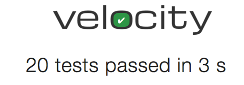
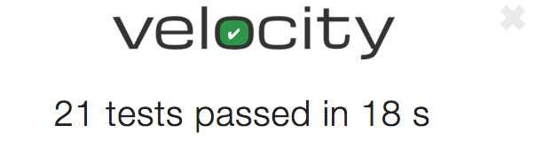
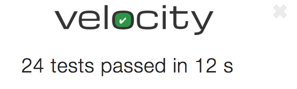
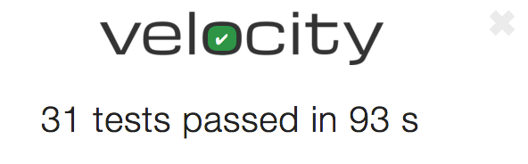
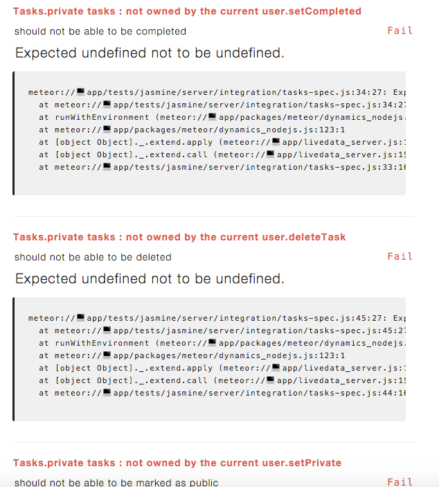

In this post we'll be continuing from where we left off with <a href="/meteor-testing-with-velocity-and-jasmine-part-1/index.html" target="_blank">part 1</a>.  We have a good chunk of the <a href="https://www.meteor.com/tutorials/blaze/creating-an-app" target="_blank">Meteor tutorial</a> completed along with associated tests.  In Part 2 we'll finish the tutorial and deal with handling users and authentication within our tests.

So onto <a href="https://www.meteor.com/tutorials/blaze/adding-user-accounts" target="_blank">step 9...</a>

## Implementing Step 9 of the tutorial

  

    <h3 class="panel-title">Step 9 requirements</h3>
  

  

    <ul>
      <li>The application should allow users to create accounts.</li>
      <li>Only logged in user's can create new tasks.</li>
      <li>Tasks should indicate who created them.</li>
    </ul>
  

### Writing our tests and implementing step 9

OK, since we are adding the concept of users to our application we'll need to update `page-contents` to take into account a login / logout link.

As well, `new-task` will need to include the new rule about logged in users  being the only ones able to create tasks.  Also we'll want to enhance the test to check that tasks are correctly associated with the users that created them.

Finally we need to update `task-item` as tasks now display who created them in the UI.

A bit of set-up is going to be required before we can get to the actual testing.  We need to figure out how to handle accounts within tests.  First off let's add the necessary authentication packages.

##### Terminal

meteor add accounts-ui accounts-password


Now that we have the accounts packages installed, we're going to want to go about creating some user fixtures.

##### Terminal

touch packages/testing/user-fixtures.js


##### /packages/testing/user-fixtures.js

Meteor.startup(function() {

  // Disable rate limiting for our test users
  //
  // As per docs.meteor.com/#/full/ddpratelimiter, "the default limits
  // login attempts, new user creation, and password resets to
  // 5 attempts every 10 seconds per connection"
  //
  // With rate limiting enabled, our tests will fail as we
  // are logging in / logging more than 5x per 10 seconds
  Accounts.removeDefaultRateLimit();

  var user = Meteor.users.findOne({username: 'Bob'});
  if (!user) {
    Accounts.createUser({
      username: 'Bob',
      password : 'foobar'
    });
  }
});


Here we're doing two things, `Accounts.removeDefaultRateLimit();` is necessary to avoid hitting the default rate limit on accounts when running our tests.

Then we are setting up the user we'll be using for our tests, we search for 'Bob' and create him if he doesn't already exist.

We need to update our package file to include the new fixture.

##### /packages/testing/package.js

...
...
api.addFiles([
  'task-fixtures.js',
  'user-fixtures.js'
], 'server');


We've added `user-fixtures.js` to our list of files and now as per <a href="http://robomongo.org/" target="_blank">Robomongo</a> we've got a user in our database.

Next we're going to need a way to login and logout from within our tests.  We could interact with the UI, but we're going to circumvent that by just calling the appropriate Meteor methods.

So we'll create a new file for this purpose in our testing package.

##### Terminal

touch packages/testing/test-user.js


##### /packages/testing/test-user.js

TestUser = {}

TestUser.login = function() {
  if (!Meteor.user())
  {
    Meteor.loginWithPassword('Bob', 'foobar', function(err) {
      if (err) {
        console.log('Login error: ' + err);
      }
    });
  }
}

TestUser.logout = function() {
  if (Meteor.user()) {
    Meteor.logout();
  }
}


Perfect we now have methods for logging in and out which we can call from within our test code.

Again we need to update `package.js`.

##### /packages/testing/package.js

...
  api.addFiles([
    'task-fixtures.js',
    'user-fixtures.js'
  ], 'server');
  api.addFiles([
    'test-user.js'
  ], 'client');

  api.export([
    'TestUser'
  ]);
});


We've added the new file and exported the `TestUser` class.

Finally let's alter our task fixture to automatically assign a user to a task when a user is logged in and default to 'Bob' when a user isn't signed in.

##### /packages/testing/task-fixtures.js

...
var getDefaultTask = function() {
  var defaultUsername = '';
  var defaultOwnerId = '';

  // if a user is logged in, assign that user
  // as the owner of the task, otherwise we'll
  // default to 'Bob'
  if (Meteor.user()) {
    defaultUsername = Meteor.user().username;
    defaultOwnerId = Meteor.user()._id;
  } else {
    var user = Meteor.users.findOne({username: 'Bob'});
    defaultUsername = user.username;
    defaultOwnerId = user._id;
  }

  return {
    text: 'Task text',
    createdAt: new Date(),
    completed: false,
    username: defaultUsername,
    owner: defaultOwnerId
  }
};
...


We're checking if a user is logged in, if so that's who the task gets associated with, otherwise we are going to default the owner to 'Bob'.  We could omit the else block where we assign the task to 'Bob' when a user is not logged in... but automatically assigning a user is going to make the `before` blocks in our tests less bloated, we don't have to worry about always logging in just to get our task data associated with a user.

Sweet, now we can get onto the actual tests.  Let's start by checking for the login / logout link and that the new task field only appears for logged in users.

#### page-contents-spec.js

###### Tests

##### /test/jasmine/client/integration/todos/page-contents-spec.js

describe ("the todo page : page contents", function() {

  describe ("for all users", function() {
    it ("should include a page title of 'Todo List'", function() {
      expect($('title').text()).toEqual('Todo List');
    });

    it ("should include a page heading of 'Todo List' appended " +
        "with the uncompleted task count", function(done) {
      Meteor.setTimeout(function() {
        expect($('h1').text()).toEqual('Todo List (0)');
        done();
      }, 400);
    });

    it ("should include an unordered list for displaying the tasks", function() {
      expect($('ul').length).toEqual(1);
    });

    it ("should include a checkbox for hiding completed tasks", function() {
      expect($('label.hide-completed').find('input:checkbox').length).toEqual(1);
    });

  });

  describe ("for logged in users", function() {

    beforeEach(function() {
      Package.testing.TestUser.login();
    });

    it ("should include a field for entering a new task "
        + "with an appropriate placeholder", function(done) {
      Meteor.setTimeout(function() {
        expect($('.new-task input').attr('placeholder'))
          .toEqual('Type to add new tasks');
        done();
      }, 400);
    });

    it ("should include a logged in user link", function(done) {
      Meteor.setTimeout(function() {
        expect($('a#login-name-link').text()).toMatch("Bob");
        done();
      }, 400);
    });

  });

  describe ("for logged out users", function() {

    beforeEach(function() {
      Package.testing.TestUser.logout();
    });

    it ("should not include a field for entering a new task", function(done) {
      Meteor.setTimeout(function() {
        expect($('.new-task input').length).toEqual(0);
        done();
      }, 400);
    });

    it ("should include a login link", function(done) {
      Meteor.setTimeout(function() {
        expect($('a#login-sign-in-link').length).toEqual(1);
        done();
      }, 400);
    });
  });

});


OK, a decent amount of changes.  First off we've wrapped our existing tests in a new `for all users` describe block.  Notice that we've also removed the test that checks for the new task field as the field should only show up for logged in users.  The tests within `for all users` test for items that... you guessed it, should appear for all users regardless of whether they are logged in or not.

Next is the `for logged in users` describe block for tests specific to logged in users.

First off we have a `before` block which logs in our test user, notice the different syntax that needs to be used when interacting with the API of a debug package, we need to prepend the call with `Package.<package name>`, instead of just calling `TestUser.login` so the call becomes `Package.testing.TestUser.login();`.

Our `for logged in users` tests check that a logged in link exists consisting of the user's name and that the new task input is available.

Conversely the `for logged out users` tests contain a call to `logout` in the `before` block and then checks for a login link and that the new task field does not show up.

With these changes we have 3 tests failing.

The test that checks for the presence of the new task field is going to pass as that field currently always appears as we have yet to hook up the logic to hide it for logged out users.

###### Implementation

Let's get these tests passing.  First thing is that we're going to be logging in via username instead of email so let's set up our accounts config.

##### Terminal

touch client/config.js


##### /client/config.js

Accounts.ui.config({
  passwordSignupFields: 'USERNAME_ONLY'
});


Now we'll update the HTML.

##### /client/templates/simple-todos.html

...
<header>
  <h1>Todo List ({{incompleteCount}})</h1>

  <label class="hide-completed">
    <input type="checkbox" checked="{{hideCompleted}}" />
    Hide Completed Tasks
  </label>

  {{> loginButtons}}

  {{#if currentUser}}
    <form class="new-task">
      <input type="text" name="text" placeholder="Type to add new tasks" />
    </form>
  {{/if}}
</header>
...


We've added the `loginButtons` template and also wrapped the new task field in a `currentUser` conditional.

And with that we have our `page-contents` tests passing, but we seem to have some issues with the new task tests now.

This makes sense, we are going to need to login in order to have access to the new task field, so let's update `new-task`.  While we are at it, we'll update `new-task` to check that tasks are associated with the correct user on creation and that the task text is prepended with the username.

##### /tests/jasmine/client/integration/todos/new-task-spec.js

describe ("the todo page : new task field", function() {

  beforeAll(function() {
    Package.testing.TestUser.login();
  });
  afterAll(function() {
    Package.testing.TestUser.logout();
  });

  afterEach(function() {
    Meteor.call('fixtures.destroyTasks');
  });

    it ("should create a new task on form submit with expected values", function(done) {
    // submit a new task
    Meteor.setTimeout(function() {
      addTaskViaUI('My new task');

      // check the updated task list
      var tasks = TodosSpecHelper.retrieveTasksFromUI();
      expect(tasks.length).toEqual(1);
      expect(tasks[0]).toEqual('Bob - My new task');

      // also check the DB
      var task = Tasks.findOne({text: 'My new task'});
      expect(task).not.toBe(undefined);
      expect(task.text).toEqual('My new task');
      expect(task.completed).toBe(false);
      expect(task.username).toEqual('Bob');
      expect(task.owner).toEqual(Meteor.userId());
      done();
    }, 400);
  });

  it ("should clear out the new task field on form submit", function(done) {
    Meteor.setTimeout(function() {
      addTaskViaUI('Another new task');
      expect($('.new-task input').val()).toEqual('');
      done();
    }, 400);
  });

});

var addTaskViaUI = function(taskName) {
  $('.new-task input').val(taskName);
  $("form").submit();
}


We've added `beforeAll` and `afterAll` blocks to handle the login and logout, these blocks are similar to `beforeEach` and `afterEach` except that instead of running before and after every test, they run once before all the tests are executed and then once after all the tests are complete.  This is a handy way to login prior to all our tests and then logout afterwards.

We've also updated the expected task text that will be displayed in the UI, i.e. `expect(tasks[0]).toEqual('Bob - My new task');`.  Tasks should now display both the text of the task and the name of the user who created them.

Finally we've updated our DB checks to ensure the username and owner values are correct via `expect(task.username).toEqual('Bob');` and `expect(task.owner).toEqual(Meteor.userId());`.

To get everything passing we'll need to update the code that displays the task text.

##### /client/templates/simple-todos.html

...
<template name="task">
  ...
      <strong>{{username}}</strong> - {{text}}
  </li>
</template>


And we'll need to add the user fields to the `addTask` method.

##### /lib/collections.js

...
Meteor.methods({
  addTask: function (text) {
    Tasks.insert({
      text: text,
      createdAt: new Date(),
      completed: false,
      owner: Meteor.userId(),
      username: Meteor.user().username
    });
  },
  ...
  ...


We're now setting the owner and username on inserted tasks.

And now our tests should be passing!

Drat!  Looks like we have some work to do, we've gone backwards.  Let's look at the first failure.

The issue is we're still using the old format of the task text in our test, we need to include the user name as part of the text, so we'll be changing the following test in `task-item`:


it ("should include the task text", function(done) {
  Meteor.setTimeout(function() {
    var tasks = TodosSpecHelper.retrieveTasksFromUI();

    expect(tasks.length).toEqual(1);
    expect(tasks[0]).toEqual('The task');
    done();
  }, 400);
});


We'll rename the test and alter the second `expect` to include the username.

##### /tests/jasmine/client/integration/todos/task-item-spec.js

...
afterEach(function() {
  Meteor.call('fixtures.destroyTasks');
});

it ("should include the name of the user who created "
    + "the task along with the task text", function(done) {
  Meteor.setTimeout(function() {
    var tasks = TodosSpecHelper.retrieveTasksFromUI();

    expect(tasks.length).toEqual(1);
    expect(tasks[0]).toEqual('Bob - The task');
    done();
  }, 400);
});

it ("should include a checkbox to mark the task as complete", function(done) {
  ...


OK, that gets us down to two failing test, both in `task-list`:

So same issue that we had in `task-item`, a similar change is required to get things back passing.

##### /tests/jasmine/client/integration/todos/task-list-spec.js

...
it ("should contain the current list of tasks sorted by creation date " +
        "descending", function(done) {
  ...
  expect(tasks[0]).toEqual('Bob - This is task 3');
  expect(tasks[1]).toEqual('Bob - This is task 2');
  expect(tasks[2]).toEqual('Bob - This is task 1');
  done();
  ...

it ("should contain the current list of incompleted tasks sorted " +
        "by creation date descending", function(done) {
  ...
  expect(tasks.length).toEqual(2);
  expect(tasks[0]).toEqual('Bob - This is task 3');
  expect(tasks[1]).toEqual('Bob - This is task 2');
  done();
  ...


We've just updated all instances of the task text to be prepended with `Bob`, and with that we are finally back to a passing state.

Onto <a href="https://www.meteor.com/tutorials/blaze/security-with-methods" target="_blank">step 10</a>.

## Implementing Step 10 of the tutorial

Step 10 of the tutorial is where the `insecure` package is removed and everything is moved into Meteor methods.  We removed `insecure` off the drop so are ahead of the game.  There is one minor requirement we can test for however.

  

    <h3 class="panel-title">Step 10 requirements</h3>
  

  

    <ul>
      <li>Attempting to add a task without logging in should throw a 'not-authorized' exception.</li>
    </ul>
  

### Writing our tests and implementing step 10

This test is going to be a little different than the others we've written, as we're going to need to bypass the UI.  This is because the new task field isn't available in the UI unless a user is logged in and this is exactly what we need to test (i.e. that a non-logged in user cannot add a task).  So what can we do?

Well one thing we could do is to call our server method directly from within our test.  Something like the following could be done from the `new-task` spec:


describe ("the todo page : new task field", function() {

  describe ("for non-logged in users", function() {

    it ("should throw a 'not-authorized' exception", function(done) {
      Meteor.setTimeout(function() {
        Meteor.call('addTask', 'some task', function(err) {
          expect(err).not.toBe(undefined);
          expect(err.error).toEqual('not-authorized');
          done();
        });

      }, 400);
    });

  });

  describe ("for logged in users", function() {
    ... existing beforeAll / afterAll blocks and tests
    ...


There are a few problems with this approach.

First off since we're just calling a Meteor method directly it doesn't seem like much of a client test, we've got no client going on here!

Second, although it's a valid, passing test we get a nasty error showing up in the browser console due to the `not-authorized` exception that gets thrown by our method.  Although we are checking for this exception in our test it still is going to propagate to the browser console.  This is ugly as it means our browser console is getting populated with cruft and it's going to be easy to overlook any new errors hitting the browser console down the line.

So we are much better off testing this kind of thing with a server test, so let's get that hooked up!

###### Tests

We'll need to create a new directory for our server tests along with a file to hold the tests.

##### Terminal

mkdir -p tests/jasmine/server/integration
touch tests/jasmine/server/integration/tasks-spec.js


And now for the test.

##### /tests/jasmine/server/integration/tasks-spec.js

describe ("Tasks : addTask", function() {

  it ("should throw an exception when adding a task if the user "
      + "is not logged in", function() {
    Meteor.call('addTask', 'some task', function(err) {
      expect(err).not.toBe(undefined);
      expect(err.error).toEqual('not-authorized');
    });
  });

});


We now have a failing test.

###### Implementation

To get our tests passing we need to ensure a user is logged in before a task is added.

##### /lib/collections.js

...
Meteor.methods({
  addTask: function (text) {
    // Make sure the user is logged in before inserting a task
    if (! Meteor.userId()) {
      throw new Meteor.Error("not-authorized");
    }

    Tasks.insert({
    ...


And with that we are all good.

Sweet, we're ready for our <a href="https://www.meteor.com/tutorials/blaze/publish-and-subscribe" target="_blank">final step</a>.

## Implementing Step 11 of the tutorial

Step 11 of the tutorial deals with removing autopublish; we're already set there, as we removed autopublish right off the bat.  There are also a number of enhancements that are made to the application in step 11 however, so let's have a look at those.

  

    <h3 class="panel-title">Step 11 requirements</h3>
  

  

    <ul>
      <li>The owner of a task should be able to mark a task as private via a private / public button.</li>
      <li>The private / public button will display the current state of the task, i.e. it will display 'public' for public tasks and 'private' for private tasks.</li>
      <li>Private tasks should display in a way that makes it obvious they are private.</li>
      <li>Attempts to mark a task the current user does not own as private will result in a 'not-authorized' exception.</li>
      <li>Private tasks will only appear to the owner of those tasks.</li>
      <li>Private tasks can only be deleted by their owner.</li>
      <li>Attempts to delete a private task that is not owned by the current user will result in a 'not-authorized' exception.</li>
      <li>Private tasks can only be marked as completed by their owner.</li>
      <li>Attempts to mark as complete a task not owned by the current user will result in a 'not-authorized' exception.</li>
    </ul>
  

### Writing our tests and implementing step 11

OK, so we've got a good chunk of work in front of us to get this all implemented, let's get started!

#### new-task-spec.js
We'll start with some of the simpler changes and get those out of the way first.  One change we'll want to make is to `new-task` to check that by default newly created tasks are public.

###### Tests

##### /tests/jasmine/client/integration/todos/new-task-spec.js

    ...
    it ("should create a new task on form submit with expected values", function(done) {
      // submit a new task
      Meteor.setTimeout(function() {
        addTaskViaUI('My new task');

        // check the updated task list
        var tasks = TodosSpecHelper.retrieveTasksFromUI();
        expect(tasks.length).toEqual(1);
        expect(tasks[0]).toEqual('Bob - My new task');

        // also check the DB
        var task = Tasks.findOne({text: 'My new task'});
        expect(task).not.toBe(undefined);
        expect(task.text).toEqual('My new task');
        expect(task.completed).toBe(false);
        expect(task.username).toEqual('Bob');
        expect(task.owner).toEqual(Meteor.userId());
        expect(task.private).toBe(false);
        done();
      }, 400);
    });
    ...


We've just added a new `expect` statement, `expect(task.private).toBe(false);`.

And now we have a failing test.

###### Implementation

##### /lib/collection.js

Meteor.methods({
  addTask: function (text) {
    // Make sure the user is logged in before inserting a task
    if (! Meteor.userId()) {
      throw new Meteor.Error("not-authorized");
    }

    Tasks.insert({
      text: text,
      createdAt: new Date(),
      completed: false,
      owner: Meteor.userId(),
      username: Meteor.user().username,
      private: false
    });
  },


A fairly easy change, we've just added the default value of `private: false` to the insert method.

And we're back to passing.

While we are at it, let's update our `getDefaultTask` method in the task fixture.

##### /packages/testing/task-fixture.js

...
var getDefaultTask = function() {
  ...
  ...

  return {
    text: 'Task text',
    createdAt: new Date(),
    completed: false,
    username: defaultUsername,
    owner: defaultOwnerId,
    private: false
  }
};
...


Again a very small change, just including `private: false` as part of the default.

#### task-list-spec.js
Next we're going to deal with the display aspects of private tasks, namely that they should not appear for user's who don't own the task or for user's who are not logged in.  We'll also ensure that private tasks a user owns show up for them.

###### Tests

First off we are going to need another user in order to test our scenarios, so let's set that up.

##### /packages/testing/user-fixtures.js

Meteor.startup(function() {

  // Disable rate limiting for our test users
  //
  // As per docs.meteor.com/#/full/ddpratelimiter, "the default limits
  // login attempts, new user creation, and password resets to
  // 5 attempts every 10 seconds per connection"
  //
  // With rate limiting enabled, our tests will fail as we
  // are logging in / logging more than 5x per 10 seconds
  Accounts.removeDefaultRateLimit();

  var user = Meteor.users.findOne({username: 'Bob'});
  if (!user) {
    Accounts.createUser({
      username: 'Bob',
      password : 'foobar'
    });
  }

  user = Meteor.users.findOne({username: 'Sally'});
  if (!user) {
    Accounts.createUser({
      username: 'Sally',
      password: 'foobar'
    });
  }
});


We've added a new user `Sally` to our fixtures.

Next let's update our `login` and `logout` methods.

##### /packages/testing/test-user.js

TestUser = {}

TestUser.login = function() {
  performLogin('Bob');
}

TestUser.login.Sally = function() {
  performLogin('Sally');
}

TestUser.logout = function() {
  if (Meteor.user()) {
    Meteor.logout();
  }
}

var performLogin = function(user) {
  Meteor.loginWithPassword(user, 'foobar', function(err) {
    if (err) {
      console.log('Login error: ' + err);
    }
  });
}


Here, we've extracted our login logic out to a function `performLogin`; and we've created a new method for logging in with Sally.  Our existing method logs in with Bob as usual.  If you needed a whole bunch of different users it would likely make sense to have a single `TestUser.login` method that takes in a username, but since we only have 2 users, I think a default login method along with one specifically for Sally works pretty good... and it also means we don't need to change any of our existing tests.

With that out of the way let's make the changes to the `task-list` spec.  There are a fair number of changes, so let's build it up step by step and then we'll list the full spec after we've completed the changes.

So the first thing we'll want to do is create a new `describe ("private tasks"` block for tests specific to private tasks and wrap our existing tests inside a `describe ("public tasks"` block.

##### /tests/jasmine/client/integration/todos/task-list-spec.js

describe ("the todo page : task list", function() {

  describe ("private tasks", function() {
    // our private tests will go here
  });

  describe ("public tasks", function() {

    beforeEach(function() {
      Meteor.call('fixtures.createTask', {
        ...
        ...


OK, so we've just created an empty block for the private tests and wrapped the existing tests in a `public` block.

Next let's flesh out the skeleton for the tests we want in our private block.


  describe ("private tasks", function() {

    xit ("should not show up for non-signed in users", function(done) {
    });

    xit ("should not show up for user's that do not own the task", function(done) {
    });

    xit ("should show up for the user that owns the task", function(done) {
    });

  });


We've listed out the scenarios we want to test for, notice we're using `xit` instead of `it`, this tells Jasmine we don't want it to run these tests.  It's a useful feature when you want to jot down some scenarios but aren't yet ready to code up the tests.

Now that we know our test scenarios, it's easy for us to see what we need in terms of data.  One public and one private task should be sufficient.  So let's fill in our test data and the contents of the tests.


beforeAll(function() {
  Meteor.call('fixtures.createTask', {
    text: 'This is a private task', createdAt: '2015-01-01', private: true });
  Meteor.call('fixtures.createTask', {
    text: 'This is a public task', createdAt: '2015-02-01'});
});
afterAll(function() {
  Meteor.call('fixtures.destroyTasks');
});


Nothing complicated in our `before` or `after` blocks, we're just creating one private and one public task.

Now let's ensure the private task doesn't show up when no one is logged in.


it ("should not show up for non-signed in users", function(done) {
  Meteor.setTimeout(function() {
    Package.testing.TestUser.logout();
  }, 400);

  Meteor.setTimeout(function() {
    var tasks = TodosSpecHelper.retrieveTasksFromUI();

    expect(tasks.length).toEqual(1);
    expect(tasks[0]).toEqual('Bob - This is a public task');
    done();
  }, 800);
});


With this test we first make sure we are signed out, and then in the `expect` section of the test we ensure only the public task is displayed.  Note we need to wrap the `logout()` call in it's own timeout.  Without this the expect section for this test executes before the user is logged out, causing the tests to fail.

Next we'll test that the private task that `Bob` owns doesn't appear for `Sally`.


it ("should not show up for user's that do not own the task", function(done) {
  Meteor.setTimeout(function() {
    Package.testing.TestUser.login.Sally();
  }, 400);

  Meteor.setTimeout(function() {
    var tasks = TodosSpecHelper.retrieveTasksFromUI();

    expect(tasks.length).toEqual(1);
    expect(tasks[0]).toEqual('Bob - This is a public task');
    done();
  }, 800);
});


OK, here we're making use of our new user `Sally`, we login as her and ensure she is unable to see `Bob's` private task.

Finally let's make sure that `Bob` can see both of his tasks.


it ("should show up for the user that owns the task", function(done) {
  Meteor.setTimeout(function() {
    Package.testing.TestUser.login();
  }, 400);

  Meteor.setTimeout(function() {
    var tasks = TodosSpecHelper.retrieveTasksFromUI();

    expect(tasks.length).toEqual(2);
    expect(tasks[0]).toEqual('Bob - This is a public task');
    expect(tasks[1]).toEqual('Bob - This is a private task');
    done();
  }, 800);
});


Simple, we login as `Bob` and make sure both tasks are visible.

The full listing for `task-list` is below:

##### /tests/jasmine/client/integration/todos/task-list-spec.js

describe ("the todo page : task list", function() {

  describe ("private tasks", function() {

    beforeAll(function() {
      Meteor.call('fixtures.createTask', {
        text: 'This is a private task', createdAt: '2015-01-01', private: true });
      Meteor.call('fixtures.createTask', {
        text: 'This is a public task', createdAt: '2015-02-01'});
    });
    afterAll(function() {
      Meteor.call('fixtures.destroyTasks');
    });

    it ("should not show up for non-signed in users", function(done) {
      Meteor.setTimeout(function() {
        Package.testing.TestUser.logout();
      }, 400);

      Meteor.setTimeout(function() {
        var tasks = TodosSpecHelper.retrieveTasksFromUI();

        expect(tasks.length).toEqual(1);
        expect(tasks[0]).toEqual('Bob - This is a public task');
        done();
      }, 800);
    });

    it ("should not show up for user's that do not own the task", function(done) {
      Meteor.setTimeout(function() {
        Package.testing.TestUser.login.Sally();
      }, 400);

      Meteor.setTimeout(function() {
        var tasks = TodosSpecHelper.retrieveTasksFromUI();

        expect(tasks.length).toEqual(1);
        expect(tasks[0]).toEqual('Bob - This is a public task');
        done();
      }, 800);
    });

    it ("should show up for the user that owns the task", function(done) {
      Meteor.setTimeout(function() {
        Package.testing.TestUser.login();
      }, 400);

      Meteor.setTimeout(function() {
        var tasks = TodosSpecHelper.retrieveTasksFromUI();

        expect(tasks.length).toEqual(2);
        expect(tasks[0]).toEqual('Bob - This is a public task');
        expect(tasks[1]).toEqual('Bob - This is a private task');
        done();
      }, 800);
    });

  });

  describe ("public tasks", function() {

    beforeEach(function() {
      Meteor.call('fixtures.createTask', {
        text: 'This is task 1', createdAt: '2015-01-01', completed: true});
      Meteor.call('fixtures.createTask', {text: 'This is task 2', createdAt: '2015-02-01'});
      Meteor.call('fixtures.createTask', {text: 'This is task 3', createdAt: '2015-03-01'});
    });
    afterEach(function() {
      Meteor.call('fixtures.destroyTasks');
    });

    describe ("show all tasks", function() {

      it ("should contain the current list of tasks sorted by creation date " +
          "descending", function(done) {
        Meteor.setTimeout(function() {
          var tasks = TodosSpecHelper.retrieveTasksFromUI();

          expect(tasks.length).toEqual(3);
          expect(tasks[0]).toEqual('Bob - This is task 3');
          expect(tasks[1]).toEqual('Bob - This is task 2');
          expect(tasks[2]).toEqual('Bob - This is task 1');
          done();
        }, 400);
      });

    });

    describe ("show incomplete tasks only", function() {

      beforeEach(function() {
        // click the 'hide completed' checkbox to hide completed task
        $('label.hide-completed').find('input:checkbox').click();
      });
      afterEach(function() {
        // re-enable the showing of completed tasks so subsequent tests are not affected
        $('label.hide-completed').find('input:checkbox').click();
      });

      it ("should contain the current list of incompleted tasks sorted " +
          "by creation date descending", function(done) {
        Meteor.setTimeout(function() {
            var tasks = TodosSpecHelper.retrieveTasksFromUI();

            expect(tasks.length).toEqual(2);
            expect(tasks[0]).toEqual('Bob - This is task 3');
            expect(tasks[1]).toEqual('Bob - This is task 2');
            done();
          }, 400);
      });

    });

  });

});


And we see 2 of our 3 new tests are failing.  The third new test where we check that Bob can see all his tasks will pass as that is the current behavior of the application.

###### Implementation

##### /server/publications.js

Meteor.publish("tasks", function () {
  return Tasks.find({
    $or: [
      { private: {$ne: true} },
      { owner: this.userId }
    ]
  });
});


We've updated our publication to take into account whether a task is private or not and whether the current user is the owner of the task... and bam, with that simple change we are back to a passing state.

#### task-item-spec.js
Next let's tackle the `task-item` spec.  Once again there are a decent amount of changes so we'll build things up step by step followed by the full code listing.

We're going to want to check that the private button shows for tasks the user owns, and doesn't show for tasks the user does not own.  We'll also check that private tasks are displayed differently from public tasks... so let's get started!

###### Tests

First off let's create our new `describe` blocks with some sketched out tests and wrap our existing tests in a `describe`.

##### /tests/jasmine/client/integration/todos/task-item-spec.js

describe ("the todo page : an individual task item", function() {

  describe ("which the current user owns", function() {

    xit ("should show the public / private button", function(done) {
    });

  });

  describe ("which the current user does not own", function() {

    xit ("should not show the public / private button", function(done) {
    });

  });

  describe ("private tasks", function() {

    xit ("should display with a grey background", function(done) {
    });

  });

  // wrap existing beforeEach / afterEach blocks and
  // tests in their own describe block
  describe ("any task", function() {
    ...


OK, so in our first describe / test we are going to check that the private / public button shows up for tasks owned by the current user.

Conversely, the second describe / test is going to check the opposite; that the private / public button does not show up for tasks not owned by the current user.

The third describe / test block is going to be used to ensure private tasks are displayed differently than public tasks.

Finally we wrap all our existing test code in a `describe ("any task"` block.

Let's start filling in our tests and then we'll work on getting them passing.

First off we deal with tasks the current user owns.


describe ("which the current user owns", function() {

  beforeEach(function() {
    Package.testing.TestUser.login();
    Meteor.call('fixtures.createTask');
  });
  afterEach(function() {
    Package.testing.TestUser.logout();
    Meteor.call('fixtures.destroyTasks');
  });

  it ("should show the public / private button", function(done) {
    Meteor.setTimeout(function() {
      var tasks = TodosSpecHelper.retrieveTasksFromUI();

      var privateButton = $('.toggle-private');
      expect(privateButton.length).toEqual(1);
      done();
    }, 400);
  });

});


In the `beforeEach` block we login, and then create a task... this will result in a task being created which is owned by the current user.  In our test we are then checking that the public / private button appears in the UI.

Next, let's write the scenario for tasks the current user does not own.


  describe ("which the current user does not own", function() {

    beforeEach(function() {
      Package.testing.TestUser.login();
      Meteor.call('fixtures.createTask', { owner: 'Joe' });
    });
    afterEach(function() {
      Package.testing.TestUser.logout();
      Meteor.call('fixtures.destroyTasks');
    });

    it ("should not show the public / private button", function(done) {
      Meteor.setTimeout(function() {
        var tasks = TodosSpecHelper.retrieveTasksFromUI();

        var privateButton = $('.toggle-private');
        expect(privateButton.length).toEqual(0);
        done();
      }, 400);
    });

  });


This describe / test block is pretty much identical to the previous one, but this time we explicitly assign the `owner` of the task we are creating to someone other than the current user.  In our test we are then ensuring the public / private button does not appear.

Finally let's test the display of private tasks.


  describe ("private tasks", function() {

    beforeEach(function() {
      Package.testing.TestUser.login(); // note need to login so can see task
      Meteor.call('fixtures.createTask', { private: true });
    });
    afterEach(function() {
      Package.testing.TestUser.logout();
      Meteor.call('fixtures.destroyTasks');
    });

    it ("should display with a grey background", function(done) {
      Meteor.setTimeout(function() {
        expect($("li").hasClass('private')).toBe(true);
        done();
      }, 400);
    });

  });


We create a private task owned by the current user and check that it has the appropriate class.

The full listing is:

##### /tests/jasmine/client/integration/todos/task-item-spec.js

describe ("the todo page : an individual task item", function() {

  describe ("which the current user owns", function() {

    beforeEach(function() {
      Package.testing.TestUser.login();
      Meteor.call('fixtures.createTask');
    });
    afterEach(function() {
      Package.testing.TestUser.logout();
      Meteor.call('fixtures.destroyTasks');
    });

    it ("should show the public / private button", function(done) {
      Meteor.setTimeout(function() {
        var tasks = TodosSpecHelper.retrieveTasksFromUI();

        var privateButton = $('.toggle-private');
        expect(privateButton.length).toEqual(1);
        done();
      }, 400);
    });

  });

  describe ("which the current user does not own", function() {

    beforeEach(function() {
      Package.testing.TestUser.login();
      Meteor.call('fixtures.createTask', { owner: 'Joe' });
    });
    afterEach(function() {
      Package.testing.TestUser.logout();
      Meteor.call('fixtures.destroyTasks');
    });

    it ("should not show the public / private button", function(done) {
      Meteor.setTimeout(function() {
        var tasks = TodosSpecHelper.retrieveTasksFromUI();

        var privateButton = $('.toggle-private');
        expect(privateButton.length).toEqual(0);
        done();
      }, 400);
    });

  });

  describe ("private tasks", function() {

    beforeEach(function() {
      Package.testing.TestUser.login(); // note need to login so can see task
      Meteor.call('fixtures.createTask', { private: true });
    });
    afterEach(function() {
      Package.testing.TestUser.logout();
      Meteor.call('fixtures.destroyTasks');
    });

    it ("should display with a grey background", function(done) {
      Meteor.setTimeout(function() {
        expect($("li").hasClass('private')).toBe(true);
        done();
      }, 400);
    });

  });

  describe ("any task", function() {

    beforeEach(function() {
      Meteor.call('fixtures.createTask', {
        text: 'The task'
      });
    });
    afterEach(function() {
      Meteor.call('fixtures.destroyTasks');
    });

    it ("should include the name of the user who created "
        + "the task along with the task text", function(done) {
      Meteor.setTimeout(function() {
        var tasks = TodosSpecHelper.retrieveTasksFromUI();

        expect(tasks.length).toEqual(1);
        expect(tasks[0]).toEqual('Bob - The task');
        done();
      }, 400);
    });

    it ("should include a checkbox to mark the task as complete", function(done) {
      Meteor.setTimeout(function() {
        var checkbox = $('li').find("input:checkbox");
        expect(checkbox.length).toEqual(1);
        done();
      }, 400);
    });

    it ("should include a delete button", function(done) {
      Meteor.setTimeout(function() {
        var deleteButton = $('.delete');
        expect(deleteButton.length).toEqual(1);
        done();
      }, 400);
    });

  });

});


We now have two failing tests... the second test where we check that the public / private button does not appear is going to currently pass as in our implementation we don't currently have the public / private button coded up.

###### Implementation

Let's get these tests passing, first we'll update the HTML.

##### /client/templates/simple-todos.html

...
...
<template name="task">
  <li class="{{#if completed}}checked{{/if}} {{#if private}}private{{/if}}">
    <button class="delete">&times;</button>
    <input type="checkbox" checked="{{completed}}" class="toggle-checked" />

    {{#if isOwner}}
      <button class="toggle-private">
        {{#if private}}
          Private
        {{else}}
          Public
        {{/if}}
      </button>
    {{/if}}

    <strong>{{username}}</strong> - {{text}}
  </li>
</template>


We've updated the class for the `li` tag, (i.e. `<li class="{{#if completed}}checked{{/if}} {{#if private}}private{{/if}}">`) to include a `private` class in cases where the task is private, this will address our test that checks that `private` tasks are displayed differently than public tasks.

The other change is to add the private / public button on the task if the current user is the owner of the task.

We need to add the `isOwner` helper.

##### /client/templates/simple-todos.js

...
Template.task.helpers({
  isOwner: function () {
    return this.owner === Meteor.userId();
  }
});

Template.task.events({
  ...


And with that all our tests are back to passing.

#### update-task-spec.js

With `update-task` we're going to want to ensure that the private and public buttons work as expected.  We'll add a new `describe` section for this purpose.

###### Tests

Let's sketch out our new `describe` blocks and tests.

##### /tests/jasmine/client/integration/todos/update-task-spec.js

describe ("the todo page : update task", function() {

  describe ("private and public tasks", function() {

    describe ("public tasks", function() {

      xit ("should update the task to private when "
          + "public button is clicked", function(done) {
      });

      xit ("should update the text of the button to 'private' "
          + "when the public button is clicked", function(done) {
      });

    });

    describe ("private tasks", function() {

      xit ("should update the task to public when "
          + "private button is clicked", function(done) {
      });

      xit ("should update the text of the button to 'public' "
          + "when the private button is clicked", function(done) {
      });

    });

  });


We've set up a `describe` block for testing the public and private task functionality and inside of that we have separate blocks for private v.s. public.  Then we have 2 tests in each block which check that the task is updated in the database and that the text of the button changes.

Let's fill in our tests and test data.


describe ("private and public tasks", function() {

    beforeAll(function() {
      Package.testing.TestUser.login();
    });
    afterAll(function() {
      Package.testing.TestUser.logout();
    });


First thing we'll do is set up login / logout in `beforeAll` and `afterAll` blocks for all the private / public tests.


describe ("public tasks", function() {

      beforeEach(function() {
        Meteor.call('fixtures.createTask',
          { text: "This is a public task"});
      });
      afterEach(function() {
        Meteor.call('fixtures.destroyTasks');
      });

      it ("should update the task to private when public button is clicked", function(done) {
        Meteor.setTimeout(function() {
          // set the task to private
          $('.toggle-private').click();

          var taskInDb = Tasks.findOne({text: "This is a public task"});
          expect(taskInDb.private).toEqual(true);
          done();
        }, 400);
      });

      it ("should update the text of the button to 'private' when the public button is clicked", function(done) {
        Meteor.setTimeout(function() {
          $('.toggle-private').click();
        }, 400);
        Meteor.setTimeout(function() {
          expect($('.toggle-private').text().trim()).toEqual('Private');
          done();
        }, 800);
      });

    });


With the public tasks we create a single public task as the test data.

In our tests we click the private / public button and in the first test ensure that the task is set to private in the database; in the second test we ensure the button text has changed to reflect the status of the task.

We'll do essentially the same thing in our private tests.  The difference being we'll start with an initially private task which we'll set to public.


describe ("private tasks", function() {

      beforeEach(function() {
        Meteor.call('fixtures.createTask',
          { text: "This is a private task", private: true});
      });
      afterEach(function() {
        Meteor.call('fixtures.destroyTasks');
      });

      it ("should update the task to public when private button is clicked", function(done) {
        Meteor.setTimeout(function() {
          // set the task to private
          $('.toggle-private').click();

          var taskInDb = Tasks.findOne({text: "This is a private task"});
          expect(taskInDb.private).toEqual(false);
          done();
        }, 400);
      });

      it ("should update the text of the button to 'public' when the private button is clicked", function(done) {
        Meteor.setTimeout(function() {
          $('.toggle-private').click();
        }, 400);
        Meteor.setTimeout(function() {
          expect($('.toggle-private').text().trim()).toEqual('Public');
          done();
        }, 800);
      });

    });


The full listing for `update-task` is:

##### /tests/jasmine/client/integration/todos/update-task-spec.js

describe ("the todo page : update task", function() {

  describe ("private and public tasks", function() {

    beforeAll(function() {
      Package.testing.TestUser.login();
    });
    afterAll(function() {
      Package.testing.TestUser.logout();
    });

    describe ("public tasks", function() {

      beforeEach(function() {
        Meteor.call('fixtures.createTask',
          { text: "This is a public task"});
      });
      afterEach(function() {
        Meteor.call('fixtures.destroyTasks');
      });

      it ("should update the task to private when public button is clicked", function(done) {
        Meteor.setTimeout(function() {
          // set the task to private
          $('.toggle-private').click();

          var taskInDb = Tasks.findOne({text: "This is a public task"});
          expect(taskInDb.private).toEqual(true);
          done();
        }, 400);
      });

      it ("should update the text of the button to 'private' when the public button is clicked", function(done) {
        Meteor.setTimeout(function() {
          $('.toggle-private').click();
        }, 400);
        Meteor.setTimeout(function() {
          expect($('.toggle-private').text().trim()).toEqual('Private');
          done();
        }, 800);
      });

    });

    describe ("private tasks", function() {

      beforeEach(function() {
        Meteor.call('fixtures.createTask',
          { text: "This is a private task", private: true});
      });
      afterEach(function() {
        Meteor.call('fixtures.destroyTasks');
      });

      it ("should update the task to public when private button is clicked", function(done) {
        Meteor.setTimeout(function() {
          // set the task to private
          $('.toggle-private').click();

          var taskInDb = Tasks.findOne({text: "This is a private task"});
          expect(taskInDb.private).toEqual(false);
          done();
        }, 400);
      });

      it ("should update the text of the button to 'public' when the private button is clicked", function(done) {
        Meteor.setTimeout(function() {
          $('.toggle-private').click();
        }, 400);
        Meteor.setTimeout(function() {
          expect($('.toggle-private').text().trim()).toEqual('Public');
          done();
        }, 800);
      });

    });

  });

  describe ("completing a task", function() {
    beforeEach(function() {
      Meteor.call('fixtures.createTask');
    });
    afterEach(function() {
      Meteor.call('fixtures.destroyTasks');
    });

    it ("should set the 'completed' field to true", function(done) {
      toggleAndCheckTaskStatus(true, done);
    });

    it ("should show a strike-through for the completed tasks", function(done) {
      toggleStatusAndCheckStrikeThru(true, done);
    });
  });

  describe ("re-activating a task", function() {
    beforeEach(function () {
      Meteor.call('fixtures.createTask', {completed: true});
    });
    afterEach(function() {
      Meteor.call('fixtures.destroyTasks');
    });

    it ("should set the 'completed' field to false", function(done) {
      toggleAndCheckTaskStatus(false, done);
    });

    it ("should remove the strike-through for the re-activated tasks", function(done) {
      toggleStatusAndCheckStrikeThru(false, done);
    });

  });

  var toggleAndCheckTaskStatus = function(completeTask, done) {
    Meteor.setTimeout(function() {
      // activate the checkbox
      $("li").find("input:checkbox").click();

      // find the associated record in the DB
      var tasks = Tasks.find().fetch();
      expect(tasks[0].completed).toEqual(completeTask);

      // verify the status of the UI checkbox
      expect($("li").find("input:checkbox").is(':checked')).toEqual(completeTask);
      done();
    }, 400);
  }

  var toggleStatusAndCheckStrikeThru = function(completeTask, done) {
    Meteor.setTimeout(function() {
      $("li").find("input:checkbox").click();
    }, 400);

    Meteor.setTimeout(function() {
      expect($("li").hasClass('checked')).toBe(completeTask);
      done();
    }, 800);
  }

});


As a result of the changes to the test, there are now 4 failing tests; 2 for the public tasks and 2 for the private tasks.

###### Implementation

To get the tests working we need to add an event handler for the private / public button.

##### /client/templates/simple-todos.js

Template.task.events({
  ...
  },
  "click .toggle-private": function () {
    Meteor.call("setPrivate", this._id, ! this.private);
  }
});


And add the `setPrivate` method.

##### /lib/collections.js

Meteor.methods({
  setPrivate: function (taskId, setToPrivate) {
    var task = Tasks.findOne(taskId);

    Tasks.update(taskId, { $set: { private: setToPrivate } });
  },
  addTask: function (text) {
    ...
    ...


Now we're back to passing.

#### tasks-spec.js

The final bit of functionality we want to test for is that we're enforcing our access rules on the server.  So we'll add a few more server tests.

###### Tests

Again, let's start with a sketch of what we want to test.  We're going to re-arrange our describe blocks a bit in the process.

##### /tests/jasmine/server/integration/tasks-spec.js

describe ("Tasks", function() {

  describe ("addTask", function() {
    it ("should throw an exception when adding a task if the user "
        * "is not logged in", function() {
      Meteor.call('addTask', 'some task', function(err) {
        expect(err).not.toBe(undefined);
        expect(err.error).toEqual('not-authorized');
      });
    });
  });

  describe ("private tasks : not owned by the current user", function() {
    describe("setCompleted", function() {
      xit ("should not be able to be completed", function() {
      });
    });

    describe("deleteTask", function() {
      xit ("should not be able to be deleted", function() {
      });
    });

    describe("setPrivate", function() {
      xit ("should not be able to be marked as public", function() {
      });
    });
  });

});


OK so we're going to need to deal with users again, as we'll need a current user and to create a task that the current user does not own.

On the client we've been using our test package to handle logins, i.e.


beforeAll(function() {
  Package.testing.TestUser.login();
});
afterAll(function() {
  Package.testing.TestUser.logout();
});


This won't work on the server however as under the hood our test package calls `Meteor.login(...` which is only available on the client.  So how do we manage users when writing server tests?  Well we can use Jasmine spies.  I was a little confused by spies initially, until I read the docs (duh, always a good idea) and realized they are very similar to test mocks.  I've used <a href="https://github.com/Moq/moq4" target="_blank">Moq</a> a fair bit in .NET, and if you've previously used a mocking framework you'll have no trouble understanding Jasmine spies.

The core <a href="http://stackoverflow.com/questions/12827580/mocking-vs-spying-in-mocking-frameworks" target="_blank">difference between mocks and spies</a> is that instead of replacing an entire object as with a mock, a spy only replaces the parts of an object you've attached a spy to.

So what does a spy look like in Jasmine?


it ("... some test", function() {
  spyOn(Meteor, 'userId').and.returnValue('someUserId');
  ...
});


What this means is that during the execution of `... some test` whenever `Meteor.userId()` is called, the return value of that call will be `someUserId`.

Making use of this we can set up appropriate scenarios for our tests pretty easily.


describe ("private tasks : not owned by the current user", function() {

  var taskId = '';
  beforeEach(function() {
    Meteor.call('fixtures.createTask', {
      text: "This is a private task",
      private: true,
      owner: 'someUserId'
    }, function(error, result) {
      taskId = result._id;
    });
  });
  afterEach(function() {
    Meteor.call('fixtures.destroyTasks');
  });


In the `beforeEach` call we create a private task and directly assign an owner of `someUserId`.  Notice the callback... we need to store the `taskId` for usage in our tests.

Next let's have a look at the first test.


it ("should not be able to be completed", function() {
  spyOn(Meteor, 'userId').and.returnValue('someOtherUserId');

  Meteor.call('setCompleted', taskId, true, function(err) {
    expect(err).not.toBe(undefined);
    expect(err.error).toEqual('not-authorized');
  });
});


This is where we make use of our `spy`, specifying that `Meteor.userId()` should return `someOtherUserId`.  Since the `ownerId` from our task (`someUserId`) doesn't match the value that will get returned from the spied up `Meteor.userId()` call, we have set up a scenario where we expect a `not-authorized` exception to be thrown.

After setting up the spy, we can get into performing our test by calling into the `setCompleted` method, passing in the `taskId` we've stored from the `beforeEach` callback.

We'll do a very similar thing for the other tests. The full listing is below.

##### /tests/jasmine/server/integration/tasks-spec.js

describe ("Tasks", function() {

  describe ("addTask", function() {
    it ("should throw an exception when adding a task if the user "
        + "is not logged in", function() {
      Meteor.call('addTask', 'some task', function(err) {
        expect(err).not.toBe(undefined);
        expect(err.error).toEqual('not-authorized');
      });
    });
  });

  describe ("private tasks : not owned by the current user", function() {

    var taskId = '';
    beforeEach(function() {
      Meteor.call('fixtures.createTask', {
        text: "This is a private task",
        private: true,
        owner: 'someUserId'
      }, function(error, result) {
        taskId = result._id;
      });
    });
    afterEach(function() {
      Meteor.call('fixtures.destroyTasks');
    });

    describe("setCompleted", function() {
      it ("should not be able to be completed", function() {
        spyOn(Meteor, 'userId').and.returnValue('someOtherUserId');

        Meteor.call('setCompleted', taskId, true, function(err) {
          expect(err).not.toBe(undefined);
          expect(err.error).toEqual('not-authorized');
        });
      });
    });

    describe("deleteTask", function() {
      it ("should not be able to be deleted", function() {
        spyOn(Meteor, 'userId').and.returnValue('someOtherUserId');

        Meteor.call('deleteTask', taskId, function(err) {
          expect(err).not.toBe(undefined);
          expect(err.error).toEqual('not-authorized');
        });
      });
    });

    describe("setPrivate", function() {
      it ("should not be able to be marked as public", function() {
        spyOn(Meteor, 'userId').and.returnValue('someOtherUserId');

        Meteor.call('setPrivate', taskId, false, function(err) {
          expect(err).not.toBe(undefined);
          expect(err.error).toEqual('not-authorized');
        });
      });
    });
  });

});


And we now have three failing tests.

###### Implementation

To get our tests passing we need to add some security checks to the methods.

##### /lib/collections.js

Tasks = new Mongo.Collection("tasks");

Meteor.methods({
  setPrivate: function (taskId, setToPrivate) {
    var task = Tasks.findOne(taskId);

    // Make sure only the task owner can make a task private
    if (task.owner !== Meteor.userId()) {
      throw new Meteor.Error("not-authorized");
    }

    Tasks.update(taskId, { $set: { private: setToPrivate } });
  },
  addTask: function (text) {
    // Make sure the user is logged in before inserting a task
    if (! Meteor.userId()) {
      throw new Meteor.Error("not-authorized");
    }

    Tasks.insert({
      text: text,
      createdAt: new Date(),
      completed: false,
      owner: Meteor.userId(),
      username: Meteor.user().username,
      private: false
    });
  },
  deleteTask: function (taskId) {
    var task = Tasks.findOne(taskId);

    // If the task is private, make sure only the owner can delete it
    if (task.private && task.owner !== Meteor.userId()) {
      throw new Meteor.Error("not-authorized");
    }

    Tasks.remove(taskId);
  },
  setCompleted: function (taskId, setCompleted) {
    var task = Tasks.findOne(taskId);

    // If the task is private, make sure only the owner can check it off
    if (task.private && task.owner !== Meteor.userId()) {
      throw new Meteor.Error("not-authorized");
    }

    Tasks.update(taskId, { $set: { completed: setCompleted} });
  }
});


And with that we have success!

## Summary
So hopefully these 2 posts have provided a bit of an introduction to <a href="https://velocity.readme.io/" target="_blank">Velocity</a> and <a href="https://velocity.readme.io/v1.0/docs/getting-started-with-jasmine" target="_blank">Jasmine</a>.

It should be noted that there are other ways of using Jasmine to test applications, for instance <a href="http://g00glen00b.be/unit-testing-meteor-applications-with-velocity-jasmine-and-sinon-js/" target="_blank">this article</a> makes extensive use of mocks.

My impression of Velocity is that it works pretty good and with some minor improvements / changes could be very solid.  One of the main issues I see is speed.  Once you have a large set of tests built up against a non-trivial application I don't think watching and re-running all the tests on each file change is going to work well.  An option to watch only certain files / specs would be useful, along with the ability to run tests on demand from the command line similar to RSpec.

It feels like a bit of a lost opportunity that for whatever reason the Meteor Development Group wasn't able to leverage the talents of the Velocity team and more fully integrate Velocity into Meteor.  I hoped the testing story for Meteor would really emerge and get stronger this year but it feels a ways off especially with the recent Velocity developments.  I could understand someone passing over Meteor for a framework that has the testing story more solidified.

### Next steps
Given the newly orphaned state of Velocity it's a little hard to say if it is a good idea to rely on it going forward.  How brittle it is to changes to Meteor?  Will a future update to Meteor break Velocity?  It seems possible and with no one maintaining Velocity, breaking changes might stay broke.

With that in mind, keeping an eye on the <a href="https://github.com/meteor/guide" target="_blank">Meteor Guide</a> recommendations for <a href="https://github.com/meteor/guide/blob/master/outlines/testing-outline.md" target="_blank">testing</a> is likely a good idea, although at this point the guide is still a work in progress.

Another work in progress is <a href="http://www.meteortesting.com/" target="_blank">The Meteor Testing Manual</a>.  I think eventually this will be an excellent resource, it's written by one of the authors behind Velocity.

Another project from the Velocity authors is a testing framework called <a href="http://xolv.io/products/chimp" target="_blank">Chimp</a>.  Looks to be worth a look, I haven't checked into it as of yet so can't comment on how easy it is to handle test data etc. with it.

Some other frameworks to consider:

* <a href="https://starrynight.meteor.com/" target="_blank">Starry Night</a> - A testing and scaffolding framework.
* <a href="https://github.com/AdamBrodzinski/meteor-capybara-rspec" target="_blank">Meteor Capybara Rspec</a> - A Meteor specific fork of RSpec / Capybara.
* <a href="https://github.com/anticoders/gagarin" target="_blank">Gagarin</a> - A Mocha based framework.

And of course there is <a href="https://atmospherejs.com/meteor/tinytest" target="_blank">tinytest</a> for unit testing, this <a href="https://github.com/awatson1978/meteor-cookbook/blob/master/cookbook/test-driven-development.md#tinytest" target="_blank">Meteor Cookbook link</a> has some general information and further links about tinytest.

So a plethora of options... I imagine there will be some convergence at a future date.

### References
A couple of resources that helped with putting together this post include:

* The <a href="https://meteor-testing.readme.io/docs/getting-started" target="_blank">Meteor Jasmine documentation</a>.
* One of the first <a href="https://doctorllama.wordpress.com/2014/09/22/bullet-proof-internationalised-meteor-applications-with-velocity-unit-testing-integration-testing-and-jasmine/" target="_blank">tutorials I saw on using Jasmine with Meteor</a>.
